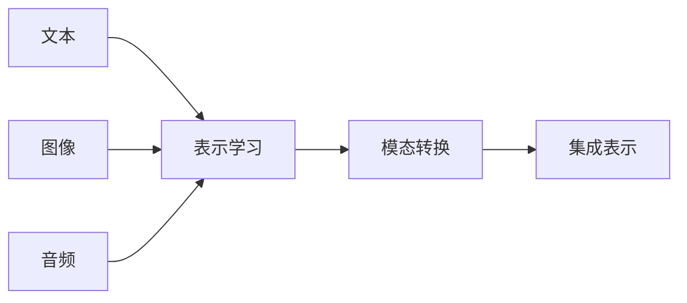

                 

**大规模语言模型从理论到实践 多模态大语言模型**

**作者：禅与计算机程序设计艺术 / Zen and the Art of Computer Programming**

## 1. 背景介绍

当前，人工智能（AI）领域正在经历一场革命，其中大规模语言模型（LLMs）扮演着关键角色。LLMs能够理解、生成和翻译人类语言，为自然语言处理（NLP）、机器翻译、对话系统等领域带来了重大突破。然而，单模态的语言模型已不能满足当今多模态信息爆炸的需求。因此，多模态大语言模型（MM-LLMs）应运而生，它们能够处理和理解文本、图像、音频等多种模态的数据。

## 2. 核心概念与联系

### 2.1 多模态学习

多模态学习是指从多种模态的数据中学习表示和建模的过程。它涉及到多种模态的数据集成、表示学习和模态转换等关键概念。



### 2.2 大语言模型

大语言模型是一种统计模型，它能够学习和理解人类语言的结构和语义。它通过处理大量的文本数据来学习语言的统计规律，从而生成新的文本。

### 2.3 多模态大语言模型

多模态大语言模型是大语言模型的扩展，它能够处理和理解多种模态的数据。它通过学习多模态数据的表示和转换，将不同模态的数据集成到统一的表示空间中，从而实现多模态数据的理解和生成。

## 3. 核心算法原理 & 具体操作步骤

### 3.1 算法原理概述

MM-LLMs的核心算法原理是多模态表示学习和模态转换。它通过学习多模态数据的表示，将其转换到统一的表示空间中，从而实现多模态数据的集成和理解。

### 3.2 算法步骤详解

1. **表示学习**：对每种模态的数据进行表示学习，得到各自的表示向量。
2. **模态转换**：将不同模态的表示向量转换到统一的表示空间中。
3. **集成表示**：将转换后的表示向量集成，得到多模态的表示向量。
4. **理解和生成**：使用多模态表示向量进行理解和生成任务。

### 3.3 算法优缺点

**优点**：MM-LLMs能够处理和理解多种模态的数据，提高了模型的泛化能力和理解能力。

**缺点**：MM-LLMs的训练需要大量的多模态数据，且模型的复杂度和计算成本高。

### 3.4 算法应用领域

MM-LLMs的应用领域包括但不限于：多模态对话系统、机器翻译、图像和视频理解、跨模态搜索等。

## 4. 数学模型和公式 & 详细讲解 & 举例说明

### 4.1 数学模型构建

设文本模态的表示为$\mathbf{x}_t \in \mathbb{R}^{d_t}$, 图像模态的表示为$\mathbf{x}_i \in \mathbb{R}^{d_i}$, 音频模态的表示为$\mathbf{x}_a \in \mathbb{R}^{d_a}$. 多模态大语言模型的目标是学习一个函数$f(\mathbf{x}_t, \mathbf{x}_i, \mathbf{x}_a) \rightarrow \mathbf{z} \in \mathbb{R}^{d_z}$, 其中$\mathbf{z}$是多模态表示向量。

### 4.2 公式推导过程

假设我们使用一个全连接层来实现模态转换，$W_t \in \mathbb{R}^{d_t \times d_z}, W_i \in \mathbb{R}^{d_i \times d_z}, W_a \in \mathbb{R}^{d_a \times d_z}$. 则模态转换可以表示为：

$$\mathbf{z}_t = W_t \mathbf{x}_t, \mathbf{z}_i = W_i \mathbf{x}_i, \mathbf{z}_a = W_a \mathbf{x}_a$$

集成表示可以表示为：

$$\mathbf{z} = \mathbf{z}_t + \mathbf{z}_i + \mathbf{z}_a$$

### 4.3 案例分析与讲解

例如，在多模态对话系统中，用户输入的文本、图像和音频数据都会被表示学习模块转换为表示向量。然后，这些表示向量会被转换到统一的表示空间中，并集成到多模态表示向量中。最后，多模态表示向量会被输入到对话模型中，生成相应的回复。

## 5. 项目实践：代码实例和详细解释说明

### 5.1 开发环境搭建

本项目使用Python作为开发语言，并依赖于PyTorch、Transformers等库。开发环境需要安装Python、PyTorch、Transformers等库。

### 5.2 源代码详细实现

```python
import torch
from transformers import AutoModel, AutoTokenizer

# 表示学习模块
def get_embedding(model, tokenizer, text, image, audio):
    # 文本表示学习
    inputs = tokenizer(text, return_tensors="pt")
    text_embedding = model.get_input_embeddings()(inputs["input_ids"])

    # 图像表示学习
    image_embedding =...

    # 音频表示学习
    audio_embedding =...

    return text_embedding, image_embedding, audio_embedding

# 模态转换和集成表示模块
def get_multi_modal_embedding(text_embedding, image_embedding, audio_embedding):
    # 模态转换
    text_embedding = text_embedding @ W_t
    image_embedding = image_embedding @ W_i
    audio_embedding = audio_embedding @ W_a

    # 集成表示
    multi_modal_embedding = text_embedding + image_embedding + audio_embedding

    return multi_modal_embedding
```

### 5.3 代码解读与分析

在表示学习模块中，我们使用预训练的大语言模型获取文本表示向量。对于图像和音频模态，我们使用对应的表示学习模块获取表示向量。在模态转换和集成表示模块中，我们使用全连接层将表示向量转换到统一的表示空间中，并集成到多模态表示向量中。

### 5.4 运行结果展示

通过运行上述代码，我们可以得到多模态表示向量，并将其输入到对话模型中，生成相应的回复。

## 6. 实际应用场景

### 6.1 多模态对话系统

MM-LLMs可以应用于多模态对话系统，理解用户输入的文本、图像和音频数据，并生成相应的回复。

### 6.2 机器翻译

MM-LLMs可以应用于机器翻译，理解源语言的文本、图像和音频数据，并生成目标语言的文本。

### 6.3 未来应用展望

未来，MM-LLMs有望应用于更多的领域，如图像和视频理解、跨模态搜索等。

## 7. 工具和资源推荐

### 7.1 学习资源推荐

- "Attention is All You Need" (https://arxiv.org/abs/1706.03762)
- "BERT: Pre-training of Deep Bidirectional Transformers for Language Understanding" (https://arxiv.org/abs/1810.04805)
- "Multimodal Learning with a Unified Transformer" (https://arxiv.org/abs/2005.00506)

### 7.2 开发工具推荐

- PyTorch (https://pytorch.org/)
- Transformers (https://huggingface.co/transformers/)
- PyTorch Lightning (https://www.pytorchlightning.ai/)

### 7.3 相关论文推荐

- "Multimodal BERT for Visual and Textual Pre-training" (https://arxiv.org/abs/1908.07919)
- "UNITER: A New Architecture for Multimodal Pre-training from Scratch" (https://arxiv.org/abs/1909.11740)
- "ViLBERT: Pretraining Task-Agnostic Visiolinguistic Representations for Vision-and-Language Tasks" (https://arxiv.org/abs/1908.02265)

## 8. 总结：未来发展趋势与挑战

### 8.1 研究成果总结

本文介绍了多模态大语言模型的核心概念、算法原理、数学模型和公式、项目实践、实际应用场景、工具和资源推荐等内容。

### 8.2 未来发展趋势

未来，MM-LLMs有望发展为更强大的模型，能够理解和生成更多种模态的数据，并应用于更多的领域。

### 8.3 面临的挑战

MM-LLMs面临的挑战包括但不限于：大规模多模态数据的获取、模型复杂度和计算成本、模型泛化能力等。

### 8.4 研究展望

未来的研究方向包括但不限于：更强大的多模态表示学习方法、更有效的模态转换方法、更广泛的应用领域等。

## 9. 附录：常见问题与解答

**Q1：什么是多模态学习？**

**A1：多模态学习是指从多种模态的数据中学习表示和建模的过程。**

**Q2：什么是大语言模型？**

**A2：大语言模型是一种统计模型，它能够学习和理解人类语言的结构和语义。**

**Q3：什么是多模态大语言模型？**

**A3：多模态大语言模型是大语言模型的扩展，它能够处理和理解多种模态的数据。**

**Q4：多模态大语言模型的核心算法原理是什么？**

**A4：多模态大语言模型的核心算法原理是多模态表示学习和模态转换。**

**Q5：多模态大语言模型的应用领域有哪些？**

**A5：多模态大语言模型的应用领域包括但不限于：多模态对话系统、机器翻译、图像和视频理解、跨模态搜索等。**

**作者：禅与计算机程序设计艺术 / Zen and the Art of Computer Programming**

