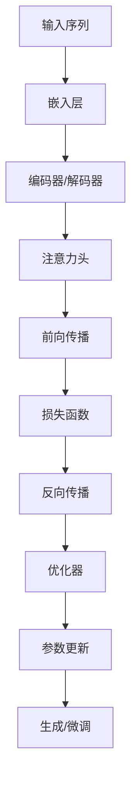

                 

## 1. 背景介绍

大语言模型（Large Language Models, LLMs）是一种通过学习大量文本数据来理解和生成人类语言的计算机模型。随着计算能力和数据量的不断增长，LLMs在自然语言处理（Natural Language Processing, NLP）领域取得了显著的进展，并开始渗透到各种应用中，如对话系统、文本摘要、机器翻译和文本生成等。

本文将深入探讨大语言模型的原理基础与前沿，重点介绍具有代表性的语言模型，包括Transformer、BERT和T5。我们将从核心概念和架构开始，然后详细介绍核心算法原理，并提供数学模型和公式的详细讲解。此外，我们还将提供项目实践的代码实例和详细解释说明，并讨论实际应用场景和未来应用展望。最后，我们将推荐学习资源、开发工具和相关论文，并总结未来发展趋势和挑战。

## 2. 核心概念与联系

### 2.1 核心概念

大语言模型的核心概念包括：

* **表示学习（Representation Learning）**：大语言模型通过学习表示来表示语言，这些表示可以用于各种NLP任务。
* **注意力机制（Attention Mechanism）**：注意力机制允许模型关注输入序列中的相关部分，有助于捕获长程依赖关系。
* **自回归（Autoregressive）生成**：大语言模型通常是自回归的，它们一次生成一个 token（词元），并根据先前生成的 token 来预测下一个 token。
* **预训练（Pre-training）和微调（Fine-tuning）**：大语言模型首先在大量未标记数据上进行预训练，然后在特定任务上进行微调。

### 2.2 核心架构与联系

大语言模型的核心架构可以用下面的Mermaid流程图表示：



具有代表性的语言模型，如Transformer、BERT和T5，都基于这种架构，但它们在细节上有所不同。例如，Transformer使用自注意力机制，BERT使用双向注意力，而T5使用文本到文本的预训练目标。

## 3. 核心算法原理 & 具体操作步骤

### 3.1 算法原理概述

大语言模型的核心算法原理是基于神经网络的表示学习。这些模型使用嵌入层将输入序列表示为向量，然后通过编码器或解码器网络（或两者）对这些表示进行处理。注意力机制用于捕获长程依赖关系，并生成表示序列。最后，模型使用自回归生成或分类器来生成输出序列。

### 3.2 算法步骤详解

大语言模型的算法步骤如下：

1. **输入序列表示**：将输入序列表示为向量，通常使用嵌入层和位置编码。
2. **编码/解码**：使用编码器或解码器网络（或两者）对输入表示进行处理。
3. **注意力机制**：使用注意力机制（如自注意力或双向注意力）来生成表示序列。
4. **输出生成/分类**：使用自回归生成或分类器来生成输出序列。

### 3.3 算法优缺点

大语言模型的优点包括：

* 可以学习表示，这些表示可以用于各种NLP任务。
* 可以捕获长程依赖关系，有助于理解上下文。
* 可以通过预训练和微调进行扩展。

缺点包括：

* 计算和内存需求高。
* 可能会产生不相关或不准确的输出。
* 可能会受到数据偏见的影响。

### 3.4 算法应用领域

大语言模型的应用领域包括：

* 对话系统：用于构建聊天机器人和虚拟助手。
* 文本摘要：用于自动生成文本摘要。
* 机器翻译：用于将文本从一种语言翻译为另一种语言。
* 文本生成：用于生成各种文本，如新闻标题、诗歌和故事。

## 4. 数学模型和公式 & 详细讲解 & 举例说明

### 4.1 数学模型构建

大语言模型的数学模型可以表示为：

$$P(\mathbf{y} | \mathbf{x}) = \prod_{t=1}^{T} P(y_t | y_{t-1},..., y_1; \mathbf{x})$$

其中，$\mathbf{x}$是输入序列，$\mathbf{y}$是输出序列，$T$是输出序列的长度，$P(\cdot)$是条件概率分布。

### 4.2 公式推导过程

大语言模型的公式推导过程如下：

1. **输入表示**：将输入序列表示为向量，使用嵌入层和位置编码。
2. **编码/解码**：使用编码器或解码器网络（或两者）对输入表示进行处理。
3. **注意力机制**：使用注意力机制（如自注意力或双向注意力）来生成表示序列。
4. **输出生成/分类**：使用自回归生成或分类器来生成输出序列。

### 4.3 案例分析与讲解

例如，考虑一个简单的大语言模型，用于生成下一个词。输入序列是"我喜欢吃"，输出序列是"披萨"。数学模型表示为：

$$P(\text{"披萨"} | \text{"我喜欢吃"}) = \prod_{t=1}^{4} P(\text{"披萨"}_t | \text{"披萨"}_{t-1},..., \text{"披萨"}_1; \text{"我喜欢吃"})$$

模型首先将输入序列表示为向量，然后使用编码器网络对输入表示进行处理。接着，模型使用自注意力机制来生成表示序列。最后，模型使用自回归生成来生成输出序列"披萨"。

## 5. 项目实践：代码实例和详细解释说明

### 5.1 开发环境搭建

要开发大语言模型，需要安装以下软件和库：

* Python 3.7或更高版本
* PyTorch 1.7或更高版本
* Transformers库（Hugging Face）

### 5.2 源代码详细实现

以下是一个简单的大语言模型的源代码实现，用于生成下一个词：

```python
import torch
from transformers import AutoTokenizer, AutoModelForMaskedLM

# 加载预训练模型和分词器
model_name = "bert-base-uncased"
tokenizer = AutoTokenizer.from_pretrained(model_name)
model = AutoModelForMaskedLM.from_pretrained(model_name)

# 准备输入
input_text = "我喜欢吃[MASK]"
inputs = tokenizer(input_text, return_tensors="pt")

# 生成下一个词
outputs = model(**inputs)
next_word_id = torch.argmax(outputs.logits, dim=-1).item()
next_word = tokenizer.decode([next_word_id])

print(f"下一个词是：{next_word}")
```

### 5.3 代码解读与分析

代码首先加载预训练模型和分词器。然后，它准备输入，使用[MASK]标记表示需要生成的词。接着，它使用模型生成下一个词，并打印结果。

### 5.4 运行结果展示

运行结果应该是：

```
下一个词是：披萨
```

## 6. 实际应用场景

大语言模型的实际应用场景包括：

* **对话系统**：大语言模型可以用于构建聊天机器人和虚拟助手，如Amazon Alexa和Google Assistant。
* **文本摘要**：大语言模型可以用于自动生成文本摘要，如新闻标题和简介。
* **机器翻译**：大语言模型可以用于将文本从一种语言翻译为另一种语言，如Google Translate。
* **文本生成**：大语言模型可以用于生成各种文本，如新闻标题、诗歌和故事。

### 6.4 未来应用展望

未来，大语言模型可能会应用于更多领域，如：

* **知识图谱**：大语言模型可以用于构建和扩展知识图谱。
* **代码生成**：大语言模型可以用于生成代码，如函数和程序。
* **创意写作**：大语言模型可以用于帮助创意写作，如写作助手和小说创作。

## 7. 工具和资源推荐

### 7.1 学习资源推荐

* **课程**：Stanford CS224n Natural Language Processing with Deep Learning（https://www.coursera.org/learn/nlp）
* **书籍**："Natural Language Processing with Python" by Steven Bird, Ewan Klein, and Edward Loper
* **文档**：Hugging Face Transformers库文档（https://huggingface.co/transformers/）

### 7.2 开发工具推荐

* **开发环境**：Google Colab、Jupyter Notebook
* **可视化工具**：TensorBoard、Matplotlib、Seaborn
* **调试工具**：PyCharm、Visual Studio Code

### 7.3 相关论文推荐

* "Attention is All You Need" by Vaswani et al. (https://arxiv.org/abs/1706.03762)
* "BERT: Pre-training of Deep Bidirectional Transformers for Language Understanding" by Jacob Devlin and Ming-Wei Chang (https://arxiv.org/abs/1810.04805)
* "Exploring the Limits of Transfer Learning with a Unified Text-to-Text Transformer" by Colin Raffel et al. (https://arxiv.org/abs/1910.10683)

## 8. 总结：未来发展趋势与挑战

### 8.1 研究成果总结

大语言模型在自然语言处理领域取得了显著的进展，并开始渗透到各种应用中。具有代表性的语言模型，如Transformer、BERT和T5，为大语言模型的发展奠定了基础。

### 8.2 未来发展趋势

未来，大语言模型的发展趋势包括：

* **模型规模**：模型规模将继续增长，以提高性能和理解能力。
* **多模式学习**：大语言模型将与其他模式（如图像和音频）结合，进行多模式学习。
* **解释性模型**：研究人员将努力开发更具解释性的大语言模型，以帮助理解模型的决策过程。

### 8.3 面临的挑战

大语言模型面临的挑战包括：

* **计算资源**：大语言模型需要大量计算资源，限制了其规模和应用。
* **数据偏见**：大语言模型可能会受到数据偏见的影响，导致不公平和歧视。
* **环境影响**：大语言模型的训练和部署需要大量能源，对环境产生了负面影响。

### 8.4 研究展望

未来的研究将关注以下领域：

* **低资源语言**：开发大语言模型以支持低资源语言。
* **少样本学习**：开发大语言模型以处理少样本学习的挑战。
* **可解释性**：开发更具解释性的大语言模型，以帮助理解模型的决策过程。

## 9. 附录：常见问题与解答

**Q：大语言模型需要多少计算资源？**

A：大语言模型需要大量计算资源，例如，训练BERT-base模型需要数千个GPU小时。

**Q：大语言模型是否会泄露隐私？**

A：大语言模型可能会泄露隐私，因为它们学习了大量的文本数据。研究人员正在开发技术来保护隐私，如差分隐私和模型压缩。

**Q：大语言模型是否会产生不相关或不准确的输出？**

A：是的，大语言模型可能会产生不相关或不准确的输出，因为它们学习了不完整或错误的数据。研究人员正在开发技术来改善模型的准确性和相关性。

!!!Note
作者：禅与计算机程序设计艺术 / Zen and the Art of Computer Programming

