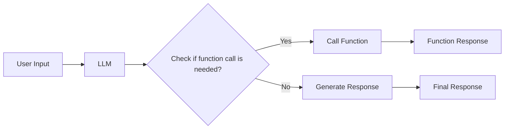

                 

- 大语言模型 (LLM)
- Function Calling
- Prompt Engineering
- In-Context Learning
- Fine-Tuning
- Few-Shot Learning

## 1. 背景介绍

在人工智能领域，大语言模型 (LLM) 因其在自然语言理解和生成任务中的出色表现而受到广泛关注。然而，LLMs 固有的缺陷，如上下文长度有限和知识储备有限，限制了它们在实用应用中的有效性。本指南将介绍一种名为 "Function Calling" 的技术，旨在克服这些挑战，扩展 LLMs 的能力，使其能够处理更复杂的任务。

## 2. 核心概念与联系

### 2.1 Function Calling 概念

Function Calling 是一种将 LLMs 与外部函数或 API 集成的方法，允许模型在生成响应时调用这些函数以获取外部信息或执行复杂计算。这种方法可以扩展 LLMs 的能力，使其能够处理需要外部知识或计算的任务。

### 2.2 Function Calling 架构

下图展示了 Function Calling 架构的 Mermaid 流程图：



在该架构中，LLM 接受用户输入，并检查是否需要调用外部函数。如果需要，则调用函数并等待响应。一旦函数返回结果，LLM 会使用该结果生成最终响应。如果不需要调用函数，LLM 会直接生成响应。

## 3. 核心算法原理 & 具体操作步骤

### 3.1 算法原理概述

Function Calling 算法的核心原理是使用特定的提示 (prompt) 来指示 LLM 在生成响应时调用外部函数。这些提示通常包含函数名称、输入参数和调用格式。LLM 学习理解这些提示并生成相应的函数调用。

### 3.2 算法步骤详解

1. **定义外部函数：** 确定需要集成的外部函数或 API，并定义它们的输入参数和输出结果。
2. **设计提示：** 为每个外部函数设计特定的提示，指示 LLM 在生成响应时调用该函数。提示应包含函数名称、输入参数和调用格式。
3. **训练 LLM：** 使用包含 Function Calling 提示的数据集训练 LLM，以使其学习理解这些提示并生成相应的函数调用。
4. **集成外部函数：** 将外部函数集成到 LLM 的环境中，以便模型可以在生成响应时调用它们。
5. **测试和评估：** 测试 LLM 的性能，评估其在需要外部知识或计算的任务中的表现。

### 3.3 算法优缺点

**优点：**

- 扩展 LLMs 的能力，使其能够处理更复杂的任务。
- 允许 LLMs 访问外部知识和计算资源。
- 可以使用少量的训练数据和计算资源实现。

**缺点：**

- 依赖于外部函数的可靠性和性能。
- 可能需要大量的提示设计和调优工作。
- 存在安全和隐私风险，因为 LLMs 可能会泄露敏感信息或执行不安全的操作。

### 3.4 算法应用领域

Function Calling 可以应用于各种需要外部知识或计算的任务，例如：

- 信息检索：使用外部搜索引擎或数据库检索信息。
- 计算任务：使用外部计算服务执行复杂计算。
- 个性化推荐：使用外部推荐系统生成个性化推荐。
- 自动化任务：使用外部 API 自动化任务，如预订航班或订购商品。

## 4. 数学模型和公式 & 详细讲解 & 举例说明

### 4.1 数学模型构建

Function Calling 的数学模型可以表示为一个生成模型，其目标是最大化生成响应的可能性：

$$P(\text{response} | \text{input}, \text{functions}) = \prod_{t=1}^{T} P(w_t | w_{t-1},..., w_1, \text{input}, \text{functions})$$

其中，$w_1,..., w_T$ 是生成的响应词汇表，$T$ 是响应的长度，$\text{input}$ 是用户输入，$\text{functions}$ 是可用的外部函数集。

### 4.2 公式推导过程

在每个时间步 $t$，模型生成下一个词 $w_t$ 的可能性取决于先前生成的词 $w_{t-1},..., w_1$，用户输入 $\text{input}$ 和可用的外部函数 $\text{functions}$。模型学习理解这些因素并生成相应的词。

### 4.3 案例分析与讲解

例如，考虑一个简单的信息检索任务，用户输入 "Who is the president of the United States?"。 LLMs 可以使用一个名为 "get_wiki_info" 的外部函数，该函数接受一个参数 "query"，并返回维基百科上的相关信息。 LLM 可以生成以下提示来调用该函数：

```
get_wiki_info({
  "query": "President of the United States"
})
```

一旦函数返回结果，LLM 可以使用该结果生成最终响应：

"The current president of the United States is Joe Biden."

## 5. 项目实践：代码实例和详细解释说明

### 5.1 开发环境搭建

要实现 Function Calling，您需要设置以下开发环境：

- Python 环境：建议使用 Python 3.8 或更高版本。
- Transformers 库：一个由 Hugging Face 开发的开源库，提供了预训练的 LLMs 和其他 NLP 模型。
- External function API：一个可以调用外部函数或 API 的服务。

### 5.2 源代码详细实现

以下是一个简单的 Function Calling 示例，使用 Transformers 库和一个虚构的外部函数 API：

```python
from transformers import AutoModelForCausalLM, AutoTokenizer
import requests

# Load pre-trained LLM
model_name = "distilgpt2"
model = AutoModelForCausalLM.from_pretrained(model_name)
tokenizer = AutoTokenizer.from_pretrained(model_name)

# Define external function API
function_api_url = "https://api.example.com/functions"

def call_external_function(function_name, inputs):
    response = requests.post(function_api_url, json={"function": function_name, "inputs": inputs})
    return response.json()["output"]

# Function Calling loop
while True:
    user_input = input("User: ")
    input_ids = tokenizer.encode(user_input, return_tensors="pt")
    output_ids = model.generate(input_ids, max_length=50, num_beams=5, early_stopping=True)
    response = tokenizer.decode(output_ids[0], skip_special_tokens=True)

    # Check if function call is needed
    if "get_wiki_info(" in response:
        # Extract function inputs
        start = response.index("get_wiki_info(") + len("get_wiki_info(")
        end = response.index(")", start)
        inputs = eval(response[start:end])

        # Call external function
        function_output = call_external_function("get_wiki_info", inputs)

        # Update response with function output
        response = response[:start] + function_output + response[end:]

    print("Assistant:", response)
```

### 5.3 代码解读与分析

在上述代码中，我们首先加载预训练的 LLM，然后定义外部函数 API 的 URL。在 Function Calling 循环中，我们接受用户输入，生成 LLM 的响应，并检查是否需要调用外部函数。如果需要，我们提取函数输入，调用外部函数，并使用函数输出更新响应。

### 5.4 运行结果展示

当用户输入 "Who is the president of the United States?" 时，LLM 生成的响应包含外部函数调用：

```
get_wiki_info({
  "query": "President of the United States"
})
```

一旦函数返回结果，LLM 会使用该结果生成最终响应：

"The current president of the United States is Joe Biden."

## 6. 实际应用场景

### 6.1 信息检索

Function Calling 可以用于改进信息检索任务，例如搜索引擎或虚拟助手。 LLMs 可以调用外部搜索引擎或数据库函数来检索相关信息，并将其包含在生成的响应中。

### 6.2 个性化推荐

在个性化推荐任务中，LLMs 可以调用外部推荐系统函数来生成个性化推荐。这些函数可以接受用户偏好和历史数据作为输入，并返回相关的推荐项目。

### 6.3 自动化任务

Function Calling 可以用于自动化任务，例如预订航班或订购商品。 LLMs 可以调用外部 API 函数来执行这些任务，并生成相应的响应。

### 6.4 未来应用展望

随着 LLMs 能力的不断提高和外部函数 API 的丰富，Function Calling 将成为一种强大的技术，使 LLMs 能够处理更复杂的任务。未来，我们可以期待看到 Function Calling 在各种应用中得到广泛采用，从虚拟助手到自动化任务再到个性化推荐。

## 7. 工具和资源推荐

### 7.1 学习资源推荐

- "Large Language Models Are Few-Shot Learners"：一篇介绍 Function Calling 的开创性论文。
  - 链接：<https://arxiv.org/abs/2005.14165>
- "Language Models as Knowledge Bases"：一篇介绍如何使用 LLMs 访问外部知识的论文。
  - 链接：<https://arxiv.org/abs/2004.05893>

### 7.2 开发工具推荐

- Transformers：一个开源库，提供了预训练的 LLMs 和其他 NLP 模型。
  - 链接：<https://huggingface.co/transformers/>
- FastAPI：一个用于构建外部函数 API 的高性能 Web 框架。
  - 链接：<https://fastapi.tiangolo.com/>

### 7.3 相关论文推荐

- "Chain of Thought Prompting Elicits Reasoning in Large Language Models"：一篇介绍如何使用提示引导 LLMs 进行推理的论文。
  - 链接：<https://arxiv.org/abs/2201.11903>
- "Self-Consistency Improves Chain-of-Thought Prompting"：一篇介绍如何改进 Chain of Thought Prompting 的论文。
  - 链接：<https://arxiv.org/abs/2203.11171>

## 8. 总结：未来发展趋势与挑战

### 8.1 研究成果总结

Function Calling 是一种强大的技术，可以扩展 LLMs 的能力，使其能够处理更复杂的任务。通过集成外部函数和 API，LLMs 可以访问外部知识和计算资源，从而提高其在各种应用中的有效性。

### 8.2 未来发展趋势

未来，我们可以期待看到 Function Calling 在各种应用中得到广泛采用，从虚拟助手到自动化任务再到个性化推荐。随着 LLMs 能力的不断提高和外部函数 API 的丰富，Function Calling 将成为一种强大的技术，使 LLMs 能够处理更复杂的任务。

### 8.3 面临的挑战

然而，Function Calling 也面临着一些挑战，包括外部函数的可靠性和性能、安全和隐私风险以及提示设计和调优的复杂性。解决这些挑战需要进一步的研究和开发工作。

### 8.4 研究展望

未来的研究应该关注以下几个方向：

- 设计更有效的提示，以改进 Function Calling 的性能和泛化能力。
- 开发新的方法来评估和优化外部函数的可靠性和性能。
- 研究 Function Calling 在安全和隐私保护中的应用，以减轻相关风险。
- 发展新的技术，以便 LLMs 可以自动发现和集成外部函数和 API。

## 9. 附录：常见问题与解答

**Q1：Function Calling 与 In-Context Learning 和 Fine-Tuning 有什么区别？**

A1：In-Context Learning 是一种方法，通过在提示中提供示例来引导 LLMs 生成特定类型的响应。Fine-Tuning 是一种方法，通过在特定任务上进一步训练 LLMs 来改进其性能。Function Calling 是一种方法，通过集成外部函数和 API 来扩展 LLMs 的能力。这三种方法可以互补，也可以结合使用。

**Q2：Function Calling 如何处理外部函数的错误和失败？**

A2：当外部函数失败或返回错误时，LLMs 可以使用错误处理机制来处理这些情况。例如，LLMs 可以生成错误消息，并提供用户可以采取的行动。此外，外部函数 API 可以提供错误码和消息，以帮助 LLMs 理解和处理错误。

**Q3：Function Calling 如何保护用户的隐私和安全？**

A3：要保护用户的隐私和安全，LLMs 应该遵循严格的安全措施，包括数据加密、访问控制和审计。此外，外部函数 API 应该遵循相同的安全措施，并提供安全的集成方式。最后，LLMs 应该被设计为只泄露必要的信息，并提供用户控制以限制信息共享。

## 作者：禅与计算机程序设计艺术 / Zen and the Art of Computer Programming

