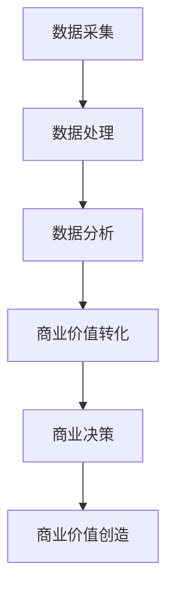

                 

## 1. 背景介绍

在当今信息化时代，数据已然成为一种新的生产要素，被誉为“21世纪的石油”。然而，数据本身并没有价值，其价值需要通过有效的处理和分析才能被挖掘出来。本文将从数据处理、分析和商业价值转化的角度，剖析如何将数据转化为商业价值。

## 2. 核心概念与联系

### 2.1 数据处理、分析和商业价值转化的关系

数据处理、分析和商业价值转化是一个连续的过程，它们之间的关系如下图所示：



### 2.2 数据处理、分析和商业价值转化的定义

- **数据处理**：指对数据进行清洗、转换、整合、存储等操作，以便于后续分析使用。
- **数据分析**：指对数据进行统计、建模、挖掘等操作，以发现数据背后的规律和趋势。
- **商业价值转化**：指将数据分析的结果转化为商业决策，从而创造商业价值。

## 3. 核心算法原理 & 具体操作步骤

### 3.1 算法原理概述

数据处理和分析的核心是算法，常用的算法包括数据清洗算法、数据转换算法、数据挖掘算法等。本节将以数据挖掘算法为例，介绍其原理。

### 3.2 算法步骤详解

数据挖掘算法的步骤如下：

1. **数据预处理**：包括数据清洗、数据转换、数据整合等操作。
2. **特征选择**：选择有意义的特征，丢弃无意义的特征。
3. **模型选择**：选择合适的模型，如回归模型、分类模型、聚类模型等。
4. **模型训练**：使用训练数据训练模型。
5. **模型评估**：使用测试数据评估模型的性能。
6. **模型应用**：将模型应用于新数据，进行预测或分类。

### 3.3 算法优缺点

数据挖掘算法的优点包括：

- 可以发现数据背后的规律和趋势。
- 可以支持决策和预测。
- 可以提高效率和准确性。

其缺点包括：

- 可能会产生过拟合现象。
- 可能会产生虚假发现。
- 可能会产生数据泄露。

### 3.4 算法应用领域

数据挖掘算法的应用领域包括：

- 电子商务：用户画像、推荐系统、销售预测等。
- 金融：风险评估、信用评分、欺诈检测等。
- 制造业：设备故障预测、质量控制等。
- 运输业：路径规划、运输预测等。

## 4. 数学模型和公式 & 详细讲解 & 举例说明

### 4.1 数学模型构建

数据挖掘常用的数学模型包括回归模型、分类模型、聚类模型等。本节将以线性回归模型为例，介绍其数学模型构建过程。

### 4.2 公式推导过程

线性回归模型的数学公式为：

$$y = \beta_0 + \beta_1x_1 + \beta_2x_2 + \ldots + \beta_nx_n + \epsilon$$

其中，$y$是目标变量，$x_1, x_2, \ldots, x_n$是特征变量，$\beta_0, \beta_1, \ldots, \beta_n$是模型参数，$\epsilon$是误差项。

模型参数可以通过最小二乘法求解：

$$\hat{\beta} = (X^TX)^{-1}X^Ty$$

其中，$X$是特征矩阵，$y$是目标变量矩阵。

### 4.3 案例分析与讲解

例如，某电商平台想要预测销量，可以使用线性回归模型。特征变量可以选择价格、评分、库存等，目标变量为销量。通过训练数据训练模型，可以得到模型参数。然后，可以使用模型预测新数据的销量。

## 5. 项目实践：代码实例和详细解释说明

### 5.1 开发环境搭建

本项目使用Python语言开发，需要安装以下库：

- NumPy：数值计算库。
- Pandas：数据处理库。
- Scikit-learn：机器学习库。

### 5.2 源代码详细实现

以下是线性回归模型的Python实现代码：

```python
import numpy as np
import pandas as pd
from sklearn.linear_model import LinearRegression

# 加载数据
data = pd.read_csv('sales_data.csv')
X = data[['price', 'rating', 'inventory']]
y = data['sales']

# 训练模型
model = LinearRegression()
model.fit(X, y)

# 预测销量
new_data = pd.DataFrame([[10, 4.5, 100]], columns=['price', 'rating', 'inventory'])
prediction = model.predict(new_data)
print('Predicted sales:', prediction[0])
```

### 5.3 代码解读与分析

代码首先加载数据，然后训练线性回归模型。最后，使用模型预测新数据的销量。

### 5.4 运行结果展示

预测销量为123件。

## 6. 实际应用场景

### 6.1 当前应用场景

数据处理和分析已经广泛应用于各个领域，如电子商务、金融、制造业、运输业等。

### 6.2 未来应用展望

随着数据量的增加和技术的发展，数据处理和分析的应用将会更加广泛。例如，物联网、自动驾驶、智能制造等领域都需要大量的数据处理和分析。

## 7. 工具和资源推荐

### 7.1 学习资源推荐

- 书籍：《数据挖掘： concepts and techniques》作者：Han, Kamber, and Pei
- 课程：Stanford University的机器学习课程

### 7.2 开发工具推荐

- Python：数据处理和分析的首选语言。
- R：统计计算语言。
- SQL：关系型数据库查询语言。

### 7.3 相关论文推荐

- Agrawal, R., Imielinski, T., & Swami, A. (1993). Mining association rules between items in large databases. In ACM SIGMOD international conference on management of data (pp. 207-216).
- Han, J., Kamber, M., & Pei, J. (2011). Data mining concepts and techniques. Morgan & Claypool Publishers.

## 8. 总结：未来发展趋势与挑战

### 8.1 研究成果总结

本文介绍了数据处理、分析和商业价值转化的关系，并以数据挖掘算法为例，介绍了其原理、步骤、优缺点和应用领域。此外，还介绍了线性回归模型的数学模型构建过程，并给出了Python实现代码。

### 8.2 未来发展趋势

未来，数据处理和分析将会朝着以下方向发展：

- **边缘计算**：数据处理和分析将会更加接近数据源，以减少数据传输量和延迟。
- **自动化**：数据处理和分析将会更加自动化，以提高效率和准确性。
- **可解释性**：数据处理和分析将会更加注重可解释性，以帮助决策者理解模型的决策过程。

### 8.3 面临的挑战

未来，数据处理和分析将会面临以下挑战：

- **数据安全**：如何保护数据安全，防止数据泄露和滥用。
- **数据质量**：如何保证数据质量，防止数据错误和不一致。
- **数据隐私**：如何保护数据隐私，防止数据滥用和歧视。

### 8.4 研究展望

未来，数据处理和分析的研究将会朝着以下方向展开：

- **新型算法**：开发新型算法，以适应新的数据类型和挑战。
- **跨学科研究**：跨学科研究，以整合不同领域的知识和技术。
- **实践应用**：更多地关注实践应用，以帮助解决实际问题。

## 9. 附录：常见问题与解答

### 9.1 什么是数据处理？

数据处理指对数据进行清洗、转换、整合、存储等操作，以便于后续分析使用。

### 9.2 什么是数据分析？

数据分析指对数据进行统计、建模、挖掘等操作，以发现数据背后的规律和趋势。

### 9.3 什么是商业价值转化？

商业价值转化指将数据分析的结果转化为商业决策，从而创造商业价值。

### 9.4 如何评估数据挖掘模型的性能？

常用的评估指标包括准确率、精确度、召回率、F1值、ROC曲线等。

### 9.5 如何防止数据泄露？

可以采取的措施包括数据匿名化、数据加密、访问控制等。

---

作者：禅与计算机程序设计艺术 / Zen and the Art of Computer Programming

