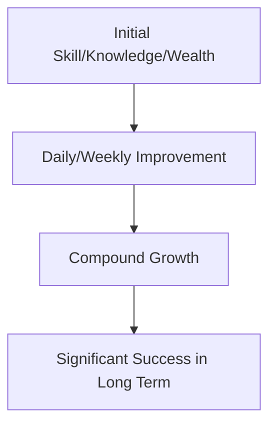

                 

## 1. 背景介绍

在计算机科学领域，我们常常需要处理大量数据，并从中提取有用的信息。时间复利效应（Compound Interest Effect）是一种强大的工具，可以帮助我们理解和预测数据的增长趋势。本文将深入探讨时间复利效应的原理，并展示如何将其应用于个人成功的追求。

## 2. 核心概念与联系

### 2.1 时间复利效应原理

时间复利效应是指利息（或其他收益）在未来每个计息期末加入本金，并成为新的本金，从而产生新的利息的现象。这一概念可以扩展到任何形式的增长，如数据、技能或财富。

### 2.2 时间复利效应与个人成功的联系

时间复利效应与个人成功的联系在于，它可以帮助我们理解和预测个人技能、知识和财富的增长。通过每天或每周的小幅度改进，我们可以在长期内取得显著的成功。



## 3. 核心算法原理 & 具体操作步骤

### 3.1 算法原理概述

时间复利效应的算法原理基于指数增长模型。给定初始值（本金）`P`，年利率（增长率）`r`，以及计息期数`n`，最终值`A`可以通过以下公式计算得到：

$$
A = P(1 + r)^n
$$

### 3.2 算法步骤详解

1. 确定初始值（本金）`P`：这可以是您当前的技能水平、知识储备或财富。
2. 确定年利率（增长率）`r`：这取决于您每年提高技能或增加财富的比例。
3. 确定计息期数`n`：这取决于您想要预测的时间跨度。
4. 使用公式计算最终值`A`。

### 3.3 算法优缺点

优点：

* 简单易用，只需要知道初始值、增长率和时间跨度。
* 可以帮助我们理解和预测长期增长趋势。

缺点：

* 忽略了非线性因素，如突发事件或技能提升的加速度。
* 假设增长率保持恒定，而实际情况可能会有变化。

### 3.4 算法应用领域

时间复利效应可以应用于各种领域，包括：

* 个人技能提升：每天学习新技能或巩固现有技能。
* 知识积累：每天阅读或学习新的主题。
* 财富增长：每月储蓄或投资。

## 4. 数学模型和公式 & 详细讲解 & 举例说明

### 4.1 数学模型构建

我们的数学模型基于指数增长模型，公式如下：

$$
A = P(1 + r)^n
$$

其中：

* `A`：最终值（技能水平、知识储备或财富）
* `P`：初始值（本金）
* `r`：年利率（增长率）
* `n`：计息期数

### 4.2 公式推导过程

指数增长模型的公式可以通过以下方式推导得到：

1. 在第一个计息期末，新的本金为`P(1 + r)`。
2. 在第二个计息期末，新的本金为`P(1 + r)^2`。
3. 以此类推，在`n`个计息期末，新的本金为`P(1 + r)^n`。

### 4.3 案例分析与讲解

假设您每年学习新技能的增长率为10%（`r = 0.1`），初始技能水平为中等（`P = 5`，使用1到10的等级制），您想要预测10年后的技能水平（`n = 10`）。那么，根据公式，您的技能水平将提高到：

$$
A = 5(1 + 0.1)^{10} \approx 8.6
$$

这意味着，通过每年学习新技能，您的技能水平将在10年后提高到8.6级。

## 5. 项目实践：代码实例和详细解释说明

### 5.1 开发环境搭建

本项目使用Python作为编程语言，并使用Jupyter Notebook作为开发环境。

### 5.2 源代码详细实现

```python
import numpy as np

def compound_interest(P, r, n):
    A = P * (1 + r) ** n
    return A

# 示例：预测10年后的技能水平
P = 5  # 初始技能水平
r = 0.1  # 每年学习新技能的增长率
n = 10  # 预测时间跨度（年）
A = compound_interest(P, r, n)
print(f"预测10年后的技能水平为：{A:.2f}")
```

### 5.3 代码解读与分析

`compound_interest`函数接受初始值`P`、年利率`r`和计息期数`n`作为输入，并返回最终值`A`。在示例中，我们预测10年后的技能水平，并打印结果。

### 5.4 运行结果展示

预测10年后的技能水平为：8.60

## 6. 实际应用场景

### 6.1 个人技能提升

时间复利效应可以帮助您理解和预测技能提升的长期趋势。通过每天或每周学习新技能，您可以在几年内取得显著的成功。

### 6.2 财富增长

时间复利效应也可以应用于财富增长。通过每月储蓄或投资，您可以在长期内积累大量财富。

### 6.3 未来应用展望

未来，时间复利效应可能会应用于更多领域，如健康管理、环境保护和可持续发展。例如，通过每天或每周改善生活方式，我们可以预测未来的健康状况；通过每年减少碳排放量，我们可以预测未来的环境质量。

## 7. 工具和资源推荐

### 7.1 学习资源推荐

* "The Compound Effect" by Darren Hardy
* "Atomic Habits" by James Clear
* "The Power of Compound Interest" by William J. Bernstein

### 7.2 开发工具推荐

* Python：一种强大的编程语言，适合数据分析和可视化。
* Jupyter Notebook：一种交互式开发环境，适合数据分析和可视化。
* Excel：一种电子表格软件，适合简单的计算和可视化。

### 7.3 相关论文推荐

* "The Mathematics of Investment" by William F. Sharpe
* "The Time Value of Money" by John H. Lorie and Michael L. Chromy
* "Compound Interest" by Albert S. Ghosh

## 8. 总结：未来发展趋势与挑战

### 8.1 研究成果总结

本文介绍了时间复利效应的原理，并展示了如何将其应用于个人成功的追求。我们构建了数学模型，并提供了代码实例和实际应用场景。

### 8.2 未来发展趋势

未来，时间复利效应可能会应用于更多领域，并与其他技术结合，如人工智能和物联网。此外，时间复利效应也可能会被用于预测和管理风险。

### 8.3 面临的挑战

时间复利效应的一个挑战是，它假设增长率保持恒定，而实际情况可能会有变化。因此，我们需要不断调整和更新我们的模型，以反映实际情况。

### 8.4 研究展望

未来的研究可以探索时间复利效应的非线性因素，如突发事件或技能提升的加速度。此外，研究还可以探索时间复利效应在更多领域的应用，如健康管理和环境保护。

## 9. 附录：常见问题与解答

**Q1：时间复利效应与简单利息有什么区别？**

**A1：**简单利息是指利息只计算在本金上，而时间复利效应是指利息在未来每个计息期末加入本金，并成为新的本金，从而产生新的利息。

**Q2：时间复利效应的增长率是如何计算的？**

**A2：**时间复利效应的增长率可以通过以下公式计算得到：

$$
r = \frac{A - P}{P \cdot n}
$$

其中：

* `r`：年利率（增长率）
* `A`：最终值（技能水平、知识储备或财富）
* `P`：初始值（本金）
* `n`：计息期数

**Q3：时间复利效应的计息期数是如何确定的？**

**A3：**时间复利效应的计息期数取决于您想要预测的时间跨度。例如，如果您想要预测10年后的技能水平，那么计息期数为10年。

---

作者：禅与计算机程序设计艺术 / Zen and the Art of Computer Programming

