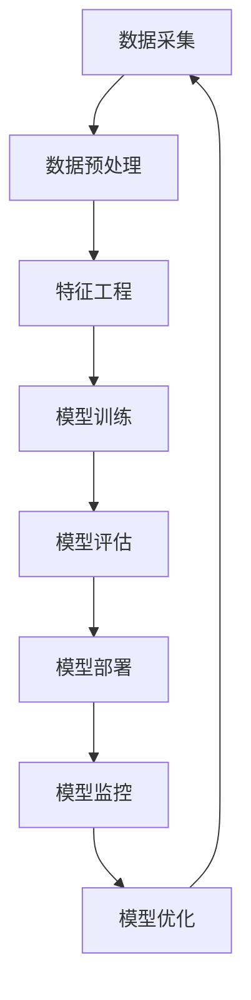

                 

## 1. 背景介绍

在人工智能（AI）领域，我们正处于一个转型的关键时期。从2011年图像分类任务中深度学习的突破，到2016年AlphaGo的问世，AI已经从实验室走向了产业化。现在，我们正在进入AI 2.0时代，这个时代的特点是AI与产业的深度结合，AI技术的泛化能力和解释性的提高。本文将探讨AI 2.0时代的产业特征，关注AI技术在各行各业的应用，并分析其对产业的影响。

## 2. 核心概念与联系

### 2.1 AI 2.0的定义

AI 2.0是指第二代人工智能，它的特点是AI技术的泛化能力和解释性的提高。与AI 1.0相比，AI 2.0更注重AI技术在各行各业的应用，更注重AI技术的解释性，以便于人们理解和信任AI的决策过程。

### 2.2 AI 2.0的架构

AI 2.0的架构可以用下面的Mermaid流程图表示：



在这个架构中，数据采集、预处理和特征工程是AI 2.0的基础，模型训练、评估、部署、监控和优化是AI 2.0的核心，它们构成了AI 2.0的生命周期。

## 3. 核心算法原理 & 具体操作步骤

### 3.1 算法原理概述

AI 2.0的核心算法是深度学习，它是一种基于神经网络的机器学习方法。深度学习的原理是模拟人类大脑的结构和功能，使用多层神经元网络来学习和处理数据。

### 3.2 算法步骤详解

深度学习的具体操作步骤如下：

1. 数据采集：收集大量的数据，这些数据将用于训练模型。
2. 数据预处理：清洗数据，处理缺失值，标准化数据等。
3. 特征工程：提取数据中的特征，这些特征将用于训练模型。
4. 模型构建：构建神经网络模型，确定网络的结构和参数。
5. 模型训练：使用训练数据训练模型，调整模型的参数以最小化损失函数。
6. 模型评估：使用验证数据评估模型的性能，调整模型的参数以提高性能。
7. 模型部署：将模型部署到生产环境中，使用模型进行预测。
8. 模型监控：监控模型的性能，检测模型的偏差和错误。
9. 模型优化：根据模型的性能和偏差，优化模型的参数和结构。

### 3.3 算法优缺点

深度学习的优点是它可以自动学习数据中的特征，无需人工特征工程。它的缺点是它需要大量的数据和计算资源，并且它缺乏解释性，人们很难理解模型的决策过程。

### 3.4 算法应用领域

深度学习在各行各业都有广泛的应用，包括图像识别、语音识别、自然语言处理、推荐系统等。在AI 2.0时代，深度学习将继续在各行各业发挥关键作用。

## 4. 数学模型和公式 & 详细讲解 & 举例说明

### 4.1 数学模型构建

深度学习的数学模型是神经网络，它由多层神经元组成。每层神经元都接收前一层神经元的输出，并将其作为输入。神经元使用激活函数对输入进行非线性变换，并将结果传递给下一层神经元。

### 4.2 公式推导过程

神经网络的数学模型可以表示为：

$$y = f(x; W, b) = f(\cdots f(x_0; W_0, b_0)\cdots; W_L, b_L)$$

其中，$x$是输入，$y$是输出，$W$和$b$是网络的权重和偏置，$f$是激活函数，$L$是网络的层数。

### 4.3 案例分析与讲解

例如，假设我们要构建一个简单的神经网络来预测房价。我们的输入$x$是房屋的面积，输出$y$是房屋的价格。我们的神经网络只有一个隐藏层，激活函数是ReLU。我们的模型可以表示为：

$$y = f(x; W, b) = Wx + b$$

其中，$W$和$b$是网络的权重和偏置。我们可以使用梯度下降算法来训练这个模型，调整$W$和$b$的值以最小化预测误差。

## 5. 项目实践：代码实例和详细解释说明

### 5.1 开发环境搭建

要构建深度学习模型，我们需要安装一些开发环境。我们推荐使用Python和TensorFlow，因为它们是当前最流行的深度学习平台。我们还需要安装一些必需的库，如NumPy和Matplotlib。

### 5.2 源代码详细实现

以下是一个简单的TensorFlow代码示例，用于构建我们之前提到的房价预测模型：

```python
import tensorflow as tf
import numpy as np

# 定义输入和输出
x = tf.placeholder(tf.float32)
y = tf.placeholder(tf.float32)

# 定义权重和偏置
W = tf.Variable(np.random.randn(), name="weight")
b = tf.Variable(np.random.randn(), name="bias")

# 定义模型
y_pred = W * x + b

# 定义损失函数
loss = tf.reduce_mean(tf.square(y_pred - y))

# 定义优化器
optimizer = tf.train.GradientDescentOptimizer(learning_rate=0.01)
train_op = optimizer.minimize(loss)

# 初始化变量
init = tf.global_variables_initializer()

# 定义会话
sess = tf.Session()
sess.run(init)

# 训练模型
for i in range(1000):
    # 定义训练数据
    x_train = np.random.rand(100, 1)
    y_train = 100 * x_train + 50 + np.random.randn(100, 1)

    # 运行训练操作
    sess.run(train_op, feed_dict={x: x_train, y: y_train})

# 打印结果
W_value, b_value = sess.run([W, b])
print("W:", W_value)
print("b:", b_value)
```

### 5.3 代码解读与分析

在代码中，我们首先定义输入和输出，然后定义权重和偏置。我们使用随机数初始化权重和偏置。然后，我们定义模型，使用权重和偏置计算预测输出。我们定义损失函数，使用均方误差计算预测误差。我们定义优化器，使用梯度下降算法最小化损失函数。我们初始化变量，定义会话，并运行训练操作。最后，我们打印出训练好的权重和偏置。

### 5.4 运行结果展示

运行这个代码后，我们会得到训练好的权重和偏置。这些值可以用于构建房价预测模型。例如，如果我们得到$W=100$和$b=50$，那么我们的模型就是$y=100x+50$，它可以用于预测房屋的价格。

## 6. 实际应用场景

### 6.1 当前应用

AI 2.0技术已经在各行各业得到广泛应用。例如，在金融行业，AI技术用于风险评估、欺诈检测和自动化交易。在医疗行业，AI技术用于疾病诊断、药物发现和个性化治疗。在制造业，AI技术用于质量控制、预测维护和自动化生产。

### 6.2 未来应用展望

在未来，AI 2.0技术将继续在各行各业发挥关键作用。例如，在自动驾驶领域，AI技术将用于感知、决策和控制。在农业领域，AI技术将用于作物病虫害检测、精准灌溉和智能农业。在教育领域，AI技术将用于个性化学习、智能辅导和在线评估。

## 7. 工具和资源推荐

### 7.1 学习资源推荐

要学习AI 2.0技术，我们推荐以下资源：

* 书籍：《深度学习》作者：Ian Goodfellow、Yoshua Bengio、Aaron Courville
* 在线课程：Coursera上的“深度学习”课程，由Stanford University提供
* 论文：arXiv上的深度学习论文

### 7.2 开发工具推荐

要开发AI 2.0应用，我们推荐以下工具：

* Python：一种流行的编程语言，广泛用于深度学习开发
* TensorFlow：一种流行的深度学习框架，由Google开发
* PyTorch：一种流行的深度学习框架，由Facebook开发

### 7.3 相关论文推荐

要了解AI 2.0技术的最新进展，我们推荐以下论文：

* “Attention Is All You Need”作者：Vaswani et al.
* “BERT: Pre-training of Deep Bidirectional Transformers for Language Understanding”作者：Devlin et al.
* “Generative Adversarial Networks”作者：Goodfellow et al.

## 8. 总结：未来发展趋势与挑战

### 8.1 研究成果总结

在AI 2.0时代，我们已经取得了显著的研究成果。我们已经开发出了更泛化、更解释性的AI技术，并将其应用于各行各业。我们已经取得了自动驾驶、语音识别和图像识别等领域的重大突破。

### 8.2 未来发展趋势

在未来，AI 2.0技术将继续发展，我们将看到以下趋势：

* AI技术的泛化能力将进一步提高，AI技术将能够处理更复杂的任务。
* AI技术的解释性将进一步提高，人们将更容易理解和信任AI的决策过程。
* AI技术将更广泛地应用于各行各业，我们将看到AI技术在制造业、农业和教育等领域的应用。

### 8.3 面临的挑战

然而，AI 2.0技术也面临着挑战。这些挑战包括：

* 数据隐私和安全：AI技术需要大量的数据，但收集和使用数据时必须考虑隐私和安全问题。
* 算法偏见：AI技术可能会受到偏见的影响，导致不公平的结果。
* 就业问题：AI技术的发展可能会导致一些岗位消失，但也会创造新的岗位。

### 8.4 研究展望

在未来，我们将继续研究AI 2.0技术，以克服这些挑战。我们将继续开发更泛化、更解释性的AI技术，并研究如何在各行各业应用这些技术。我们还将研究如何保护数据隐私和安全，如何消除算法偏见，如何帮助人们适应AI技术的发展。

## 9. 附录：常见问题与解答

### 9.1 什么是AI 2.0？

AI 2.0是指第二代人工智能，它的特点是AI技术的泛化能力和解释性的提高。

### 9.2 AI 2.0与AI 1.0有什么区别？

与AI 1.0相比，AI 2.0更注重AI技术在各行各业的应用，更注重AI技术的解释性，以便于人们理解和信任AI的决策过程。

### 9.3 AI 2.0的架构是什么？

AI 2.0的架构包括数据采集、数据预处理、特征工程、模型训练、模型评估、模型部署、模型监控和模型优化等步骤。

### 9.4 深度学习是什么？

深度学习是一种基于神经网络的机器学习方法，它的原理是模拟人类大脑的结构和功能，使用多层神经元网络来学习和处理数据。

### 9.5 如何构建深度学习模型？

构建深度学习模型的步骤包括数据采集、数据预处理、特征工程、模型构建、模型训练、模型评估、模型部署、模型监控和模型优化等。

### 9.6 什么是AI 2.0的数学模型？

AI 2.0的数学模型是神经网络，它由多层神经元组成。每层神经元都接收前一层神经元的输出，并将其作为输入。神经元使用激活函数对输入进行非线性变换，并将结果传递给下一层神经元。

### 9.7 如何推导神经网络的数学模型？

神经网络的数学模型可以表示为$y = f(x; W, b) = f(\cdots f(x_0; W_0, b_0)\cdots; W_L, b_L)$，其中$x$是输入，$y$是输出，$W$和$b$是网络的权重和偏置，$f$是激活函数，$L$是网络的层数。

### 9.8 如何构建房价预测模型？

构建房价预测模型的步骤包括数据采集、数据预处理、特征工程、模型构建、模型训练、模型评估、模型部署、模型监控和模型优化等。我们可以使用深度学习技术构建房价预测模型。

### 9.9 如何开发AI 2.0应用？

要开发AI 2.0应用，我们推荐使用Python和TensorFlow等开发工具，并参考相关论文和学习资源。

### 9.10 AI 2.0技术的未来发展趋势是什么？

在未来，AI 2.0技术将继续发展，我们将看到AI技术的泛化能力和解释性的提高，AI技术将更广泛地应用于各行各业。

## 作者：禅与计算机程序设计艺术 / Zen and the Art of Computer Programming

