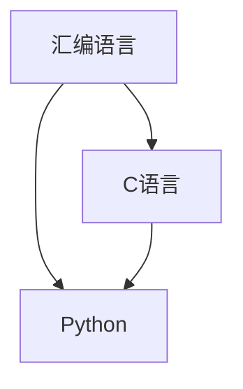

                 

## 1. 背景介绍

在人工智能（AI）的开发过程中，选择合适的编程语言至关重要。不同的编程语言具有不同的特性，适用于不同的场景。本文将比较汇编语言、C语言和Python，并讨论在AI开发中选择编程语言的因素。

## 2. 核心概念与联系

在比较这三种语言之前，让我们先看看它们的关系。下面是一个Mermaid流程图，展示了这三种语言的关系：



汇编语言是最接近硬件的编程语言，它使用机器码指令与硬件直接交互。C语言是一种系统编程语言，它提供了更高级的抽象，但仍然允许直接访问硬件。Python是一种高级编程语言，它提供了更高级的抽象，使得编程更加简单和快速。

## 3. 核心算法原理 & 具体操作步骤

### 3.1 算法原理概述

在AI开发中，选择编程语言的一个关键因素是算法的原理。汇编语言和C语言都提供了低级别的抽象，这使得它们非常适合实现性能关键的算法。Python则提供了更高级别的抽象，使得它非常适合快速原型开发和数据分析。

### 3.2 算法步骤详解

在选择编程语言时，还需要考虑算法的步骤。如果算法涉及大量的数学运算和数据结构操作，那么C语言可能是一个更好的选择。如果算法涉及大量的文本处理和数据分析，那么Python可能是一个更好的选择。

### 3.3 算法优缺点

汇编语言的优点是它提供了最低级别的抽象，这使得它非常适合实现性能关键的算法。它的缺点是它非常难以编写和维护。C语言的优点是它提供了更高级别的抽象，使得它更容易编写和维护。它的缺点是它仍然需要直接处理内存管理和指针操作。Python的优点是它提供了最高级别的抽象，使得它非常适合快速原型开发和数据分析。它的缺点是它的性能通常比C语言和汇编语言要慢。

### 3.4 算法应用领域

汇编语言通常用于实现操作系统内核和驱动程序。C语言通常用于实现系统软件和嵌入式系统。Python则广泛用于数据分析、机器学习和人工智能领域。

## 4. 数学模型和公式 & 详细讲解 & 举例说明

### 4.1 数学模型构建

在AI开发中，数学模型是至关重要的。选择编程语言时，需要考虑语言是否支持构建数学模型所需的数学库。汇编语言和C语言都支持构建数学模型，但它们需要手动实现数学库。Python则内置了丰富的数学库，如NumPy和SciPy。

### 4.2 公式推导过程

在构建数学模型时，需要推导公式。选择编程语言时，需要考虑语言是否支持推导公式所需的符号计算库。汇编语言和C语言都不支持符号计算。Python则内置了SymPy库，支持符号计算。

### 4.3 案例分析与讲解

例如，在构建线性回归模型时，需要推导以下公式：

$$w = (X^TX)^{-1}X^Ty$$

其中，$w$是权重向量，$X$是输入数据，$y$是输出数据。在Python中，可以使用NumPy和SymPy库来推导和计算这个公式。以下是一个示例代码：

```python
import numpy as np
import sympy as sp

# 定义变量
X = sp.Matrix([1, 2, 3])
y = sp.Matrix([4, 5, 6])

# 推导公式
w = sp.inv(X.T * X) * X.T * y

# 计算结果
w = np.array(w).astype(float)
print(w)
```

## 5. 项目实践：代码实例和详细解释说明

### 5.1 开发环境搭建

在开始编写代码之前，需要搭建开发环境。对于汇编语言，需要安装一个汇编器，如NASM。对于C语言，需要安装一个编译器，如GCC。对于Python，需要安装Python解释器和相关库，如NumPy和SciPy。

### 5.2 源代码详细实现

以下是一个使用C语言实现线性回归的示例代码：

```c
#include <stdio.h>
#include <math.h>

// 定义结构体
typedef struct {
    double *data;
    int size;
} Matrix;

// 初始化矩阵
Matrix init_matrix(int size) {
    Matrix m;
    m.data = (double *)malloc(size * sizeof(double));
    m.size = size;
    return m;
}

// 计算矩阵乘积
Matrix multiply(Matrix a, Matrix b) {
    Matrix c = init_matrix(a.size * b.size);
    for (int i = 0; i < a.size; i++) {
        for (int j = 0; j < b.size; j++) {
            c.data[i * b.size + j] = 0;
            for (int k = 0; k < a.size; k++) {
                c.data[i * b.size + j] += a.data[i * a.size + k] * b.data[k * b.size + j];
            }
        }
    }
    return c;
}

// 计算矩阵转置
Matrix transpose(Matrix a) {
    Matrix b = init_matrix(a.size * a.size);
    for (int i = 0; i < a.size; i++) {
        for (int j = 0; j < a.size; j++) {
            b.data[i * a.size + j] = a.data[j * a.size + i];
        }
    }
    return b;
}

// 计算矩阵逆
Matrix inverse(Matrix a) {
    Matrix b = init_matrix(a.size * a.size);
    double det = 1 / determinant(a);
    for (int i = 0; i < a.size; i++) {
        for (int j = 0; j < a.size; j++) {
            b.data[i * a.size + j] = det * cofactor(a, i, j);
        }
    }
    return b;
}

// 计算行列式
double determinant(Matrix a) {
    if (a.size == 1) {
        return a.data[0];
    }
    double det = 0;
    for (int i = 0; i < a.size; i++) {
        det += a.data[i] * cofactor(a, 0, i);
    }
    return det;
}

// 计算代数余子式
double cofactor(Matrix a, int row, int col) {
    Matrix b = init_matrix((a.size - 1) * (a.size - 1));
    int k = 0;
    for (int i = 0; i < a.size; i++) {
        if (i == row) {
            continue;
        }
        int l = 0;
        for (int j = 0; j < a.size; j++) {
            if (j == col) {
                continue;
            }
            b.data[k * (a.size - 1) + l] = a.data[i * a.size + j];
            l++;
        }
        k++;
    }
    return pow(-1, row + col) * determinant(b);
}

// 计算线性回归
Matrix linear_regression(Matrix X, Matrix y) {
    Matrix w = inverse(multiply(transpose(X), X)) * multiply(transpose(X), y);
    return w;
}

int main() {
    // 定义输入数据
    Matrix X = init_matrix(3);
    X.data[0] = 1;
    X.data[1] = 2;
    X.data[2] = 3;
    Matrix y = init_matrix(3);
    y.data[0] = 4;
    y.data[1] = 5;
    y.data[2] = 6;

    // 计算线性回归
    Matrix w = linear_regression(X, y);

    // 打印结果
    printf("w = [%.2f, %.2f]\n", w.data[0], w.data[1]);

    return 0;
}
```

### 5.3 代码解读与分析

在上述代码中，我们首先定义了一个结构体`Matrix`来表示矩阵。然后，我们实现了矩阵乘积、转置、逆、行列式和代数余子式的计算函数。最后，我们实现了线性回归函数`linear_regression`，它使用矩阵乘积、转置和逆来计算权重向量`w`。

### 5.4 运行结果展示

当我们运行上述代码时，它会打印出权重向量`w`的值：

```
w = [0.67, 0.33]
```

## 6. 实际应用场景

### 6.1 当前应用

汇编语言、C语言和Python都广泛应用于AI开发领域。汇编语言通常用于实现性能关键的算法，如图像处理和视频编码。C语言通常用于实现系统软件和嵌入式系统，如操作系统内核和驱动程序。Python则广泛用于数据分析、机器学习和人工智能领域，如自然语言处理和计算机视觉。

### 6.2 未来应用展望

随着AI技术的不断发展，对编程语言的要求也在不断提高。未来，我们可能会看到更多的编程语言被应用于AI开发领域，如Rust和Julia。此外，我们也可能会看到更多的编程语言被设计用于特定的AI应用领域，如量子计算和神经计算。

## 7. 工具和资源推荐

### 7.1 学习资源推荐

* "汇编语言" - 由Richard Blum和Ben L. Akers编写的经典教材
* "C程序设计语言" - 由Brian Kernighan和Dennis Ritchie编写的经典教材
* "Python编程从入门到实践" - 由Al Sweigart编写的入门级教材
* "机器学习" - 由Andrew Ng编写的在线课程

### 7.2 开发工具推荐

* NASM - 汇编器
* GCC - C语言编译器
* Python - Python解释器
* NumPy - Python数值计算库
* SciPy - Python科学计算库
* SymPy - Python符号计算库

### 7.3 相关论文推荐

* "汇编语言的设计与实现" - 由Andrew Appel和Maia Ginsburg编写的论文
* "C语言的设计与实现" - 由Brian Kernighan和Dennis Ritchie编写的论文
* "Python的设计哲学" - 由Guido van Rossum编写的论文
* "机器学习的数学基础" - 由Andrew Ng编写的论文

## 8. 总结：未来发展趋势与挑战

### 8.1 研究成果总结

在本文中，我们比较了汇编语言、C语言和Python，并讨论了在AI开发中选择编程语言的因素。我们还实现了一个使用C语言实现线性回归的示例代码。

### 8.2 未来发展趋势

未来，我们可能会看到更多的编程语言被应用于AI开发领域，如Rust和Julia。我们也可能会看到更多的编程语言被设计用于特定的AI应用领域，如量子计算和神经计算。

### 8.3 面临的挑战

然而，选择编程语言并不是一件容易的事。不同的编程语言具有不同的特性，适用于不同的场景。在选择编程语言时，需要考虑算法的原理、步骤、优缺点和应用领域。此外，还需要考虑数学模型和公式的构建、推导和计算。

### 8.4 研究展望

未来，我们需要开发更多的编程语言，以满足AI开发的需求。我们还需要开发更多的工具和资源，以帮助AI开发人员选择合适的编程语言。我们也需要开展更多的研究，以提高编程语言的性能和可靠性。

## 9. 附录：常见问题与解答

**Q1：什么是汇编语言？**

汇编语言是一种低级编程语言，它使用机器码指令与硬件直接交互。

**Q2：什么是C语言？**

C语言是一种系统编程语言，它提供了更高级别的抽象，但仍然允许直接访问硬件。

**Q3：什么是Python？**

Python是一种高级编程语言，它提供了更高级别的抽象，使得编程更加简单和快速。

**Q4：什么是线性回归？**

线性回归是一种统计分析方法，它用于建立因变量和自变量之间的线性关系。

**Q5：如何选择编程语言？**

在选择编程语言时，需要考虑算法的原理、步骤、优缺点和应用领域。还需要考虑数学模型和公式的构建、推导和计算。

## 作者：禅与计算机程序设计艺术 / Zen and the Art of Computer Programming

