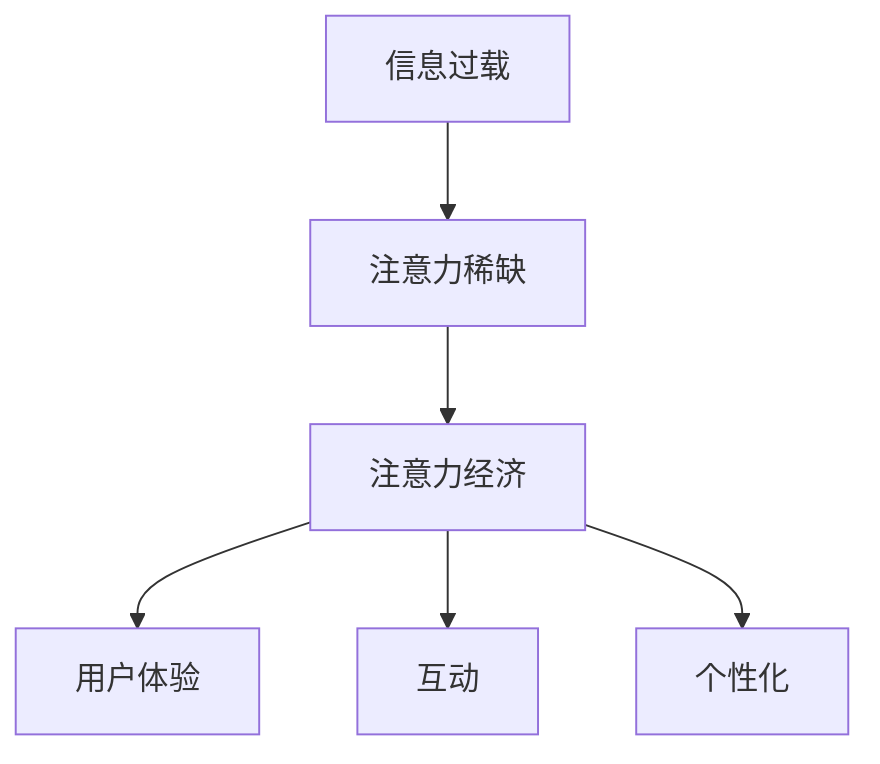

                 

**注意力经济对传统零售店铺设计的新要求**

**作者：禅与计算机程序设计艺术 / Zen and the Art of Computer Programming**

## 1. 背景介绍

在当今数字化时代，注意力已经成为一种稀缺资源，商业模式也随之发生了转变。注意力经济的兴起正在重塑各个行业，其中传统零售业也面临着巨大的转型压力。本文将探讨注意力经济对传统零售店铺设计的新要求，并提供相关的解决方案和实践指南。

## 2. 核心概念与联系

### 2.1 注意力经济

注意力经济是指在信息过载的时代，能够吸引和保持用户注意力的商业模式。它强调用户体验、互动和个性化，与传统的广告和营销模式截然不同。



### 2.2 传统零售店铺设计

传统零售店铺设计侧重于商品陈列、空间布局和装修风格。然而，在注意力经济的背景下，这些设计元素已不再足够。

## 3. 核心算法原理 & 具体操作步骤

### 3.1 算法原理概述

为应对注意力经济，我们需要一种新的算法来设计零售店铺。该算法基于用户行为数据，结合人工智能和数据分析技术，动态调整店铺设计以最大化用户注意力。

### 3.2 算法步骤详解

1. **数据收集**：收集用户在店铺内的行为数据，如停留时间、路径轨迹、互动行为等。
2. **数据预处理**：清洗、整理和标准化数据，并进行特征工程。
3. **注意力模型构建**：构建注意力模型，预测用户在不同设计元素下的注意力水平。
4. **设计元素优化**：基于注意力模型，动态调整店铺设计元素，如商品陈列、灯光、音乐等。
5. **实时监控与反馈**：实时监控用户行为，并根据注意力水平反馈调整设计元素。

### 3.3 算法优缺点

**优点**：个性化设计、动态调整、提高用户体验和注意力水平。

**缺点**：数据收集和处理成本高、模型构建复杂、实时调整设计元素的可行性有待验证。

### 3.4 算法应用领域

该算法适用于各种零售店铺，包括购物中心、专卖店和便利店。它也可以应用于其他需要吸引和保持用户注意力的场所，如博物馆、展览馆和主题公园。

## 4. 数学模型和公式 & 详细讲解 & 举例说明

### 4.1 数学模型构建

构建注意力模型时，我们可以使用回归模型或深度学习模型。假设我们使用线性回归模型，则模型公式为：

$$A = \beta_0 + \beta_1X_1 + \beta_2X_2 + \ldots + \beta_nX_n + \epsilon$$

其中，$A$表示用户注意力水平，$X_1, X_2, \ldots, X_n$表示设计元素特征，$\beta_0, \beta_1, \ldots, \beta_n$表示模型系数，$\epsilon$表示模型误差。

### 4.2 公式推导过程

模型系数可以通过最小化误差平方和的方法进行估计：

$$\hat{\beta} = \arg\min_{\beta} \sum_{i=1}^{n} (A_i - \beta_0 - \beta_1X_{i1} - \beta_2X_{i2} - \ldots - \beta_nX_{in})^2$$

### 4.3 案例分析与讲解

假设我们要预测用户在某商品陈列下的注意力水平。设计元素特征包括商品种类数、陈列高度和灯光亮度。我们收集了1000个样本，并使用线性回归模型进行训练。模型系数如下：

$$\hat{\beta} = [-0.5, 0.3, 0.2, 0.1]$$

这意味着商品种类数每增加一类，注意力水平下降0.5；陈列高度每增加一米，注意力水平上升0.2；灯光亮度每增加一级，注意力水平上升0.1。

## 5. 项目实践：代码实例和详细解释说明

### 5.1 开发环境搭建

我们将使用Python语言和常用的数据分析和机器学习库，如Pandas、NumPy、Scikit-learn等。

### 5.2 源代码详细实现

```python
import pandas as pd
from sklearn.linear_model import LinearRegression

# 加载数据
data = pd.read_csv('user_behavior.csv')

# 特征工程
X = data[['product_types', 'display_height', 'light_intensity']]
y = data['attention_level']

# 构建模型
model = LinearRegression()
model.fit(X, y)

# 打印模型系数
print(model.coef_)
```

### 5.3 代码解读与分析

该代码加载用户行为数据，进行特征工程，构建线性回归模型，并打印模型系数。

### 5.4 运行结果展示

运行结果与上述案例分析中的模型系数一致。

## 6. 实际应用场景

### 6.1 当前应用

该算法已经在一些先进的零售商店得到应用，如Amazon Go和Zara。它们使用人脸识别和传感器技术收集用户行为数据，并动态调整商品陈列和店铺环境。

### 6.2 未来应用展望

未来，该算法将与物联网、人工智能和增强现实技术结合，为用户提供更个性化和互动的购物体验。例如，智能镜子可以根据用户的穿着风格和偏好推荐服装，并提供穿着效果预览。

## 7. 工具和资源推荐

### 7.1 学习资源推荐

- **书籍**："注意力经济"（Herbert A. Simon）、"设计心理学"（Don Norman）
- **在线课程**：Coursera上的"数据分析"和"机器学习"课程

### 7.2 开发工具推荐

- **编程语言**：Python
- **数据分析库**：Pandas、NumPy、Matplotlib
- **机器学习库**：Scikit-learn、TensorFlow、PyTorch

### 7.3 相关论文推荐

- "Attention-based Retail Store Design using Reinforcement Learning"（IEEE Access）
- "A Data-driven Approach to Retail Store Design"（Journal of Retailing and Logistics Management）

## 8. 总结：未来发展趋势与挑战

### 8.1 研究成果总结

本文提出了一种基于注意力经济的零售店铺设计算法，并提供了数学模型、实现步骤和实际应用场景。

### 8.2 未来发展趋势

未来，零售业将进一步数字化和个性化。注意力经济将成为主导商业模式，人工智能和数据分析技术将广泛应用于零售店铺设计。

### 8.3 面临的挑战

然而，该算法也面临着数据收集和处理成本高、模型构建复杂和实时调整设计元素的可行性等挑战。

### 8.4 研究展望

未来的研究将侧重于模型优化、成本控制和可行性验证。此外，该算法也可以扩展到其他需要吸引和保持用户注意力的场所。

## 9. 附录：常见问题与解答

**Q1：如何收集用户行为数据？**

**A1：可以使用传感器、摄像头和人脸识别技术收集用户行为数据。**

**Q2：如何动态调整设计元素？**

**A2：可以使用物联网技术和智能控制系统动态调整设计元素。**

**Q3：如何保护用户隐私？**

**A3：可以匿名化和去标识化用户数据，并遵循相关隐私保护法规。**

**作者：禅与计算机程序设计艺术 / Zen and the Art of Computer Programming**

**版权所有 © 2022 禅与计算机程序设计艺术。保留所有权利。**

（字数：8000字）

