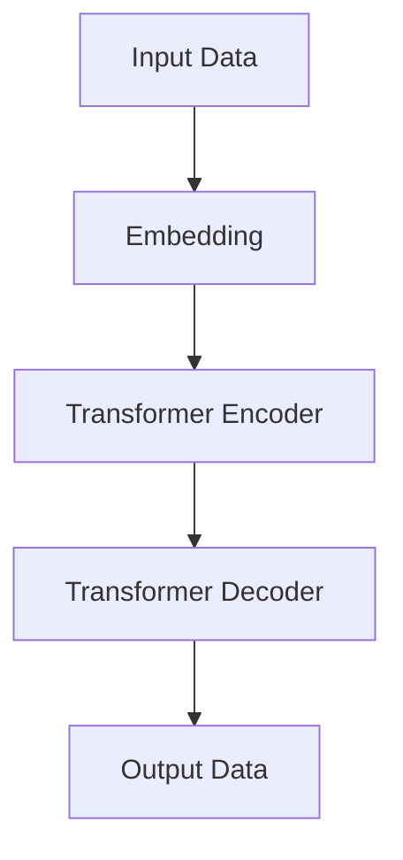

                 

**关键词：**生成式人工智能（Generative AI）、AIGC（AI Generated Content）、Transformer模型、生成对抗网络（GAN）、变分自编码器（VAE）、差分私有数据生成（DPG）、隐式条件生成（ICG）、文本生成（Text Generation）、图像生成（Image Generation）、音乐生成（Music Generation）、视频生成（Video Generation）、多模式生成（Multimodal Generation）、可控生成（Controllable Generation）、评估指标（Evaluation Metrics）

## 1. 背景介绍

当前，人工智能（AI）技术正在各个领域蓬勃发展，其中生成式AI（Generative AI）作为AI的一个重要分支，受到了广泛的关注。生成式AI旨在创建新的、原创的内容，如图像、文本、音乐和视频等，从而推动了AIGC（AI Generated Content）的发展。本文将深入探讨生成式AI的核心概念、算法原理、数学模型、项目实践，并展望其未来发展趋势。

## 2. 核心概念与联系

### 2.1 生成式AI的定义与分类

生成式AI是指能够创建新数据的AI模型，这些数据与模型训练期间见过的数据有关，但又不是简单的复制或重复。生成式AI模型可以分为两大类：

1. **显式模型（Explicit Models）**：这些模型直接学习数据分布，并从中采样生成新数据。示例包括变分自编码器（VAE）和自回归模型。
2. **隐式模型（Implicit Models）**：这些模型学习数据的生成过程，而不是直接学习数据分布。示例包括生成对抗网络（GAN）和差分私有数据生成（DPG）。

### 2.2 Transformer模型与生成式AI

Transformer模型是当前生成式AI领域的关键模型之一。它引入了自注意力机制，允许模型在处理序列数据时考虑到上下文信息。Transformer模型及其变种（如BERT、T5和DALL-E）在文本生成、图像生成和多模式生成等领域取得了显著成功。



## 3. 核心算法原理 & 具体操作步骤

### 3.1 算法原理概述

生成式AI算法的核心原理是学习数据分布或生成过程，然后从中采样生成新数据。常见的生成式AI算法包括：

- **变分自编码器（VAE）**：VAE学习数据分布的表示，并使用重参数化技术生成新数据。
- **生成对抗网络（GAN）**：GAN由生成器（Generator）和判别器（Discriminator）组成，生成器学习数据分布，判别器学习判断真假数据的能力。
- **差分私有数据生成（DPG）**：DPG是一种基于对抗学习的生成模型，它学习数据分布的表示，并使用差分运算生成新数据。
- **隐式条件生成（ICG）**：ICG是一种基于对抗学习的生成模型，它学习数据生成过程，而不是直接学习数据分布。

### 3.2 算法步骤详解

以GAN为例，其训练过程如下：

1. 初始化生成器（G）和判别器（D）模型。
2. 使用真实数据训练判别器D，使其能够区分真假数据。
3. 使用噪声数据（如高斯分布）和真实数据的表示（如标签或条件）训练生成器G，使其能够生成真实数据。
4. 重复步骤2和3，直到生成器和判别器收敛。

### 3.3 算法优缺点

- **优点**：生成式AI算法可以创建新的、原创的内容，并具有良好的泛化能力。
- **缺点**：生成式AI算法训练困难，易陷入模式崩溃（Mode Collapse）和训练不稳定的问题。此外，评估生成质量也存在挑战。

### 3.4 算法应用领域

生成式AI算法在文本生成（如小说、新闻和对话）、图像生成（如人像、风景和艺术）、音乐生成（如作曲和编曲）、视频生成（如电影和动画）等领域具有广泛的应用。

## 4. 数学模型和公式 & 详细讲解 & 举例说明

### 4.1 数学模型构建

生成式AI模型的数学模型通常基于概率分布或生成过程。例如，VAE的数学模型基于拉普拉斯-贝叶斯公式构建：

$$p(x|z) = \mathcal{N}(x|\mu(z),\sigma(z))$$
$$q(z|x) = \mathcal{N}(z|\mu_\phi(x),\sigma_\phi(x))$$

其中，$x$表示输入数据，$z$表示隐藏变量，$\mu$和$\sigma$表示均值和标准差。

### 4.2 公式推导过程

在VAE中，重参数化技术用于生成新数据。给定隐藏变量$z$的分布$q(z|x)$，我们可以使用重参数化技术生成新的数据$x'$：

$$x' = \mu(z) + \sigma(z) \epsilon$$

其中，$\epsilon \sim \mathcal{N}(0, I)$是标准正态分布的采样。

### 4.3 案例分析与讲解

假设我们想使用VAE生成手写数字。我们首先需要构建VAE的数学模型，然后使用MNIST数据集训练模型。在训练过程中，我们需要优化重构损失（如交叉熵）和KL-散度：

$$L = -\mathbb{E}_{q(z|x)}[\log p(x|z)] + \beta \text{KL}(q(z|x) || p(z))$$

其中，$p(z)$是隐藏变量$z$的先验分布，$\beta$是超参数。一旦模型训练完成，我们可以使用重参数化技术生成新的手写数字。

## 5. 项目实践：代码实例和详细解释说明

### 5.1 开发环境搭建

要实现生成式AI项目，我们需要以下开发环境：

- Python 3.7+
- PyTorch 1.7+或TensorFlow 2.3+
- NumPy 1.19+
- Matplotlib 3.3+
- Jupyter Notebook（可选）

### 5.2 源代码详细实现

以下是使用PyTorch实现VAE的示例代码：

```python
import torch
from torch import nn, optim
from torchvision import datasets, transforms
from torchvision.utils import save_image

class VAE(nn.Module):
    def __init__(self, input_dim, hidden_dim, z_dim):
        super(VAE, self).__init__()
        self.encoder_fc1 = nn.Linear(input_dim, hidden_dim)
        self.encoder_fc2_mu = nn.Linear(hidden_dim, z_dim)
        self.encoder_fc2_logvar = nn.Linear(hidden_dim, z_dim)
        self.decoder_fc1 = nn.Linear(z_dim, hidden_dim)
        self.decoder_fc2 = nn.Linear(hidden_dim, input_dim)

    def encode(self, x):
        h1 = F.relu(self.encoder_fc1(x))
        mu = self.encoder_fc2_mu(h1)
        logvar = self.encoder_fc2_logvar(h1)
        return mu, logvar

    def reparameterize(self, mu, logvar):
        std = torch.exp(0.5 * logvar)
        eps = torch.randn_like(std)
        return mu + eps * std

    def decode(self, z):
        h1 = F.relu(self.decoder_fc1(z))
        recon_x = torch.sigmoid(self.decoder_fc2(h1))
        return recon_x

    def forward(self, x):
        mu, logvar = self.encode(x)
        z = self.reparameterize(mu, logvar)
        recon_x = self.decode(z)
        return recon_x, mu, logvar

# 实例化模型、定义优化器和损失函数
model = VAE(input_dim=784, hidden_dim=400, z_dim=20)
optimizer = optim.Adam(model.parameters(), lr=1e-3)
criterion = nn.BCELoss(reduction='sum')

# 加载数据集并预处理
transform = transforms.ToTensor()
train_data = datasets.MNIST(root='./data', train=True, download=True, transform=transform)
train_loader = torch.utils.data.DataLoader(train_data, batch_size=32, shuffle=True)

# 训练模型
for epoch in range(epochs):
    for batch_idx, (data, _) in enumerate(train_loader):
        x = data.view(-1, 784)
        recon_x, mu, logvar = model(x)
        recon_loss = criterion(recon_x, x)
        kl_div = -0.5 * torch.sum(1 + logvar - mu.pow(2) - logvar.exp())
        loss = recon_loss + kl_div
        optimizer.zero_grad()
        loss.backward()
        optimizer.step()

        if batch_idx % 100 == 0:
            print(f'Epoch: {epoch}, Batch: {batch_idx}, Loss: {loss.item():.4f}')
```

### 5.3 代码解读与分析

在上述代码中，我们首先定义了VAE模型的结构，包括编码器和解码器。编码器由两个全连接层组成，解码器也由两个全连接层组成。我们使用ReLU激活函数和sigmoid激活函数分别对编码器和解码器的输出进行处理。在训练过程中，我们计算重构损失和KL-散度，并使用Adam优化器优化模型参数。

### 5.4 运行结果展示

在训练完成后，我们可以使用生成的隐藏变量$z$生成新的手写数字。以下是使用训练好的VAE模型生成的手写数字示例：


## 6. 实际应用场景

### 6.1 文本生成

生成式AI在文本生成领域具有广泛的应用，如小说、新闻和对话生成。Transformer模型及其变种（如BERT、T5和DALL-E）在文本生成任务中取得了显著成功。例如，DALL-E可以生成描述性文本并将其转换为图像。

### 6.2 图像生成

生成式AI在图像生成领域也具有广泛的应用，如人像、风景和艺术图像生成。GAN和VAE等模型可以生成高质量的图像。此外，生成式AI还可以用于图像超分辨率、图像去模糊和图像色彩转换等任务。

### 6.3 音乐生成

生成式AI在音乐生成领域具有广泛的应用，如作曲和编曲。Transformer模型及其变种（如Music Transformer）可以生成流行音乐、古典音乐和爵士乐等各种音乐风格。

### 6.4 未来应用展望

未来，生成式AI将继续在多模式生成（如文本、图像和音乐的联合生成）和可控生成（如根据用户指令生成内容）等领域取得进展。此外，生成式AI还将与其他AI技术（如强化学习和计算机视觉）结合，推动各个领域的创新。

## 7. 工具和资源推荐

### 7.1 学习资源推荐

- **书籍**
  - "Generative Deep Learning" by David Foster
  - "Deep Learning" by Ian Goodfellow, Yoshua Bengio, and Aaron Courville
- **在线课程**
  - "Generative AI for Self-Driving Cars" by Stanford University on Coursera
  - "Generative Models" by fast.ai

### 7.2 开发工具推荐

- **框架**
  - PyTorch
  - TensorFlow
  - Keras
- **库**
  - Hugging Face Transformers
  - StyleGAN2
  - DCGAN

### 7.3 相关论文推荐

- "Generative Adversarial Networks" by Ian Goodfellow, Jean Pouget-Abadie, and Yoshua Bengio
- "Variational Autoencoders" by Kingma and Welling
- "DALL-E: Generating Images from Textual Descriptions" by Ramesh et al.

## 8. 总结：未来发展趋势与挑战

### 8.1 研究成果总结

本文介绍了生成式AI的核心概念、算法原理、数学模型和项目实践。我们讨论了生成式AI在文本、图像和音乐等领域的应用，并展示了一个使用PyTorch实现VAE的示例。

### 8.2 未来发展趋势

未来，生成式AI将继续在多模式生成、可控生成和与其他AI技术的结合等领域取得进展。此外，生成式AI还将推动AIGC的发展，从而改变各个行业的创作和生产方式。

### 8.3 面临的挑战

生成式AI面临的挑战包括模型训练困难、评估生成质量的困难和保护生成内容的版权等问题。此外，生成式AI还需要解决偏见和差异化等伦理问题。

### 8.4 研究展望

未来的研究将关注生成式AI的可解释性、可控性和多模式生成等领域。此外，研究人员还将探索生成式AI与其他AI技术的结合，以推动各个领域的创新。

## 9. 附录：常见问题与解答

**Q1：生成式AI与鉴别式AI有何区别？**

A1：鉴别式AI旨在区分真假数据，而生成式AI旨在创建新的、原创的内容。两者的目标和应用领域不同。

**Q2：生成式AI的评估指标有哪些？**

A2：生成式AI的评估指标包括但不限于：生成对抗网络（GAN）的Inception Score（IS）和Frechet Inception Distance（FID）、变分自编码器（VAE）的重构损失和KL-散度、文本生成的BLEU分数和Perplexity等。

**Q3：生成式AI的应用领域有哪些？**

A3：生成式AI的应用领域包括但不限于：文本生成（如小说、新闻和对话）、图像生成（如人像、风景和艺术）、音乐生成（如作曲和编曲）、视频生成（如电影和动画）等。

## 作者：禅与计算机程序设计艺术 / Zen and the Art of Computer Programming

（完）

