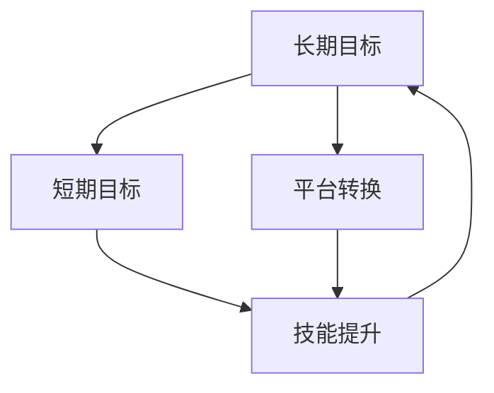

                 

## 程序员的职业生涯规划：长跑与长跑

> 关键词：职业生涯规划、技能提升、持续学习、长期目标、平台转换

## 1. 背景介绍

在信息技术飞速发展的今天，程序员这个职业受到了前所未有的关注。然而，编程这项技能并非一蹴而就，而是需要长期的学习和实践。本文将从程序员的职业生涯规划角度出发，分享一些经验和建议，帮助程序员在 IT 这个大跑道上跑得更远、更稳、更快。

## 2. 核心概念与联系

### 2.1 核心概念

- **长期目标（Long-term Goal）**：指程序员在未来一段时间内（通常为数年）想要实现的职业目标。
- **短期目标（Short-term Goal）**：指程序员在当前或短期内（通常为数月）想要实现的具体目标。
- **技能提升（Skill Improvement）**：指程序员通过学习和实践，提高编程技能的过程。
- **平台转换（Platform Switching）**：指程序员从一种编程语言、框架或开发环境转换到另一种的过程。

### 2.2 核心概念联系

程序员的职业生涯规划是一个动态的过程，需要不断平衡长期目标和短期目标，通过技能提升来实现目标，并根据需要进行平台转换。下图展示了这些概念的关系：



## 3. 核心算法原理 & 具体操作步骤

### 3.1 算法原理概述

程序员的职业生涯规划算法可以看作一个反复迭代的过程，每个迭代周期包含以下步骤：

1. 确定长期目标和短期目标；
2. 评估当前技能水平；
3. 确定需要提升的技能；
4. 学习和实践以提升技能；
5. 评估技能提升情况；
6. 根据需要进行平台转换；
7. 重复上述步骤。

### 3.2 算法步骤详解

#### 3.2.1 确定长期目标和短期目标

长期目标应当是具体的、可衡量的，例如 "三年内成为架构师" 或 "五年内创立自己的公司"。短期目标则应当是实现长期目标的具体步骤，例如 "一年内学习云原生架构" 或 "半年内掌握一门新编程语言"。

#### 3.2.2 评估当前技能水平

评估当前技能水平可以通过自测、与同行交流、参加技术会议等方式进行。要客观评估自己的优势和不足，为下一步的技能提升提供依据。

#### 3.2.3 确定需要提升的技能

根据长期目标和短期目标，结合当前技能水平评估结果，确定需要提升的技能。这些技能应当是实现目标所必需的，且当前水平有待提高。

#### 3.2.4 学习和实践以提升技能

学习和实践是技能提升的关键。可以通过在线课程、技术书籍、开源项目等方式学习新技能。实践则可以通过工作项目、个人项目或参加技术竞赛等方式进行。

#### 3.2.5 评估技能提升情况

定期评估技能提升情况，看看自己是否达到了预期水平。如果没有，需要调整学习和实践的方向和方法。

#### 3.2.6 根据需要进行平台转换

随着技术的发展，一些新的编程语言、框架或开发环境可能会出现，并成为实现目标的关键。此时，程序员需要进行平台转换，学习新的技术栈。

### 3.3 算法优缺点

**优点**：该算法能够帮助程序员明确目标，有计划地提升技能，从而实现职业生涯的长期发展。

**缺点**：该算法需要程序员有很强的自驱动力，能够自觉地学习和实践。此外，该算法对技术发展的预判能力也很重要，如果预判不足，可能会导致平台转换的成本过高。

### 3.4 算法应用领域

该算法适用于所有程序员，无论是初入行的新手还是已经有一定经验的老手。它可以帮助程序员从不同的角度看待自己的职业生涯，并提供了一套系统的方法来实现自己的目标。

## 4. 数学模型和公式 & 详细讲解 & 举例说明

### 4.1 数学模型构建

设程序员的技能水平为 $S(t)$，时间 $t$ 为程序员从事编程工作的年数。则程序员的技能水平随时间变化的模型可以表示为：

$$S(t) = S_0 + \int_{0}^{t} \alpha(t) dt$$

其中，$S_0$ 为程序员初始技能水平，$ \alpha(t) $ 为程序员每年技能提升的速率。

### 4.2 公式推导过程

程序员的技能水平是随着时间变化的，可以看作是初始技能水平 $S_0$ 加上从事编程工作以来每年技能提升的总和。这里的技能提升速率 $ \alpha(t) $ 可以看作是程序员每年学习和实践的结果。

### 4.3 案例分析与讲解

例如，一位程序员初始技能水平为 $S_0 = 5$（用分数表示），每年技能提升速率为 $ \alpha(t) = 0.5$。则该程序员在从事编程工作 $t$ 年后的技能水平为：

$$S(t) = 5 + \int_{0}^{t} 0.5 dt = 5 + 0.5t$$

如果 $t = 5$ 年，则该程序员的技能水平为 $S(5) = 6$。这说明，如果该程序员每年都能保持一定的学习和实践强度，那么五年后，他的技能水平将会有明显提高。

## 5. 项目实践：代码实例和详细解释说明

### 5.1 开发环境搭建

本项目使用 Python 语言，需要安装 Python 环境和 NumPy、Matplotlib 库。可以使用以下命令安装：

```bash
pip install numpy matplotlib
```

### 5.2 源代码详细实现

以下是实现程序员技能水平模型的 Python 代码：

```python
import numpy as np
import matplotlib.pyplot as plt

# 初始技能水平
S0 = 5

# 技能提升速率
alpha = 0.5

# 时间列表
t = np.linspace(0, 10, 100)

# 计算技能水平列表
S = S0 + alpha * t

# 绘制技能水平随时间变化图
plt.plot(t, S)
plt.xlabel('Time (years)')
plt.ylabel('Skill level')
plt.title('Skill level over time')
plt.show()
```

### 5.3 代码解读与分析

该代码使用 NumPy 计算技能水平列表，并使用 Matplotlib 绘制技能水平随时间变化的图表。图表显示，随着时间推移，程序员的技能水平会不断提高。

### 5.4 运行结果展示

运行该代码后，会生成一个图表，显示程序员的技能水平随着时间推移而不断提高。这说明，如果程序员能够保持一定的学习和实践强度，那么他的技能水平会有明显提高。

## 6. 实际应用场景

### 6.1 当前应用

程序员的职业生涯规划算法可以帮助程序员明确自己的目标，有计划地提升技能，从而实现自己的职业生涯目标。例如，一位想要成为架构师的程序员，可以根据该算法确定自己的长期目标和短期目标，评估自己的当前技能水平，并有计划地学习和实践以提升自己的技能。

### 6.2 未来应用展望

随着技术的发展，程序员的职业生涯规划也需要与时俱进。未来，程序员的职业生涯规划可能会更加注重软技能的提升，如沟通、协作、创新等。此外，人工智能、区块链等新技术的发展，也会对程序员的职业生涯规划产生新的影响。

## 7. 工具和资源推荐

### 7.1 学习资源推荐

- **在线课程**： Coursera、Udemy、Pluralsight 等在线学习平台提供了大量的编程课程。
- **技术书籍**：《代码大全》《设计模式》《深入理解计算机系统》等技术书籍是程序员的必读书籍。
- **开源项目**：GitHub 上有大量的开源项目，程序员可以从中学习新技能。

### 7.2 开发工具推荐

- **集成开发环境（IDE）**：Visual Studio Code、IntelliJ IDEA、PyCharm 等 IDE 提供了丰富的开发功能。
- **版本控制系统**：Git 是当前最流行的版本控制系统，可以帮助程序员管理代码。
- **云平台**：AWS、Google Cloud、Azure 等云平台提供了丰富的开发资源。

### 7.3 相关论文推荐

- [The Mythical Man-Month: Essays on Software Engineering](https://www.goodreads.com/book/show/4069.The_Mythical_Man_Month)
- [The Cathedral and the Bazaar](https://www.goodreads.com/book/show/8477.The_Cathedral_and_the_Bazaar)
- [You Don't Know JS](https://github.com/getify/You-Dont-Know-JS)

## 8. 总结：未来发展趋势与挑战

### 8.1 研究成果总结

本文提出了程序员的职业生涯规划算法，并给出了数学模型和代码实现。该算法能够帮助程序员明确目标，有计划地提升技能，从而实现自己的职业生涯目标。

### 8.2 未来发展趋势

未来，程序员的职业生涯规划可能会更加注重软技能的提升，如沟通、协作、创新等。此外，人工智能、区块链等新技术的发展，也会对程序员的职业生涯规划产生新的影响。

### 8.3 面临的挑战

程序员的职业生涯规划面临的挑战包括技术发展速度快、学习压力大、工作压力大等。程序员需要不断学习，不断适应新的技术环境，才能实现自己的职业生涯目标。

### 8.4 研究展望

未来，程序员的职业生涯规划研究可以从以下几个方向展开：

- **软技能提升**：如何帮助程序员提升沟通、协作、创新等软技能？
- **新技术影响**：新技术的发展对程序员的职业生涯规划会产生什么影响？
- **个性化规划**：如何根据程序员的个性特点，提供个性化的职业生涯规划？

## 9. 附录：常见问题与解答

**Q1：我该如何确定自己的长期目标？**

**A1：长期目标应当是具体的、可衡量的，例如 "三年内成为架构师" 或 "五年内创立自己的公司"。可以根据自己的兴趣、优势和当前技能水平确定长期目标。**

**Q2：我该如何评估自己的当前技能水平？**

**A2：评估当前技能水平可以通过自测、与同行交流、参加技术会议等方式进行。要客观评估自己的优势和不足，为下一步的技能提升提供依据。**

**Q3：我该如何学习新技能？**

**A3：学习新技能可以通过在线课程、技术书籍、开源项目等方式进行。实践则可以通过工作项目、个人项目或参加技术竞赛等方式进行。**

**Q4：我该如何评估自己的技能提升情况？**

**A4：定期评估技能提升情况，看看自己是否达到了预期水平。如果没有，需要调整学习和实践的方向和方法。**

**Q5：我该如何进行平台转换？**

**A5：随着技术的发展，一些新的编程语言、框架或开发环境可能会出现，并成为实现目标的关键。此时，程序员需要进行平台转换，学习新的技术栈。可以通过在线课程、技术书籍、开源项目等方式学习新技能。**

!!!Note
作者：禅与计算机程序设计艺术 / Zen and the Art of Computer Programming

