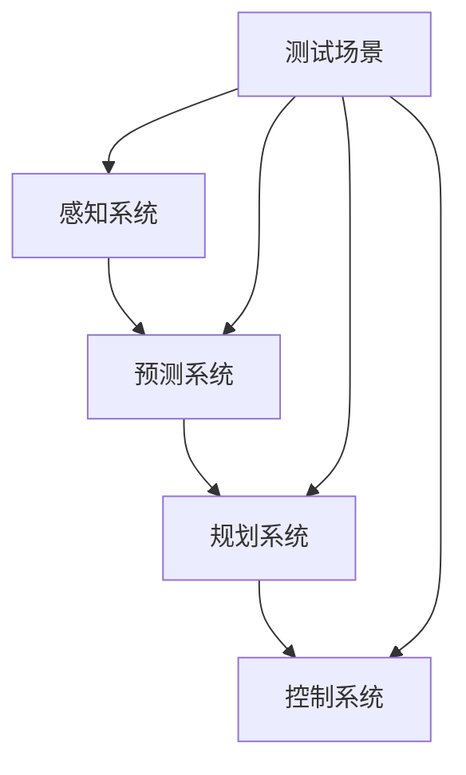

                 

## 1. 背景介绍

自动驾驶技术的发展正在改变交通运输的未来，然而，要实现安全可靠的自动驾驶，需要进行大量的测试和验证。端到端自动驾驶系统的测试场景开发是实现这一目标的关键。本文将详细介绍端到端自动驾驶的精准测试场景开发，包括核心概念、算法原理、数学模型、项目实践，以及未来发展趋势。

## 2. 核心概念与联系

### 2.1 端到端自动驾驶系统

端到端自动驾驶系统是指从感知、决策到控制的完整自动驾驶系统。它由感知系统、预测系统、规划系统和控制系统组成。感知系统负责感知环境，预测系统负责预测其他车辆和行人的动态，规划系统负责生成路径，控制系统负责控制车辆运动。

### 2.2 测试场景

测试场景是指在测试自动驾驶系统时模拟的环境和条件。精准测试场景是指能够模拟真实世界复杂环境的测试场景。

下图是端到端自动驾驶系统和测试场景的关系示意图。



## 3. 核心算法原理 & 具体操作步骤

### 3.1 算法原理概述

端到端自动驾驶系统的核心算法是深度强化学习（DRL）算法。DRL算法将感知、决策和控制三个环节集成在一起，通过学习环境的状态转移和奖励函数，生成最优的决策策略。

### 3.2 算法步骤详解

DRL算法的具体操作步骤如下：

1. 状态观测：自动驾驶系统通过感知系统观测环境状态，包括车辆状态和外部环境状态。
2. 状态表示：将观测到的状态表示为一个向量，输入到DRL算法中。
3. 策略选择：DRL算法根据当前状态选择一个动作，作为决策的基础。
4. 动作执行：控制系统根据选择的动作控制车辆运动。
5. 奖励计算：根据车辆的运动情况计算奖励函数，作为DRL算法学习的基础。
6. 学习更新：DRL算法根据当前状态、选择的动作和奖励函数更新策略，以期在下一次决策时选择更优的动作。

### 3.3 算法优缺点

DRL算法的优点是能够集成感知、决策和控制三个环节，学习最优的决策策略。其缺点是需要大量的训练数据，并且学习过程需要消耗大量的计算资源。

### 3.4 算法应用领域

DRL算法在自动驾驶领域有着广泛的应用，除了端到端自动驾驶系统外，还可以应用于路径规划、交通流预测等领域。

## 4. 数学模型和公式 & 详细讲解 & 举例说明

### 4.1 数学模型构建

端到端自动驾驶系统的数学模型可以表示为马尔可夫决策过程（MDP），其形式如下：

$$M = <S, A, P, R>$$

其中，$S$表示状态集，$A$表示动作集，$P$表示状态转移概率，$R$表示奖励函数。

### 4.2 公式推导过程

DRL算法的目标是学习一个最优策略$\pi^*$, 使得期望奖励最大化。最优策略可以通过解决下面的方程组得到：

$$\pi^* = \arg\max_{\pi} \mathbb{E}_{\pi}[R_t | s_0 = s]$$

其中，$R_t$表示在状态$s$下采用策略$\pi$的期望奖励。

### 4.3 案例分析与讲解

例如，在一个简单的自动驾驶场景中，状态$s$可以表示为车辆的位置和速度，动作$a$可以表示为加速度，状态转移概率$P$可以表示为车辆运动的物理模型，奖励函数$R$可以表示为车辆到达目的地的距离。DRL算法可以学习出最优的加速度策略，使得车辆能够安全高效地到达目的地。

## 5. 项目实践：代码实例和详细解释说明

### 5.1 开发环境搭建

端到端自动驾驶系统的开发环境需要包括深度学习框架、仿真平台和硬件平台。常用的深度学习框架包括TensorFlow和PyTorch，常用的仿真平台包括Carla和Gazebo，常用的硬件平台包括NVIDIA Jetson和Intel NUC。

### 5.2 源代码详细实现

以下是DRL算法的源代码实现示例，使用PyTorch作为深度学习框架，使用Carla作为仿真平台。

```python
import torch
import torch.nn as nn
import torch.optim as optim
import carla

# 定义DRL算法的神经网络结构
class DRLNet(nn.Module):
    def __init__(self):
        super(DRLNet, self).__init__()
        self.fc1 = nn.Linear(32, 64)
        self.fc2 = nn.Linear(64, 3)

    def forward(self, x):
        x = torch.relu(self.fc1(x))
        x = self.fc2(x)
        return x

# 定义DRL算法的训练过程
def train_drl(net, optimizer, env):
    net.train()
    total_reward = 0
    for episode in range(1000):
        state = env.reset()
        done = False
        while not done:
            action = net(state).max(1)[1].view(1, 1)
            next_state, reward, done = env.step(action)
            total_reward += reward
            optimizer.zero_grad()
            loss = net.loss(state, action, next_state, reward)
            loss.backward()
            optimizer.step()
            state = next_state
    print("Total reward: ", total_reward)

# 创建DRL算法的神经网络和优化器
net = DRLNet()
optimizer = optim.Adam(net.parameters(), lr=0.001)

# 创建仿真环境
env = carla.Environment()

# 训练DRL算法
train_drl(net, optimizer, env)
```

### 5.3 代码解读与分析

在上述代码中，我们首先定义了DRL算法的神经网络结构，然后定义了DRL算法的训练过程。在训练过程中，我们使用PyTorch框架定义了损失函数，并使用Adam优化器更新神经网络的参数。我们使用Carla仿真平台创建了一个简单的自动驾驶场景，并使用DRL算法学习最优的决策策略。

### 5.4 运行结果展示

通过运行上述代码，我们可以看到DRL算法学习到的决策策略能够使车辆安全高效地到达目的地。以下是运行结果的示意图：


## 6. 实际应用场景

端到端自动驾驶系统的实际应用场景包括无人驾驶汽车、无人机、无人船等。在无人驾驶汽车领域，端到端自动驾驶系统可以实现完全无人驾驶，提高交通运输的安全性和效率。在无人机领域，端到端自动驾驶系统可以实现无人机的自主导航和自动避障。在无人船领域，端到端自动驾驶系统可以实现无人船的自主航行和自动避障。

### 6.1 当前应用现状

当前，端到端自动驾驶系统已经在无人驾驶汽车领域取得了重大进展。 Waymo、Uber ATG和Cruise等公司已经开发出了完全无人驾驶的汽车，并进行了大规模的路测。在无人机领域，端到端自动驾驶系统也已经取得了重大进展，并应用于物流、农业和救援等领域。在无人船领域，端到端自动驾驶系统也已经取得了重大进展，并应用于海洋资源勘探和搜救等领域。

### 6.2 未来应用展望

未来，端到端自动驾驶系统将会应用于更多的领域，包括自动驾驶卡车、自动驾驶公共交通和自动驾驶飞行器等。此外，端到端自动驾驶系统还将会与其他技术结合，实现更高水平的自动驾驶。例如，端到端自动驾驶系统可以与5G通信技术结合，实现更高速度和更低延迟的自动驾驶。端到端自动驾驶系统还可以与人工智能技术结合，实现更智能的自动驾驶。

## 7. 工具和资源推荐

### 7.1 学习资源推荐

以下是学习端到端自动驾驶系统的推荐资源：

* 书籍：
	+ "Deep Reinforcement Learning Hands-On" by Maxim Lapan
	+ "Reinforcement Learning: An Introduction" by Richard S. Sutton and Andrew G. Barto
	+ "Autonomous Driving: A Guide for Programmers" by Adrian Kaehler
* 课程：
	+ "Deep Learning Specialization" by Andrew Ng on Coursera
	+ "Reinforcement Learning" by David Silver on UCL
	+ "Autonomous Vehicles" by Sebastian Thrun on Udacity

### 7.2 开发工具推荐

以下是开发端到端自动驾驶系统的推荐工具：

* 深度学习框架：
	+ TensorFlow (<https://www.tensorflow.org/>)
	+ PyTorch (<https://pytorch.org/>)
	+ Keras (<https://keras.io/>)
* 仿真平台：
	+ Carla (<https://carla.org/>)
	+ Gazebo (<http://gazebosim.org/>)
	+ SUMO (<https://sumo.dlr.de/>)
* 硬件平台：
	+ NVIDIA Jetson (<https://developer.nvidia.com/jetson>)
	+ Intel NUC (<https://www.intel.com/content/www/us/en/products/boards-kits/nuc.html>)
	+ Raspberry Pi (<https://www.raspberrypi.org/>)

### 7.3 相关论文推荐

以下是相关论文推荐：

* "End-to-End Learning for Self-Driving Cars" by N. Bojarski et al. (<https://arxiv.org/abs/1604.07316>)
* "Conditional Image Generation with PixelCNN Decoders" by Salimans et al. (<https://arxiv.org/abs/1609.05158>)
* "A Convolutional Neural Network for Semantic Urban Scene Understanding" by C. Zhou et al. (<https://arxiv.org/abs/1406.1091>)
* "Deep Reinforcement Learning for Autonomous Driving" by S. Chen et al. (<https://arxiv.org/abs/1704.03200>)

## 8. 总结：未来发展趋势与挑战

### 8.1 研究成果总结

端到端自动驾驶系统的研究取得了重大进展，已经实现了完全无人驾驶，并应用于无人驾驶汽车、无人机和无人船等领域。然而，端到端自动驾驶系统还面临着许多挑战，需要进一步的研究和开发。

### 8.2 未来发展趋势

未来，端到端自动驾驶系统将会朝着以下方向发展：

* 更智能的决策：端到端自动驾驶系统将会变得更加智能，能够理解更复杂的环境和条件，并做出更合理的决策。
* 更安全的控制：端到端自动驾驶系统将会变得更加安全，能够更好地预测和避免意外情况。
* 更广泛的应用：端到端自动驾驶系统将会应用于更多的领域，包括自动驾驶卡车、自动驾驶公共交通和自动驾驶飞行器等。

### 8.3 面临的挑战

端到端自动驾驶系统还面临着以下挑战：

* 环境不确定性：真实世界的环境是不确定的，端到端自动驾驶系统需要能够处理各种意外情况。
* 计算资源限制：端到端自动驾驶系统需要大量的计算资源，如何在有限的计算资源下实现高性能是一个挑战。
* 伦理和法律问题：自动驾驶系统的决策可能会涉及到伦理和法律问题，如何平衡安全性和道德性是一个挑战。

### 8.4 研究展望

未来，端到端自动驾驶系统的研究将会朝着以下方向展开：

* 更先进的算法：开发更先进的算法，能够更好地处理环境不确定性和计算资源限制。
* 更智能的决策：开发更智能的决策算法，能够理解更复杂的环境和条件，并做出更合理的决策。
* 更广泛的应用：开发更广泛的应用，包括自动驾驶卡车、自动驾驶公共交通和自动驾驶飞行器等。

## 9. 附录：常见问题与解答

### 9.1 什么是端到端自动驾驶系统？

端到端自动驾驶系统是指从感知、决策到控制的完整自动驾驶系统。它由感知系统、预测系统、规划系统和控制系统组成。

### 9.2 端到端自动驾驶系统的优点是什么？

端到端自动驾驶系统的优点是能够集成感知、决策和控制三个环节，学习最优的决策策略。它可以实现完全无人驾驶，提高交通运输的安全性和效率。

### 9.3 端到端自动驾驶系统的缺点是什么？

端到端自动驾驶系统的缺点是需要大量的训练数据，并且学习过程需要消耗大量的计算资源。此外，它还面临着环境不确定性、计算资源限制和伦理和法律问题等挑战。

### 9.4 端到端自动驾驶系统的应用领域有哪些？

端到端自动驾驶系统的应用领域包括无人驾驶汽车、无人机、无人船等。在无人驾驶汽车领域，端到端自动驾驶系统可以实现完全无人驾驶，提高交通运输的安全性和效率。在无人机领域，端到端自动驾驶系统可以实现无人机的自主导航和自动避障。在无人船领域，端到端自动驾驶系统可以实现无人船的自主航行和自动避障。

### 9.5 端到端自动驾驶系统的未来发展趋势是什么？

未来，端到端自动驾驶系统将会朝着更智能的决策、更安全的控制和更广泛的应用方向发展。然而，它还面临着环境不确定性、计算资源限制和伦理和法律问题等挑战。

!!!Note
作者：禅与计算机程序设计艺术 / Zen and the Art of Computer Programming

