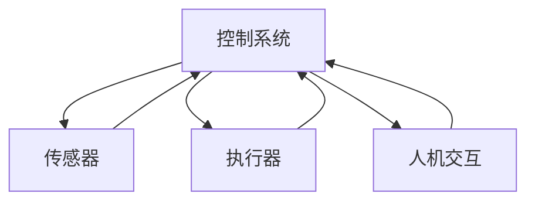

                 

## 1. 背景介绍

自动化技术是指利用机器、设备和软件等自动完成工作的技术。自动化技术的发展与应用已经渗透到我们的日常生活和工业生产的方方面面。从汽车、家电到工业机器人，再到人工智能和物联网，自动化技术无处不在。本文将深入探讨自动化技术的发展历程、核心概念与联系、关键算法原理、数学模型、项目实践、实际应用场景，并提供工具和资源推荐，最终展望未来发展趋势与挑战。

## 2. 核心概念与联系

自动化技术的核心概念包括控制系统、传感器、执行器、人机交互等。这些概念是相互联系的，共同构成了自动化系统的整体架构。下面是这些概念的Mermaid流程图表示：



- **控制系统**：自动化系统的大脑，根据预设的程序或算法，接收传感器信息，并发出指令控制执行器。
- **传感器**：检测自动化系统运行状态的设备，将检测到的信息转换为电信号传递给控制系统。
- **执行器**：根据控制系统的指令，执行相应的动作，完成自动化系统的任务。
- **人机交互**：连接人与自动化系统的桥梁，实现人与系统的信息交流。

## 3. 核心算法原理 & 具体操作步骤

### 3.1 算法原理概述

自动化技术中常用的算法包括PID控制算法、模糊控制算法、神经网络控制算法等。本节以PID控制算法为例进行介绍。

PID控制算法是一种最常用的控制算法，其名称来自于算法的三个基本参数：比例（Proportional）、积分（Integral）、微分（Derivative）。PID控制算法的目标是使系统的输出与输入保持一致，即系统的误差为零。

### 3.2 算法步骤详解

PID控制算法的具体操作步骤如下：

1. **误差计算**：计算系统的当前输出与输入之间的误差。
2. **比例控制**：根据误差的大小，调整控制量。比例系数越大，控制量的变化越大。
3. **积分控制**：累积误差，并根据累积误差调整控制量。积分系数越大，控制量的变化越大。
4. **微分控制**：预测误差的变化趋势，并根据预测调整控制量。微分系数越大，控制量的变化越大。
5. **控制量计算**：将比例、积分、微分控制量相加，得到最终的控制量。
6. **控制量输出**：将控制量输出给执行器，执行相应的动作。

### 3.3 算法优缺点

PID控制算法的优点包括：

- 结构简单，易于实现。
- 成本低廉，适用于各种控制系统。
- 稳定性好，能够有效抑制系统的振荡。

PID控制算法的缺点包括：

- 只能应用于线性系统，对非线性系统的控制效果不佳。
- 参数调节困难，需要大量的试错过程。
- 无法应对系统的突发变化，适应性差。

### 3.4 算法应用领域

PID控制算法广泛应用于工业控制系统，如温度控制、压力控制、流量控制等。此外，PID控制算法也应用于航空航天、机器人控制、汽车控制等领域。

## 4. 数学模型和公式 & 详细讲解 & 举例说明

### 4.1 数学模型构建

PID控制算法的数学模型可以表示为：

$$u(t) = K_p e(t) + K_i \int_{0}^{t} e(\tau) d\tau + K_d \frac{de(t)}{dt}$$

其中，$u(t)$是控制量，$e(t)$是误差，$K_p$是比例系数，$K_i$是积分系数，$K_d$是微分系数。

### 4.2 公式推导过程

PID控制算法的公式推导过程如下：

1. **误差计算**：$e(t) = r(t) - y(t)$，其中$r(t)$是输入，$y(t)$是输出。
2. **比例控制**：$u_p(t) = K_p e(t)$。
3. **积分控制**：$u_i(t) = K_i \int_{0}^{t} e(\tau) d\tau$。
4. **微分控制**：$u_d(t) = K_d \frac{de(t)}{dt}$。
5. **控制量计算**：$u(t) = u_p(t) + u_i(t) + u_d(t)$。

### 4.3 案例分析与讲解

例如，在温度控制系统中，输入$r(t)$是设定的温度，输出$y(t)$是系统当前的温度。误差$e(t)$表示设定温度与当前温度之间的差异。控制量$u(t)$表示加热器的功率。通过调节比例系数$K_p$，积分系数$K_i$，微分系数$K_d$，可以使系统的温度稳定在设定的值附近。

## 5. 项目实践：代码实例和详细解释说明

### 5.1 开发环境搭建

本项目使用Python语言开发，环境包括：

- Python 3.8
- NumPy
- Matplotlib
- Control

### 5.2 源代码详细实现

以下是PID控制算法的Python实现代码：

```python
import numpy as np
import matplotlib.pyplot as plt
from control import tf, step_response

# 系统传递函数
G = tf([1], [1, 2, 1])

# PID控制器参数
Kp = 1.0
Ki = 0.5
Kd = 0.2

# 闭环传递函数
Gc = tf([Kp, Ki, Kd], [1, 0])

# 闭环系统
sys_cl = G * Gc

# 步进响应
t, y, x = step_response(sys_cl)

# 绘制步进响应图
plt.plot(t, y)
plt.xlabel('Time (s)')
plt.ylabel('Output')
plt.title('Step Response')
plt.grid()
plt.show()
```

### 5.3 代码解读与分析

代码首先定义了系统的传递函数$G(s)$。然后，定义了PID控制器的参数$K_p$，$K_i$，$K_d$，并构建了闭环传递函数$Gc(s)$。之后，计算闭环系统的传递函数$sys\_cl(s)$。最后，使用`step_response`函数计算闭环系统的步进响应，并绘制步进响应图。

### 5.4 运行结果展示

运行代码后，会生成系统的步进响应图。图中显示了系统的输出随时间变化的情况。通过调节PID控制器的参数，可以改变系统的响应特性，使系统的输出更接近理想的步进响应。

## 6. 实际应用场景

### 6.1 工业控制

PID控制算法广泛应用于工业控制系统，如温度控制、压力控制、流量控制等。例如，在化工生产过程中，需要控制反应釜的温度，以保证化学反应的稳定进行。此时，可以使用PID控制算法控制加热器的功率，从而实现温度的稳定控制。

### 6.2 机器人控制

PID控制算法也应用于机器人控制领域。例如，在机器人臂的控制中，需要控制机器人臂的位置和姿态。此时，可以使用PID控制算法控制机器人臂的电机，从而实现位置和姿态的稳定控制。

### 6.3 未来应用展望

随着物联网和人工智能技术的发展，自动化技术的应用领域将会进一步扩展。未来，自动化技术将会渗透到更多的领域，如智能交通、智能家居、智能医疗等。此外，自动化技术也将与人工智能技术结合，实现更高水平的自动化控制。

## 7. 工具和资源推荐

### 7.1 学习资源推荐

- **书籍**：推荐阅读《控制系统工程学》和《自动控制原理》等专业书籍。
- **在线课程**：推荐学习 Coursera上的《控制系统工程》和 Udacity上的《机器人控制》等课程。

### 7.2 开发工具推荐

- **Matlab/Simulink**：是控制系统设计和仿真软件，广泛应用于工业控制系统的设计和仿真。
- **Python Control Library**：是Python语言的控制系统库，提供了丰富的控制系统设计和分析工具。

### 7.3 相关论文推荐

- [PID Control](https://ieeexplore.ieee.org/document/4277893)
- [PID Control with Anti-Windup](https://ieeexplore.ieee.org/document/4631097)
- [Robust PID Control](https://ieeexplore.ieee.org/document/4100594)

## 8. 总结：未来发展趋势与挑战

### 8.1 研究成果总结

自动化技术的发展已经取得了丰硕的成果，从工业控制到机器人控制，再到人工智能控制，自动化技术已经渗透到各个领域。PID控制算法作为最基本的控制算法，仍然是自动化技术的核心。

### 8.2 未来发展趋势

未来，自动化技术的发展将会朝着以下方向进行：

- **智能化**：自动化技术将会与人工智能技术结合，实现更高水平的自动化控制。
- **网络化**：自动化技术将会与物联网技术结合，实现更广泛的自动化控制。
- **柔性化**：自动化技术将会朝着柔性化方向发展，实现更灵活的自动化控制。

### 8.3 面临的挑战

自动化技术的发展也面临着以下挑战：

- **复杂性**：自动化系统的复杂性不断增加，如何设计和控制复杂系统是一个挑战。
- **可靠性**：自动化系统的可靠性要求不断提高，如何保证系统的安全和可靠运行是一个挑战。
- **成本**：自动化技术的成本不断降低，如何在保证性能的同时降低成本是一个挑战。

### 8.4 研究展望

未来，自动化技术的研究将会朝着以下方向展开：

- **新型控制算法的研究**：开发新型控制算法，以适应更复杂的自动化系统。
- **多智能体控制系统的研究**：研究多智能体控制系统的协同控制问题。
- **人机交互控制系统的研究**：研究人机交互控制系统的设计和控制问题。

## 9. 附录：常见问题与解答

**Q1：PID控制算法的参数如何调节？**

A1：PID控制算法的参数调节是一个经验性的过程。常用的调节方法包括Ziegler-Nichols方法和Cohen-Coon方法。也可以使用模拟仿真软件进行参数调节。

**Q2：PID控制算法的缺点是什么？**

A2：PID控制算法的缺点包括只能应用于线性系统，参数调节困难，适应性差等。

**Q3：PID控制算法的应用领域有哪些？**

A3：PID控制算法广泛应用于工业控制系统，如温度控制、压力控制、流量控制等。此外，PID控制算法也应用于航空航天、机器人控制、汽车控制等领域。

**Q4：自动化技术的未来发展趋势是什么？**

A4：自动化技术的未来发展趋势包括智能化、网络化、柔性化等。

**Q5：自动化技术的面临挑战是什么？**

A5：自动化技术的面临挑战包括复杂性、可靠性、成本等。

## 作者：禅与计算机程序设计艺术 / Zen and the Art of Computer Programming

