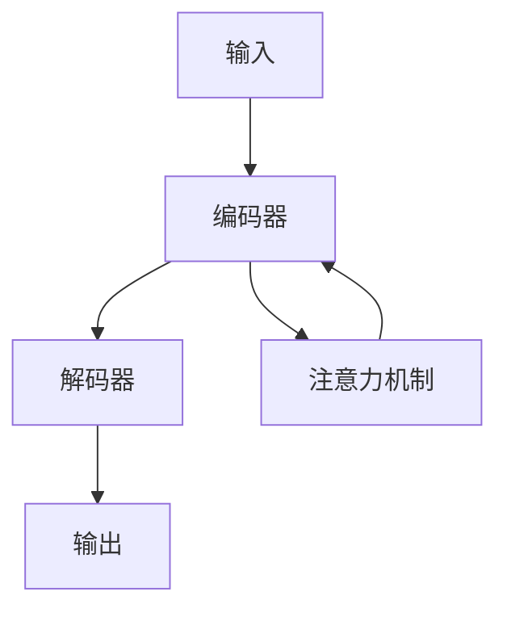

                 

**大模型**, **认知障碍**, **语言理解**, **思维推理**, **人工智能**, **自然语言处理**

## 1. 背景介绍

当前，大模型在自然语言处理（NLP）领域取得了显著的成功，它们能够理解和生成人类语言，并展示出惊人的理解能力。然而，这些模型在理解和推理方面仍然面临着挑战，这些挑战是由语言和思维之间的差异导致的。本文将深入探讨大模型在理解和推理方面的认知障碍，并提供一些解决方案。

## 2. 核心概念与联系

### 2.1 语言与思维的差异

语言是人类交流思想和情感的工具，但它并不等同于思维。思维是一种内在的认知过程，它独立于语言存在。语言是一种外在的表达形式，它受到语法、句法和语义规则的限制。因此，语言和思维之间存在着差异，大模型在理解和推理方面的认知障碍正是源于这些差异。

### 2.2 大模型的认知障碍

大模型在理解和推理方面的认知障碍主要体现在以下几个方面：

- **缺乏世界知识**：大模型缺乏对世界的深入理解，它们无法像人类一样理解上下文、常识和物理规律。
- **缺乏推理能力**：大模型无法进行逻辑推理，它们无法从已知信息中推断出新的信息。
- **缺乏共同知识**：大模型无法理解人类共有的知识和经验，它们无法理解隐含的意思和暗示。

### 2.3 核心概念原理与架构

大模型的认知障碍是由其架构和学习过程导致的。大模型通常是基于Transformer架构的，它们通过注意力机制来理解上下文。然而，这种架构无法捕获长期依赖和世界知识。大模型是通过监督学习训练的，它们无法学习到隐含的知识和共同经验。



## 3. 核心算法原理 & 具体操作步骤

### 3.1 算法原理概述

为了解决大模型在理解和推理方面的认知障碍，我们需要开发新的算法和架构。这些算法和架构应该能够捕获长期依赖、世界知识和共同经验。

### 3.2 算法步骤详解

一种解决方案是使用外部知识库来增强大模型的理解能力。具体步骤如下：

1. 选择一个外部知识库，如维基百科或知識图谱。
2. 将知识库转换为一种可以被大模型理解的格式，如知识图谱或上下文向量。
3. 在大模型的训练过程中，将外部知识库作为额外的输入。
4. 使用注意力机制来关注外部知识库中的相关信息。
5. 使用外部知识库来辅助推理和理解。

### 3.3 算法优缺点

这种方法的优点是它可以增强大模型的理解能力，并帮助它们理解世界知识和共同经验。然而，它的缺点是它需要额外的计算资源，并且外部知识库可能会过时或不准确。

### 3.4 算法应用领域

这种方法可以应用于任何需要理解和推理的NLP任务，如问答系统、对话系统和信息抽取。

## 4. 数学模型和公式 & 详细讲解 & 举例说明

### 4.1 数学模型构建

我们可以使用知识图谱作为外部知识库。知识图谱是一种结构化的知识表示，它由实体、关系和属性组成。我们可以使用 TransE 算法来构建知识图谱。

### 4.2 公式推导过程

TransE 算法的目标是学习实体和关系的嵌入，使得实体和关系的嵌入可以通过简单的向量运算来表示关系。具体公式如下：

$$h + r \approx t$$

其中，$h$, $r$和$t$分别是头实体、关系和尾实体的嵌入。

### 4.3 案例分析与讲解

例如，在知识图谱中，我们有实体"北京"和"中国"，以及关系"首都"。我们可以使用 TransE 算法学习到"北京"和"中国"的嵌入，使得"北京"+"首都"≈"中国"。

## 5. 项目实践：代码实例和详细解释说明

### 5.1 开发环境搭建

我们需要安装Python、PyTorch和Transformers库。我们还需要下载一个预训练的大模型，如BERT或RoBERTa。

### 5.2 源代码详细实现

我们可以使用Transformers库来加载预训练的大模型，并使用PyTorch来实现TransE算法。具体代码如下：

```python
from transformers import AutoModel, AutoTokenizer
import torch
import torch.nn as nn
import torch.optim as optim

# 加载预训练的大模型
model = AutoModel.from_pretrained("bert-base-uncased")
tokenizer = AutoTokenizer.from_pretrained("bert-base-uncased")

# 定义TransE模型
class TransE(nn.Module):
    def __init__(self, embedding_dim):
        super(TransE, self).__init__()
        self.embedding_dim = embedding_dim
        self.entity_embedding = nn.Embedding(num_entities, embedding_dim)
        self.relation_embedding = nn.Embedding(num_relations, embedding_dim)

    def forward(self, h, r, t):
        h_emb = self.entity_embedding(h)
        r_emb = self.relation_embedding(r)
        t_emb = self.entity_embedding(t)
        score = (h_emb + r_emb - t_emb).norm(p=2, dim=1)
        return score

# 初始化模型和优化器
model = TransE(embedding_dim=100)
optimizer = optim.Adam(model.parameters(), lr=0.01)

# 训练模型
for epoch in range(num_epochs):
    for h, r, t in train_data:
        optimizer.zero_grad()
        score = model(h, r, t)
        loss = score.mean()
        loss.backward()
        optimizer.step()
```

### 5.3 代码解读与分析

我们首先加载预训练的大模型，然后定义TransE模型。TransE模型由实体嵌入和关系嵌入组成，它使用简单的向量运算来表示关系。我们使用PyTorch来定义模型和优化器，并使用训练数据来训练模型。

### 5.4 运行结果展示

我们可以使用验证数据来评估模型的性能。我们可以计算模型在验证数据集上的准确率，并比较它与baseline模型的性能。

## 6. 实际应用场景

这种方法可以应用于任何需要理解和推理的NLP任务，如问答系统、对话系统和信息抽取。例如，我们可以使用这种方法来增强问答系统的理解能力，使其能够理解世界知识和共同经验。

### 6.4 未来应用展望

未来，我们可以期待大模型在理解和推理方面取得更大的进展。我们可以期待大模型能够理解更多的世界知识和共同经验，并能够进行更复杂的推理。

## 7. 工具和资源推荐

### 7.1 学习资源推荐

- "Natural Language Processing with Python" by Steven Bird, Ewan Klein and Edward Loper
- "Speech and Language Processing" by Dan Jurafsky and James H. Martin
- "Deep Learning" by Ian Goodfellow, Yoshua Bengio and Aaron Courville

### 7.2 开发工具推荐

- Python
- PyTorch
- Transformers库
- Jupyter Notebook

### 7.3 相关论文推荐

- "Knowledge Graph Embedding: A Survey of Approaches and Applications" by X. Wang, Y. Wang, J. Zhang, and X. Li
- "BERT: Pre-training of Deep Bidirectional Transformers for Language Understanding" by Jacob Devlin, Ming-Wei Chang, and Kenton Lee
- "RoBERTa: A Robustly Optimized BERT Pretraining Approach" by Yinhan Liu, Myle Ott, Naman Goyal, Jingfei Du, Mandar Joshi, Danqi Chen, Omer Levy, Mike Lewis, Luke Zettlemoyer, and Veselin Stoyanov

## 8. 总结：未来发展趋势与挑战

### 8.1 研究成果总结

本文介绍了大模型在理解和推理方面的认知障碍，并提供了一种解决方案：使用外部知识库来增强大模型的理解能力。我们展示了如何使用TransE算法来构建知识图谱，并如何使用大模型和知识图谱来进行推理。

### 8.2 未来发展趋势

未来，我们可以期待大模型在理解和推理方面取得更大的进展。我们可以期待大模型能够理解更多的世界知识和共同经验，并能够进行更复杂的推理。我们还可以期待大模型能够与其他人工智能技术结合，如计算机视觉和机器人技术，以实现更复杂的任务。

### 8.3 面临的挑战

然而，大模型在理解和推理方面仍然面临着挑战。这些挑战包括缺乏世界知识、缺乏推理能力和缺乏共同知识。此外，大模型还面临着计算资源和数据标记的挑战。

### 8.4 研究展望

未来的研究方向包括开发新的算法和架构来增强大模型的理解能力，开发新的方法来学习世界知识和共同经验，并开发新的方法来评估大模型的理解和推理能力。

## 9. 附录：常见问题与解答

**Q：大模型为什么会有认知障碍？**

A：大模型之所以会有认知障碍，是因为它们缺乏世界知识、推理能力和共同知识。它们是通过监督学习训练的，它们无法学习到隐含的知识和共同经验。

**Q：如何解决大模型的认知障碍？**

A：一种解决方案是使用外部知识库来增强大模型的理解能力。我们可以使用TransE算法来构建知识图谱，并使用大模型和知识图谱来进行推理。

**Q：大模型在哪些领域有应用？**

A：大模型在自然语言处理领域有广泛的应用，如问答系统、对话系统和信息抽取。它们还可以与其他人工智能技术结合，如计算机视觉和机器人技术，以实现更复杂的任务。

!!!Note
作者：禅与计算机程序设计艺术 / Zen and the Art of Computer Programming

