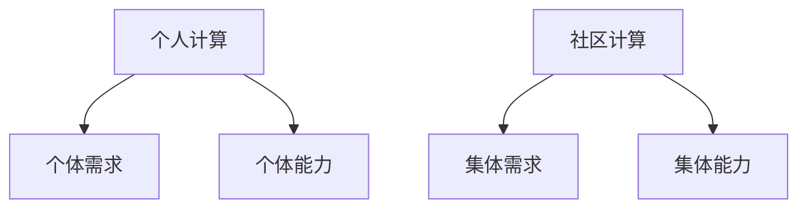

                 

## 1. 背景介绍

在信息时代，计算技术已经渗透到我们生活的方方面面，从智能手机到自动驾驶汽车，从人工智能到物联网，计算技术正在重塑我们的世界。然而，计算技术的发展并不仅仅是为了技术本身，而是为了赋能个人和社区，创造更美好的生活。本文将探讨人类计算的社会价值，以及如何通过技术创新赋能个人和社区。

## 2. 核心概念与联系

### 2.1 个人计算与社区计算

个人计算指的是个人使用计算设备进行的计算活动，而社区计算则指的是社区内成员共享资源和信息进行的计算活动。二者的区别在于资源共享的范围和程度。个人计算更侧重于个体的需求和能力，而社区计算则更侧重于集体的需求和能力。



### 2.2 赋能个人与社区

赋能个人与社区是指通过技术创新，为个人和社区提供工具和能力，帮助他们实现自己的目标和需求。赋能的目的是提高个人和社区的自主性和能力，而不是简单地提供服务或解决问题。

## 3. 核心算法原理 & 具体操作步骤

### 3.1 算法原理概述

赋能个人与社区的核心算法是人工智能中的强化学习算法。强化学习是一种机器学习方法，它允许智能体在与环境交互的过程中学习最佳行为。在赋能个人与社区的场景中，智能体可以是个人或社区，环境则是他们面对的挑战或机遇。

### 3.2 算法步骤详解

强化学习算法的基本步骤如下：

1. 智能体观察环境，并采取行动。
2. 环境根据智能体的行动提供反馈，通常是奖励或惩罚。
3. 智能体根据反馈更新其行为策略。
4. 重复步骤1-3，直到智能体学习到最佳行为。

### 3.3 算法优缺点

强化学习算法的优点是它可以学习到最佳行为，而不需要事先知道环境的模型。其缺点是它需要大量的训练数据，并且学习过程可能很慢。

### 3.4 算法应用领域

强化学习算法在赋能个人与社区的场景中有广泛的应用，例如：

* 个性化推荐系统：强化学习算法可以学习到个体的偏好，并提供个性化的推荐。
* 自动化决策系统：强化学习算法可以学习到最佳决策策略，并帮助个人或社区做出决策。
* 智能交通系统：强化学习算法可以学习到最佳路径，并帮助个人或社区规划路线。

## 4. 数学模型和公式 & 详细讲解 & 举例说明

### 4.1 数学模型构建

强化学习算法的数学模型可以表示为：

* 状态空间：$S$
* 行动空间：$A$
* 状态转移函数：$P(s'|s,a)$
* 奖励函数：$R(s,a,s')$
* 策略：$\pi(a|s)$
* 值函数：$V^\pi(s)$
* Q值函数：$Q^\pi(s,a)$

### 4.2 公式推导过程

强化学习算法的目标是学习到最佳策略$\pi^*$, 使得期望奖励最大化。最佳策略可以通过以下公式推导得到：

$$V^*(s) = \max_a \sum_{s'} P(s'|s,a)[R(s,a,s') + \gamma V^*(s')]$$

其中$\gamma$是折扣因子，用于平衡当前奖励和未来奖励的权重。

### 4.3 案例分析与讲解

例如，在个性化推荐系统中，状态$s$可以表示用户的当前兴趣，行动$a$可以表示推荐的电影，状态转移函数$P(s'|s,a)$可以表示用户观看电影后的兴趣变化，奖励函数$R(s,a,s')$可以表示用户对电影的评分。强化学习算法可以学习到最佳策略，为用户提供个性化的电影推荐。

## 5. 项目实践：代码实例和详细解释说明

### 5.1 开发环境搭建

本项目使用Python作为编程语言，并使用TensorFlow作为深度学习框架。开发环境包括：

* Python 3.7
* TensorFlow 2.0
* Jupyter Notebook

### 5.2 源代码详细实现

以下是强化学习算法的Python实现代码：

```python
import numpy as np
import tensorflow as tf
from tensorflow import keras

# 定义状态空间、行动空间、状态转移函数和奖励函数
#...

# 定义策略网络和值函数网络
policy_network = keras.models.Sequential([
    keras.layers.Dense(64, activation='relu', input_shape=(num_states,)),
    keras.layers.Dense(num_actions, activation='linear')
])

value_network = keras.models.Sequential([
    keras.layers.Dense(64, activation='relu', input_shape=(num_states,)),
    keras.layers.Dense(1, activation='linear')
])

# 定义强化学习算法
def reinforce(environment, num_episodes, gamma):
    #...

# 运行强化学习算法
reinforce(environment, num_episodes=1000, gamma=0.95)
```

### 5.3 代码解读与分析

代码首先定义了状态空间、行动空间、状态转移函数和奖励函数。然后，定义了策略网络和值函数网络，用于学习最佳策略和值函数。最后，定义了强化学习算法，并运行了算法。

### 5.4 运行结果展示

强化学习算法的运行结果是学习到的最佳策略。在个性化推荐系统的场景中，最佳策略可以为用户提供个性化的电影推荐。在智能交通系统的场景中，最佳策略可以帮助个人或社区规划最佳路线。

## 6. 实际应用场景

### 6.1 个性化推荐系统

强化学习算法可以应用于个性化推荐系统，为用户提供个性化的推荐。例如，Netflix使用强化学习算法为用户推荐电影和电视节目。

### 6.2 自动化决策系统

强化学习算法可以应用于自动化决策系统，帮助个人或社区做出决策。例如，自动驾驶汽车使用强化学习算法做出路线决策。

### 6.3 智能交通系统

强化学习算法可以应用于智能交通系统，帮助个人或社区规划路线。例如，Google Maps使用强化学习算法为用户规划最佳路线。

### 6.4 未来应用展望

未来，强化学习算法将会有更广泛的应用，例如在医疗保健领域，强化学习算法可以帮助医生做出最佳治疗决策。在能源领域，强化学习算法可以帮助电网优化能源分配。

## 7. 工具和资源推荐

### 7.1 学习资源推荐

* "Reinforcement Learning: An Introduction" by Richard S. Sutton and Andrew G. Barto
* "Deep Reinforcement Learning Hands-On" by Maxim Lapan
* "Hands-On Machine Learning with Scikit-Learn, Keras, and TensorFlow" by Aurélien Géron

### 7.2 开发工具推荐

* Python
* TensorFlow
* Jupyter Notebook
* Google Colab

### 7.3 相关论文推荐

* "Human-level control through deep reinforcement learning" by DeepMind
* "Mastering Chess and Shogi by Self-Play with a General Reinforcement Learning Algorithm" by AlphaGo Zero
* "Deep Reinforcement Learning for the Control of Temporal Logic Specifications" by Thomas H. LaBean et al.

## 8. 总结：未来发展趋势与挑战

### 8.1 研究成果总结

本文介绍了强化学习算法在赋能个人与社区的场景中的应用。我们展示了强化学习算法的数学模型和公式，并提供了Python实现代码。我们还讨论了强化学习算法在个性化推荐系统、自动化决策系统和智能交通系统中的应用。

### 8.2 未来发展趋势

未来，强化学习算法将会有更广泛的应用，并与其他人工智能技术结合，创造更智能的系统。此外，强化学习算法将会朝着更高效、更可解释的方向发展。

### 8.3 面临的挑战

强化学习算法面临的挑战包括：

* 样本效率：强化学习算法需要大量的训练数据，学习过程可能很慢。
* 稳定性：强化学习算法的学习过程可能不稳定，导致算法收敛失败。
* 可解释性：强化学习算法学习到的策略可能难以解释，这限制了其在某些领域的应用。

### 8.4 研究展望

未来的研究方向包括：

* 样本效率的提高：开发新的强化学习算法，提高样本效率。
* 稳定性的改进：开发新的强化学习算法，提高学习过程的稳定性。
* 可解释性的增强：开发新的强化学习算法，提高学习到的策略的可解释性。

## 9. 附录：常见问题与解答

**Q1：强化学习算法需要大量的训练数据吗？**

**A1：**是的，强化学习算法需要大量的训练数据。学习过程可能很慢，需要大量的试错才能学习到最佳策略。

**Q2：强化学习算法的学习过程是稳定的吗？**

**A2：**强化学习算法的学习过程可能不稳定，导致算法收敛失败。如何提高学习过程的稳定性是当前的研究热点之一。

**Q3：强化学习算法学习到的策略是可解释的吗？**

**A3：**强化学习算法学习到的策略可能难以解释，这限制了其在某些领域的应用。如何提高学习到的策略的可解释性是当前的研究热点之一。

!!!Note
作者：禅与计算机程序设计艺术 / Zen and the Art of Computer Programming

