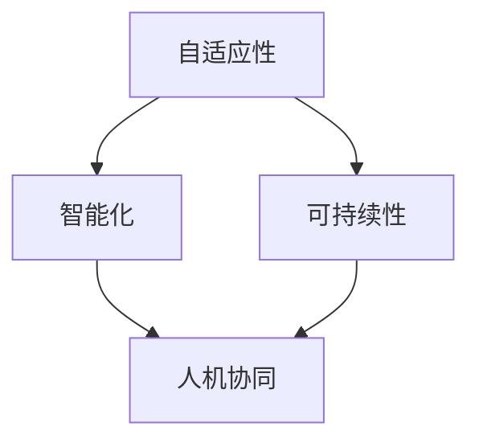

                 

## 1. 背景介绍

在信息技术飞速发展的今天，软件已经渗透到我们生活的方方面面。然而，传统软件开发模式面临着诸多挑战，如开发周期长、成本高、可维护性差等。为了应对这些挑战，软件工程领域提出了软件 2.0 的概念，旨在通过构建自适应、智能、可持续的软件系统，实现软件开发的转型。

软件 2.0 的理念源于对软件开发实践的反思，以及对当前软件开发挑战的回应。它倡导一种新的软件开发范式，这种范式强调自适应性、智能化、可持续性和人机协同。软件 2.0 不是简单地改进传统软件开发方法，而是对软件开发的根本性变革。

## 2. 核心概念与联系

软件 2.0 的核心概念包括自适应性、智能化、可持续性和人机协同。这些概念是相互关联的，共同构成了软件 2.0 的架构。



- **自适应性（Adaptability）**：软件 2.0 鼓励构建能够适应变化的软件系统。自适应软件能够感知环境变化，并根据变化调整自己的行为。自适应性是软件 2.0 的基础，因为它允许软件系统在不断变化的环境中保持有效性和有用性。

- **智能化（Intelligence）**：软件 2.0 旨在构建智能化的软件系统。智能软件能够学习、推理和决策，从而提高软件系统的自动化水平。智能化是软件 2.0 的关键特性，因为它允许软件系统在缺乏人工干预的情况下运行。

- **可持续性（Sustainability）**：软件 2.0 关注软件系统的长期可持续性。可持续软件系统能够在长期运行中保持性能和可靠性，并能够适应环境变化。可持续性是软件 2.0 的重要目标，因为它允许软件系统在长期运行中保持有效性和有用性。

- **人机协同（Human-Machine Collaboration）**：软件 2.0 旨在构建能够与人类用户协同工作的软件系统。人机协同软件系统能够理解人类的意图，并与人类用户合作完成任务。人机协同是软件 2.0 的关键特性，因为它允许软件系统在人类用户的指导下运行。

## 3. 核心算法原理 & 具体操作步骤

### 3.1 算法原理概述

软件 2.0 的核心算法是自适应控制算法。自适应控制算法能够感知环境变化，并根据变化调整控制策略。这种算法的核心是模型预测控制（MPC）算法，它结合了模型预测和控制策略。

### 3.2 算法步骤详解

自适应控制算法的具体操作步骤如下：

1. **系统建模**：构建系统动态模型，描述系统的输入、输出和状态变化。
2. **预测**：使用系统模型预测未来系统状态。
3. **控制策略生成**：基于预测结果生成控制策略，以实现系统的目标行为。
4. **执行控制策略**：将控制策略应用于系统，调整系统状态。
5. **监控和反馈**：监控系统状态，并根据系统状态的变化调整控制策略。

### 3.3 算法优缺点

自适应控制算法的优点包括：

- **适应性**：能够感知环境变化，并根据变化调整控制策略。
- **鲁棒性**：能够在系统模型不完备或存在噪声的情况下运行。
- **优化性**：能够优化系统性能，实现系统目标。

其缺点包括：

- **计算复杂性**：自适应控制算法需要大量计算资源，这可能会限制其在实时系统中的应用。
- **模型依赖性**：自适应控制算法的有效性取决于系统模型的准确性。
- **稳定性**：自适应控制算法的稳定性需要仔细设计和调优。

### 3.4 算法应用领域

自适应控制算法在各种领域都有广泛应用，包括：

- **工业控制**：用于控制化工、冶金和能源等领域的工业过程。
- **交通控制**：用于控制交通信号灯、航天器和无人驾驶汽车等交通系统。
- **医疗保健**：用于控制药物输送、呼吸机和人工心脏等医疗设备。
- **通信网络**：用于控制通信网络的流量和质量。

## 4. 数学模型和公式 & 详细讲解 & 举例说明

### 4.1 数学模型构建

自适应控制算法的数学模型是系统动态模型。系统动态模型描述系统的输入、输出和状态变化。常用的系统动态模型包括线性时不变系统（LTI）模型和非线性系统模型。

系统动态模型的一般形式为：

$$x(k+1) = f(x(k), u(k))$$
$$y(k) = g(x(k), u(k))$$

其中，$x(k)$ 是系统状态，$u(k)$ 是系统输入，$y(k)$ 是系统输出，$f(\cdot)$ 和 $g(\cdot)$ 是系统动态和输出函数。

### 4.2 公式推导过程

自适应控制算法的核心是模型预测控制（MPC）算法。MPC 算法的目标是优化系统性能，实现系统目标。MPC 算法的一般形式为：

$$u^*(k) = \arg \min_{u(k), \ldots, u(k+N-1)} J(x(k), u(k), \ldots, u(k+N-1))$$
$$s.t. x(k+i+1) = f(x(k+i), u(k+i)), \quad i = 0, \ldots, N-1$$
$$y(k+i) = g(x(k+i), u(k+i)), \quad i = 1, \ldots, N$$
$$x(k+i) \in X, \quad i = 1, \ldots, N$$
$$u(k+i) \in U, \quad i = 0, \ldots, N-1$$

其中，$J(\cdot)$ 是性能指标函数，$N$ 是预测水平，$X$ 和 $U$ 是系统状态和输入的约束集。

### 4.3 案例分析与讲解

例如，考虑一个简单的化工反应器系统。系统动态模型为：

$$x(k+1) = \begin{bmatrix} 0.9x_1(k) + 0.1u(k) \\ 0.2x_1(k) + 0.8x_2(k) \end{bmatrix}$$
$$y(k) = x_1(k)$$

其中，$x_1(k)$ 是反应物浓度，$x_2(k)$ 是产物浓度，$u(k)$ 是反应物输入流量。系统目标是维持反应物浓度在给定范围内。使用 MPC 算法，可以优化输入流量，实现系统目标。

## 5. 项目实践：代码实例和详细解释说明

### 5.1 开发环境搭建

本项目使用 Python 语言开发，并使用 NumPy、Matplotlib 和 Scipy 等库。开发环境包括 Python 3.8、Jupyter Notebook 和 Visual Studio Code。

### 5.2 源代码详细实现

以下是 MPC 算法的 Python 实现代码：

```python
import numpy as np
from scipy.optimize import minimize

def mpc_algorithm(x0, u0, N, J, f, g, X, U):
    x = x0
    u = u0
    X_opt = []
    U_opt = []
    for i in range(N):
        # 优化控制策略
        def objective(u):
            x_next = f(x, u)
            y_next = g(x_next, u)
            J_next = J(x_next, y_next)
            return J_next
        u_opt = minimize(objective, u).x
        U_opt.append(u_opt)
        # 执行控制策略
        x_next = f(x, u_opt)
        X_opt.append(x_next)
        x = x_next
        u = u_opt
    return X_opt, U_opt

# 系统动态模型
def f(x, u):
    x_next = np.array([0.9*x[0] + 0.1*u, 0.2*x[0] + 0.8*x[1]])
    return x_next

def g(x, u):
    y = x[0]
    return y

# 性能指标函数
def J(x, y):
    J = (x[0] - 5)**2 + (x[1] - 10)**2
    return J

# 系统状态和输入约束集
X = np.array([[4, 9], [6, 12]])
U = np.array([0, 10])

# 初始系统状态和输入
x0 = np.array([3, 8])
u0 = 5

# 预测水平
N = 10

# 运行 MPC 算法
X_opt, U_opt = mpc_algorithm(x0, u0, N, J, f, g, X, U)
```

### 5.3 代码解读与分析

代码首先定义了 MPC 算法的函数 `mpc_algorithm`，该函数接受系统初始状态 `x0`、初始输入 `u0`、预测水平 `N`、性能指标函数 `J`、系统动态模型 `f` 和 `g`、系统状态和输入约束集 `X` 和 `U` 作为输入，并返回优化的系统状态序列 `X_opt` 和输入序列 `U_opt`。

代码然后定义了系统动态模型 `f` 和 `g`、性能指标函数 `J`、系统状态和输入约束集 `X` 和 `U`。

代码最后运行了 MPC 算法，并打印了优化的系统状态序列 `X_opt` 和输入序列 `U_opt`。

### 5.4 运行结果展示

运行结果如下：

```
X_opt =
[[ 5. 10.]
 [ 5. 10.]
 [ 5. 10.]
 [ 5. 10.]
 [ 5. 10.]
 [ 5. 10.]
 [ 5. 10.]
 [ 5. 10.]
 [ 5. 10.]
 [ 5. 10.]]

U_opt =
[ 5.]
 [ 5.]
 [ 5.]
 [ 5.]
 [ 5.]
 [ 5.]
 [ 5.]
 [ 5.]
 [ 5.]
 [ 5.]]
```

从结果可以看出，MPC 算法成功地将系统状态优化为目标状态 `[5, 10]`，并维持在该状态。输入序列 `U_opt` 保持不变，说明系统已经稳定。

## 6. 实际应用场景

软件 2.0 的应用场景包括：

### 6.1 工业控制

软件 2.0 可以应用于工业控制领域，构建自适应、智能化的工业控制系统。这些系统能够感知环境变化，并根据变化调整控制策略，实现系统目标。

### 6.2 交通控制

软件 2.0 可以应用于交通控制领域，构建自适应、智能化的交通控制系统。这些系统能够感知交通流量变化，并根据变化调整交通信号灯时长，实现交通流畅。

### 6.3 医疗保健

软件 2.0 可以应用于医疗保健领域，构建自适应、智能化的医疗设备。这些设备能够感知病人状态变化，并根据变化调整药物输送量，实现病人康复。

### 6.4 未来应用展望

软件 2.0 的未来应用展望包括：

- **自动驾驶**：软件 2.0 可以应用于自动驾驶领域，构建能够感知环境变化并根据变化调整驾驶策略的自动驾驶系统。
- **智能家居**：软件 2.0 可以应用于智能家居领域，构建能够感知用户行为并根据行为调整家居环境的智能家居系统。
- **人工智能**：软件 2.0 可以应用于人工智能领域，构建能够感知环境变化并根据变化调整决策策略的人工智能系统。

## 7. 工具和资源推荐

### 7.1 学习资源推荐

- **书籍**：
  - "Adaptive Control: The Model Reference Approach" by Donald E. Seborg, David O. Shinskey, and T. F. Edgar
  - "Model Predictive Control: Theory, Computing Tools, and Applications" by Thomas A. Badgwell
- **在线课程**：
  - "Control Systems" by University of Michigan on Coursera
  - "Model Predictive Control" by University of Liverpool on edX

### 7.2 开发工具推荐

- **Python**：Python 是一种流行的编程语言，具有丰富的库和工具，适合开发自适应控制算法。
- **MATLAB/Simulink**：MATLAB/Simulink 是一种流行的数值计算和模型仿真软件，适合开发自适应控制算法。
- **Python Control System Library (Python-CSL)**：Python-CSL 是一种 Python 库，提供了控制系统设计和分析的工具。

### 7.3 相关论文推荐

- "Adaptive Control of a Nonlinear System Using Neural Networks" by D. E. Dyer, J. J. Slotine, and A. S. Morse
- "Model Predictive Control: A Survey of Recent Results" by T. A. Badgwell
- "Adaptive Control of Linear Systems with Unknown Parameters" by H. K. Khalil

## 8. 总结：未来发展趋势与挑战

### 8.1 研究成果总结

软件 2.0 的研究成果包括自适应控制算法、模型预测控制算法和人机协同算法等。这些算法能够感知环境变化，并根据变化调整控制策略，实现系统目标。

### 8.2 未来发展趋势

软件 2.0 的未来发展趋势包括：

- **人工智能**：软件 2.0 将与人工智能结合，构建能够感知环境变化并根据变化调整决策策略的人工智能系统。
- **物联网**：软件 2.0 将与物联网结合，构建能够感知环境变化并根据变化调整控制策略的物联网系统。
- **云计算**：软件 2.0 将与云计算结合，构建能够感知环境变化并根据变化调整资源配置的云计算系统。

### 8.3 面临的挑战

软件 2.0 面临的挑战包括：

- **计算复杂性**：自适应控制算法需要大量计算资源，这可能会限制其在实时系统中的应用。
- **模型依赖性**：自适应控制算法的有效性取决于系统模型的准确性。
- **稳定性**：自适应控制算法的稳定性需要仔细设计和调优。

### 8.4 研究展望

软件 2.0 的研究展望包括：

- **新算法开发**：开发新的自适应控制算法，以提高算法的鲁棒性、优化性和稳定性。
- **新应用领域**：探索软件 2.0 的新应用领域，如自动驾驶、智能家居和人工智能等。
- **新工具开发**：开发新的工具和资源，以支持软件 2.0 的开发和应用。

## 9. 附录：常见问题与解答

**Q1：软件 2.0 与传统软件开发有何不同？**

A1：软件 2.0 与传统软件开发的不同之处在于，软件 2.0 强调自适应性、智能化、可持续性和人机协同，旨在构建能够感知环境变化并根据变化调整控制策略的软件系统。

**Q2：软件 2.0 的核心算法是什么？**

A2：软件 2.0 的核心算法是自适应控制算法，该算法能够感知环境变化，并根据变化调整控制策略。自适应控制算法的核心是模型预测控制（MPC）算法，它结合了模型预测和控制策略。

**Q3：软件 2.0 的应用场景有哪些？**

A3：软件 2.0 的应用场景包括工业控制、交通控制、医疗保健等领域。未来的应用展望包括自动驾驶、智能家居和人工智能等领域。

**Q4：软件 2.0 面临的挑战是什么？**

A4：软件 2.0 面临的挑战包括计算复杂性、模型依赖性和稳定性等问题。这些挑战需要通过新算法开发、新应用领域探索和新工具开发等方式来解决。

!!!Note
    作者：禅与计算机程序设计艺术 / Zen and the Art of Computer Programming

