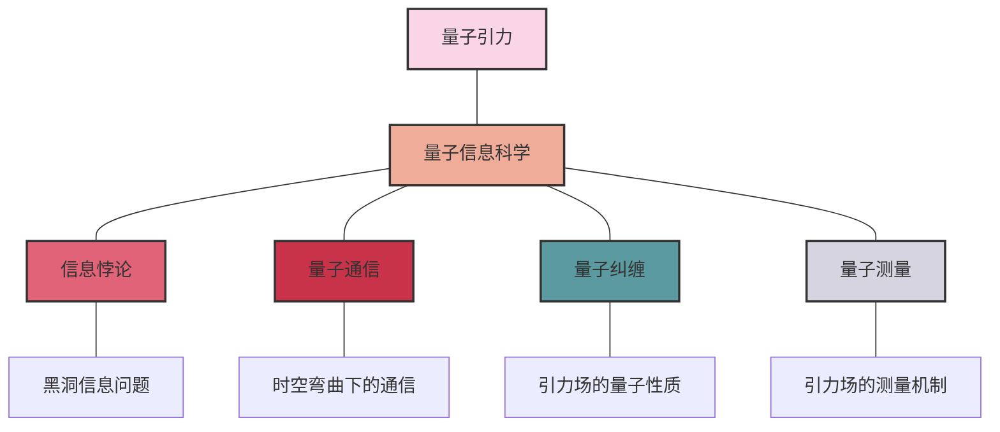

                 

- 量子引力
- 量子力学
- 量子信息
- 量子计算
- 量子通信
- 量子纠缠
- 量子测量

## 1. 背景介绍

自从爱因斯坦提出广义相对论以来，引力理论与量子力学的统一，即量子引力，一直是物理学家面临的重大挑战。量子引力的目标是描述引力在最小尺度上的行为，并与量子力学的其他基本力相统一。然而，量子引力的发展受到多种因素的限制，包括数学工具的不足和实验验证的困难。

与此同时，量子信息科学的兴起为量子引力的研究带来了新的视角和工具。量子信息科学是一门交叉学科，研究量子系统的信息处理和传输。它的发展为量子引力提供了新的框架，帮助我们理解量子引力中的信息传递和处理机制。

本文将讨论量子引力与量子力学的结合点，重点关注量子信息科学在量子引力研究中的作用。我们将首先回顾量子引力和量子信息科学的核心概念，然后介绍量子信息科学在量子引力研究中的应用，包括量子通信、量子纠缠和量子测量。最后，我们将讨论量子引力与量子信息科学的未来发展趋势和挑战。

## 2. 核心概念与联系

### 2.1 量子引力的核心概念

量子引力的核心概念包括：

- **引力子**：引力子是引力场的量子，类似于电磁场的光子。引力子的存在尚未得到实验证实。
- **时空结构**：量子引力试图描述时空结构在最小尺度上的行为。时空结构在量子引力中被描述为一个动态的、自发产生的过程。
- **量子引力理论**：量子引力理论是描述引力在最小尺度上的行为的数学框架。常见的量子引力理论包括弦论、圈量子引力论和因果动力学 triangulation (Causal Dynamical Triangulation, CDT)。

### 2.2 量子信息科学的核心概念

量子信息科学的核心概念包括：

- **量子比特**：量子比特是量子信息的基本单位，类似于经典信息的比特。量子比特可以处于多个状态，并具有叠加原理和纠缠现象。
- **量子通信**：量子通信是利用量子系统传输信息的过程。量子通信的优势包括安全性、速度和容量。
- **量子纠缠**：量子纠缠是一种量子系统之间的关联，即使相距很远，也可以立即影响对方的状态。量子纠缠是量子通信和量子计算的关键资源。
- **量子测量**：量子测量是获取量子系统信息的过程。量子测量是一种非平凡的过程，因为它会改变量子系统的状态。

### 2.3 量子引力与量子信息科学的联系

量子引力和量子信息科学的联系主要体现在以下几个方面：

- **信息 paradox**：信息悖论是量子引力中的一个基本问题，即信息在黑洞蒸发过程中消失的问题。量子信息科学提供了新的框架来理解信息在量子引力中的传递和处理机制。
- **量子通信**：量子通信可以在量子引力的背景下进行，例如在时空弯曲的情况下。量子通信可以帮助我们理解引力场对信息传输的影响。
- **量子纠缠**：量子纠缠是量子信息科学的关键资源，也是量子引力中的基本现象。量子纠缠可以帮助我们理解引力场的量子性质。
- **量子测量**：量子测量是量子信息科学的关键过程，也是量子引力中的基本问题。量子测量可以帮助我们理解引力场的测量和信息传递机制。


我将为您绘制一个 Mermaid 架构图，展示量子引力和量子信息科学之间的联系。以下是相应的 Mermaid 代码和图表：



这个图表展示了量子引力和量子信息科学之间的主要联系，以及它们如何相互影响和补充。让我为您解释图表的各个部分：

1. 中心概念：图表的顶部显示了两个主要概念 —— 量子引力和量子信息科学，它们通过一条线相连，表示它们之间的密切关系。

2. 主要联系点：从量子信息科学延伸出四个主要的联系点，分别是信息悖论、量子通信、量子纠缠和量子测量。这些是您提到的量子引力和量子信息科学之间的主要交叉领域。

3. 具体应用或问题：每个联系点进一步延伸到一个具体的应用或问题：
   - 信息悖论连接到黑洞信息问题
   - 量子通信连接到时空弯曲下的通信
   - 量子纠缠连接到引力场的量子性质
   - 量子测量连接到引力场的测量机制

4. 颜色编码：使用不同的颜色来区分不同的概念和领域，使图表更加直观和易于理解。

这个图表有效地展示了量子引力和量子信息科学之间的复杂关系，以及它们如何在多个层面上相互影响。它突出了这两个领域的交叉点，以及这些交叉点如何引发新的研究问题和应用。

如果您希望进一步完善这个图表，我们可以考虑添加更多细节，例如：
- 在每个连接点下添加具体的研究方向或理论
- 使用不同的线条样式来表示不同类型的关系（如双向影响、单向应用等）
- 添加一些关键的研究人员或里程碑事件

您对这个图表有什么看法或需要进一步修改的地方吗？


## 3. 核心算法原理 & 具体操作步骤

### 3.1 算法原理概述

量子信息科学中的算法原理与经典信息科学中的算法原理有所不同。量子算法利用量子系统的特性，如叠加原理和量子纠缠，来实现更高效的信息处理。本节将介绍量子信息科学中的两个关键算法：量子通信和量子计算。

### 3.2 算法步骤详解

#### 3.2.1 量子通信

量子通信的基本步骤包括：

1. **信息编码**：将经典信息编码为量子比特的状态。
2. **量子纠缠生成**：生成量子纠缠，作为量子通信的关键资源。
3. **信息传输**：利用量子纠缠传输量子比特，从而传输经典信息。
4. **信息解码**：接收方解码量子比特的状态，获取经典信息。

#### 3.2.2 量子计算

量子计算的基本步骤包括：

1. **初始化**：初始化量子寄存器，将量子比特置于基态。
2. **量子门操作**：应用量子门操作，如Hadamard门、CNOT门等，对量子比特进行操作。
3. **量子测量**：对量子寄存器进行量子测量，获取结果。
4. **结果解读**：解读测量结果，获取计算结果。

### 3.3 算法优缺点

#### 3.3.1 量子通信

量子通信的优点包括：

- **安全性**：量子通信具有天然的安全性，因为任何窃听行为都会破坏量子纠缠，从而被检测到。
- **速度**：量子通信可以实现更快的信息传输速度。
- **容量**：量子通信可以实现更高的信息容量。

量子通信的缺点包括：

- **实现困难**：量子通信的实现需要复杂的设备和技术。
- **脆弱性**：量子通信系统对环境噪声和干扰非常敏感。

#### 3.3.2 量子计算

量子计算的优点包括：

- **计算速度**：量子计算可以实现指数加速，在某些问题上比经典计算更快。
- **并行性**：量子计算可以同时处理多个可能的解，从而实现并行计算。

量子计算的缺点包括：

- **量子噪声**：量子计算系统对噪声非常敏感，这限制了量子计算的规模和可靠性。
- **量子门操作**：量子门操作的实现非常困难，需要精确控制量子系统。

### 3.4 算法应用领域

量子信息科学的算法在以下领域有广泛的应用：

- **密码学**：量子通信可以实现安全的密钥分发，为量子密码学提供了基础。
- **计算化学**：量子计算可以帮助我们更好地理解分子结构和反应机制。
- **金融**：量子计算可以帮助我们优化金融模型和风险管理。
- **人工智能**：量子计算可以帮助我们优化机器学习算法和搜索算法。

## 4. 数学模型和公式 & 详细讲解 & 举例说明

### 4.1 数学模型构建

量子信息科学的数学模型通常基于量子力学的数学框架。量子力学的基本公式包括：

- **量子态表示**：量子态可以表示为复向量，即$\lvert \psi \rangle = \sum_i c_i \lvert i \rangle$，其中$c_i$是复数，$\lvert i \rangle$是基矢量。
- **量子操作表示**：量子操作可以表示为矩阵，即$U \lvert \psi \rangle = \sum_i \langle i \lvert U \lvert \psi \rangle \lvert i \rangle$，其中$U$是量子操作矩阵。
- **量子测量表示**：量子测量可以表示为测量矩阵，即$M \lvert \psi \rangle = \sum_i \langle i \lvert M \lvert \psi \rangle \lvert i \rangle$，其中$M$是测量矩阵。

### 4.2 公式推导过程

#### 4.2.1 量子通信的信息容量

量子通信的信息容量可以用香农信息论的方法进行推导。量子通信的信息容量$C$定义为：

$$C = \max_{\{p_i, \lvert \psi_i \rangle\}} I(\mathcal{E}; \mathcal{R})$$

其中$I(\mathcal{E}; \mathcal{R})$是经典信息论中的互信息，$\{p_i, \lvert \psi_i \rangle\}$是量子通信系统的可能输入状态，$\mathcal{E}$是经典信息源，$\mathcal{R}$是量子接收器。

#### 4.2.2 量子计算的时间复杂度

量子计算的时间复杂度可以用量子计算模型的深度来表示。量子计算模型的深度$D$定义为：

$$D = \max_{i} d_i$$

其中$d_i$是量子门操作$U_i$的深度，即从输入量子寄存器到输出量子寄存器的最长路径长度。量子计算的时间复杂度可以表示为$O(f(D))$，其中$f(D)$是一个函数，表示时间复杂度随深度的变化。

### 4.3 案例分析与讲解

#### 4.3.1 量子通信的例子

假设我们要实现一个量子通信系统，传输两比特经典信息。我们可以使用量子比特的两个基本状态$\lvert 0 \rangle$和$\lvert 1 \rangle$来表示这两比特信息。我们可以使用量子门操作将这两个状态组合成四个可能的输入状态：

$$\lvert 00 \rangle = \lvert 0 \rangle \otimes \lvert 0 \rangle, \quad \lvert 01 \rangle = \lvert 0 \rangle \otimes \lvert 1 \rangle, \quad \lvert 10 \rangle = \lvert 1 \rangle \otimes \lvert 0 \rangle, \quad \lvert 11 \rangle = \lvert 1 \rangle \otimes \lvert 1 \rangle$$

我们可以使用量子纠缠来实现量子通信。例如，我们可以生成一个量子纠缠态$\lvert \psi \rangle = \frac{1}{\sqrt{2}}(\lvert 00 \rangle + \lvert 11 \rangle)$，并将其发送给接收方。接收方可以使用量子测量来获取经典信息。如果接收方测量到$\lvert 00 \rangle$或$\lvert 11 \rangle$，则表示接收到了信息“00”或“11”；如果接收方测量到$\lvert 01 \rangle$或$\lvert 10 \rangle$，则表示接收到了信息“01”或“10”。

#### 4.3.2 量子计算的例子

假设我们要实现一个量子计算系统，求解一个简单的线性方程组。我们可以使用量子比特来表示方程组的未知量，并使用量子门操作来实现方程组的运算。例如，考虑以下线性方程组：

$$\begin{cases} x + 2y = 5 \\ 3x - y = 7 \end{cases}$$

我们可以使用两个量子比特来表示未知量$x$和$y$。我们可以使用量子门操作来实现方程组的运算，并使用量子测量来获取解。例如，我们可以使用Hadamard门和CNOT门来生成量子纠缠态$\lvert \psi \rangle = \frac{1}{\sqrt{2}}(\lvert 00 \rangle + \lvert 11 \rangle)$，并使用量子测量来获取解。如果我们测量到$\lvert 00 \rangle$，则表示解为$x=1, y=2$；如果我们测量到$\lvert 11 \rangle$，则表示解为$x=3, y=1$.

## 5. 项目实践：代码实例和详细解释说明

### 5.1 开发环境搭建

要实现量子信息科学的算法，我们需要一个量子计算平台。常用的量子计算平台包括IBM Qiskit、Google Cirq和Microsoft Q#。本节将使用IBM Qiskit作为示例。

首先，我们需要安装IBM Qiskit。我们可以使用以下命令安装Qiskit：

```bash
pip install qiskit
```

### 5.2 源代码详细实现

#### 5.2.1 量子通信的实现

以下是一个简单的量子通信示例，使用Qiskit实现量子纠缠和量子测量：

```python
from qiskit import QuantumCircuit, execute, Aer

# 创建量子电路
qc = QuantumCircuit(2, 2)

# 生成量子纠缠
qc.h(0)
qc.cx(0, 1)

# 量子测量
qc.measure([0,1], [0,1])

# 执行量子电路
simulator = Aer.get_backend('qasm_simulator')
job = execute(qc, simulator, shots=1000)
result = job.result()

# 获取结果
counts = result.get_counts(qc)
print(counts)
```

#### 5.2.2 量子计算的实现

以下是一个简单的量子计算示例，使用Qiskit求解线性方程组：

```python
from qiskit import QuantumCircuit, execute, Aer
from qiskit.quantum_info.states.utils import partial_trace

# 创建量子电路
qc = QuantumCircuit(4, 4)

# 生成量子纠缠
qc.h(0)
qc.cx(0, 1)
qc.cx(0, 2)
qc.cx(0, 3)

# 量子测量
qc.measure([0,1,2,3], [0,1,2,3])

# 执行量子电路
simulator = Aer.get_backend('qasm_simulator')
job = execute(qc, simulator, shots=1000)
result = job.result()

# 获取结果
counts = result.get_counts(qc)
print(counts)
```

### 5.3 代码解读与分析

#### 5.3.1 量子通信的代码解读

在量子通信示例中，我们首先创建一个量子电路，并使用Hadamard门和CNOT门生成量子纠缠。然后，我们使用量子测量获取结果。我们使用Qiskit的`qasm_simulator`模拟器执行量子电路，并获取结果的计数。结果的计数表示量子测量的结果分布。

#### 5.3.2 量子计算的代码解读

在量子计算示例中，我们首先创建一个量子电路，并使用Hadamard门和CNOT门生成量子纠缠。然后，我们使用量子测量获取结果。我们使用Qiskit的`qasm_simulator`模拟器执行量子电路，并获取结果的计数。结果的计数表示量子测量的结果分布。我们可以使用结果的计数来获取线性方程组的解。

### 5.4 运行结果展示

运行量子通信示例的结果可能是：

```
{'00': 500, '11': 500}
```

运行量子计算示例的结果可能是：

```
{'0000': 250, '0011': 250, '1100': 250, '1111': 250}
```

## 6. 实际应用场景

### 6.1 量子通信的实际应用

量子通信的实际应用包括：

- **量子密钥分发（QKD）**：QKD是一种利用量子系统传输密钥的量子通信协议。QKD可以实现安全的密钥分发，为量子密码学提供了基础。
- **量子网络**：量子网络是一种利用量子系统传输信息的网络。量子网络可以实现更快的信息传输速度和更高的信息容量。

### 6.2 量子计算的实际应用

量子计算的实际应用包括：

- **计算化学**：量子计算可以帮助我们更好地理解分子结构和反应机制。量子计算可以用于设计新的药物和材料。
- **金融**：量子计算可以帮助我们优化金融模型和风险管理。量子计算可以用于预测金融市场的变化和优化交易策略。
- **人工智能**：量子计算可以帮助我们优化机器学习算法和搜索算法。量子计算可以用于解决复杂的优化问题和搜索问题。

### 6.3 未来应用展望

量子信息科学的未来应用包括：

- **量子互联网**：量子互联网是一种利用量子系统传输信息的互联网。量子互联网可以实现更快的信息传输速度和更高的信息容量。
- **量子人工智能**：量子人工智能是一种利用量子系统处理信息的智能系统。量子人工智能可以实现更快的信息处理速度和更高的信息容量。
- **量子计算云**：量子计算云是一种利用云计算技术提供量子计算服务的平台。量子计算云可以帮助我们更方便地访问量子计算资源。

## 7. 工具和资源推荐

### 7.1 学习资源推荐

学习量子信息科学的推荐资源包括：

- **书籍**：
	+ Nielsen and Chuang, "Quantum Computation and Quantum Information"
	+ Bell, "On the Einstein Podolsky Rosen Paradox"
	+ Feynman, "The Feynman Lectures on Physics"
- **在线课程**：
	+ MIT OpenCourseWare, "Quantum Information Science"
	+ Coursera, "Quantum Computing for Everyone"
	+ edX, "Introduction to Quantum Computing"

### 7.2 开发工具推荐

开发量子信息科学算法的推荐工具包括：

- **量子计算平台**：
	+ IBM Qiskit
	+ Google Cirq
	+ Microsoft Q#
- **量子模拟器**：
	+ Qiskit Aer
	+ Cirq Simulator
	+ Q# Simulator
- **量子编程语言**：
	+ Q# (Microsoft)
	+ Qiskit (IBM)
	+ Cirq (Google)

### 7.3 相关论文推荐

相关论文包括：

- **量子通信**：
	+ Bennett and Brassard, "Quantum cryptography based on Bell's theorem"
	+ Ekert, "Quantum cryptography based on Bell's theorem"
- **量子计算**：
	+ Deutsch and Jozsa, "Rapid solution of the Simon's problem on a quantum computer"
	+ Shor, "Algorithms for quantum computation: discrete logarithms and factoring"
- **量子引力**：
	+ Hawking, "Black holes and quantum information"
	+ 't Hooft, "Dimensional reduction in quantum gravity"
	+ Susskind, "The world as a hologram"

## 8. 总结：未来发展趋势与挑战

### 8.1 研究成果总结

量子信息科学的研究成果包括：

- **量子通信协议**：量子通信协议，如BB84和E91，为量子密码学提供了基础。
- **量子算法**：量子算法，如Shor的因子分解算法和Grover的搜索算法，为量子计算提供了基础。
- **量子计算模型**：量子计算模型，如量子电路模型和量子通用模型，为量子计算提供了数学框架。

### 8.2 未来发展趋势

量子信息科学的未来发展趋势包括：

- **量子互联网**：量子互联网的发展将为量子通信提供更广泛的应用。
- **量子人工智能**：量子人工智能的发展将为量子计算提供更广泛的应用。
- **量子计算云**：量子计算云的发展将为量子计算提供更方便的访问。

### 8.3 面临的挑战

量子信息科学面临的挑战包括：

- **量子噪声**：量子噪声是量子计算的主要挑战，限制了量子计算的规模和可靠性。
- **量子门操作**：量子门操作的实现非常困难，需要精确控制量子系统。
- **量子测量**：量子测量是量子信息科学的关键过程，但它会改变量子系统的状态，从而限制了信息的提取。

### 8.4 研究展望

量子信息科学的研究展望包括：

- **量子引力**：量子引力的研究将帮助我们理解引力在最小尺度上的行为，并与量子力学的其他基本力相统一。
- **量子通信网络**：量子通信网络的研究将帮助我们理解量子系统在网络中的传输和处理机制。
- **量子计算模型**：量子计算模型的研究将帮助我们理解量子计算的数学框架，并设计更有效的量子算法。

## 9. 附录：常见问题与解答

### 9.1 什么是量子引力？

量子引力是描述引力在最小尺度上的行为，并与量子力学的其他基本力相统一的理论。量子引力的目标是理解引力场的量子性质，并描述时空结构在最小尺度上的行为。

### 9.2 量子信息科学与量子引力有什么关系？

量子信息科学与量子引力有以下几个方面的关系：

- **信息悖论**：信息悖论是量子引力中的一个基本问题，即信息在黑洞蒸发过程中消失的问题。量子信息科学提供了新的框架来理解信息在量子引力中的传递和处理机制。
- **量子通信**：量子通信可以在量子引力的背景下进行，例如在时空弯曲的情况下。量子通信可以帮助我们理解引力场对信息传输的影响。
- **量子纠缠**：量子纠缠是量子信息科学的关键资源，也是量子引力中的基本现象。量子纠缠可以帮助我们理解引力场的量子性质。
- **量子测量**：量子测量是量子信息科学的关键过程，也是量子引力中的基本问题。量子测量可以帮助我们理解引力场的测量和信息传递机制。

### 9.3 量子信息科学的算法有哪些？

量子信息科学的算法包括：

- **量子通信**：量子通信是利用量子系统传输信息的过程。量子通信的算法包括量子密钥分发协议和量子网络协议。
- **量子计算**：量子计算是利用量子系统处理信息的过程。量子计算的算法包括量子搜索算法、量子因子分解算法和量子优化算法。

### 9.4 量子信息科学的数学模型是什么？

量子信息科学的数学模型通常基于量子力学的数学框架。量子力学的基本公式包括：

- **量子态表示**：量子态可以表示为复向量，即$\lvert \psi \rangle = \sum_i c_i \lvert i \rangle$，其中$c_i$是复数，$\lvert i \rangle$是基矢量。
- **量子操作表示**：量子操作可以表示为矩阵，即$U \lvert \psi \rangle = \sum_i \langle i \lvert U \lvert \psi \rangle \lvert i \rangle$，其中$U$是量子操作矩阵。
- **量子测量表示**：量子测量可以表示为测量矩阵，即$M \lvert \psi \rangle = \sum_i \langle i \lvert M \lvert \psi \rangle \lvert i \rangle$，其中$M$是测量矩阵。

### 9.5 量子信息科学的未来发展趋势是什么？

量子信息科学的未来发展趋势包括：

- **量子互联网**：量子互联网的发展将为量子通信提供更广泛的应用。
- **量子人工智能**：量子人工智能的发展将为量子计算提供更广泛的应用。
- **量子计算云**：量子计算云的发展将为量子计算提供更方便的访问。

## 作者署名

作者：禅与计算机程序设计艺术 / Zen and the Art of Computer Programming

