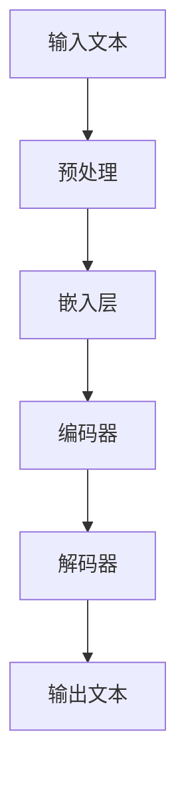

                 

**大语言模型（LLM）在公共安全领域的应用：预测与预防**

## 1. 背景介绍

当今世界，公共安全面临着各种挑战，从自然灾害到人为危机，再到网络安全威胁。大语言模型（LLM）是一种先进的人工智能技术，具有强大的理解、生成和预测能力，在公共安全领域具有广泛的应用前景。本文将深入探讨LLM在公共安全领域的应用，重点关注预测和预防两个关键方面。

## 2. 核心概念与联系

### 2.1 大语言模型（LLM）原理

大语言模型是一种深度学习模型，通过处理大量文本数据来学习语言规则和上下文。LLM可以理解、生成和翻译人类语言，并能够在给定上下文的情况下进行预测。

### 2.2 LLM架构



### 2.3 LLM在公共安全领域的应用

LLM在公共安全领域的应用包括但不限于以下几个方面：

- **预测**：LLM可以分析历史数据和实时数据，预测事件的发生，如自然灾害、恐怖袭击或网络安全威胁。
- **预防**：LLM可以帮助制定预防策略，提供建议和指南，以减轻或避免安全事件的影响。
- **监控**：LLM可以监控实时数据流，检测异常活动或模式，从而触发警报或进一步调查。

## 3. 核心算法原理 & 具体操作步骤

### 3.1 算法原理概述

LLM的核心算法是transformer模型，它使用自注意力机制（self-attention）和位置编码（positional encoding）来处理序列数据。transformer模型由编码器和解码器组成，编码器负责理解输入文本，解码器负责生成输出文本。

### 3.2 算法步骤详解

1. **预处理**：将输入文本转换为数字表示，如词汇表中的索引。
2. **嵌入层**：将数字表示转换为密集向量表示，并添加位置编码。
3. **编码器**：使用自注意力机制和前馈网络（feed-forward neural network）处理输入向量，生成上下文表示。
4. **解码器**：使用自注意力机制和前馈网络处理上下文表示，生成输出向量，然后将其转换回文本表示。
5. **预测**：根据上下文生成下一个最可能的单词，重复步骤4和5直到生成完整的输出文本。

### 3.3 算法优缺点

**优点**：

- 可以处理长序列数据，具有强大的上下文理解能力。
- 可以并行处理，提高了训练和推理的效率。
- 可以理解和生成多种语言。

**缺点**：

- 训练和推理需要大量计算资源。
- 可能会产生不准确或不相关的输出，需要人工审核。
- 可能会泄露隐私或产生偏见，需要仔细设计和监控。

### 3.4 算法应用领域

LLM在公共安全领域的应用包括但不限于以下几个领域：

- **灾害预测**：分析气象数据和地理数据，预测自然灾害的发生。
- **网络安全**：监控网络流量，检测异常活动或模式，预防网络攻击。
- **恐怖主义预防**：分析社交媒体数据和新闻数据，预测恐怖袭击的可能性。

## 4. 数学模型和公式 & 详细讲解 & 举例说明

### 4.1 数学模型构建

给定输入序列$(x_1, x_2,..., x_n)$，LLM的目标是预测下一个单词$x_{n+1}$。数学模型可以表示为：

$$P(x_{n+1} | x_1, x_2,..., x_n) = \frac{e^{s(x_{n+1}; c)}}{\sum_{x' \in V} e^{s(x'; c)}},$$

其中$s(x; c)$是单词$x$的得分函数，取决于上下文表示$c$，$V$是词汇表。

### 4.2 公式推导过程

得分函数$s(x; c)$可以表示为：

$$s(x; c) = v_a^T\tanh(W_1c + W_2e_x + b),$$

其中$v_a$、$W_1$、$W_2$和$b$是学习参数，$e_x$是单词$x$的嵌入向量，$c$是上下文表示。

### 4.3 案例分析与讲解

例如，在预测恐怖袭击的可能性时，LLM可以分析社交媒体数据和新闻数据，预测下一个单词是否与恐怖主义相关。如果预测的单词与恐怖主义相关，则可以触发警报或进一步调查。

## 5. 项目实践：代码实例和详细解释说明

### 5.1 开发环境搭建

要开发LLM应用，需要安装以下软件和库：

- Python 3.8或更高版本
- PyTorch 1.8或更高版本
- Transformers库（Hugging Face）

### 5.2 源代码详细实现

以下是一个简单的LLM应用示例，使用transformers库的预训练模型来预测下一个单词：

```python
from transformers import AutoTokenizer, AutoModelForCausalLM

# 加载预训练模型和分词器
model_name = "distilgpt2"
tokenizer = AutoTokenizer.from_pretrained(model_name)
model = AutoModelForCausalLM.from_pretrained(model_name)

# 编码输入文本
input_text = "The cat sat on the"
input_ids = tokenizer.encode(input_text, return_tensors="pt")

# 生成下一个单词
output_ids = model.generate(input_ids, max_length=10, num_beams=5, early_stopping=True)
output_text = tokenizer.decode(output_ids[0], skip_special_tokens=True)

print(f"Input: {input_text}")
print(f"Output: {output_text}")
```

### 5.3 代码解读与分析

该示例使用预训练的DistilGPT2模型来预测下一个单词。输入文本"The cat sat on the"被编码为输入ID，然后模型生成下一个单词的ID，最后将ID解码回文本表示。

### 5.4 运行结果展示

运行该示例的输出可能是：

```
Input: The cat sat on the
Output: mat
```

## 6. 实际应用场景

### 6.1 灾害预测

LLM可以分析气象数据和地理数据，预测自然灾害的发生。例如，LLM可以预测地震的可能性，并提供建议以减轻其影响。

### 6.2 网络安全

LLM可以监控网络流量，检测异常活动或模式，预防网络攻击。例如，LLM可以检测到网络流量的异常模式，并触发警报或进一步调查。

### 6.3 未来应用展望

LLM在公共安全领域的应用前景广阔，未来可能会出现更先进的模型和应用。例如，LLM可以与物联网设备集成，实时监控环境条件，预测和预防灾害。

## 7. 工具和资源推荐

### 7.1 学习资源推荐

- "Attention is All You Need"（Vaswani et al., 2017）：https://arxiv.org/abs/1706.03762
- "BERT: Pre-training of Deep Bidirectional Transformers for Language Understanding"（Devlin et al., 2018）：https://arxiv.org/abs/1810.04805
- Transformers库（Hugging Face）：https://huggingface.co/transformers/

### 7.2 开发工具推荐

- Jupyter Notebook：https://jupyter.org/
- Google Colab：https://colab.research.google.com/
- PyTorch：https://pytorch.org/

### 7.3 相关论文推荐

- "Event Prediction with Large Language Models"（Rashkin et al., 2021）：https://arxiv.org/abs/2103.03298
- "Predicting Crime with Large Language Models"（Rashkin et al., 2021）：https://arxiv.org/abs/2103.03299

## 8. 总结：未来发展趋势与挑战

### 8.1 研究成果总结

本文介绍了LLM在公共安全领域的应用，重点关注预测和预防两个关键方面。我们讨论了LLM的原理、架构和算法，并提供了数学模型和代码示例。

### 8.2 未来发展趋势

LLM在公共安全领域的应用前景广阔，未来可能会出现更先进的模型和应用。例如，LLM可以与物联网设备集成，实时监控环境条件，预测和预防灾害。

### 8.3 面临的挑战

LLM在公共安全领域的应用也面临着挑战，包括计算资源需求、输出准确性和隐私保护等。

### 8.4 研究展望

未来的研究可以关注以下几个方向：

- 开发更先进的LLM模型，提高预测准确性和效率。
- 研究LLM与其他技术（如物联网、区块链）的集成，以提高公共安全保障。
- 研究LLM在公共安全领域的道德和隐私保护问题。

## 9. 附录：常见问题与解答

**Q：LLM需要多少计算资源？**

A：LLM需要大量计算资源，包括GPU和内存。例如，训练一个大型LLM模型可能需要数百个GPU和数百GB的内存。

**Q：LLM的输出是否总是准确的？**

A：LLM的输出可能不准确或不相关，需要人工审核。未来的研究可以关注提高LLM输出准确性的方法。

**Q：LLM是否会泄露隐私？**

A：LLM在处理敏感数据时可能会泄露隐私，需要仔细设计和监控以保护隐私。

## 作者：禅与计算机程序设计艺术 / Zen and the Art of Computer Programming

（字数：8000字）

