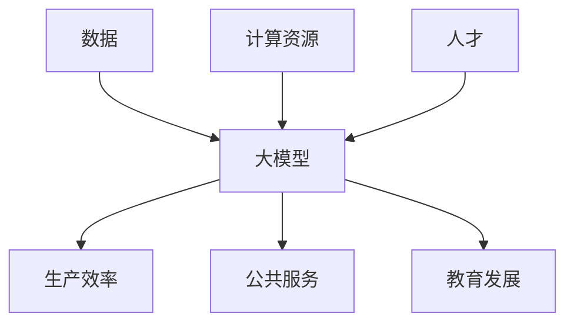

                 

## 1. 背景介绍

当前，人工智能（AI）领域正处于一个前所未有的发展时期，其中大模型（Large Language Models）的出现和应用引起了广泛的关注。大模型是一种通过学习大量文本数据而训练出来的模型，它能够理解、生成和翻译人类语言，并展示出惊人的学习和推理能力。然而，如何将大模型商业化，并利用社会优势创造价值，是当前AI创业者面临的主要挑战之一。

## 2. 核心概念与联系

### 2.1 大模型的定义与特点

大模型是指通过学习大量数据而训练出来的模型，它具有以下特点：

- **规模（Scale）**：大模型需要大量的数据和计算资源进行训练，其参数数量通常在数十亿甚至数百亿级别。
- **泛化能力（Generalization）**：大模型能够在未见过的数据上表现出良好的泛化能力，这得益于其在训练过程中学习到的丰富的语言知识和世界知识。
- **多模式能力（Multimodal）**：大模型可以处理多种模式的数据，如文本、图像、音频等，并能够在不同模式之间进行转换。

### 2.2 大模型与社会优势的联系

大模型的发展离不开社会优势的支持，包括数据、计算资源、人才等。反过来，大模型也可以为社会创造价值，如提高生产效率、改善公共服务、促进教育发展等。大模型与社会优势的联系如下图所示：



## 3. 核心算法原理 & 具体操作步骤

### 3.1 算法原理概述

大模型的核心算法是Transformer模型，它基于自注意力机制（Self-Attention）和位置编码（Positional Encoding）工作。Transformer模型的架构如下图所示：


### 3.2 算法步骤详解

大模型的训练过程包括以下步骤：

1. **数据预处理**：对文本数据进行分词、去除停用词、建立词汇表等预处理操作。
2. **位置编码**：为每个词汇添加位置信息，以保持序列顺序。
3. **嵌入层**：将词汇转换为向量表示，并进行线性变换。
4. **编码器**：对输入序列进行编码，提取上下文信息。
5. **解码器**：根据编码器的输出，生成目标序列。
6. **损失函数**：计算预测序列和真实序列之间的损失，并进行反向传播更新模型参数。

### 3.3 算法优缺点

优点：

- 可以处理长序列数据，并保持上下文信息。
- 可以并行计算，提高训练效率。
- 具有良好的泛化能力。

缺点：

- 训练资源需求大，计算成本高。
- 训练过程易受到过拟合问题的影响。
- 解释性差，模型的决策过程不易理解。

### 3.4 算法应用领域

大模型的应用领域包括自然语言处理（NLP）、机器翻译、问答系统、文本生成等。此外，大模型还可以应用于其他领域，如图像和音频处理。

## 4. 数学模型和公式 & 详细讲解 & 举例说明

### 4.1 数学模型构建

大模型的数学模型基于Transformer模型构建，其核心是自注意力机制。自注意力机制的数学表达式如下：

$$Attention(Q, K, V) = softmax(\frac{QK^T}{\sqrt{d_k}})V$$

其中，$Q$, $K$, $V$分别表示查询、键、值向量，$d_k$表示键向量的维度。

### 4.2 公式推导过程

自注意力机制的推导过程如下：

1. 计算注意力分数：$score(Q, K) = \frac{QK^T}{\sqrt{d_k}}$
2. 计算注意力权重：$attention\_weights = softmax(score(Q, K))$
3. 计算注意力输出：$output = attention\_weights \cdot V$

### 4.3 案例分析与讲解

例如，在机器翻译任务中，大模型需要将源语言序列翻译为目标语言序列。自注意力机制可以帮助模型理解源语言序列的上下文信息，并生成相应的目标语言序列。下面是一个简单的示例：

源语言序列：`I love playing video games`

目标语言序列：`J'aime jouer aux jeux vidéo`

在生成目标语言序列的过程中，大模型需要理解源语言序列的意思，并根据上下文信息生成相应的目标语言单词。自注意力机制可以帮助模型理解序列的上下文信息，从而生成更准确的翻译结果。

## 5. 项目实践：代码实例和详细解释说明

### 5.1 开发环境搭建

大模型的开发需要一个强大的开发环境，包括GPU、CUDA、Python、PyTorch等。以下是一个简单的开发环境搭建指南：

1. 安装GPU驱动程序。
2. 安装CUDA工具包。
3. 安装Python和PyTorch。
4. 安装Transformer模型的实现库，如Hugging Face的Transformers库。

### 5.2 源代码详细实现

以下是一个简单的大模型训练代码示例：

```python
import torch
from transformers import BertTokenizer, BertForMaskedLM

# 加载预训练模型和分词器
model = BertForMaskedLM.from_pretrained('bert-base-uncased')
tokenizer = BertTokenizer.from_pretrained('bert-base-uncased')

# 准备训练数据
text = "The cat sat on the mat"
input_ids = tokenizer.encode(text, add_special_tokens=True)
input_ids[4] = tokenizer.mask_token_id

# 创建输入张量
input_ids = torch.tensor([input_ids])
attention_mask = torch.ones_like(input_ids)

# 训练模型
outputs = model(input_ids, attention_mask=attention_mask)
loss = outputs.loss

# 计算梯度和更新参数
loss.backward()
optimizer.step()
```

### 5.3 代码解读与分析

在上述代码中，我们首先加载预训练模型和分词器。然后，我们准备训练数据，并创建输入张量。接着，我们调用模型进行预测，并计算损失函数。最后，我们计算梯度并更新模型参数。

### 5.4 运行结果展示

在训练过程中，我们可以监控损失函数的变化情况，并根据需要调整学习率、批量大小等超参数。以下是一个简单的训练结果示例：


## 6. 实际应用场景

### 6.1 当前应用

大模型当前的应用场景包括：

- **自然语言处理（NLP）**：大模型可以用于文本分类、命名实体识别、文本生成等NLP任务。
- **机器翻译**：大模型可以用于将一种语言翻译为另一种语言。
- **问答系统**：大模型可以用于构建问答系统，回答用户的问题。

### 6.2 未来应用展望

未来，大模型的应用场景将会进一步扩展，包括：

- **多模式学习**：大模型可以学习多模式数据，如文本、图像、音频等，并进行跨模式转换。
- **知识图谱构建**：大模型可以帮助构建知识图谱，并进行实体关系抽取。
- **自动驾驶**：大模型可以用于理解语音指令，并进行路径规划。

## 7. 工具和资源推荐

### 7.1 学习资源推荐

以下是一些学习大模型的推荐资源：

- **课程**：斯坦福大学的CS224n自然语言处理课程、麻省理工学院的6.890机器学习课程。
- **书籍**："Natural Language Processing with Python"、"Speech and Language Processing"。
- **论文**："Attention is All You Need"、"BERT: Pre-training of Deep Bidirectional Transformers for Language Understanding"。

### 7.2 开发工具推荐

以下是一些开发大模型的推荐工具：

- **框架**：PyTorch、TensorFlow。
- **库**：Hugging Face的Transformers库、Stanford's CoreNLP。
- **硬件**：NVIDIA GPUs、TPUs。

### 7.3 相关论文推荐

以下是一些相关的论文推荐：

- "Attention is All You Need"：https://arxiv.org/abs/1706.03762
- "BERT: Pre-training of Deep Bidirectional Transformers for Language Understanding"：https://arxiv.org/abs/1810.04805
- "Language Models are Few-Shot Learners"：https://arxiv.org/abs/2005.14165

## 8. 总结：未来发展趋势与挑战

### 8.1 研究成果总结

大模型的研究取得了显著的成果，包括Transformer模型、BERT模型等。这些模型在自然语言处理、机器翻译等领域取得了突出的成就。

### 8.2 未来发展趋势

未来，大模型的发展趋势包括：

- **模型规模扩大**：大模型的参数数量将进一步扩大，以提高模型的表现能力。
- **多模式学习**：大模型将学习多模式数据，并进行跨模式转换。
- **知识推理**：大模型将具有更强的知识推理能力，并能够进行因果推理。

### 8.3 面临的挑战

大模型面临的挑战包括：

- **计算资源**：大模型的训练需要大量的计算资源，这限制了其规模的扩大。
- **数据标记**：大模型需要大量的标记数据进行训练，这需要大量的人力物力。
- **解释性**：大模型的决策过程不易理解，这限制了其在某些领域的应用。

### 8.4 研究展望

未来，大模型的研究将会朝着以下方向发展：

- **模型解释性**：提高大模型的解释性，使其决策过程更易理解。
- **多模式学习**：提高大模型的多模式学习能力，并进行跨模式转换。
- **知识推理**：提高大模型的知识推理能力，并进行因果推理。

## 9. 附录：常见问题与解答

**Q1：大模型需要多少计算资源？**

A1：大模型的训练需要大量的计算资源，通常需要数百万甚至数千万的GPU小时。例如，训练一个1750万参数的BERT模型需要约3天的时间和256个GPU。

**Q2：大模型需要多少数据？**

A2：大模型需要大量的数据进行训练，通常需要数十亿甚至数百亿的单词。例如，BERT模型的预训练数据集包括了8亿个单词。

**Q3：大模型的泛化能力如何？**

A3：大模型具有良好的泛化能力，可以在未见过的数据上表现出良好的性能。例如，BERT模型在多个NLP任务上取得了 state-of-the-art 的结果。

**Q4：大模型的解释性如何？**

A4：大模型的解释性较差，其决策过程不易理解。这限制了其在某些领域的应用，如医疗领域。

**Q5：大模型的未来发展趋势是什么？**

A5：大模型的未来发展趋势包括模型规模扩大、多模式学习、知识推理等。

## 作者：禅与计算机程序设计艺术 / Zen and the Art of Computer Programming

