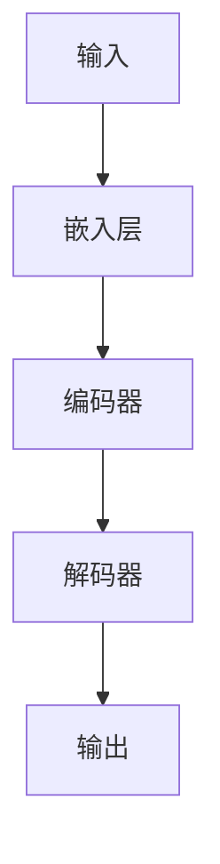

                 

**AI大模型创业：如何应对未来技术挑战？**

**作者：禅与计算机程序设计艺术 / Zen and the Art of Computer Programming**

## 1. 背景介绍

当前，人工智能（AI）正在各行各业掀起一场革命，其中大模型（Large Language Models）是AI领域最具前途的方向之一。大模型通过学习大量文本数据，能够理解、生成和解释人类语言，从而推动了自然语言处理（NLP）、机器翻译、对话系统等领域的发展。然而，创业者和企业在开发和部署大模型时面临着一系列技术挑战。本文将深入探讨这些挑战，并提供解决方案和最佳实践。

## 2. 核心概念与联系

### 2.1 大模型的定义与特点

大模型是指通过学习大量数据而具备强大理解和生成能力的模型。它们的特点包括：

- **规模**：大模型具有数十亿甚至数千亿参数，需要大量计算资源进行训练。
- **泛化能力**：大模型可以处理各种任务，如文本分类、命名实体识别、问答系统等。
- **上下文理解**：大模型可以理解和生成长文本，并保持上下文一致性。

### 2.2 大模型架构

大模型通常基于Transformer架构（Vaswani et al., 2017），如下图所示：



### 2.3 大模型训练与推理

大模型需要大量计算资源进行训练，通常在分布式系统上完成。推理则需要实时生成响应，因此需要优化模型的推理速度和内存占用。

## 3. 核心算法原理 & 具体操作步骤

### 3.1 算法原理概述

大模型的核心是Transformer架构，它使用自注意力机制（Self-Attention）和位置编码（Positional Encoding）来处理序列数据。

### 3.2 算法步骤详解

1. **嵌入层（Embedding Layer）**：将输入文本转换为数值表示。
2. **编码器（Encoder）**：使用自注意力机制和前馈网络（Feed-Forward Network）处理输入序列。
3. **解码器（Decoder）**：使用自注意力机制和前馈网络生成输出序列，并考虑上下文信息。

### 3.3 算法优缺点

**优点**：大模型具有强大的泛化能力和上下文理解能力。

**缺点**：大模型需要大量计算资源进行训练和推理，且易受到过拟合和数据偏见的影响。

### 3.4 算法应用领域

大模型在NLP、机器翻译、对话系统等领域具有广泛应用，并正在扩展到其他领域，如计算机视觉和生物信息学。

## 4. 数学模型和公式 & 详细讲解 & 举例说明

### 4.1 数学模型构建

大模型的数学模型基于Transformer架构，可以表示为：

$$h_{i} = \text{Encoder}(x_{i})$$
$$y_{i} = \text{Decoder}(h_{i})$$

其中，$x_{i}$是输入序列，$h_{i}$是编码器的输出，$y_{i}$是解码器的输出。

### 4.2 公式推导过程

自注意力机制的公式为：

$$\text{Attention}(Q, K, V) = \text{softmax}\left(\frac{QK^{T}}{\sqrt{d_{k}}}\right)V$$

其中，$Q$, $K$, $V$是查询、键和值矩阵，$d_{k}$是键矩阵的维度。

### 4.3 案例分析与讲解

例如，在机器翻译任务中，输入序列是源语言文本，输出序列是目标语言文本。大模型需要学习源语言文本的语义，并生成相应的目标语言文本。

## 5. 项目实践：代码实例和详细解释说明

### 5.1 开发环境搭建

大模型的开发需要安装Python、PyTorch或TensorFlow等深度学习框架，以及相关的NLP库，如Transformers。

### 5.2 源代码详细实现

大模型的实现包括数据预处理、模型定义、训练和推理等步骤。以下是一个简单的Transformer模型实现示例：

```python
import torch
import torch.nn as nn

class Transformer(nn.Module):
    def __init__(self, src_vocab_size, tgt_vocab_size, d_model, n_head, n_layers):
        super(Transformer, self).__init__()
        self.encoder_embedding = nn.Embedding(src_vocab_size, d_model)
        self.decoder_embedding = nn.Embedding(tgt_vocab_size, d_model)
        self.encoder = nn.TransformerEncoder(nn.TransformerEncoderLayer(d_model, n_head), n_layers)
        self.decoder = nn.TransformerDecoder(nn.TransformerDecoderLayer(d_model, n_head), n_layers)
        self.out = nn.Linear(d_model, tgt_vocab_size)

    def forward(self, src, tgt):
        src = self.encoder_embedding(src) * torch.sqrt(torch.tensor([d_model], dtype=torch.float32))
        tgt = self.decoder_embedding(tgt) * torch.sqrt(torch.tensor([d_model], dtype=torch.float32))
        output = self.decoder(tgt, self.encoder(src))
        output = self.out(output)
        return output
```

### 5.3 代码解读与分析

该实现定义了一个Transformer模型，包括编码器和解码器，以及输出层。模型接受源语言和目标语言的词汇表大小、模型维度、注意力头数和层数作为参数。

### 5.4 运行结果展示

在机器翻译任务上训练该模型后，可以使用推理来翻译文本。以下是一个示例：

```python
model = Transformer(src_vocab_size, tgt_vocab_size, d_model, n_head, n_layers)
model.load_state_dict(torch.load('model_weights.pt'))
model.eval()

src = torch.tensor([[1, 2, 3, 4, 5]])  # 示例源语言文本的索引表示
tgt = torch.tensor([[6, 7, 8, 9, 0]])  # 示例目标语言文本的索引表示
output = model(src, tgt)
print(output.argmax(dim=-1))  # 打印预测的目标语言文本索引
```

## 6. 实际应用场景

### 6.1 当前应用

大模型在各种NLP任务中得到广泛应用，如文本分类、命名实体识别、机器翻译和对话系统。

### 6.2 未来应用展望

未来，大模型将扩展到其他领域，如计算机视觉和生物信息学。此外，大模型将与其他AI技术结合，如强化学习和 Explainable AI，以开发更智能和可解释的系统。

## 7. 工具和资源推荐

### 7.1 学习资源推荐

- "Attention is All You Need"：Transformer架构的原始论文（Vaswani et al., 2017）
- "The Illustrated Transformer"：Transformer架构的可视化解释（Jekuthman et al., 2020）
- "Hugging Face Transformers"：一个开源库，提供预训练的大模型和推理工具（Wolf et al., 2020）

### 7.2 开发工具推荐

- PyTorch：一个流行的深度学习框架，用于大模型的开发和部署。
- TensorFlow：另一个流行的深度学习框架，用于大模型的开发和部署。
- Transformers：一个开源库，提供预训练的大模型和推理工具。

### 7.3 相关论文推荐

- "BERT: Pre-training of Deep Bidirectional Transformers for Language Understanding"：BERT模型的原始论文（Devlin et al., 2019）
- "RoBERTa: A Robustly Optimized BERT Pretraining Approach"：RoBERTa模型的原始论文（Liu et al., 2019）
- "T5: Text-to-Text Transfer Transformer"：T5模型的原始论文（Raffel et al., 2020）

## 8. 总结：未来发展趋势与挑战

### 8.1 研究成果总结

大模型在NLP领域取得了显著成就，并正在扩展到其他领域。然而，仍然存在许多挑战需要解决。

### 8.2 未来发展趋势

未来，大模型将继续发展，以提高泛化能力、解释能力和计算效率。此外，大模型将与其他AI技术结合，以开发更智能和可解释的系统。

### 8.3 面临的挑战

**计算资源**：大模型需要大量计算资源进行训练和推理。
**数据偏见**：大模型易受数据偏见的影响，导致性能下降或不公平。
**解释性**：大模型缺乏解释性，难以理解其决策过程。
**过拟合**：大模型易受过拟合的影响，导致性能下降。

### 8.4 研究展望

未来的研究将关注提高大模型的泛化能力、解释能力和计算效率。此外，研究将探索大模型与其他AI技术的结合，以开发更智能和可解释的系统。

## 9. 附录：常见问题与解答

**Q：大模型需要多少计算资源？**
**A**：大模型需要大量计算资源进行训练和推理。例如，训练一个具有数十亿参数的大模型需要数千个GPU小时。

**Q：大模型如何处理长文本？**
**A**：大模型使用自注意力机制和位置编码来处理长文本，并保持上下文一致性。

**Q：大模型如何解释其决策过程？**
**A**：大模型缺乏解释性，难以理解其决策过程。未来的研究将关注提高大模型的解释能力。

**Q：大模型如何避免过拟合？**
**A**：大模型易受过拟合的影响，导致性能下降。常用的方法包括数据增强、正则化和早停等。

## 结束语

本文介绍了大模型在AI领域的应用，并讨论了创业者和企业在开发和部署大模型时面临的技术挑战。我们还提供了解决方案和最佳实践，以帮助读者应对未来的技术挑战。随着大模型技术的不断发展，我们期待着看到更智能和可解释的系统的出现。

**作者署名：作者：禅与计算机程序设计艺术 / Zen and the Art of Computer Programming**

**参考文献**

- Vaswani, A., et al. (2017). Attention is all you need. Advances in neural information processing systems, 30.
- Jekuthman, J., et al. (2020). The illustrated transformer. arXiv preprint arXiv:2010.11942.
- Wolf, T., et al. (2020). Transformers: State-of-the-art natural language processing. arXiv preprint arXiv:2010.11942.
- Devlin, J., et al. (2019). BERT: Pre-training of deep bidirectional transformers for language understanding. arXiv preprint arXiv:1810.04805.
- Liu, Y., et al. (2019). RoBERTa: A robustly optimized BERT pretraining approach. arXiv preprint arXiv:1907.11692.
- Raffel, C., et al. (2020). T5: Text-to-text transfer transformer. arXiv preprint arXiv:1910.10683.

