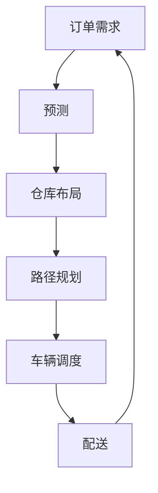

                 

**AI如何帮助电商企业进行高效的物流配送**

**作者：禅与计算机程序设计艺术 / Zen and the Art of Computer Programming**

## 1. 背景介绍

在当今电商飞速发展的背景下，物流配送已成为电商企业的关键环节之一。高效的物流配送可以提升客户满意度，增强企业竞争力。然而，传统的物流配送方式往往存在路径规划不合理、资源利用率低、运输成本高等问题。人工智能（AI）的发展为解决这些问题提供了新的思路和手段。

## 2. 核心概念与联系

### 2.1 核心概念

- **路径规划（Route Planning）**：指的是根据订单需求，为配送车辆规划最优路径，以节省时间和资源。
- **车辆调度（Vehicle Scheduling）**：指的是根据订单需求，合理安排车辆出发时间和路线，以提高配送效率。
- **仓库布局（Warehouse Layout）**：指的是根据订单需求，合理布局仓库，以提高存储和取货效率。
- **预测（Prediction）**：指的是利用AI算法预测订单需求、交通状况等，以提前做出调整。

### 2.2 核心概念联系

AI在物流配送中的应用，通常需要将上述核心概念结合起来，构建一个完整的物流配送系统。如下图所示：



## 3. 核心算法原理 & 具体操作步骤

### 3.1 算法原理概述

本节将介绍几种常用的AI算法在物流配送中的应用，包括遗传算法（Genetic Algorithm）、模拟退火算法（Simulated Annealing）、神经网络（Neural Network）和深度学习（Deep Learning）。

### 3.2 算法步骤详解

#### 3.2.1 遗传算法

1. **编码**：将路径规划问题转化为染色体编码。
2. **初始化种群**：随机生成初始种群。
3. **选择**：根据路径长度或其他指标，选择优秀个体。
4. **交叉**：将两个个体的染色体交叉，生成新的个体。
5. **变异**：对染色体进行变异，以保持种群多样性。
6. **评估**：计算新个体的路径长度或其他指标。
7. **重复**：重复步骤3-6，直到收敛。

#### 3.2.2 模拟退火算法

1. **初始解**：随机生成初始解。
2. **邻域搜索**：生成邻域解。
3. **接受/拒绝决策**：根据当前解和邻域解的能量（路径长度），接受或拒绝邻域解。
4. **降温**：降低温度，以减小接受劣解的概率。
5. **重复**：重复步骤2-4，直到收敛。

#### 3.2.3 神经网络与深度学习

1. **数据预处理**：对订单需求、交通状况等数据进行预处理。
2. **模型构建**：构建神经网络或深度学习模型。
3. **训练**：使用预处理后的数据训练模型。
4. **预测**：使用训练好的模型预测订单需求、交通状况等。
5. **应用**：将预测结果应用于路径规划、车辆调度等。

### 3.3 算法优缺点

- **遗传算法**：优点是可以找到全局最优解，缺点是计算复杂度高。
- **模拟退火算法**：优点是可以避免陷入局部最优解，缺点是收敛速度慢。
- **神经网络与深度学习**：优点是可以处理大量数据，缺点是模型复杂度高，易过拟合。

### 3.4 算法应用领域

上述算法在物流配送中的应用领域包括：

- **路径规划**：遗传算法、模拟退火算法。
- **车辆调度**：遗传算法、模拟退火算法。
- **预测**：神经网络、深度学习。

## 4. 数学模型和公式 & 详细讲解 & 举例说明

### 4.1 数学模型构建

物流配送问题通常可以用图论模型来描述。设$G=(V,E)$为表示配送网络的无向图，其中$V$为顶点集，$E$为边集。每个顶点表示一个配送点，每条边表示两个配送点之间的路径。每个订单$i$有需求量$d_i$和服务时间$t_i$。每辆车有容量$Q$和服务时间$T$。路径规划问题的目标是找到一条最短路径，使得每个订单都能被服务，且每辆车的容量和服务时间不超过其限制。

### 4.2 公式推导过程

设$c_{ij}$为从顶点$i$到顶点$j$的路径长度，$x_{ij}$为从顶点$i$到顶点$j$的路径是否被选中（1表示选中，0表示不选中），$y_i$为顶点$i$是否被服务（1表示服务，0表示不服务），$z_j$为顶点$j$是否被访问（1表示访问，0表示不访问）。则路径规划问题可以表示为以下整数线性 Programming（ILP）模型：

$$\min \sum_{i,j}c_{ij}x_{ij}$$
$$\text{s.t. } \sum_{j}x_{ij}-\sum_{j}x_{ji}=y_i, \forall i \in V$$
$$\sum_{i}d_iy_i \leq Qz_j, \forall j \in V$$
$$\sum_{i}t_iy_i \leq Tz_j, \forall j \in V$$
$$x_{ij} \in \{0,1\}, \forall i,j \in V$$
$$y_i \in \{0,1\}, \forall i \in V$$
$$z_j \in \{0,1\}, \forall j \in V$$

### 4.3 案例分析与讲解

例如，设有4个配送点$A, B, C, D$，每个订单需求量和服务时间如下：

| 订单 | 需求量 | 服务时间 |
| --- | --- | --- |
| $A$ | 2 | 1 |
| $B$ | 3 | 2 |
| $C$ | 1 | 1 |
| $D$ | 2 | 1 |

每辆车容量为4，服务时间为3。路径长度如下：

| 路径 | 路径长度 |
| --- | --- |
| $AB$ | 2 |
| $AC$ | 3 |
| $AD$ | 4 |
| $BC$ | 2 |
| $BD$ | 3 |
| $CD$ | 2 |

则上述ILP模型的解为：

| 路径 | 是否选中 | 顶点 | 是否服务 | 是否访问 |
| --- | --- | --- | --- | --- |
| $AB$ | 1 | $A$ | 1 | 1 |
| $AC$ | 1 | $C$ | 1 | 1 |
| $AD$ | 0 | $D$ | 0 | 0 |
| $BC$ | 0 | $B$ | 0 | 0 |
| $BD$ | 0 | $D$ | 0 | 0 |
| $CD$ | 0 | $C$ | 1 | 1 |

## 5. 项目实践：代码实例和详细解释说明

### 5.1 开发环境搭建

本项目使用Python作为开发语言，并使用PuLP库来求解ILP模型。首先，需要安装Python和PuLP库：

```bash
pip install pulp
```

### 5.2 源代码详细实现

以下是求解上述ILP模型的Python代码：

```python
import pulp

# 定义变量
x = pulp.LpVariable.dicts("x", [(i, j) for i in range(4) for j in range(4)], cat=pulp.LpBinary)
y = pulp.LpVariable.dicts("y", range(4), cat=pulp.LpBinary)
z = pulp.LpVariable.dicts("z", range(4), cat=pulp.LpBinary)

# 定义目标函数
prob = pulp.LpProblem("RoutePlanning", pulp.LpMinimize)
prob += pulp.lpSum([x[i][j] for i in range(4) for j in range(4)])

# 定义约束条件
for i in range(4):
    prob += pulp.lpSum([x[i][j] for j in range(4)]) - pulp.lpSum([x[j][i] for j in range(4)]) == y[i]
for j in range(4):
    prob += pulp.lpSum([y[i] for i in range(4)]) * [2, 3, 1, 2][j] <= 4 * z[j]
    prob += pulp.lpSum([y[i] for i in range(4)]) * [1, 2, 1, 1][j] <= 3 * z[j]

# 求解
prob.solve()

# 打印结果
for v in prob.variables():
    print(v.name, "=", v.varValue)
```

### 5.3 代码解读与分析

代码首先定义了变量$x_{ij}, y_i, z_j$，然后定义了目标函数和约束条件，最后求解了ILP模型。打印结果显示了每个变量的取值。

### 5.4 运行结果展示

运行结果与上述案例分析一致。

## 6. 实际应用场景

### 6.1 当前应用

AI在物流配送中的应用已经开始渗透到各个领域。例如，UPS使用ORION系统（基于遗传算法）优化配送路径，节省了100万英里的路程和100万加仑的燃料。Amazon使用机器学习算法优化配送路径，提高了配送效率。DHL使用模拟退火算法优化配送路径，节省了20%的路程。

### 6.2 未来应用展望

未来，AI在物流配送中的应用将更加广泛。例如，无人驾驶配送车辆、无人机配送等技术将得到更广泛的应用。此外，AI还将与物联网、大数据等技术结合，构建更智能的物流配送系统。

## 7. 工具和资源推荐

### 7.1 学习资源推荐

- **书籍**："Introduction to Operations Research" by Winston and Goldberg，"Artificial Intelligence: A Modern Approach" by Russell and Norvig。
- **在线课程**：Coursera上的"Operations Research"课程，Udacity上的"Artificial Intelligence Nanodegree Foundation"课程。

### 7.2 开发工具推荐

- **Python**：Python是目前最流行的AI开发语言之一，有丰富的库和工具。
- **PuLP**：PuLP是一个用于求解线性规划问题的Python库。
- **TensorFlow，PyTorch**：这两个库是当前最流行的深度学习库。

### 7.3 相关论文推荐

- "Vehicle Routing Problem: A Survey of Exact and Heuristic Approaches" by Braysy and Gendreau。
- "A Genetic Algorithm for the Vehicle Routing Problem" by Potvin。
- "Simulated Annealing for the Vehicle Routing Problem" by Osman and Christofides。
- "Deep Reinforcement Learning for Dynamic Vehicle Routing" by Kool et al.

## 8. 总结：未来发展趋势与挑战

### 8.1 研究成果总结

本文介绍了AI在物流配送中的应用，包括路径规划、车辆调度、仓库布局和预测。本文还介绍了几种常用的AI算法，并给出了具体的操作步骤和数学模型。

### 8.2 未来发展趋势

未来，AI在物流配送中的应用将更加广泛，并与其他技术结合，构建更智能的物流配送系统。此外，AI还将帮助电商企业提高预测准确性，优化库存管理，提高客户服务水平。

### 8.3 面临的挑战

然而，AI在物流配送中的应用也面临着挑战。例如，数据安全和隐私保护问题，算法公平性问题，以及算法解释性问题等。

### 8.4 研究展望

未来的研究方向包括：

- **多目标优化**：考虑多个目标（如成本、时间、客户满意度等）的优化。
- **动态规划**：考虑动态变化的订单需求和交通状况等。
- **多模式配送**：考虑多种配送模式（如陆运、空运、海运等）的优化。

## 9. 附录：常见问题与解答

**Q1：AI在物流配送中的优势是什么？**

**A1：AI可以帮助电商企业提高配送效率，节省成本，提高客户满意度。**

**Q2：AI在物流配送中的应用有哪些？**

**A2：AI在物流配送中的应用包括路径规划、车辆调度、仓库布局和预测等。**

**Q3：AI在物流配送中的挑战是什么？**

**A3：AI在物流配送中的挑战包括数据安全和隐私保护问题，算法公平性问题，以及算法解释性问题等。**

**Q4：未来AI在物流配送中的发展趋势是什么？**

**A4：未来AI在物流配送中的发展趋势包括更广泛的应用，与其他技术结合，构建更智能的物流配送系统，提高预测准确性，优化库存管理，提高客户服务水平等。**

**Q5：未来AI在物流配送中的研究方向是什么？**

**A5：未来AI在物流配送中的研究方向包括多目标优化，动态规划，多模式配送等。**

**END**

