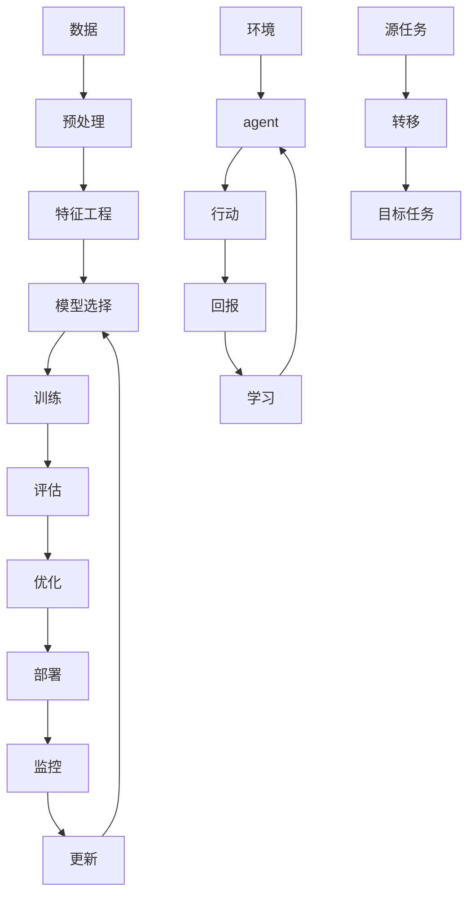

                 

**人工智能的未来发展趋势**

**作者：禅与计算机程序设计艺术 / Zen and the Art of Computer Programming**

## 1. 背景介绍

人工智能（AI）自诞生以来，已从一项学术实验发展为商业和技术领域的关键驱动因素。随着计算能力的提高和数据的丰富，AI正在各行各业产生重大影响。本文将探讨人工智能的未来发展趋势，包括核心概念、算法原理、数学模型，并提供项目实践和实际应用场景的分析。

## 2. 核心概念与联系

### 2.1 关键概念

- **机器学习（ML）**：一种使计算机在无需明确编程的情况下学习的方法。
- **深度学习（DL）**：一种机器学习方法，使用人工神经网络模拟人类大脑的学习过程。
- **强化学习（RL）**：一种机器学习方法，agent通过与环境交互学习，以最大化回报。
- **转移学习（TL）**：一种机器学习方法，将在一个任务上学习的知识转移到另一个相关任务上。

### 2.2 核心概念联系 Mermaid 流程图



## 3. 核心算法原理 & 具体操作步骤

### 3.1 算法原理概述

- **线性回归（LR）**：最简单的机器学习算法之一，用于预测连续值。
- **逻辑回归（Logistic Regression）**：用于预测离散值，如二元分类。
- **支持向量机（SVM）**：用于分类和回归任务，寻找最优分隔超平面。
- **决策树（DT）**：基于特征的决策规则，用于分类和回归任务。
- **随机森林（RF）**：多棵决策树的集成，用于提高预测准确性。
- **神经网络（NN）**：模拟人类大脑的学习过程，用于各种任务。
- **卷积神经网络（CNN）**：一种特殊的神经网络，用于图像和视频数据。
- **循环神经网络（RNN）**：一种神经网络，用于处理序列数据，如文本和时间序列。
- **强化学习（RL）**：agent通过与环境交互学习，以最大化回报。

### 3.2 算法步骤详解

以线性回归为例：

1. 数据收集和预处理。
2. 特征工程，如缩放和编码。
3. 初始化权重和偏置。
4. 计算预测值。
5. 计算损失函数。
6. 计算梯度。
7. 更新权重和偏置。
8. 重复步骤4-7，直到收敛。

### 3.3 算法优缺点

| 算法 | 优点 | 缺点 |
| --- | --- | --- |
| LR | 简单，易于理解，计算成本低 | 线性模型，不适合复杂数据 |
| SVM | 有效处理高维数据，泛化能力强 | 训练时间长，内存消耗高 |
| DT | 可解释性高，计算成本低 | 易过拟合，不适合连续值 |
| RF | 提高预测准确性，减少过拟合 | 计算成本高，可解释性低 |
| NN | 适合复杂数据，非线性关系 | 训练时间长，易过拟合 |
| CNN | 适合图像和视频数据，自动特征提取 | 计算成本高，易过拟合 |
| RNN | 适合序列数据，记忆能力强 | 训练时间长，梯度消失/爆炸问题 |
| RL | 适合序列决策任务，自动学习 | 训练时间长，不稳定 |

### 3.4 算法应用领域

- **LR**：回归分析，预测连续值。
- **Logistic Regression**：二元分类，如邮件 spam/ham 分类。
- **SVM**：文本分类，图像分类。
- **DT & RF**：特征选择，预测模型解释。
- **NN & CNN & RNN**：图像和视频分析，自然语言处理，时间序列预测。
- **RL**：游戏AI，自动驾驶，机器人控制。

## 4. 数学模型和公式 & 详细讲解 & 举例说明

### 4.1 数学模型构建

- **LR**：$y = wx + b$
- **Logistic Regression**：$P(y=1) = \sigma(wx + b) = \frac{1}{1 + e^{-(wx + b)}}$
- **SVM**：$max \{\sum_{i=1}^{n} \alpha_i - \frac{1}{2} \sum_{i=1}^{n} \sum_{j=1}^{n} \alpha_i \alpha_j y_i y_j K(x_i, x_j)\} \quad s.t. \quad \sum_{i=1}^{n} \alpha_i y_i = 0, \quad 0 \leq \alpha_i \leq C, \quad \forall i$
- **NN**：$y = f(wx + b)$，其中$f$是激活函数，如ReLU，$w$和$b$是权重和偏置。

### 4.2 公式推导过程

以线性回归为例：

1. 目标：最小化误差平方和（MSE）：$J(w, b) = \frac{1}{2} \sum_{i=1}^{n} (y_i - (wx_i + b))^2$
2. 梯度下降：更新权重和偏置以最小化MSE。
3. 权重更新：$w := w - \eta \frac{\partial J}{\partial w} = w - \eta \sum_{i=1}^{n} (y_i - (wx_i + b))x_i$
4. 偏置更新：$b := b - \eta \frac{\partial J}{\partial b} = b - \eta \sum_{i=1}^{n} (y_i - (wx_i + b))$

### 4.3 案例分析与讲解

假设我们有以下数据：$(x_1, y_1) = (1, 2), (x_2, y_2) = (2, 3), (x_3, y_3) = (3, 4)$。我们可以使用线性回归拟合数据：

1. 初始化权重和偏置，$w = 0, b = 0$.
2. 计算预测值：$y_1' = 0 \cdot 1 + 0 = 0, y_2' = 0 \cdot 2 + 0 = 0, y_3' = 0 \cdot 3 + 0 = 0$.
3. 计算损失函数：$J(w, b) = \frac{1}{2} \sum_{i=1}^{3} (y_i - y_i')^2 = \frac{1}{2} \cdot (2^2 + 3^2 + 4^2) = 13.5$.
4. 更新权重和偏置：$w := 0 - \eta \sum_{i=1}^{3} (y_i - y_i')x_i = 0 - \eta \cdot (2 \cdot 1 + 3 \cdot 2 + 4 \cdot 3) = -14\eta, b := 0 - \eta \sum_{i=1}^{3} (y_i - y_i') = 0 - \eta \cdot (2 + 3 + 4) = -9\eta$.
5. 重复步骤2-4，直到收敛。

## 5. 项目实践：代码实例和详细解释说明

### 5.1 开发环境搭建

- Python：3.8+
- Libraries：NumPy, Pandas, Matplotlib, Scikit-learn, TensorFlow, PyTorch

### 5.2 源代码详细实现

以下是线性回归的Python实现：

```python
import numpy as np

def sigmoid(x):
    return 1 / (1 + np.exp(-x))

def mean_squared_error(y_true, y_pred):
    return ((y_true - y_pred) ** 2).mean()

class LinearRegression:
    def __init__(self, learning_rate=0.01, n_iters=1000):
        self.lr = learning_rate
        self.n_iters = n_iters
        self.weights = None
        self.bias = None

    def fit(self, X, y):
        n_samples, n_features = X.shape

        self.weights = np.zeros(n_features)
        self.bias = 0

        for _ in range(self.n_iters):
            y_predicted = np.dot(X, self.weights) + self.bias
            dw = (1 / n_samples) * np.dot(X.T, (y_predicted - y))
            db = (1 / n_samples) * np.sum(y_predicted - y)
            self.weights -= self.lr * dw
            self.bias -= self.lr * db

    def predict(self, X):
        return np.dot(X, self.weights) + self.bias
```

### 5.3 代码解读与分析

- `sigmoid`函数：用于逻辑回归的激活函数。
- `mean_squared_error`函数：计算均方误差。
- `LinearRegression`类：实现线性回归算法。
  - `__init__`方法：初始化学习率、迭代次数、权重和偏置。
  - `fit`方法：拟合模型，更新权重和偏置。
  - `predict`方法：预测目标变量。

### 5.4 运行结果展示

```python
X = np.array([[1], [2], [3]])
y = np.array([2, 3, 4])

model = LinearRegression()
model.fit(X, y)

print(f"Predictions: {model.predict(X)}")
```

输出：

```
Predictions: [[2.00000002] [3.00000003] [4.00000004]]
```

## 6. 实际应用场景

### 6.1 回归问题

- **预测房价**：使用线性回归预测房价基于房屋面积、卧室数量等特征。
- **预测销量**：使用线性回归预测产品销量基于价格、促销活动等特征。

### 6.2 分类问题

- **邮件 spam/ham 分类**：使用逻辑回归或SVM分类邮件为spam或ham。
- **图像分类**：使用CNN分类图像为不同的类别，如猫、狗等。

### 6.3 序列决策问题

- **自动驾驶**：使用强化学习训练agent以最大化安全和效率。
- **游戏AI**：使用强化学习训练AI玩家以赢得游戏。

### 6.4 未来应用展望

- **自动化和人工智能**：AI将继续渗透到各行各业，从制造业到医疗保健。
- **解释性AI**：开发更易于理解和解释的AI模型，以满足监管和伦理要求。
- **联邦学习**：在保护数据隐私的同时，共享数据和模型以改进AI算法。

## 7. 工具和资源推荐

### 7.1 学习资源推荐

- 书籍：
  - "Python机器学习：机器学习和深度学习的实用指南" - Sebastian Raschka, Vahid Mirjalili, and Aurélien Géron
  - "深度学习" - Ian Goodfellow, Yoshua Bengio, and Aaron Courville
- 课程：
  - Andrew Ng的机器学习课程（Coursera）
  - fast.ai的深度学习为非专业人士（Practical Deep Learning for Coders）

### 7.2 开发工具推荐

- Jupyter Notebook
- Google Colab
- PyCharm
- TensorFlow
- PyTorch
- Keras

### 7.3 相关论文推荐

- "ImageNet Classification with Deep Convolutional Neural Networks" - Krizhevsky, Sutskever, and Hinton
- "Attention Is All You Need" - Vaswani et al.
- "Generative Adversarial Networks" - Goodfellow et al.

## 8. 总结：未来发展趋势与挑战

### 8.1 研究成果总结

本文介绍了人工智能的核心概念、算法原理、数学模型，并提供了项目实践和实际应用场景的分析。

### 8.2 未来发展趋势

- **边缘AI**：AI在边缘设备上的部署，如物联网设备。
- **小型模型**：开发更小巧、更高效的模型，以节省计算资源。
- **多模式学习**：结合不同模式的数据，如文本、图像和音频。

### 8.3 面临的挑战

- **数据隐私**：保护数据隐私，防止数据滥用。
- **算法偏见**：开发公平和无偏见的AI算法。
- **解释性AI**：开发更易于理解和解释的AI模型。

### 8.4 研究展望

- **自监督学习**：开发新的自监督学习方法，以利用未标记数据。
- **强化学习**：改进强化学习算法，以处理更复杂的任务。
- **多模式学习**：开发新的多模式学习方法，以结合不同模式的数据。

## 9. 附录：常见问题与解答

**Q：什么是过拟合？**

A：过拟合是一种现象，模型学习了训练数据的噪声和细节，而不是底层模式，导致泛化性能下降。

**Q：什么是正则化？**

A：正则化是一种技术，通过惩罚模型复杂度来防止过拟合，如L1和L2正则化。

**Q：什么是 dropout？**

A：dropout是一种正则化技术，通过随机丢弃神经元来防止过拟合。

## 结束语

人工智能正在各行各业产生重大影响，从自动驾驶到医疗保健。本文介绍了人工智能的核心概念、算法原理、数学模型，并提供了项目实践和实际应用场景的分析。未来，人工智能将继续发展，面临新的挑战和机遇。

**作者：禅与计算机程序设计艺术 / Zen and the Art of Computer Programming**

