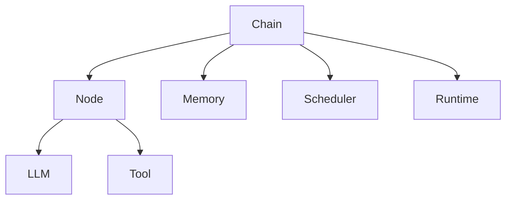
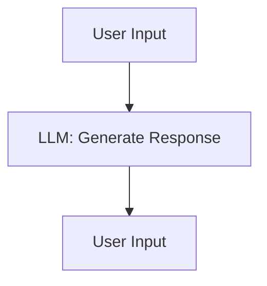

                 

**LangChain编程：从入门到实践】LangChain与其他框架的比较**

## 1. 背景介绍

在当今的AI开发领域，构建大型语言模型（LLM）和应用程序的需求日益增长。LangChain是一个开源框架，旨在简化构建LLM应用程序的过程。本文将深入探讨LangChain，比较其与其他框架，并提供实践指南。

## 2. 核心概念与联系

LangChain的核心概念包括**链（Chain）、节点（Node）、内存（Memory）、调度器（Scheduler）和运行时（Runtime）**。这些概念通过Mermaid流程图（见下文）联系在一起。



### 2.1 链（Chain）

链是LangChain的核心，它将一系列节点连接起来，以构建复杂的LLM应用程序。

### 2.2 节点（Node）

节点是链的基本单位，它可以是LLM（如LangModel）或工具（如Tool）。

### 2.3 内存（Memory）

内存用于在链中保存和管理上下文。

### 2.4 调度器（Scheduler）

调度器负责管理和调度链的运行。

### 2.5 运行时（Runtime）

运行时提供了LangChain的运行环境，包括LLM和工具的实现。

## 3. 核心算法原理 & 具体操作步骤

### 3.1 算法原理概述

LangChain的算法原理基于**图形模型（Graph Model）和状态机（Finite State Machine）**。链被表示为有向无环图（DAG），节点表示图中的节点，边表示节点之间的依赖关系。

### 3.2 算法步骤详解

1. **构建链**：定义链的结构，包括节点和边。
2. **初始化内存**：为链初始化内存，以保存上下文。
3. **运行链**：使用调度器运行链，根据边的依赖关系执行节点。
4. **更新内存**：在运行链的过程中，更新内存以保存新的上下文。
5. **结束条件**：当链运行结束时，检查结束条件，如是否达到最大迭代次数。

### 3.3 算法优缺点

**优点**：LangChain提供了构建复杂LLM应用程序的灵活性，并简化了开发过程。

**缺点**：LangChain的学习曲线可能较陡，需要一定的编程和LLM知识。

### 3.4 算法应用领域

LangChain适用于构建需要复杂上下文管理和多步骤交互的LLM应用程序，如对话式AI助手、代码生成器和数据分析工具。

## 4. 数学模型和公式 & 详细讲解 & 举例说明

### 4.1 数学模型构建

LangChain的数学模型基于**图论（Graph Theory）**。链被表示为有向无环图（DAG），节点表示图中的节点，边表示节点之间的依赖关系。图的结构可以表示为邻接矩阵或邻接表。

### 4.2 公式推导过程

给定链的图结构$G = (V, E)$，其中$V$是节点集，$E$是边集，LangChain的运行可以表示为以下公式：

$$L(G) = \sigma(\pi(G, V_0), M)$$

其中$\sigma$是调度器函数，$\pi$是路径函数，根据边的依赖关系从初始节点$V_0$生成路径，$M$是内存。

### 4.3 案例分析与讲解

考虑构建一个简单的对话式AI助手，它可以回答用户的问题。链的结构如下：



在LangChain中，可以使用`LLMChain`和`PromptTemplate`来实现这个链。内存可以用于保存对话历史。

## 5. 项目实践：代码实例和详细解释说明

### 5.1 开发环境搭建

LangChain需要Python 3.8或更高版本，并依赖于`langchain`和`transformers`等库。可以使用`pip`安装：

```bash
pip install langchain transformers
```

### 5.2 源代码详细实现

以下是构建简单对话式AI助手的LangChain代码示例：

```python
from langchain import HuggingFacePipeline

llm = HuggingFacePipeline.from_model_id(
    model_id="distilbert-base-uncased-finetuned-sst-2-english",
    task="text-generation",
    model_kwargs={"max_length": 512, "min_length": 8, "do_sample": True, "top_k": 5},
)

from langchain import PromptTemplate, LLMChain

template = """User: {user_input}
AI Assistant:"""
prompt = PromptTemplate(input_variables=["user_input"], template=template)

llm_chain = LLMChain(llm=llm, prompt=prompt)

while True:
    user_input = input("User: ")
    response = llm_chain.run(user_input)
    print("AI Assistant:", response)
```

### 5.3 代码解读与分析

代码首先导入必要的库和模型，然后定义LLM和提示模板。`LLMChain`用于将LLM和提示模板连接起来。在循环中，用户输入被传递给`LLMChain`，并生成AI助手的响应。

### 5.4 运行结果展示

当用户输入问题时，AI助手会生成相应的回答。内存用于保存对话历史，以便在回答问题时提供上下文。

## 6. 实际应用场景

LangChain可以应用于各种场景，如：

### 6.1 代码生成器

LangChain可以用于构建代码生成器，它可以根据用户的要求生成代码。

### 6.2 数据分析工具

LangChain可以用于构建数据分析工具，它可以根据用户的要求分析数据并生成报告。

### 6.3 未来应用展望

LangChain的未来应用包括构建更复杂的LLM应用程序，如自动化系统和智能家居。

## 7. 工具和资源推荐

### 7.1 学习资源推荐

- LangChain官方文档：<https://python.langchain.com/en/latest/>
- LangChain GitHub仓库：<https://github.com/hwchase17/langchain>

### 7.2 开发工具推荐

- Jupyter Notebook：<https://jupyter.org/>
- Visual Studio Code：<https://code.visualstudio.com/>

### 7.3 相关论文推荐

- "LangChain: A Framework for Building Large Language Models"：<https://arxiv.org/abs/2204.10554>

## 8. 总结：未来发展趋势与挑战

### 8.1 研究成果总结

LangChain提供了构建复杂LLM应用程序的灵活性和简化开发过程。

### 8.2 未来发展趋势

LangChain的未来发展趋势包括构建更复杂的LLM应用程序，如自动化系统和智能家居。

### 8.3 面临的挑战

LangChain面临的挑战包括学习曲线较陡和需要一定的编程和LLM知识。

### 8.4 研究展望

未来的研究将关注LangChain的扩展，以支持更复杂的LLM应用程序和更大的模型。

## 9. 附录：常见问题与解答

**Q：LangChain需要什么依赖？**

**A：LangChain需要Python 3.8或更高版本，并依赖于langchain和transformers等库。**

**Q：如何构建LangChain链？**

**A：使用LangChain提供的类，如LLMChain和PromptTemplate，可以构建链。**

**Q：LangChain支持哪些LLM？**

**A：LangChain支持各种LLM，包括Hugging Face模型和本地模型。**

**作者：禅与计算机程序设计艺术 / Zen and the Art of Computer Programming**

