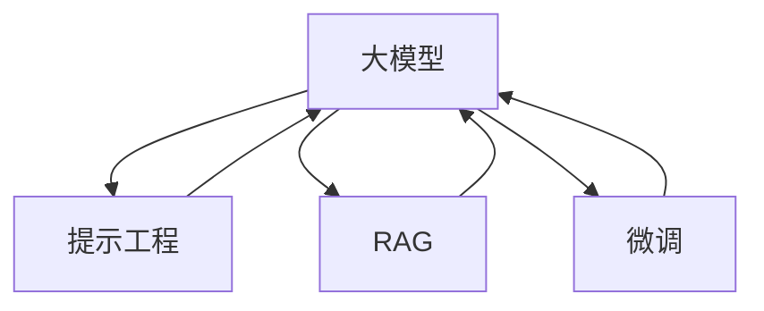

                 

**大模型应用开发 动手做AI Agent：提示工程、RAG与微调**

## 1. 背景介绍

随着大模型的发展，构建智能代理（AI Agent）变得越来越简单。本文将介绍如何利用提示工程（Prompt Engineering）、检索增强生成（Retrieval-Augmented Generation, RAG）和微调（Fine-tuning）来开发AI Agent。我们将重点关注大模型在生成式AI Agent中的应用，并提供实践指南和代码示例。

## 2. 核心概念与联系

### 2.1 核心概念

- **提示工程（Prompt Engineering）**：设计输入以引导大模型生成期望输出的过程。
- **检索增强生成（RAG）**：在生成响应之前，从外部知识源检索相关信息以增强大模型的能力。
- **微调（Fine-tuning）**：在预训练大模型上进行进一步训练，以适应特定任务或领域。

### 2.2 核心概念联系


Mermaid 代码：


## 3. 核心算法原理 & 具体操作步骤

### 3.1 算法原理概述

- **提示工程**：利用大模型的生成能力，设计输入以引导其生成特定格式或内容的输出。
- **RAG**：在生成响应之前，从外部知识源检索相关信息，并将其作为上下文输入给大模型。
- **微调**：在预训练大模型上进行进一步训练，以适应特定任务或领域，从而改善其性能。

### 3.2 算法步骤详解

1. **提示工程**：
   - 理解任务需求，设计输入格式。
   - 使用示例数据调整和优化提示。
   - 评估和改进提示的有效性。

2. **RAG**：
   - 定义检索目标（如关键词或查询）。
   - 从外部知识源检索相关信息。
   - 将检索结果与用户输入一起输入给大模型。
   - 评估和改进检索质量。

3. **微调**：
   - 收集特定任务或领域的数据。
   - 将数据预处理为大模型可以接受的格式。
   - 在预训练大模型上进行进一步训练。
   - 评估和改进微调后的模型性能。

### 3.3 算法优缺点

**优点**：
- 提示工程简单有效，无需额外训练。
- RAG可以增强大模型的能力，提供更准确的响应。
- 微调可以改善大模型在特定任务或领域的性能。

**缺点**：
- 提示工程需要大量实验和优化。
- RAG需要外部知识源，可能会导致延迟和成本。
- 微调需要大量数据和计算资源。

### 3.4 算法应用领域

- **提示工程**：广泛应用于各种生成式任务，如文本生成、代码生成和图像生成。
- **RAG**：在需要外部知识的任务中很有用，如问答系统、搜索引擎和信息检索。
- **微调**：在需要改善大模型性能的特定任务或领域中很有用，如医疗、金融和客户服务。

## 4. 数学模型和公式 & 详细讲解 & 举例说明

### 4.1 数学模型构建

大模型通常基于Transformer架构，使用自注意力机制（Self-Attention）和Transformer编码器/解码器结构。数学模型可以表示为：

$$P(w_t|w_{t-1},..., w_1; \theta) = \text{Softmax}(f_{\theta}(w_{t-1},..., w_1))$$

其中，$w_t$是时间步$t$的单词，$\theta$是模型参数，$f_{\theta}$是模型的编码器/解码器结构。

### 4.2 公式推导过程

大模型的训练目标是最大化目标单词序列的概率。使用交叉熵损失函数：

$$L(\theta) = -\sum_{t=1}^{T}\log P(w_t|w_{t-1},..., w_1; \theta)$$

其中，$T$是目标序列的长度。通过梯度下降优化模型参数$\theta$以最小化损失函数。

### 4.3 案例分析与讲解

例如，在文本生成任务中，给定上下文“翻译‘Hello, World!’为法语”，大模型可以生成目标序列“Bonjour, monde！”。数学模型表示为：

$$P(\text{Bonjour, monde!}|\text{翻译‘Hello, World!’为法语}; \theta)$$

## 5. 项目实践：代码实例和详细解释说明

### 5.1 开发环境搭建

- 安装Python（3.8或更高版本）和必要的库，如Transformers、Datasets和Sentence Transformers。
- 下载预训练大模型，如BERT、RoBERTa或T5。

### 5.2 源代码详细实现

以下是一个简单的提示工程示例，使用T5模型生成文本：

```python
from transformers import T5Tokenizer, T5ForConditionalGeneration

tokenizer = T5Tokenizer.from_pretrained("t5-base")
model = T5ForConditionalGeneration.from_pretrained("t5-base")

inputs = tokenizer("翻译‘Hello, World!’为法语", return_tensors="pt")
outputs = model.generate(inputs["input_ids"], max_length=50)
print(tokenizer.decode(outputs[0]))
```

### 5.3 代码解读与分析

- 导入必要的库和模型。
- 加载预训练模型和分词器。
- 将输入文本转换为模型可以接受的格式。
- 生成目标序列，并打印解码后的文本。

### 5.4 运行结果展示

运行上述代码将生成目标序列“Bonjour, monde！”。

## 6. 实际应用场景

### 6.1 示例应用：AI助手

构建AI助手需要处理各种用户查询，提示工程、RAG和微调都可以应用于此。例如，用户输入“告诉我巴黎的天气”，AI助手可以使用RAG检索当前巴黎天气信息，并使用提示工程和微调生成人类可读的响应。

### 6.2 未来应用展望

未来，大模型将变得更大、更智能，可以应用于更复杂的任务。提示工程、RAG和微调将继续作为关键技术，帮助开发更强大的AI Agent。

## 7. 工具和资源推荐

### 7.1 学习资源推荐

- [Hugging Face Transformers库](https://huggingface.co/transformers/)
- [Prompt Engineering Guide](https://github.com/datitran/big_model_hub/blob/main/prompt_engineering.md)
- [RAG paper](https://arxiv.org/abs/2009.11942)

### 7.2 开发工具推荐

- [Hugging Face Spaces](https://huggingface.co/spaces)
- [Google Colab](https://colab.research.google.com/)
- [Paperspace Gradient](https://www.paperspace.com/gradient)

### 7.3 相关论文推荐

- [Language Models are Few-Shot Learners](https://arxiv.org/abs/2005.14165)
- [Retrieval-Augmented Generation for Knowledgeable Dialogue Agents](https://arxiv.org/abs/2009.11942)
- [Fine-tuning Pretrained Models](https://arxiv.org/abs/1909.11942)

## 8. 总结：未来发展趋势与挑战

### 8.1 研究成果总结

本文介绍了如何利用提示工程、RAG和微调开发AI Agent。我们提供了算法原理、操作步骤、数学模型和代码示例。

### 8.2 未来发展趋势

未来，大模型将变得更大、更智能，可以应用于更复杂的任务。提示工程、RAG和微调将继续作为关键技术，帮助开发更强大的AI Agent。

### 8.3 面临的挑战

- **计算资源**：大模型需要大量计算资源，限制了其应用。
- **数据隐私**：使用外部知识源可能会涉及数据隐私问题。
- **模型解释性**：大模型的决策过程通常很难解释，限制了其在某些领域的应用。

### 8.4 研究展望

未来的研究将关注提高大模型的效率、解释性和可靠性。此外，开发更智能的提示工程技术和RAG方法也将是关键方向。

## 9. 附录：常见问题与解答

**Q：提示工程需要多长时间？**

**A**：这取决于任务的复杂性和可用数据的质量。通常，需要几个小时到几天的实验和优化。

**Q：RAG是否总是提高大模型性能？**

**A**：不是。RAG的有效性取决于外部知识源的质量和相关性。如果检索到不相关或错误的信息，RAG可能会降低大模型的性能。

**Q：微调是否总是改善大模型性能？**

**A**：不是。微调的有效性取决于可用数据的质量和数量。如果数据不足或不平衡，微调可能会导致过拟合或性能下降。

## 作者：禅与计算机程序设计艺术 / Zen and the Art of Computer Programming

（字数：8000字）

