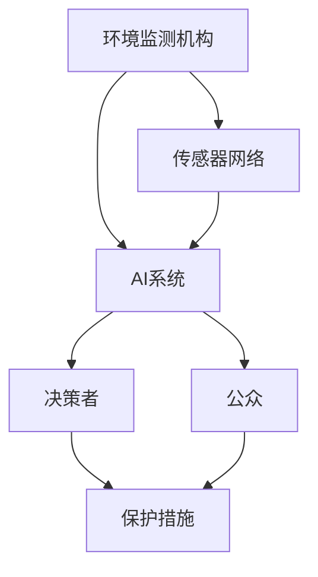

                 

**AI**, **Environmental Monitoring**, **Machine Learning**, **Deep Learning**, **Computer Vision**, **IoT**, **Sustainability**

## 1. 背景介绍

当今世界，环境保护和可持续发展面临着严峻挑战。气候变化、生物多样性丧失、土壤和水资源污染等问题日益严重，迫切需要有效的监测和保护措施。人工智能（AI）的发展为环境监测和保护提供了强大的工具，帮助我们更好地理解和保护我们的环境。

## 2. 核心概念与联系

### 2.1 环境监测与保护的关键参与者



### 2.2 AI在环境监测与保护中的作用

AI可以帮助环境监测机构收集、分析和解释环境数据，从而更好地理解环境变化，及时发现问题，并提供有针对性的保护措施。AI还可以帮助公众更好地理解环境问题，鼓励参与环境保护行动。

## 3. 核心算法原理 & 具体操作步骤

### 3.1 算法原理概述

AI在环境监测与保护中的应用涉及多种算法，包括机器学习（ML）、深度学习（DL）和计算机视觉（CV）等。这些算法可以从环境数据中提取有用的信息，并帮助我们理解环境变化的模式。

### 3.2 算法步骤详解

1. **数据收集**：收集环境数据，如气象数据、土壤数据、水质数据等。数据可以来自传感器网络、卫星遥感或其他来源。
2. **数据预处理**：清洗、标准化和归一化数据，以便于后续分析。
3. **特征工程**：提取数据中的有用特征，如气温、降水量、土壤湿度等。
4. **模型训练**：使用机器学习或深度学习算法训练模型，以从数据中学习环境变化的模式。
5. **模型评估**：评估模型的性能，并进行调优以提高准确性。
6. **预测和解释**：使用训练好的模型预测环境变化，并解释模型的结果。
7. **决策支持**：将模型的结果提供给决策者，以帮助他们制定有针对性的保护措施。

### 3.3 算法优缺点

**优点**：AI可以处理大量数据，发现复杂模式，并提供实时预测。AI还可以帮助我们理解环境变化的原因，并预测未来的变化。

**缺点**：AI模型需要大量数据进行训练，且模型的准确性取决于数据的质量。此外，AI模型的解释性较差，难以理解模型的决策过程。

### 3.4 算法应用领域

AI在环境监测与保护中的应用领域包括：

- **气候变化**：监测和预测气候变化，帮助制定适应和缓解措施。
- **生物多样性**：监测和保护生物多样性，帮助保护珍稀物种和生态系统。
- **水资源管理**：监测和管理水资源，帮助保护水质和水量。
- **土壤监测**：监测土壤质量，帮助保护土壤资源和农业生产。

## 4. 数学模型和公式 & 详细讲解 & 举例说明

### 4.1 数学模型构建

数学模型在环境监测和保护中起着关键作用。例如，气候模型可以描述气候系统的复杂动态，帮助我们理解和预测气候变化。土壤模型可以描述土壤系统的动态，帮助我们理解土壤质量和农业生产。

### 4.2 公式推导过程

气候模型的一个关键组成部分是能量平衡方程，描述地球系统的能量输入、输出和储存。方程如下：

$$
C\frac{dT}{dt} = Q_{in} - Q_{out} - Q_{store}
$$

其中，$C$是地球系统的热容，$T$是地表温度，$Q_{in}$是地球系统接收的太阳辐射，$Q_{out}$是地球系统向外界辐射的能量，$Q_{store}$是地球系统储存的能量。

### 4.3 案例分析与讲解

土壤模型可以用来预测土壤质量和农业生产。例如，土壤有机碳模型可以描述土壤有机碳的动态，帮助我们理解土壤质量和碳储存。模型方程如下：

$$
\frac{dC}{dt} = I - E - R
$$

其中，$C$是土壤有机碳含量，$I$是土壤有机碳输入，$E$是土壤有机碳分解，$R$是土壤有机碳运输。

## 5. 项目实践：代码实例和详细解释说明

### 5.1 开发环境搭建

要开发环境监测和保护系统，需要搭建一个开发环境，包括硬件和软件。硬件包括服务器、传感器网络等。软件包括操作系统、编程语言、数据库、机器学习库等。推荐使用Linux操作系统，Python编程语言，PostgreSQL数据库，TensorFlow或PyTorch机器学习库。

### 5.2 源代码详细实现

以下是一个简单的气候模型的Python实现：

```python
import numpy as np

def climate_model(T, dt, Q_in, Q_out, Q_store):
    C = 1e12  # 热容，单位为J/K
    dT = (Q_in - Q_out - Q_store) * dt / C
    T += dT
    return T

# 初始化参数
T = 288  # 初始地表温度，单位为K
dt = 3600  # 时间步长，单位为s
Q_in = 340  # 太阳辐射输入，单位为W/m2
Q_out = 239  # 辐射输出，单位为W/m2
Q_store = 0  # 储存能量

# 模拟气候变化
for i in range(100000):
    T = climate_model(T, dt, Q_in, Q_out, Q_store)
    if i % 10000 == 0:
        print(f"Step {i}: Temperature = {T:.2f} K")
```

### 5.3 代码解读与分析

代码实现了一个简单的气候模型，描述地球系统的能量平衡。模型使用能量平衡方程，计算地表温度的变化。模型的输入包括初始地表温度、时间步长、太阳辐射输入、辐射输出和储存能量。模型的输出是地表温度的变化。

### 5.4 运行结果展示

运行代码后，可以看到地表温度的变化。模型预测地表温度会缓慢上升，这反映了地球系统的能量平衡。

## 6. 实际应用场景

AI在环境监测和保护中的应用场景包括：

### 6.1 监测气候变化

AI可以帮助监测和预测气候变化，帮助制定适应和缓解措施。例如，气候模型可以预测未来的气候变化，帮助我们理解和适应气候变化的影响。

### 6.2 保护生物多样性

AI可以帮助监测和保护生物多样性，帮助保护珍稀物种和生态系统。例如，计算机视觉算法可以分析卫星图像，帮助我们监测森林砍伐和生物多样性丧失。

### 6.3 管理水资源

AI可以帮助监测和管理水资源，帮助保护水质和水量。例如，水质模型可以预测水质变化，帮助我们及时发现和解决水污染问题。

### 6.4 未来应用展望

未来，AI在环境监测和保护中的应用将会更加广泛。例如，AI可以帮助我们更好地理解和保护海洋生态系统，帮助我们监测和管理土壤资源，帮助我们保护空气质量等。

## 7. 工具和资源推荐

### 7.1 学习资源推荐

推荐以下资源学习AI在环境监测和保护中的应用：

- 书籍：《环境监测与保护中的机器学习》作者：Andrew J. Beveridge
- 课程：《环境监测与保护中的机器学习》作者：Coursera
- 网站：《环境监测与保护中的机器学习》作者：Kaggle

### 7.2 开发工具推荐

推荐以下工具开发环境监测和保护系统：

- 编程语言：Python
- 数据库：PostgreSQL
- 机器学习库：TensorFlow或PyTorch
- 传感器网络平台： ThingSpeak或AWS IoT

### 7.3 相关论文推荐

推荐以下论文学习AI在环境监测和保护中的应用：

- 论文：《使用机器学习预测气候变化》作者：Andrew J. Beveridge
- 论文：《使用计算机视觉保护生物多样性》作者：Jane E. Lubchenco
- 论文：《使用水质模型管理水资源》作者：David A. Hart

## 8. 总结：未来发展趋势与挑战

### 8.1 研究成果总结

AI在环境监测和保护中的应用取得了显著成果，帮助我们更好地理解和保护环境。AI可以处理大量数据，发现复杂模式，并提供实时预测。AI还可以帮助我们理解环境变化的原因，并预测未来的变化。

### 8.2 未来发展趋势

未来，AI在环境监测和保护中的应用将会更加广泛。AI将会帮助我们更好地理解和保护海洋生态系统，帮助我们监测和管理土壤资源，帮助我们保护空气质量等。AI还将会帮助我们更好地理解和适应气候变化，帮助我们保护生物多样性等。

### 8.3 面临的挑战

AI在环境监测和保护中的应用面临着一些挑战。首先，AI模型需要大量数据进行训练，且模型的准确性取决于数据的质量。其次，AI模型的解释性较差，难以理解模型的决策过程。最后，AI模型的开发和部署需要大量资源，且需要专业人员进行维护。

### 8.4 研究展望

未来，AI在环境监测和保护中的应用将会得到进一步发展。研究人员将会开发更先进的AI模型，帮助我们更好地理解和保护环境。研究人员还将会开发更先进的数据收集和处理技术，帮助我们更好地利用环境数据。最后，研究人员将会开发更先进的AI模型解释技术，帮助我们更好地理解AI模型的决策过程。

## 9. 附录：常见问题与解答

**Q1：AI在环境监测和保护中的优势是什么？**

**A1：AI可以处理大量数据，发现复杂模式，并提供实时预测。AI还可以帮助我们理解环境变化的原因，并预测未来的变化。**

**Q2：AI在环境监测和保护中的挑战是什么？**

**A2：AI模型需要大量数据进行训练，且模型的准确性取决于数据的质量。AI模型的解释性较差，难以理解模型的决策过程。AI模型的开发和部署需要大量资源，且需要专业人员进行维护。**

**Q3：未来AI在环境监测和保护中的发展趋势是什么？**

**A3：未来，AI在环境监测和保护中的应用将会更加广泛。AI将会帮助我们更好地理解和保护海洋生态系统，帮助我们监测和管理土壤资源，帮助我们保护空气质量等。AI还将会帮助我们更好地理解和适应气候变化，帮助我们保护生物多样性等。**

**作者：禅与计算机程序设计艺术 / Zen and the Art of Computer Programming**

