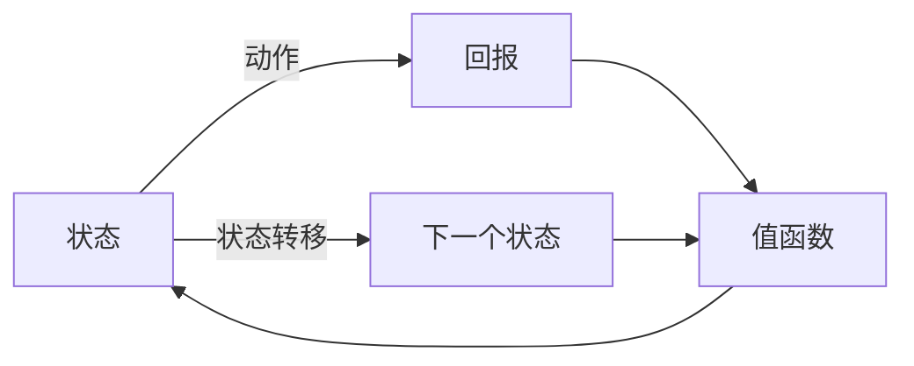

                 

**值函数**, **策略函数**, **深度强化学习**, **Bellman方程**, **Q学习**, **Policy Gradient**, **Actor-Critic方法**, **深度神经网络**

## 1. 背景介绍

强化学习是一种机器学习方法，它允许智能体在与环境交互的过程中学习一系列动作，以最大化某种形式的回报。深度强化学习（DRL）是强化学习的一个分支，它使用深度神经网络（DNN）来近似值函数或策略函数，从而提高学习效率和泛化能力。本文将详细介绍值函数与策略函数在深度强化学习中的作用，并讨论相关算法和数学模型。

## 2. 核心概念与联系

### 2.1 核心概念

- **值函数（Value Function）**: 给定状态和动作，预测未来回报的函数。常见的值函数包括状态值函数（$V^\pi(s)$）和动作值函数（$Q^\pi(s, a)$），其中$\pi$表示策略。
- **策略函数（Policy Function）**: 给定状态，选择动作的分布的函数。策略函数可以是确定性的（$\pi(a|s) = 1$ if $a = \pi(s)$ else $0$）或随机的（$\sum_a \pi(a|s) = 1$）。
- **Bellman方程**: 描述值函数与策略函数之间关系的数学方程。它是强化学习的基础，用于更新值函数和策略函数。

### 2.2 核心概念联系

值函数和策略函数是强化学习的两个关键组成部分。值函数用于评估策略的好坏，而策略函数则根据当前状态选择动作。Bellman方程则描述了它们之间的关系，如下所示：

$$
V^\pi(s) = \sum_a \pi(a|s) \sum_{s',r} P(s',r|s,a)[r + \gamma V^\pi(s')]
$$

其中，$P(s',r|s,a)$是状态转移概率，$r$是回报，$V^\pi(s')$是下一个状态的值函数，$0 < \gamma < 1$是折扣因子。



## 3. 核心算法原理 & 具体操作步骤

### 3.1 算法原理概述

强化学习算法可以分为两大类：基于值函数的方法和基于策略的方法。基于值函数的方法（如$Q$-学习）首先学习值函数，然后根据值函数选择动作。基于策略的方法（如Policy Gradient）直接学习策略函数。深度强化学习则使用深度神经网络来近似值函数或策略函数。

### 3.2 算法步骤详解

#### 3.2.1 $Q$-学习

1. 初始化$Q(s, a)$为任意值。
2. 重复以下步骤：
   - 从环境获取当前状态$s$。
   - 根据$\epsilon$-贪婪策略选择动作$a$。
   - 执行动作$a$并获取回报$r$和下一个状态$s'$。
   - 更新$Q(s, a)$：$Q(s, a) \leftarrow (1 - \alpha)Q(s, a) + \alpha(r + \gamma \max_{a'} Q(s', a'))$，其中$\alpha$是学习率。
   - 将当前状态$s$、动作$a$、回报$r$和下一个状态$s'$存入经验回放池。
   - 从经验回放池中随机抽取一批样本，并使用它们更新$Q(s, a)$。
3. 直到收敛。

#### 3.2.2 Policy Gradient

1. 初始化策略函数$\pi_\theta(a|s)$的参数$\theta$为任意值。
2. 重复以下步骤：
   - 从环境获取当前状态$s$。
   - 根据当前策略$\pi_\theta(a|s)$选择动作$a$。
   - 执行动作$a$并获取回报$r$和下一个状态$s'$。
   - 计算梯度：$\nabla_\theta J(\theta) = \mathbb{E}[\nabla_\theta \log \pi_\theta(a|s) \sum_{t=0}^{T-1} \gamma^t \nabla_\theta \log \pi_\theta(a_t|s_t) Q^\pi(s_t, a_t)]$，其中$J(\theta)$是预期回报，$Q^\pi(s_t, a_t)$是动作值函数。
   - 使用梯度下降更新参数$\theta$：$\theta \leftarrow \theta + \alpha \nabla_\theta J(\theta)$，其中$\alpha$是学习率。
3. 直到收敛。

### 3.3 算法优缺点

- **基于值函数的方法**优点：稳定、可靠，容易理解和实现。缺点：收敛慢，容易陷入局部最优。
- **基于策略的方法**优点：收敛快，可以避免局部最优。缺点：计算梯度复杂，容易过拟合。
- **深度强化学习**优点：可以处理高维状态空间，泛化能力强。缺点：计算资源消耗大，训练时间长。

### 3.4 算法应用领域

强化学习和深度强化学习已成功应用于许多领域，包括游戏（如AlphaGo）、机器人控制、自动驾驶、电力调度、金融投资等。它们还可以用于优化复杂系统的控制策略，如数据中心的能源管理和通信网络的流量控制。

## 4. 数学模型和公式 & 详细讲解 & 举例说明

### 4.1 数学模型构建

强化学习的数学模型包括状态转移概率$P(s',r|s,a)$、回报函数$r(s,a,s')$和折扣因子$\gamma$. 状态转移概率描述了环境的动态，回报函数定义了智能体的目标，折扣因子则控制了未来回报的重要性。

### 4.2 公式推导过程

#### 4.2.1 Bellman方程推导

Bellman方程可以通过动态规划的原理推导出来。给定当前状态$s$和动作$a$，未来回报可以表示为当前回报$r(s,a,s')$加上下一个状态的值函数$V(s')$的期望：

$$
V(s) = \sum_a \pi(a|s) \sum_{s',r} P(s',r|s,a)[r + \gamma V(s')]
$$

#### 4.2.2 Policy Gradient推导

Policy Gradient可以通过最大化预期回报$J(\theta)$来推导。预期回报可以表示为动作值函数$Q^\pi(s,a)$的期望：

$$
J(\theta) = \mathbb{E}[\sum_{t=0}^{T-1} \gamma^t Q^\pi(s_t, a_t)]
$$

动作值函数$Q^\pi(s,a)$可以表示为状态值函数$V^\pi(s)$和策略函数$\pi_\theta(a|s)$的期望：

$$
Q^\pi(s,a) = \sum_{s',r} P(s',r|s,a)[r + \gamma V^\pi(s')] = \sum_{s',r} P(s',r|s,a)[r + \gamma \mathbb{E}_{a' \sim \pi_\theta}[\pi_\theta(a'|s') Q^\pi(s',a')]]
$$

将上式代入预期回报的表达式中，并使用链式法则可以得到Policy Gradient的表达式：

$$
\nabla_\theta J(\theta) = \mathbb{E}[\nabla_\theta \log \pi_\theta(a|s) \sum_{t=0}^{T-1} \gamma^t \nabla_\theta \log \pi_\theta(a_t|s_t) Q^\pi(s_t, a_t)]
$$

### 4.3 案例分析与讲解

例如，在CartPole环境中，状态$s$包括杆的角度和角速度，动作$a$包括向左或向右的推力，回报$r$为每个时间步的回报，折扣因子$\gamma$为0.95。状态转移概率$P(s',r|s,a)$可以通过物理模型或经验回放池估计。值函数$V(s)$和策略函数$\pi_\theta(a|s)$可以使用深度神经网络近似。Bellman方程和Policy Gradient可以用于更新值函数和策略函数，从而学习最优策略。

## 5. 项目实践：代码实例和详细解释说明

### 5.1 开发环境搭建

强化学习和深度强化学习项目需要以下软件和库：

- Python 3.6+
- TensorFlow 2.0+或PyTorch 1.0+
- Gym 0.10.5+
- NumPy 1.16.2+
- Matplotlib 3.1.1+

### 5.2 源代码详细实现

以下是使用TensorFlow实现$Q$-学习和Policy Gradient的示例代码。

**$Q$-学习**

```python
import numpy as np
import tensorflow as tf
from tensorflow.keras import layers
import gym

# 环境初始化
env = gym.make('CartPole-v0')

# 超参数设置
learning_rate = 0.01
discount_factor = 0.95
epsilon = 1.0
epsilon_decay = 0.995
epsilon_min = 0.01
num_episodes = 1000

# 状态空间和动作空间大小
state_space = env.observation_space.shape[0]
action_space = env.action_space.n

# 创建Q网络
model = tf.keras.Sequential([
    layers.Dense(24, activation='relu', input_shape=(state_space,)),
    layers.Dense(24, activation='relu'),
    layers.Dense(action_space, activation='linear')
])
model.compile(optimizer=tf.keras.optimizers.Adam(learning_rate), loss='mse')

# 经验回放池
replay_buffer = []

# 训练
for episode in range(num_episodes):
    state = env.reset()
    done = False
    total_reward = 0

    while not done:
        # 选择动作
        if np.random.uniform(0, 1) < epsilon:
            action = env.action_space.sample()
        else:
            action = np.argmax(model.predict(state.reshape(1, -1)))

        # 执行动作并获取回报
        next_state, reward, done, _ = env.step(action)
        total_reward += reward

        # 存储经验
        replay_buffer.append((state, action, reward, next_state, done))
        if len(replay_buffer) > 1000:
            replay_buffer.pop(0)

        # 更新Q网络
        if len(replay_buffer) > 32:
            batch = np.random.choice(len(replay_buffer), 32)
            states, actions, rewards, next_states, dones = zip(*[replay_buffer[i] for i in batch])
            targets = model.predict(states)
            next_q_values = model.predict(next_states)
            for i in range(32):
                targets[i, actions[i]] = rewards[i] + discount_factor * (1 - dones[i]) * np.max(next_q_values[i])
            model.fit(states, targets, epochs=1, verbose=0)

        # 更新epsilon
        if epsilon > epsilon_min:
            epsilon *= epsilon_decay

        state = next_state

    print(f'Episode {episode + 1}: Total Reward = {total_reward}')
```

**Policy Gradient**

```python
import numpy as np
import tensorflow as tf
from tensorflow.keras import layers
import gym

# 环境初始化
env = gym.make('CartPole-v0')

# 超参数设置
learning_rate = 0.01
discount_factor = 0.95
num_episodes = 1000

# 状态空间和动作空间大小
state_space = env.observation_space.shape[0]
action_space = env.action_space.n

# 创建策略网络
model = tf.keras.Sequential([
    layers.Dense(24, activation='relu', input_shape=(state_space,)),
    layers.Dense(24, activation='relu'),
    layers.Dense(action_space, activation='softmax')
])
model.compile(optimizer=tf.keras.optimizers.Adam(learning_rate), loss='categorical_crossentropy')

# 训练
for episode in range(num_episodes):
    state = env.reset()
    done = False
    total_reward = 0
    log_probs = []
    values = []

    while not done:
        # 选择动作
        action_probs = model.predict(state.reshape(1, -1))
        action = np.random.choice(action_space, p=action_probs[0])

        # 执行动作并获取回报
        next_state, reward, done, _ = env.step(action)
        total_reward += reward

        # 存储日志概率和值函数
        log_probs.append(np.log(action_probs[0, action]))
        values.append(model.predict(state.reshape(1, -1))[0, 0])

        state = next_state

    # 计算梯度并更新策略网络
    discounted_rewards = np.array([total_reward] * len(values)) * np.power(discount_factor, np.arange(len(values))[::-1])
    discounted_rewards -= np.mean(discounted_rewards)
    discounted_rewards /= np.std(discounted_rewards)
    gradients = np.array(values) * discounted_rewards
    gradients -= np.mean(gradients)
    gradients /= np.std(gradients)
    model.fit(state.reshape(1, -1), [gradients], epochs=1, verbose=0)

    print(f'Episode {episode + 1}: Total Reward = {total_reward}')
```

### 5.3 代码解读与分析

**$Q$-学习**代码使用经验回放池存储状态、动作、回报、下一个状态和结束标志，并使用随机梯度下降更新Q网络。epsilon贪婪策略用于平衡探索和利用，epsilon随着训练过程线性衰减。

**Policy Gradient**代码使用策略网络直接学习策略函数。它存储每个时间步的日志概率和值函数，然后使用梯度下降更新策略网络。梯度计算使用了REINFORCE算法，它将回报乘以日志概率，然后除以回报的标准差。

### 5.4 运行结果展示

运行上述代码后，智能体将学习控制CartPole的最优策略。训练过程中，智能体的表现将不断改善，直到它能够稳定地控制CartPole。训练结束后，智能体的表现将保持稳定，不会退化。

## 6. 实际应用场景

强化学习和深度强化学习已成功应用于许多实际应用场景，包括：

- **游戏**：AlphaGo使用深度强化学习击败了围棋世界冠军李世石。
- **机器人控制**：DeepMind使用深度强化学习训练了一个虚拟机器人，它可以学习各种任务，如开门、接电话和使用工具。
- **自动驾驶**：Waymo使用深度强化学习训练了自动驾驶系统，它可以学习复杂的驾驶策略，如在高速公路上超车和在城市环境中行驶。
- **电力调度**：IBM使用强化学习优化了电网调度，从而提高了电网的效率和可靠性。
- **金融投资**：JPMorgan使用强化学习优化了交易策略，从而提高了交易的效率和收益。

## 7. 工具和资源推荐

### 7.1 学习资源推荐

- **书籍**
  - "Reinforcement Learning: An Introduction" by Richard S. Sutton and Andrew G. Barto
  - "Deep Reinforcement Learning Hands-On" by Maxim Lapan
- **在线课程**
  - "Reinforcement Learning" by Andrew Ng on Coursera
  - "Deep Reinforcement Learning Specialization" by Andrew Ng on Coursera
- **博客和论文**
  - [DeepMind's blog](https://deepmind.com/blog)
  - [arXiv's reinforcement learning papers](https://arxiv.org/list/cs.LG/recent)

### 7.2 开发工具推荐

- **Python库**
  - TensorFlow
  - PyTorch
  - Gym
  - Stable Baselines3
  - RLlib
- **集成开发环境（IDE）**
  - PyCharm
  - Jupyter Notebook
  - Google Colab

### 7.3 相关论文推荐

- [Human-level control through deep reinforcement learning](https://arxiv.org/abs/1507.01350) by DeepMind
- [Asynchronous methods for deep reinforcement learning](https://arxiv.org/abs/1708.02260) by DeepMind
- [Proximal policy optimization algorithms](https://arxiv.org/abs/1707.06347) by Schulman et al.
- [Soft actor-critic: Off-policy maximum entropy deep reinforcement learning with a stochastic actor](https://arxiv.org/abs/1801.01290) by Haarnoja et al.

## 8. 总结：未来发展趋势与挑战

### 8.1 研究成果总结

强化学习和深度强化学习取得了显著的研究成果，包括AlphaGo击败围棋世界冠军、DeepMind的虚拟机器人学习各种任务和Waymo的自动驾驶系统。这些成果展示了强化学习和深度强化学习的巨大潜力。

### 8.2 未来发展趋势

未来，强化学习和深度强化学习将继续发展，并可能出现以下趋势：

- **多智能体系统**：多智能体系统是指多个智能体共享环境的强化学习系统。未来，强化学习将需要处理更复杂的多智能体系统，如自动驾驶汽车和无人机编队。
- **模型驱动的强化学习**：模型驱动的强化学习是指使用模型预测环境的动态，从而优化策略的强化学习方法。未来，强化学习将需要处理更复杂的环境，如不确定性和模糊性更强的环境。
- **元学习**：元学习是指学习如何学习的强化学习方法。未来，强化学习将需要处理更多的任务和环境，从而需要学习如何适应新的任务和环境。

### 8.3 面临的挑战

强化学习和深度强化学习仍然面临着许多挑战，包括：

- **样本效率**：强化学习需要大量的样本才能收敛，这限制了其在真实世界中的应用。未来，需要开发更高效的强化学习算法，以提高样本效率。
- **泛化能力**：强化学习算法通常只能在训练环境中表现出色，在新环境中表现不佳。未来，需要开发更泛化的强化学习算法，以适应新环境。
- **解释性**：强化学习算法通常是黑箱，难以解释其决策过程。未来，需要开发更解释性的强化学习算法，以便于理解和信任。

### 8.4 研究展望

未来，强化学习和深度强化学习的研究将继续关注样本效率、泛化能力和解释性等挑战。此外，研究还将关注多智能体系统、模型驱动的强化学习和元学习等前沿领域。强化学习和深度强化学习的进一步发展将推动人工智能在更多领域的应用，如自动驾驶、医疗保健和能源管理。

## 9. 附录：常见问题与解答

**Q1：强化学习和监督学习有什么区别？**

A1：强化学习和监督学习是两种不同的机器学习方法。监督学习需要大量的标记数据来训练模型，而强化学习则需要智能体与环境交互来学习策略。此外，强化学习的目标是最大化未来回报，而监督学习的目标是最小化预测误差。

**Q2：什么是经验回放池？**

A2：经验回放池是一种存储智能体与环境交互数据的数据结构。它用于存储状态、动作、回报和下一个状态等信息，并用于更新值函数或策略函数。经验回放池可以帮助强化学习算法提高样本效率和稳定性。

**Q3：什么是Bellman方程？**

A3：Bellman方程是强化学习的基础方程，它描述了值函数与策略函数之间的关系。它可以用于更新值函数或策略函数，从而学习最优策略。Bellman方程有两种形式：状态值函数形式和动作值函数形式。

**Q4：什么是Policy Gradient？**

A4：Policy Gradient是一种基于策略的强化学习方法，它直接学习策略函数。它使用梯度下降更新策略函数，以最大化预期回报。Policy Gradient有两种形式：REINFORCE算法和Actor-Critic方法。

**Q5：什么是深度强化学习？**

A5：深度强化学习是一种使用深度神经网络近似值函数或策略函数的强化学习方法。它可以处理高维状态空间和动作空间，并具有良好的泛化能力。深度强化学习的代表算法包括Deep Q-Network（DQN）和Proximal Policy Optimization（PPO）。

## 作者：禅与计算机程序设计艺术 / Zen and the Art of Computer Programming

