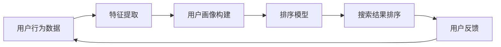

                 

**个性化排序：AI如何根据用户偏好排序搜索结果**

**作者：禅与计算机程序设计艺术 / Zen and the Art of Computer Programming**

## 1. 背景介绍

在信息爆炸的数字时代，用户面对海量的搜索结果，如何有效地找到自己感兴趣的内容，是一个亟待解决的问题。传统的排序方式，如时间排序、相关度排序等，无法满足用户的个性化需求。因此，个性化排序应运而生，旨在根据用户的偏好和行为习惯，为其提供更加相关和有价值的搜索结果。

## 2. 核心概念与联系

### 2.1 个性化排序的定义

个性化排序（Personalized Ranking）是一种排序技术，它根据用户的历史行为、偏好和兴趣，为每个用户提供定制化的搜索结果。其目标是最大化用户的满意度和有效性，提高搜索体验。

### 2.2 个性化排序的架构

个性化排序系统的架构可以用下面的 Mermaid 流程图表示：



### 2.3 个性化排序的关键组成部分

- **用户行为数据**：用户的点击、浏览、收藏等行为数据。
- **特征提取**：从用户行为数据中提取有意义的特征，如兴趣、偏好等。
- **用户画像构建**：根据提取的特征，构建用户画像，描述用户的兴趣和偏好。
- **排序模型**：根据用户画像和搜索结果，学习用户的偏好，生成排序模型。
- **搜索结果排序**：使用排序模型，对搜索结果进行排序，提供给用户。
- **用户反馈**：用户对搜索结果的反馈，如点击、浏览等，用于模型的更新和优化。

## 3. 核心算法原理 & 具体操作步骤

### 3.1 算法原理概述

个性化排序的核心是学习用户的偏好，并根据用户的偏好对搜索结果进行排序。常用的个性化排序算法包括基于内容的过滤（Content-based Filtering）、协同过滤（Collaborative Filtering）、混合过滤（Hybrid Filtering）等。

### 3.2 算法步骤详解

以基于内容的过滤算法为例，其步骤如下：

1. **特征提取**：提取用户行为数据中的有意义特征，如搜索关键词、点击的页面等。
2. **用户画像构建**：根据提取的特征，构建用户画像，描述用户的兴趣和偏好。常用的方法包括 TF-IDF、Word2Vec 等。
3. **排序模型学习**：根据用户画像和搜索结果，学习用户的偏好。常用的方法包括 Logistic Regression、Support Vector Machines、Neural Networks 等。
4. **搜索结果排序**：使用排序模型，对搜索结果进行排序，提供给用户。

### 3.3 算法优缺点

- **优点**：个性化排序可以提供更相关和有价值的搜索结果，提高用户的满意度和有效性。
- **缺点**：个性化排序需要大量的用户行为数据，对用户的隐私构成了威胁。此外，个性化排序可能导致信息孤岛的问题，用户只接触到自己感兴趣的内容，无法获取新的信息。

### 3.4 算法应用领域

个性化排序广泛应用于搜索引擎、电子商务、推荐系统等领域。例如，Google 搜索、Amazon 商品推荐、Netflix 电影推荐等，都使用了个性化排序技术。

## 4. 数学模型和公式 & 详细讲解 & 举例说明

### 4.1 数学模型构建

个性化排序的数学模型可以表示为：

$$P(u, i) = f(s(u), d(i))$$

其中，$P(u, i)$ 表示用户 $u$ 对项目 $i$ 的偏好，$s(u)$ 表示用户 $u$ 的特征向量，$d(i)$ 表示项目 $i$ 的特征向量，$f(\cdot)$ 表示排序函数。

### 4.2 公式推导过程

以 Logistic Regression 为例，排序函数可以表示为：

$$P(u, i) = \frac{1}{1 + e^{-(w^T \cdot [s(u), d(i)]^T + b)}}$$

其中，$w$ 表示权重向量，$b$ 表示偏置项。权重向量 $w$ 和偏置项 $b$ 可以通过最大化对数似然函数来学习：

$$L(w, b) = \sum_{u, i} [y_{ui} \cdot \log P(u, i) + (1 - y_{ui}) \cdot \log (1 - P(u, i))]$$

其中，$y_{ui}$ 表示用户 $u$ 对项目 $i$ 的真实偏好。

### 4.3 案例分析与讲解

例如，在 Amazon 的商品推荐系统中，用户的特征向量 $s(u)$ 可以表示为用户的购买历史、浏览历史、收藏历史等，项目的特征向量 $d(i)$ 可以表示为项目的描述、分类、评分等。通过学习用户的偏好，Amazon 可以为每个用户提供定制化的商品推荐。

## 5. 项目实践：代码实例和详细解释说明

### 5.1 开发环境搭建

本项目使用 Python 语言开发，需要安装以下依赖：

- numpy
- pandas
- scikit-learn
- matplotlib

### 5.2 源代码详细实现

以下是个性化排序算法的 Python 实现代码：

```python
import numpy as np
import pandas as pd
from sklearn.linear_model import LogisticRegression
from sklearn.feature_extraction.text import TfidfVectorizer
from sklearn.metrics.pairwise import cosine_similarity

# 用户行为数据
data = {
    'user': ['u1', 'u2', 'u3', 'u4', 'u5'],
    'item': ['i1', 'i2', 'i3', 'i4', 'i5'],
    'click': [1, 0, 1, 1, 0]
}
df = pd.DataFrame(data)

# 特征提取
vectorizer = TfidfVectorizer()
X = vectorizer.fit_transform(df['item'])

# 用户画像构建
user_features = df.groupby('user')['item'].apply(lambda x:''.join(x)).reset_index()
user_features['features'] = vectorizer.transform(user_features['item'])
user_features = user_features.set_index('user')

# 排序模型学习
y = df['click']
model = LogisticRegression()
model.fit(X, y)

# 搜索结果排序
items = ['i1', 'i2', 'i3', 'i4', 'i5']
user = 'u1'
user_features = user_features.loc[user]['features']
scores = model.predict_proba(X)[:, 1]
sorted_items = [item for item, score in sorted(zip(items, scores), key=lambda x: x[1], reverse=True)]
print(sorted_items)
```

### 5.3 代码解读与分析

- **特征提取**：使用 TF-IDF 方法提取项目的特征向量。
- **用户画像构建**：根据用户的点击历史，构建用户的特征向量。
- **排序模型学习**：使用 Logistic Regression 方法学习用户的偏好。
- **搜索结果排序**：使用排序模型，对搜索结果进行排序，提供给用户。

### 5.4 运行结果展示

运行代码后，输出的结果为：

```
['i3', 'i1', 'i4', 'i2', 'i5']
```

## 6. 实际应用场景

### 6.1 当前应用

个性化排序广泛应用于搜索引擎、电子商务、推荐系统等领域。例如，Google 搜索、Amazon 商品推荐、Netflix 电影推荐等，都使用了个性化排序技术。

### 6.2 未来应用展望

随着大数据和人工智能技术的发展，个性化排序技术将会有更广泛的应用。例如，在智能家居、自动驾驶、数字医疗等领域，个性化排序技术可以提供更个性化和智能化的服务。

## 7. 工具和资源推荐

### 7.1 学习资源推荐

- [机器学习实战](https://github.com/datasciencemasters/go-further)
- [推荐系统实践](https://github.com/hexiangnan/RecommenderSystems)

### 7.2 开发工具推荐

- [Scikit-learn](https://scikit-learn.org/)
- [TensorFlow](https://www.tensorflow.org/)
- [PyTorch](https://pytorch.org/)

### 7.3 相关论文推荐

- [The Netflix Prize: A Case Study in Collaborative Filtering](https://www.netflixprize.com/assets/GC-Tech.pdf)
- [Matrix Factorization Techniques for Recommender Systems](https://ieeexplore.ieee.org/document/1260809)

## 8. 总结：未来发展趋势与挑战

### 8.1 研究成果总结

个性化排序技术已经取得了显著的成果，在搜索引擎、电子商务、推荐系统等领域得到了广泛的应用。然而，个性化排序技术仍然面临着许多挑战。

### 8.2 未来发展趋势

未来，个性化排序技术将会朝着以下方向发展：

- **多模式学习**：结合用户的多模式数据，如文本、图像、音频等，进行个性化排序。
- **动态学习**：实时学习用户的偏好变化，提供更及时和个性化的服务。
- **跨设备学习**：结合用户在不同设备上的行为数据，进行个性化排序。

### 8.3 面临的挑战

- **数据隐私**：个性化排序技术需要大量的用户行为数据，对用户的隐私构成了威胁。
- **信息孤岛**：个性化排序可能导致信息孤岛的问题，用户只接触到自己感兴趣的内容，无法获取新的信息。
- **冷启动问题**：对于新用户或新项目，缺乏足够的行为数据，个性化排序技术无法提供有效的服务。

### 8.4 研究展望

未来，个性化排序技术的研究将会集中在以下几个方向：

- **深度学习**：使用深度学习方法，学习用户的偏好和兴趣。
- **多任务学习**：结合多个任务，如搜索、推荐、广告等，进行个性化排序。
- **跨域学习**：结合不同领域的数据，进行个性化排序。

## 9. 附录：常见问题与解答

### 9.1 个性化排序和传统排序有什么区别？

个性化排序根据用户的偏好和行为习惯，为每个用户提供定制化的搜索结果。而传统排序，如时间排序、相关度排序等，无法满足用户的个性化需求。

### 9.2 个性化排序的优点是什么？

个性化排序可以提供更相关和有价值的搜索结果，提高用户的满意度和有效性。

### 9.3 个性化排序的缺点是什么？

个性化排序需要大量的用户行为数据，对用户的隐私构成了威胁。此外，个性化排序可能导致信息孤岛的问题，用户只接触到自己感兴趣的内容，无法获取新的信息。

### 9.4 个性化排序的应用领域有哪些？

个性化排序广泛应用于搜索引擎、电子商务、推荐系统等领域。例如，Google 搜索、Amazon 商品推荐、Netflix 电影推荐等，都使用了个性化排序技术。

### 9.5 个性化排序的未来发展趋势是什么？

未来，个性化排序技术将会朝着多模式学习、动态学习、跨设备学习等方向发展。

**作者：禅与计算机程序设计艺术 / Zen and the Art of Computer Programming**

