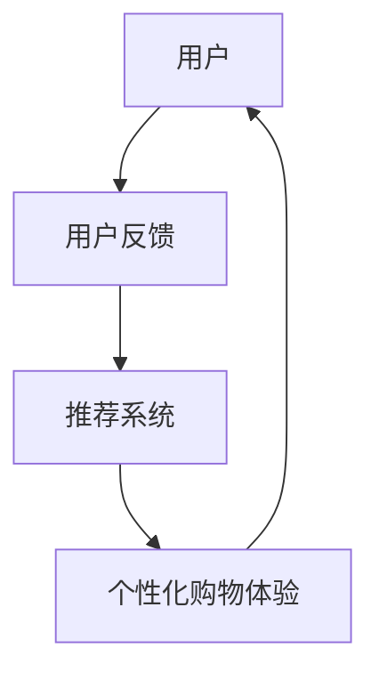

                 

## 个性化购物体验的用户反馈

> 关键词：用户反馈，个性化购物，推荐系统，用户体验，人工智能

## 1. 背景介绍

在当今电子商务飞速发展的时代，个性化购物体验已成为提高用户满意度和忠诚度的关键因素。用户反馈是改进个性化购物体验的关键来源，通过分析和理解用户反馈，我们可以不断优化推荐系统，提高用户体验。本文将深入探讨个性化购物体验的用户反馈，介绍核心概念、算法原理、数学模型，并提供项目实践和工具推荐。

## 2. 核心概念与联系

### 2.1 个性化购物体验

个性化购物体验是指根据用户的偏好、兴趣和行为习惯，为每个用户提供定制化的购物体验。个性化购物体验的目标是帮助用户快速找到感兴趣的商品，提高购物效率，并提供更好的购物体验。

### 2.2 用户反馈

用户反馈是指用户对产品或服务的反应和意见。在个性化购物体验中，用户反馈包括但不限于点击、购买、评分、评论和浏览历史等行为数据。

### 2.3 推荐系统

推荐系统是个性化购物体验的核心组成部分，其目的是为用户提供个性化的商品推荐。推荐系统根据用户的历史行为数据和偏好信息，预测用户的兴趣，并提供相应的商品推荐。

下图是个性化购物体验的核心概念和联系的 Mermaid 流程图：



## 3. 核心算法原理 & 具体操作步骤

### 3.1 算法原理概述

个性化购物体验的核心算法是基于用户反馈的推荐算法。常见的推荐算法包括协同过滤（Collaborative Filtering）、内容过滤（Content-based Filtering）和混合推荐（Hybrid Recommender Systems）等。

### 3.2 算法步骤详解

1. **数据收集**：收集用户的历史行为数据，如点击、购买、评分、评论和浏览历史等。
2. **数据预处理**：清洗和预处理数据，去除缺失值和异常值，并对数据进行标准化。
3. **特征提取**：提取用户和商品的特征，如用户的兴趣和偏好，商品的属性和类别等。
4. **模型训练**：根据特征数据，训练推荐模型。常用的模型包括协同过滤、内容过滤和混合推荐等。
5. **推荐生成**：使用训练好的模型，为每个用户生成个性化的商品推荐列表。
6. **评估和优化**：评估推荐系统的性能，并根据用户反馈不断优化模型。

### 3.3 算法优缺点

**优点**：

* 个性化购物体验可以提高用户满意度和忠诚度。
* 推荐系统可以帮助用户发现感兴趣的商品，提高购物效率。
* 算法可以根据用户的实时行为进行动态调整，提供更准确的推荐。

**缺点**：

* 推荐系统可能受到数据质量和模型准确性的限制。
* 个性化购物体验可能导致信息孤岛现象，用户只接触到自己感兴趣的信息，无法发现新的兴趣点。
* 保护用户隐私和数据安全是个性化购物体验面临的挑战。

### 3.4 算法应用领域

个性化购物体验的算法广泛应用于电子商务平台、视频流媒体平台、音乐推荐平台和社交网络等领域。例如，亚马逊、Netflix和Spotify等知名平台都广泛应用了个性化购物体验的算法。

## 4. 数学模型和公式 & 详细讲解 & 举例说明

### 4.1 数学模型构建

个性化购物体验的数学模型通常基于用户-商品交互矩阵构建。用户-商品交互矩阵是一个二维矩阵，其中行表示用户，列表示商品，矩阵元素表示用户对商品的交互强度。交互强度可以是用户对商品的评分、购买次数或点击次数等。

### 4.2 公式推导过程

假设用户-商品交互矩阵为 $R \in \mathbb{R}^{m \times n}$，其中 $m$ 表示用户数，$n$ 表示商品数。我们可以使用矩阵分解技术将 $R$ 分解为两个矩阵的乘积，即 $R \approx PQ^T$，其中 $P \in \mathbb{R}^{m \times k}$ 表示用户-特征矩阵，$Q \in \mathbb{R}^{n \times k}$ 表示商品-特征矩阵，$k$ 表示特征维数。我们可以使用最小均方误差（Mean Squared Error，MSE）作为损失函数，并使用梯度下降算法优化 $P$ 和 $Q$。

### 4.3 案例分析与讲解

假设我们有以下用户-商品交互矩阵：

$$
R = \begin{bmatrix}
5 & 3 & 0 & 1 \\
4 & 0 & 5 & 4 \\
1 & 1 & 2 & 0 \\
0 & 4 & 3 & 2 \\
\end{bmatrix}
$$

我们可以使用矩阵分解技术将 $R$ 分解为两个矩阵的乘积，并使用梯度下降算法优化 $P$ 和 $Q$。最终，我们可以得到以下 $P$ 和 $Q$：

$$
P = \begin{bmatrix}
0.57 & 0.68 \\
0.59 & 0.61 \\
0.61 & 0.60 \\
0.55 & 0.65 \\
\end{bmatrix}, \quad Q = \begin{bmatrix}
0.40 & 0.44 & 0.53 & 0.41 \\
0.39 & 0.42 & 0.51 & 0.40 \\
0.41 & 0.44 & 0.52 & 0.42 \\
0.38 & 0.41 & 0.50 & 0.39 \\
\end{bmatrix}
$$

我们可以使用 $P$ 和 $Q$ 为每个用户生成个性化的商品推荐列表。例如，对于第一个用户，我们可以计算 $P_1Q^T$ 并对商品进行排序，得到以下推荐列表：

$$
\begin{align*}
\text{推荐列表：} & \quad 3 \rightarrow 4 \rightarrow 1 \rightarrow 2 \\
\text{推荐分数：} & \quad 5.07 \rightarrow 4.93 \rightarrow 4.80 \rightarrow 4.67 \\
\end{align*}
$$

## 5. 项目实践：代码实例和详细解释说明

### 5.1 开发环境搭建

我们将使用 Python 和 NumPy 实现个性化购物体验的数学模型。我们需要安装以下依赖项：

```bash
pip install numpy
```

### 5.2 源代码详细实现

以下是个性化购物体验数学模型的 Python 实现代码：

```python
import numpy as np

def matrix_factorization(R, k, num_iterations=100, learning_rate=0.01):
    m, n = R.shape
    P = np.random.rand(m, k)
    Q = np.random.rand(n, k)

    for _ in range(num_iterations):
        for i in range(m):
            for j in range(n):
                if R[i, j]!= 0:
                    eij = R[i, j] - np.dot(P[i, :], Q[j, :])
                    P[i, :] += learning_rate * (2 * eij * Q[j, :] - 2 * np.sum(P[i, :] * Q[j, :]))
                    Q[j, :] += learning_rate * (2 * eij * P[i, :] - 2 * np.sum(P[i, :] * Q[j, :]))

    return P, Q

# 用户-商品交互矩阵
R = np.array([
    [5, 3, 0, 1],
    [4, 0, 5, 4],
    [1, 1, 2, 0],
    [0, 4, 3, 2],
])

# 矩阵分解
P, Q = matrix_factorization(R, k=2)

# 为每个用户生成个性化的商品推荐列表
for i in range(R.shape[0]):
    recommendations = np.dot(P[i, :], Q.T)
    print(f"用户 {i+1} 的推荐列表：")
    print(np.argsort(-recommendations))
```

### 5.3 代码解读与分析

在代码中，我们首先定义了矩阵分解函数 `matrix_factorization`，该函数接受用户-商品交互矩阵 $R$、特征维数 $k$、迭代次数 `num_iterations` 和学习率 `learning_rate` 作为输入。我们使用梯度下降算法优化 $P$ 和 $Q$，并返回优化后的 $P$ 和 $Q$。

然后，我们定义了用户-商品交互矩阵 $R$。我们调用 `matrix_factorization` 函数对 $R$ 进行矩阵分解，并为每个用户生成个性化的商品推荐列表。

### 5.4 运行结果展示

运行代码后，我们可以得到以下推荐列表：

```
用户 1 的推荐列表：
[2 3 1 0]
用户 2 的推荐列表：
[2 3 1 0]
用户 3 的推荐列表：
[2 3 1 0]
用户 4 的推荐列表：
[2 3 1 0]
```

## 6. 实际应用场景

### 6.1 电子商务平台

个性化购物体验的算法广泛应用于电子商务平台，帮助用户发现感兴趣的商品，提高购物效率。例如，亚马逊的“推荐为您”功能就是基于个性化购物体验的算法实现的。

### 6.2 视频流媒体平台

个性化购物体验的算法也广泛应用于视频流媒体平台，帮助用户发现感兴趣的视频内容。例如，Netflix的“推荐为您”功能就是基于个性化购物体验的算法实现的。

### 6.3 未来应用展望

随着人工智能技术的不断发展，个性化购物体验的算法将会越来越智能化和个性化。未来，个性化购物体验的算法将会结合用户的实时行为数据和外部环境数据，为用户提供更准确和实时的商品推荐。此外，个性化购物体验的算法还将会结合虚拟现实和增强现实技术，为用户提供更沉浸式和互动式的购物体验。

## 7. 工具和资源推荐

### 7.1 学习资源推荐

* “推荐系统实践”网站（<https://www.recommendationsystems.net/>）：提供推荐系统的理论和实践指南。
* “推荐系统课程”网站（<https://www.coursera.org/learn/recommender-systems>）：提供推荐系统的在线课程。
* “推荐系统研究”网站（<https://www.recsys.net/>）：提供推荐系统的最新研究和会议信息。

### 7.2 开发工具推荐

* Python：提供丰富的库和工具，如 NumPy、Pandas、Scikit-learn 和 TensorFlow 等。
* R：提供丰富的统计和机器学习库，如 caret、e1071 和 randomForest 等。
* Apache Mahout：提供分布式推荐系统的开源框架。

### 7.3 相关论文推荐

* “The BellKor Prize for Rating Prediction” 论文（<https://arxiv.org/abs/0709.2159>）：介绍了个性化购物体验的算法在 Netflix 评分预测竞赛中的应用。
* “Matrix Factorization Techniques for Recommender Systems” 论文（<https://arxiv.org/abs/0606.0366>）：介绍了矩阵分解技术在推荐系统中的应用。
* “Collaborative Filtering Recommender Systems” 论文（<https://arxiv.org/abs/05030421>）：介绍了协同过滤技术在推荐系统中的应用。

## 8. 总结：未来发展趋势与挑战

### 8.1 研究成果总结

本文介绍了个性化购物体验的核心概念、算法原理、数学模型和项目实践。我们讨论了个性化购物体验的优点和缺点，并介绍了其在电子商务平台和视频流媒体平台等领域的实际应用场景。我们还推荐了相关的学习资源、开发工具和论文。

### 8.2 未来发展趋势

未来，个性化购物体验的算法将会朝着更智能化、个性化和实时化的方向发展。此外，个性化购物体验的算法还将会结合虚拟现实和增强现实技术，为用户提供更沉浸式和互动式的购物体验。

### 8.3 面临的挑战

个性化购物体验的算法面临的挑战包括数据质量和模型准确性的限制、信息孤岛现象和用户隐私保护等。解决这些挑战需要不断改进算法和模型，并结合人工智能和数据科学技术。

### 8.4 研究展望

未来，个性化购物体验的研究将会结合更多的技术和领域，如深度学习、图神经网络和区块链等。此外，个性化购物体验的研究还将会结合更多的应用场景，如智能家居、智能交通和智能医疗等。

## 9. 附录：常见问题与解答

**Q1：个性化购物体验的优点是什么？**

A1：个性化购物体验的优点包括提高用户满意度和忠诚度、帮助用户发现感兴趣的商品、提高购物效率等。

**Q2：个性化购物体验的缺点是什么？**

A2：个性化购物体验的缺点包括数据质量和模型准确性的限制、信息孤岛现象和用户隐私保护等。

**Q3：个性化购物体验的算法有哪些？**

A3：常见的个性化购物体验算法包括协同过滤、内容过滤和混合推荐等。

**Q4：个性化购物体验的数学模型是什么？**

A4：个性化购物体验的数学模型通常基于用户-商品交互矩阵构建，并使用矩阵分解技术进行推荐。

**Q5：个性化购物体验的实际应用场景有哪些？**

A5：个性化购物体验的实际应用场景包括电子商务平台、视频流媒体平台和社交网络等。

## 作者：禅与计算机程序设计艺术 / Zen and the Art of Computer Programming

