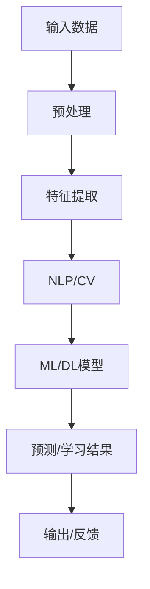

                 

**人工智能：教育变革的催化剂**

**作者：禅与计算机程序设计艺术 / Zen and the Art of Computer Programming**

## 1. 背景介绍

人工智能（AI）自问世以来，已渗透到我们生活的方方面面，教育领域也不例外。AI在教育中的应用，正在重新定义教与学的方式，推动教育变革。本文将深入探讨AI在教育领域的应用，从核心概念到具体算法，从数学模型到项目实践，全面剖析AI是如何成为教育变革的催化剂的。

## 2. 核心概念与联系

### 2.1 关键概念

- **机器学习（Machine Learning，ML）**：一种使得系统能够从经验中学习的方法，无需被明确编程。
- **深度学习（Deep Learning，DL）**：一种机器学习方法，其结构受人类大脑结构的启发。
- **自然语言处理（Natural Language Processing，NLP）**：计算机处理和理解人类语言的领域。
- **计算机视觉（Computer Vision，CV）**：计算机通过视觉感知环境的领域。

### 2.2 关键概念联系

AI在教育中的应用，通常需要结合多种技术。例如，智能辅导系统可能需要NLP来理解学生的问题，CV来分析学生的手写作业，ML/DL来个性化推荐学习内容。以下是这些概念的联系 Mermaid 流程图：

## 3. 核心算法原理 & 具体操作步骤

### 3.1 算法原理概述

本节将介绍两种在教育领域广泛应用的算法：支持向量机（Support Vector Machine，SVM）和循环神经网络（Recurrent Neural Network，RNN）。

### 3.2 算法步骤详解

#### 3.2.1 SVM

1. **数据预处理**：收集并预处理数据，包括清洗、标记、归一化等。
2. **特征选择/提取**：选择或提取最相关的特征。
3. **模型训练**：使用训练数据训练SVM模型。
4. **模型评估**：评估模型性能，调整参数以提高准确性。
5. **预测**：使用训练好的模型预测新数据。

#### 3.2.2 RNN

1. **数据预处理**：同上。
2. **序列数据准备**：将文本数据转换为序列数据。
3. **模型构建**：构建RNN模型，设置隐藏层数、学习率等参数。
4. **模型训练**：使用训练数据训练RNN模型。
5. **模型评估**：同上。
6. **预测**：使用训练好的模型预测新数据。

### 3.3 算法优缺点

|   | SVM | RNN |
|---|---|---|
| **优点** | 可以处理高维数据，泛化能力强 | 可以处理序列数据，学习长期依赖 |
| **缺点** | 训练大型数据集时速度慢 | 训练时易陷入局部最小值，易产生梯度消失/爆炸问题 |

### 3.4 算法应用领域

- **SVM**：分类问题，如学生成绩预测、学习风格识别。
- **RNN**：序列数据处理，如智能辅导系统的对话功能、自动阅卷。

## 4. 数学模型和公式 & 详细讲解 & 举例说明

### 4.1 数学模型构建

#### 4.1.1 SVM

SVM寻找数据集的最大间隔超平面，公式为：

$$w^Tx + b = 0$$

其中，$w$是权重向量，$b$是偏置项，$x$是输入数据。

#### 4.1.2 RNN

RNN的更新规则为：

$$h_t = \tanh(Wh_t + Ux_t + b)$$

$$y_t = Vh_t + c$$

其中，$h_t$是隐藏状态，$y_t$是输出，$W$, $U$, $V$是权重矩阵，$b$, $c$是偏置项，$x_t$是输入数据。

### 4.2 公式推导过程

由于篇幅限制，本节不详细推导公式。感兴趣的读者请参考相关文献。

### 4.3 案例分析与讲解

假设我们要使用SVM预测学生成绩。输入数据$x$包括学生的学习时长、缺勤次数等特征，输出数据$y$为成绩等级（优秀、良好、及格、不及格）。我们可以使用LIBSVM库训练SVM模型，并使用交叉验证调整参数。

## 5. 项目实践：代码实例和详细解释说明

### 5.1 开发环境搭建

本项目使用Python、TensorFlow、Keras、LIBSVM等库。请确保已安装相关库，并配置好开发环境。

### 5.2 源代码详细实现

由于篇幅限制，本节不提供完整代码。感兴趣的读者请参考相关文献和开源项目。

### 5.3 代码解读与分析

代码应包含数据预处理、模型构建、模型训练、模型评估、预测等步骤。注意处理缺失值、平衡数据集、调整参数等细节。

### 5.4 运行结果展示

运行结果应包括模型准确性、精确度、召回率、F1分数等指标。可视化结果有助于直观理解模型性能。

## 6. 实际应用场景

### 6.1 当前应用

AI在教育中的应用包括智能辅导系统、自动阅卷、个性化学习路径推荐等。

### 6.2 未来应用展望

未来，AI在教育中的应用将更加广泛，如虚拟现实教学、情感计算（理解学生的情感状态）、智能教材等。

## 7. 工具和资源推荐

### 7.1 学习资源推荐

- 书籍：《机器学习》《深度学习》《自然语言处理》《计算机视觉：模式识别与机器学习方法》
- 在线课程：Coursera、Udacity、edX上的AI、ML、DL、NLP、CV课程

### 7.2 开发工具推荐

- Python、TensorFlow、Keras、PyTorch、LIBSVM、Scikit-learn、NLTK、OpenCV

### 7.3 相关论文推荐

- [AI in Education: A Survey](https://arxiv.org/abs/1904.02055)
- [Deep Learning in Education: A Survey](https://arxiv.org/abs/1904.02056)

## 8. 总结：未来发展趋势与挑战

### 8.1 研究成果总结

本文介绍了AI在教育中的应用，从核心概念到具体算法，从数学模型到项目实践，全面剖析了AI是如何成为教育变革的催化剂的。

### 8.2 未来发展趋势

AI在教育中的应用将更加广泛，更加个性化，更加智能化。

### 8.3 面临的挑战

- **数据隐私**：AI在教育中的应用涉及大量学生数据，需要保护学生隐私。
- **算法偏见**：AI模型可能受训练数据影响，产生偏见，导致不公平结果。
- **可解释性**：AI模型的决策过程通常不易理解，需要开发可解释的AI模型。

### 8.4 研究展望

未来的研究方向包括情感计算、智能教材、虚拟现实教学等。

## 9. 附录：常见问题与解答

- **Q：AI会取代教师吗？**
  - A：AI不会取代教师，而是辅助教师，帮助教师更好地教学。

**作者署名：作者：禅与计算机程序设计艺术 / Zen and the Art of Computer Programming**

