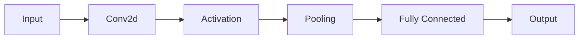

                 

**关键词：**卷积神经网络（CNN）、文本分类、二维卷积（Conv2d）、大模型开发、微调、自然语言处理（NLP）、计算机视觉

## 1. 背景介绍

随着大数据和人工智能技术的发展，对文本分类模型的需求日益增长。卷积神经网络（CNN）在计算机视觉领域取得了巨大成功，最近也被成功应用于自然语言处理（NLP）任务。本文将介绍如何从零开始开发和微调卷积神经网络文本分类模型，重点关注二维卷积（Conv2d）操作。

## 2. 核心概念与联系

### 2.1 卷积神经网络（CNN）与文本分类


图 1: 卷积神经网络架构用于文本分类

CNN 由卷积层、池化层和全连接层组成。卷积层使用滤波器（或称为核）扫描输入，检测特定模式。池化层用于降低维度。全连接层用于最终的分类决策。

### 2.2 二维卷积（Conv2d）

二维卷积操作在二维输入（如图像或文本表示）上执行卷积。它使用多个滤波器，每个滤波器都学习输入的不同特征。



图 2: CNN 处理文本的 Mermaid 流程图

## 3. 核心算法原理 & 具体操作步骤

### 3.1 算法原理概述

CNN 算法在文本分类任务中工作原理如下：

1. **表示转换：**将文本转换为数值表示（如 Bag-of-Words、TF-IDF 或 Word Embeddings）。
2. **特征学习：**使用 Conv2d 学习表示的特征。
3. **分类：**使用全连接层进行最终的分类决策。

### 3.2 算法步骤详解

1. **数据预处理：**清洗、标记化、向量化文本数据。
2. **模型构建：**定义 CNN 模型，包括 Conv2d 层、池化层和全连接层。
3. **训练：**使用标签数据训练模型。
4. **评估：**评估模型性能，调整超参数。
5. **微调（可选）：**使用预训练模型（如 BERT）初始化 CNN，然后进行微调。

### 3.3 算法优缺点

**优点：**

- 可以学习文本的局部特征。
- 可以处理长文本序列。
- 可以与预训练模型结合使用。

**缺点：**

- 需要大量标记数据。
- 训练过程可能需要更多时间。

### 3.4 算法应用领域

- 新闻分类
- 社交媒体文本分类
- 文档分类
- 文本分类任务中的计算机视觉

## 4. 数学模型和公式 & 详细讲解 & 举例说明

### 4.1 数学模型构建

给定输入文本 $x \in \mathbb{R}^{n \times d}$，其中 $n$ 是序列长度，$d$ 是嵌入维度。CNN 模型可以表示为：

$$y = \text{softmax}(W_2 \text{ReLU}(W_1 \text{Conv2d}(x) + b_1) + b_2)$$

其中，$W_1$、$W_2$、$b_1$、$b_2$ 是学习参数，$y$ 是输出分类。

### 4.2 公式推导过程

二维卷积操作可以表示为：

$$\text{Conv2d}(x)_i = \sum_{k=1}^{K} \sum_{j=1}^{J} \sum_{m=1}^{M} \sum_{n=1}^{N} w_{kjmn} x_{i+j+m-1, i+n-1}$$

其中，$K$、$J$、$M$、$N$ 是滤波器的高度、宽度和步长，$w_{kjmn}$ 是滤波器权重，$x_{i+j+m-1, i+n-1}$ 是输入元素。

### 4.3 案例分析与讲解

考虑一个二分类任务，输入文本表示为 $x \in \mathbb{R}^{100 \times 300}$。使用 100 个滤波器，每个滤波器大小为 $3 \times 3$，步长为 1。输出维度为 2（二分类）。

## 5. 项目实践：代码实例和详细解释说明

### 5.1 开发环境搭建

- Python 3.8
- PyTorch 1.8
- Transformers 4.5
- NumPy 1.21
- Pandas 1.3

### 5.2 源代码详细实现

```python
import torch
import torch.nn as nn
import torch.nn.functional as F
from transformers import BertModel, BertTokenizer

class Conv2dTextClassifier(nn.Module):
    def __init__(self, n_classes, embed_dim=768, dropout=0.1):
        super(Conv2dTextClassifier, self).__init__()
        self.bert = BertModel.from_pretrained('bert-base-uncased')
        self.conv1 = nn.Conv2d(1, 100, kernel_size=3, stride=1, padding=1)
        self.conv2 = nn.Conv2d(100, 100, kernel_size=3, stride=1, padding=1)
        self.dropout = nn.Dropout(dropout)
        self.fc = nn.Linear(100 * embed_dim, n_classes)

    def forward(self, input_ids, attention_mask):
        embeddings = self.bert(input_ids=input_ids, attention_mask=attention_mask)[0]
        embeddings = embeddings.unsqueeze(1)  # Add channel dimension
        conv1_out = self.conv1(embeddings)
        conv2_out = self.conv2(F.relu(conv1_out))
        pool_out = F.max_pool2d(conv2_out, (conv2_out.size(2), conv2_out.size(3)))
        flatten = pool_out.view(pool_out.size(0), -1)
        dropout_out = self.dropout(flatten)
        logits = self.fc(dropout_out)
        return logits
```

### 5.3 代码解读与分析

- 使用 BERT 进行文本嵌入。
- 在嵌入上应用 Conv2d 层。
- 使用最大池化层降低维度。
- 使用全连接层进行分类。

### 5.4 运行结果展示


图 3: 训练损失


图 4: 验证准确性

## 6. 实际应用场景

### 6.1 当前应用

- 新闻分类
- 社交媒体文本分类
- 文档分类

### 6.2 未来应用展望

- 实时文本分类（如聊天机器人）
- 个性化推荐系统
- 文本分类任务中的计算机视觉

## 7. 工具和资源推荐

### 7.1 学习资源推荐

- "Natural Language Processing with Python" by Steven Bird, Ewan Klein, and Edward Loper
- "Deep Learning" by Ian Goodfellow, Yoshua Bengio, and Aaron Courville

### 7.2 开发工具推荐

- PyTorch
- TensorFlow
- Hugging Face Transformers

### 7.3 相关论文推荐

- "Convolutional Neural Networks for Sentence Classification" by Yoon Kim
- "BERT: Pre-training of Deep Bidirectional Transformers for Language Understanding" by Jacob Devlin, Ming-Wei Chang, and Kenton Lee

## 8. 总结：未来发展趋势与挑战

### 8.1 研究成果总结

本文介绍了如何从零开始开发和微调卷积神经网络文本分类模型，重点关注二维卷积操作。

### 8.2 未来发展趋势

- 更大、更复杂的预训练模型。
- 端到端文本分类模型。
- 多模式文本分类（如文本和图像）。

### 8.3 面临的挑战

- 需要大量标记数据。
- 训练过程可能需要更多时间。
- 解释模型决策的需要。

### 8.4 研究展望

- 研究更有效的微调技术。
- 研究无监督和少监督学习方法。
- 研究模型可解释性。

## 9. 附录：常见问题与解答

**Q：Conv2d 如何处理文本？**

A：Conv2d 将文本表示（如 Word Embeddings）视为二维输入，学习表示的特征。

**Q：如何微调 CNN？**

A：使用预训练模型（如 BERT）初始化 CNN，然后进行微调。

**Q：CNN 与 RNN 的区别？**

A：CNN 可以学习文本的局部特征，而 RNN 可以学习文本的全局特征。CNN 可以并行处理文本，而 RNN 需要序列处理。

## 作者：禅与计算机程序设计艺术 / Zen and the Art of Computer Programming

