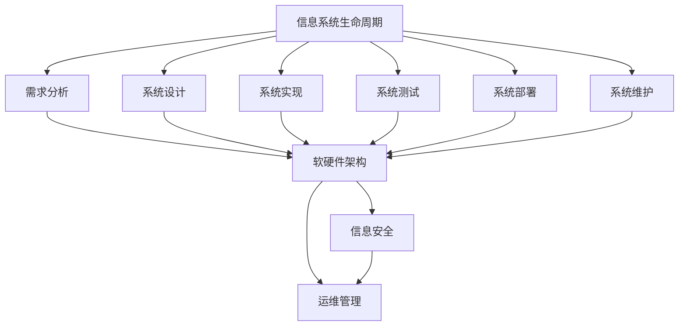

                 

**信息软硬件系统建设及运维管理**

**作者：禅与计算机程序设计艺术 / Zen and the Art of Computer Programming**

## 1. 背景介绍

在当今信息化时代，信息系统的建设和运维管理已成为企业和组织的核心竞争力之一。信息软硬件系统的建设和运维管理涉及到软件开发、硬件配置、网络管理、数据库管理、安全管理等多个领域，是一项复杂的系统工程。本文将从信息系统建设的角度，介绍信息软硬件系统的建设及运维管理，并结合实践案例进行分析。

## 2. 核心概念与联系

信息软硬件系统建设及运维管理的核心概念包括信息系统的生命周期、软硬件架构、信息安全等。这些概念是信息系统建设和运维管理的基础，它们之间密切相关，构成了信息系统建设和运维管理的整体框架。



## 3. 核心算法原理 & 具体操作步骤

### 3.1 算法原理概述

信息系统建设和运维管理中涉及到多种算法，如需求分析算法、系统设计算法、信息安全算法等。这些算法的原理是信息系统建设和运维管理的基础。

### 3.2 算法步骤详解

以需求分析算法为例，其步骤如下：

1. 识别需求：收集用户需求，并将其转化为可理解的需求描述。
2. 分析需求：对需求进行分析，确定需求的可行性和优先级。
3. 确定需求：根据分析结果，确定需求的范围和边界。
4. 文档化需求：将需求文档化，并与用户确认。

### 3.3 算法优缺点

需求分析算法的优点是能够帮助系统分析师准确地理解和记录用户需求，从而提高系统建设的成功率。其缺点是需求分析是一个复杂的过程，需要大量的时间和资源。

### 3.4 算法应用领域

需求分析算法广泛应用于信息系统建设的各个阶段，如软件开发、系统集成等。

## 4. 数学模型和公式 & 详细讲解 & 举例说明

### 4.1 数学模型构建

信息系统建设和运维管理中涉及到多种数学模型，如系统可靠性模型、系统容量模型等。这些模型用于描述信息系统的性能和特性。

### 4.2 公式推导过程

以系统容量模型为例，其公式推导过程如下：

1. 确定系统的输入输出关系：$y = f(x)$
2. 确定系统的容量边界：$C = \max(x)$
3. 确定系统的利用率：$U = \frac{x}{C}$

### 4.3 案例分析与讲解

例如，在一个信息系统中，假设系统的输入输出关系为$y = 2x - 1$，系统的容量边界为$C = 100$，则系统的利用率为$U = \frac{x}{100}$。

## 5. 项目实践：代码实例和详细解释说明

### 5.1 开发环境搭建

信息系统建设和运维管理的项目实践需要一个合适的开发环境。常用的开发环境包括Windows、Linux、macOS等操作系统，以及各种开发工具，如Eclipse、Visual Studio等。

### 5.2 源代码详细实现

以需求分析算法为例，其源代码实现如下：

```python
def analyze_requirement(requirement):
    # 识别需求
    analyzed_requirement = recognize_requirement(requirement)

    # 分析需求
    analyzed_requirement = analyze_requirement(analyzed_requirement)

    # 确定需求
    analyzed_requirement = determine_requirement(analyzed_requirement)

    # 文档化需求
    document_requirement(analyzed_requirement)

    return analyzed_requirement
```

### 5.3 代码解读与分析

上述代码实现了需求分析算法的四个步骤。其中，`recognize_requirement()`、`analyze_requirement()`、`determine_requirement()`、`document_requirement()`分别对应需求识别、分析、确定、文档化四个步骤。

### 5.4 运行结果展示

运行上述代码后，可以得到分析后的需求描述。

## 6. 实际应用场景

信息软硬件系统建设及运维管理在各个行业都有广泛的应用，如金融行业、电信行业、医疗行业等。信息系统建设和运维管理的目标是提高信息系统的可靠性、可用性、安全性和效率。

### 6.1 实际应用案例

例如，在金融行业，信息系统建设和运维管理可以帮助银行提高交易处理的效率，降低交易风险。在电信行业，信息系统建设和运维管理可以帮助运营商提高网络的可靠性和容量。

### 6.2 未来应用展望

随着信息技术的发展，信息系统建设和运维管理的未来趋势是朝着智能化、自动化方向发展。例如，利用人工智能技术实现自动化需求分析、系统设计等。

## 7. 工具和资源推荐

### 7.1 学习资源推荐

信息系统建设和运维管理的学习资源包括各种书籍、在线课程、论文等。推荐阅读《信息系统建设与管理》《信息系统安全》《信息系统容量规划与管理》等书籍。

### 7.2 开发工具推荐

信息系统建设和运维管理的开发工具包括各种IDE、数据库管理系统、网络管理系统等。推荐使用Eclipse、Visual Studio、MySQL、Oracle等工具。

### 7.3 相关论文推荐

推荐阅读《信息系统建设与管理》《信息系统安全》《信息系统容量规划与管理》等期刊论文。

## 8. 总结：未来发展趋势与挑战

### 8.1 研究成果总结

信息系统建设和运维管理是一个复杂的系统工程，需要涉及到多个领域的知识。本文从信息系统建设的角度，介绍了信息软硬件系统的建设及运维管理，并结合实践案例进行了分析。

### 8.2 未来发展趋势

信息系统建设和运维管理的未来发展趋势是朝着智能化、自动化方向发展。例如，利用人工智能技术实现自动化需求分析、系统设计等。

### 8.3 面临的挑战

信息系统建设和运维管理面临的挑战包括系统复杂性、安全性、可靠性等。如何提高信息系统的可靠性、安全性和效率，是信息系统建设和运维管理需要解决的关键问题。

### 8.4 研究展望

信息系统建设和运维管理是一个不断发展的领域，未来的研究方向包括信息系统的智能化、自动化、安全化等。

## 9. 附录：常见问题与解答

### 9.1 信息系统建设和运维管理的目标是什么？

信息系统建设和运维管理的目标是提高信息系统的可靠性、可用性、安全性和效率。

### 9.2 信息系统建设和运维管理的关键概念有哪些？

信息系统建设和运维管理的关键概念包括信息系统的生命周期、软硬件架构、信息安全等。

### 9.3 信息系统建设和运维管理的算法原理是什么？

信息系统建设和运维管理的算法原理包括需求分析算法、系统设计算法、信息安全算法等。

### 9.4 信息系统建设和运维管理的数学模型有哪些？

信息系统建设和运维管理的数学模型包括系统可靠性模型、系统容量模型等。

### 9.5 信息系统建设和运维管理的学习资源有哪些？

信息系统建设和运维管理的学习资源包括各种书籍、在线课程、论文等。推荐阅读《信息系统建设与管理》《信息系统安全》《信息系统容量规划与管理》等书籍。

**作者署名：作者：禅与计算机程序设计艺术 / Zen and the Art of Computer Programming**

