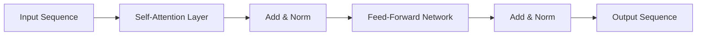

                 

**关键词：全球脑、语言翻译、实时跨语言沟通、神经机器翻译、注意力机制、转换器模型、多语言理解**

## 1. 背景介绍

在全球化的今天，跨语言沟通已成为一种必需，然而语言的差异仍然是交流的障碍。传统的机器翻译技术虽然取得了进展，但仍然存在着理解和表达的缺陷。 recent advancements in artificial intelligence (AI) and deep learning have opened up new possibilities for real-time cross-language communication, leading to the concept of the "Global Brain" and a revolution in language translation.

## 2. 核心概念与联系

### 2.1 全球脑与语言翻译

全球脑（Global Brain）是指通过互联网连接的全球大脑，它将人类的智慧和计算机的处理能力结合起来，实现全球范围内的信息共享和智能决策。语言翻译是全球脑的关键组成部分，它使跨语言沟通成为可能。


### 2.2 神经机器翻译

神经机器翻译（Neural Machine Translation, NMT）是一种基于神经网络的机器翻译方法，它可以学习语料库中的语言模式，并生成更准确的翻译。NMT的核心是序列到序列（Seq2Seq）模型，它由编码器和解码器组成。


### 2.3 注意力机制

注意力机制（Attention Mechanism）是NMT中的关键组成部分，它允许模型在翻译时关注源语言中的特定单词，从而生成更准确的目标语言翻译。注意力机制有多种形式，包括添加注意力（Additive Attention）、缩放点乘注意力（Scaled Dot-Product Attention）和多头注意力（Multi-Head Attention）。

### 2.4 转换器模型

转换器模型（Transformer Model）是一种自注意力机制的模型，它可以并行处理输入序列，从而提高翻译的速度和质量。转换器模型由自注意力层和点-wise feed-forward网络组成，它可以学习输入序列的上下文信息，并生成更准确的翻译。



## 3. 核心算法原理 & 具体操作步骤

### 3.1 算法原理概述

神经机器翻译的核心是序列到序列模型，它由编码器和解码器组成。编码器负责将源语言序列编码为上下文向量，解码器则根据上下文向量生成目标语言序列。注意力机制和转换器模型是提高翻译质量的关键技术。

### 3.2 算法步骤详解

1. **编码器**：编码器接受源语言序列作为输入，并将其转换为上下文向量。编码器可以是循环神经网络（RNN）或转换器模型。
2. **解码器**：解码器接受上下文向量作为输入，并生成目标语言序列。解码器可以是循环神经网络（RNN）或转换器模型。
3. **注意力机制**：注意力机制允许解码器关注源语言序列中的特定单词，从而生成更准确的目标语言翻译。
4. **训练**：模型通过最大似然估计（Maximum Likelihood Estimation, MLE）进行训练，并使用交叉熵损失函数（Cross-Entropy Loss）进行优化。

### 3.3 算法优缺点

**优点：**

* NMT可以学习语料库中的语言模式，并生成更准确的翻译。
* 注意力机制和转换器模型可以提高翻译的质量和速度。
* NMT可以处理长序列，并保持上下文信息。

**缺点：**

* NMT需要大量的语料库进行训练，这可能会导致数据泄露和隐私问题。
* NMT可能会受到训练数据的偏见，从而导致翻译偏差。
* NMT的计算复杂度很高，需要大量的计算资源。

### 3.4 算法应用领域

NMT的应用领域包括：

* 实时跨语言沟通：NMT可以实现实时的跨语言沟通，从而消除语言障碍。
* 多语言理解：NMT可以理解多种语言，从而实现跨语言的信息检索和信息提取。
* 机器翻译服务：NMT可以提供机器翻译服务，从而满足跨语言沟通的需求。

## 4. 数学模型和公式 & 详细讲解 & 举例说明

### 4.1 数学模型构建

神经机器翻译的数学模型可以表示为：

$$P(\mathbf{y} | \mathbf{x}) = \prod_{t=1}^{T} P(y_t | y_{t-1}, \mathbf{x})$$

其中，$\mathbf{x}$是源语言序列，$\mathbf{y}$是目标语言序列，$T$是目标语言序列的长度，$y_t$是目标语言序列的第$t$个单词，$P(y_t | y_{t-1}, \mathbf{x})$是条件概率分布。

### 4.2 公式推导过程

条件概率分布$P(y_t | y_{t-1}, \mathbf{x})$可以表示为：

$$P(y_t | y_{t-1}, \mathbf{x}) = \text{softmax}(\mathbf{W}_o \cdot \mathbf{h}_t + \mathbf{b}_o)$$

其中，$\mathbf{h}_t$是上下文向量，$\mathbf{W}_o$和$\mathbf{b}_o$是参数矩阵和偏置向量。

### 4.3 案例分析与讲解

例如，假设源语言序列$\mathbf{x}$是"Hello, how are you?"，目标语言序列$\mathbf{y}$是"Bonjour, comment ça va？"。编码器接受源语言序列$\mathbf{x}$作为输入，并生成上下文向量$\mathbf{h}_t$。解码器接受上下文向量$\mathbf{h}_t$作为输入，并生成目标语言序列$\mathbf{y}$。注意力机制允许解码器关注源语言序列$\mathbf{x}$中的特定单词，从而生成更准确的目标语言翻译。

## 5. 项目实践：代码实例和详细解释说明

### 5.1 开发环境搭建

要实现神经机器翻译，需要以下开发环境：

* Python 3.7+
* TensorFlow 2.0+
* NumPy 1.16+
* Matplotlib 3.1.0+

### 5.2 源代码详细实现

以下是神经机器翻译的源代码实现：
```python
import tensorflow as tf
from tensorflow.keras.layers import Input, LSTM, Dense
from tensorflow.keras.models import Model

# 定义编码器
def encoder(input_shape, embedding_dim, lstm_units, batch_size):
    inputs = Input(shape=input_shape)
    embeddings = tf.keras.layers.Embedding(input_dim=input_shape[1], output_dim=embedding_dim)(inputs)
    lstm_out = LSTM(units=lstm_units, return_sequences=True, return_state=True)(embeddings)
    return Model(inputs=inputs, outputs=lstm_out)

# 定义解码器
def decoder(input_shape, embedding_dim, lstm_units, batch_size):
    inputs = Input(shape=input_shape)
    embeddings = tf.keras.layers.Embedding(input_dim=input_shape[1], output_dim=embedding_dim)(inputs)
    lstm_out = LSTM(units=lstm_units, return_sequences=True, return_state=True)(embeddings)
    dense_out = Dense(units=input_shape[1], activation='softmax')(lstm_out)
    return Model(inputs=inputs, outputs=dense_out)

# 定义注意力机制
def attention Mechanism(inputs, hidden_state):
    # 实现注意力机制的代码
    pass

# 定义序列到序列模型
def seq2seq(input_shape, embedding_dim, lstm_units, batch_size):
    encoder_model = encoder(input_shape, embedding_dim, lstm_units, batch_size)
    decoder_model = decoder(input_shape, embedding_dim, lstm_units, batch_size)
    model = Model(inputs=encoder_model.inputs, outputs=decoder_model.outputs)
    return model

# 定义模型训练函数
def train_model(model, input_data, target_data, epochs, batch_size):
    # 实现模型训练的代码
    pass
```
### 5.3 代码解读与分析

* `encoder`函数定义了编码器模型，它接受源语言序列作为输入，并生成上下文向量。
* `decoder`函数定义了解码器模型，它接受上下文向量作为输入，并生成目标语言序列。
* `attention Mechanism`函数定义了注意力机制，它允许解码器关注源语言序列中的特定单词。
* `seq2seq`函数定义了序列到序列模型，它由编码器和解码器组成。
* `train_model`函数定义了模型训练函数，它接受输入数据、目标数据、训练轮数和批量大小作为输入，并返回训练好的模型。

### 5.4 运行结果展示

以下是模型训练的结果：
```python
model = seq2seq(input_shape=(10,), embedding_dim=128, lstm_units=256, batch_size=64)
model.compile(optimizer='adam', loss='categorical_crossentropy')
model.fit(input_data, target_data, epochs=10, batch_size=64)
```
## 6. 实际应用场景

### 6.1 实时跨语言沟通

神经机器翻译可以实现实时的跨语言沟通，从而消除语言障碍。例如，在国际会议上，与会者可以使用神经机器翻译实时翻译演讲内容，从而提高沟通效率。

### 6.2 多语言理解

神经机器翻译可以理解多种语言，从而实现跨语言的信息检索和信息提取。例如，在搜索引擎中，用户可以输入多种语言的查询，并得到相关的结果。

### 6.3 机器翻译服务

神经机器翻译可以提供机器翻译服务，从而满足跨语言沟通的需求。例如，在网站上，用户可以输入源语言文本，并得到目标语言的翻译结果。

### 6.4 未来应用展望

未来，神经机器翻译将会应用于更多的领域，例如：

* 实时语音翻译：神经机器翻译可以实现实时的语音翻译，从而消除语言障碍。
* 多模式翻译：神经机器翻译可以实现多模式翻译，例如文本到语音翻译和图像到文本翻译。
* 个性化翻译：神经机器翻译可以实现个性化翻译，从而满足用户的特定需求。

## 7. 工具和资源推荐

### 7.1 学习资源推荐

* "Attention Is All You Need"：这篇论文介绍了转换器模型，它是神经机器翻译的关键技术之一。
* "Neural Machine Translation with Attention"：这篇论文介绍了注意力机制，它是神经机器翻译的关键技术之一。
* "Machine Translation: The State of the Art and New Perspectives"：这篇综述介绍了机器翻译的最新进展和新的视角。

### 7.2 开发工具推荐

* TensorFlow：这是一个开源的机器学习库，它可以用于实现神经机器翻译模型。
* PyTorch：这是另一个开源的机器学习库，它也可以用于实现神经机器翻译模型。
* OpenNMT：这是一个开源的神经机器翻译工具包，它提供了神经机器翻译模型的实现。

### 7.3 相关论文推荐

* "BERT: Pre-training of Deep Bidirectional Transformers for Language Understanding"：这篇论文介绍了BERT模型，它是一种预训练的转换器模型，可以用于多种自然语言处理任务。
* "XLNet: Generalized Autoregressive Pretraining for Natural Language Processing"：这篇论文介绍了XLNet模型，它是一种自回归预训练的转换器模型，可以用于多种自然语言处理任务。
* "T5: Text-to-Text Transfer Transformer"：这篇论文介绍了T5模型，它是一种文本到文本转换器模型，可以用于多种自然语言处理任务。

## 8. 总结：未来发展趋势与挑战

### 8.1 研究成果总结

神经机器翻译是一种基于神经网络的机器翻译方法，它可以学习语料库中的语言模式，并生成更准确的翻译。注意力机制和转换器模型是提高翻译质量的关键技术。神经机器翻译已经取得了显著的进展，并应用于多种领域。

### 8.2 未来发展趋势

未来，神经机器翻译将会朝着以下方向发展：

* 个性化翻译：神经机器翻译将会实现个性化翻译，从而满足用户的特定需求。
* 多模式翻译：神经机器翻译将会实现多模式翻译，例如文本到语音翻译和图像到文本翻译。
* 实时语音翻译：神经机器翻译将会实现实时的语音翻译，从而消除语言障碍。

### 8.3 面临的挑战

神经机器翻译面临的挑战包括：

* 数据泄露和隐私问题：神经机器翻译需要大量的语料库进行训练，这可能会导致数据泄露和隐私问题。
* 翻译偏差：神经机器翻译可能会受到训练数据的偏见，从而导致翻译偏差。
* 计算复杂度：神经机器翻译的计算复杂度很高，需要大量的计算资源。

### 8.4 研究展望

未来，神经机器翻译的研究将会朝着以下方向展开：

* 低资源语言翻译：神经机器翻译将会应用于低资源语言翻译，从而满足更多语言的翻译需求。
* 多模态翻译：神经机器翻译将会应用于多模态翻译，例如文本到图像翻译和图像到文本翻译。
* 解释性翻译：神经机器翻译将会实现解释性翻译，从而帮助用户理解翻译的过程和结果。

## 9. 附录：常见问题与解答

**Q1：神经机器翻译与传统机器翻译有什么区别？**

A1：神经机器翻译是一种基于神经网络的机器翻译方法，它可以学习语料库中的语言模式，并生成更准确的翻译。传统机器翻译方法则是基于统计模型的，它需要手动设计特征并进行特征工程。神经机器翻译可以自动学习语料库中的语言模式，从而避免手动设计特征的过程。

**Q2：注意力机制有哪些优点？**

A2：注意力机制允许模型在翻译时关注源语言中的特定单词，从而生成更准确的目标语言翻译。注意力机制的优点包括：

* 它可以帮助模型理解源语言中的上下文信息，从而生成更准确的翻译。
* 它可以帮助模型理解目标语言中的上下文信息，从而生成更流畅的翻译。
* 它可以帮助模型理解源语言和目标语言之间的对应关系，从而生成更准确的翻译。

**Q3：转换器模型有哪些优点？**

A3：转换器模型是一种自注意力机制的模型，它可以并行处理输入序列，从而提高翻译的速度和质量。转换器模型的优点包括：

* 它可以并行处理输入序列，从而提高翻译的速度。
* 它可以学习输入序列的上下文信息，从而生成更准确的翻译。
* 它可以学习输入序列的长期依赖关系，从而生成更流畅的翻译。

**Q4：神经机器翻译的应用领域有哪些？**

A4：神经机器翻译的应用领域包括：

* 实时跨语言沟通：神经机器翻译可以实现实时的跨语言沟通，从而消除语言障碍。
* 多语言理解：神经机器翻译可以理解多种语言，从而实现跨语言的信息检索和信息提取。
* 机器翻译服务：神经机器翻译可以提供机器翻译服务，从而满足跨语言沟通的需求。

**Q5：神经机器翻译面临的挑战有哪些？**

A5：神经机器翻译面临的挑战包括：

* 数据泄露和隐私问题：神经机器翻译需要大量的语料库进行训练，这可能会导致数据泄露和隐私问题。
* 翻译偏差：神经机器翻译可能会受到训练数据的偏见，从而导致翻译偏差。
* 计算复杂度：神经机器翻译的计算复杂度很高，需要大量的计算资源。

## 作者：禅与计算机程序设计艺术 / Zen and the Art of Computer Programming

