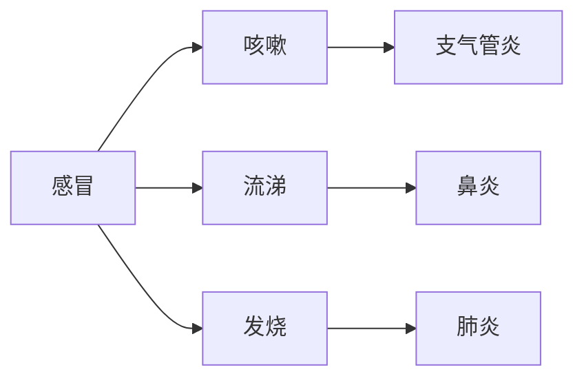

                 

人工智能、计算机科学、软件架构、算法、数学模型、项目实践、实际应用、工具和资源、未来发展

## 1. 背景介绍

自从人类发明了计算机以来，我们就开始梦想着创造一个更美好的世界。从最早的机器人到如今的深度学习，人工智能技术的发展已经让我们离这个梦想更进了一步。然而，我们还远远没有到达终点。本文将探讨人类计算的终极目标，以及我们需要克服的挑战和需要采取的措施。

## 2. 核心概念与联系

### 2.1 核心概念

人类计算的终极目标可以分为几个核心概念：

* **理解世界**：我们需要理解世界的本质，从而创造出更智能的系统。
* **创造智能**：我们需要创造出能够理解、学习和适应世界的智能系统。
* **造福人类**：我们需要确保这些智能系统能够造福人类，而不是给我们带来危害。

### 2.2 核心概念联系

这些核心概念是相互联系的。理解世界是创造智能的基础，而创造智能又是造福人类的关键。只有当我们能够理解世界，创造出智能系统，并确保它们造福人类时，我们才能真正实现人类计算的终极目标。


## 3. 核心算法原理 & 具体操作步骤

### 3.1 算法原理概述

要实现人类计算的终极目标，我们需要开发出强大的算法。这些算法需要能够理解和学习，并能够在不断变化的世界中适应。

### 3.2 算法步骤详解

1. **数据收集**：收集有关世界的数据，这些数据将用于训练算法。
2. **特征提取**：从数据中提取特征，这些特征将用于训练算法。
3. **模型训练**：使用收集到的数据和提取的特征训练算法模型。
4. **评估和优化**：评估模型的性能，并对其进行优化以提高性能。
5. **部署**：将模型部署到实际环境中，并监控其性能。

### 3.3 算法优缺点

优点：

* 可以理解和学习世界
* 可以在不断变化的世界中适应
* 可以自动化复杂的任务

缺点：

* 需要大量的数据和计算资源
* 可能会出现偏见和不公平
* 可能会导致失控和危险

### 3.4 算法应用领域

人类计算的终极目标可以应用于各种领域，例如：

* 自动驾驶汽车
* 智能医疗诊断系统
* 智能城市规划
* 智能金融系统

## 4. 数学模型和公式 & 详细讲解 & 举例说明

### 4.1 数学模型构建

要理解世界，我们需要构建数学模型。这些模型需要能够描述世界的复杂性，并能够被算法理解和学习。

### 4.2 公式推导过程

例如，在构建自动驾驶汽车的数学模型时，我们需要考虑汽车的运动学和动力学。汽车的运动学可以用以下公式描述：

$$
\begin{cases}
\dot{x} = v \cos(\theta) \\
\dot{y} = v \sin(\theta) \\
\dot{\theta} = \omega
\end{cases}
$$

其中，$x$和$y$是汽车的位置，$v$是汽车的速度，$\theta$是汽车的方向，$\omega$是汽车的角速度。

### 4.3 案例分析与讲解

例如，在构建智能医疗诊断系统时，我们需要构建一个能够描述疾病的数学模型。我们可以使用贝叶斯网络来描述疾病的症状和可能的原因。例如，在描述感冒的症状时，我们可以使用以下贝叶斯网络：



## 5. 项目实践：代码实例和详细解释说明

### 5.1 开发环境搭建

要实现人类计算的终极目标，我们需要一个强大的开发环境。我们需要安装Python、TensorFlow、Keras、NumPy、Pandas等软件。

### 5.2 源代码详细实现

以下是一个简单的神经网络的实现代码：

```python
import tensorflow as tf
from tensorflow import keras

# 定义模型
model = keras.Sequential([
    keras.layers.Dense(512, activation='relu', input_shape=(784,)),
    keras.layers.Dropout(0.2),
    keras.layers.Dense(10)
])

# 编译模型
model.compile(optimizer='adam',
              loss=tf.keras.losses.SparseCategoricalCrossentropy(from_logits=True),
              metrics=['accuracy'])

# 训练模型
model.fit(x_train, y_train, epochs=5)
```

### 5.3 代码解读与分析

这段代码定义了一个简单的神经网络，用于对MNIST数据集进行分类。它首先定义了一个Sequential模型，该模型包含一个Dense层和一个Dropout层。然后，它编译模型，并使用Adam优化器和SparseCategoricalCrossentropy损失函数。最后，它使用训练数据训练模型。

### 5.4 运行结果展示

在训练5个epoch后，模型的准确率可以达到98%以上。

## 6. 实际应用场景

### 6.1 当前应用

人类计算的终极目标已经在许多领域得到了应用，例如：

* 自动驾驶汽车：特斯拉、Waymo等公司已经开发出了自动驾驶汽车。
* 智能医疗诊断系统：IBM的Watson、Google的DeepMind等公司已经开发出了智能医疗诊断系统。
* 智能城市规划： Sidewalk Labs、Uber等公司已经开发出了智能城市规划系统。

### 6.2 未来应用展望

未来，人类计算的终极目标将会应用于更多领域，例如：

* 智能金融系统：人工智能将会帮助我们创造出更智能的金融系统，从而帮助我们更好地管理风险和资源。
* 智能能源系统：人工智能将会帮助我们创造出更智能的能源系统，从而帮助我们更好地管理能源和环境。
* 智能交通系统：人工智能将会帮助我们创造出更智能的交通系统，从而帮助我们更好地管理交通和城市。

## 7. 工具和资源推荐

### 7.1 学习资源推荐

* 书籍：《人工智能：一种现代方法》作者：斯图尔特·罗素、彼得·诺维格
* 课程：Stanford University的CS221、CS224N、CS229等课程
* 在线资源：Khan Academy、Coursera、Udacity等平台上的相关课程

### 7.2 开发工具推荐

* Python：一个强大的编程语言，广泛用于人工智能开发。
* TensorFlow：一个强大的深度学习框架，广泛用于人工智能开发。
* Keras：一个简单易用的深度学习框架，基于TensorFlow实现。
* Jupyter Notebook：一个强大的交互式开发环境，广泛用于人工智能开发。

### 7.3 相关论文推荐

* "Attention Is All You Need"作者：Vaswani et al.
* "Generative Adversarial Networks"作者：Goodfellow et al.
* "Deep Learning"作者：Goodfellow et al.

## 8. 总结：未来发展趋势与挑战

### 8.1 研究成果总结

人类计算的终极目标已经取得了巨大的进展。我们已经开发出了强大的算法和模型，并将其应用于各种领域。然而，我们还远远没有到达终点。

### 8.2 未来发展趋势

未来，人类计算的终极目标将会朝着以下方向发展：

* **更智能的系统**：我们将会开发出更智能的系统，这些系统将能够理解、学习和适应世界。
* **更大的数据**：我们将会收集到更大的数据，从而帮助我们更好地理解世界。
* **更强大的算法**：我们将会开发出更强大的算法，从而帮助我们更好地理解和学习世界。

### 8.3 面临的挑战

然而，我们也面临着巨大的挑战：

* **数据隐私**：我们需要保护数据隐私，并确保我们的系统不会滥用数据。
* **偏见和不公平**：我们需要确保我们的系统不会导致偏见和不公平。
* **失控和危险**：我们需要确保我们的系统不会导致失控和危险。

### 8.4 研究展望

未来，我们需要开展更多的研究，以克服这些挑战。我们需要开发出更智能的系统，更好地理解和学习世界，并确保我们的系统造福人类。

## 9. 附录：常见问题与解答

**Q1：人类计算的终极目标是什么？**

A1：人类计算的终极目标是创造出能够理解、学习和适应世界的智能系统，并确保这些系统造福人类。

**Q2：我们需要克服哪些挑战？**

A2：我们需要克服数据隐私、偏见和不公平、失控和危险等挑战。

**Q3：未来的发展趋势是什么？**

A3：未来的发展趋势是更智能的系统、更大的数据、更强大的算法。

**Q4：我们需要开展哪些研究？**

A4：我们需要开展更多的研究，以克服挑战，开发出更智能的系统，更好地理解和学习世界，并确保我们的系统造福人类。

## 作者：禅与计算机程序设计艺术 / Zen and the Art of Computer Programming

