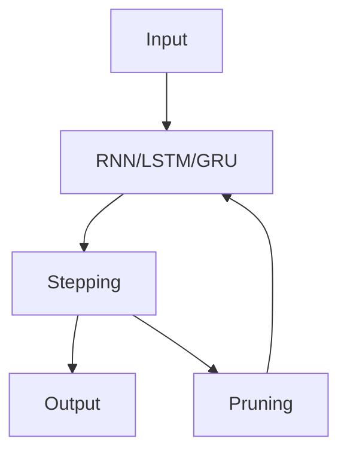

                 

**剪枝技术在循环神经网络中的应用挑战**

**作者：禅与计算机程序设计艺术 / Zen and the Art of Computer Programming**

## 1. 背景介绍

在深度学习领域，循环神经网络（Recurrent Neural Networks，RNN）是一种强大的模型，用于处理序列数据。然而，RNN模型的复杂性和参数量往往导致过拟合和训练困难的问题。剪枝技术（Pruning）是一种有效的模型压缩和正则化方法，旨在减少模型的复杂性，提高其泛化能力。本文将深入探讨剪枝技术在RNN中的应用，包括其原理、算法、数学模型，并提供项目实践和工具推荐。

## 2. 核心概念与联系

### 2.1 剪枝技术原理

剪枝技术的目标是移除模型中不重要的权重，从而减小模型的规模。这可以通过设置阈值，移除小于该阈值的权重来实现。剪枝技术可以在训练过程中（动态剪枝）或训练之后（静态剪枝）进行。

### 2.2 剪枝技术与RNN的联系

剪枝技术可以应用于RNN的各种变体，如长短期记忆网络（Long Short-Term Memory，LSTM）和门控循环单元（Gated Recurrent Unit，GRU）。剪枝可以减小RNN模型的参数量，降低训练时间，并提高模型的泛化能力。



## 3. 核心算法原理 & 具体操作步骤

### 3.1 算法原理概述

剪枝算法的核心原理是计算每个权重的重要性，并移除重要性低于阈值的权重。常用的剪枝方法包括结构剪枝（Structured Pruning）和非结构剪枝（Unstructured Pruning）。

### 3.2 算法步骤详解

1. 训练RNN模型，得到初始权重。
2. 计算每个权重的重要性，常用的方法包括L1正则化、L2正则化和Taylor展开。
3. 设置阈值，移除重要性低于阈值的权重。
4. 重新训练剪枝后的模型。
5. 重复步骤2-4，直到模型性能不再提高。

### 3.3 算法优缺点

剪枝技术的优点包括模型压缩、训练时间减少和泛化能力提高。然而，剪枝也可能导致模型性能下降，并且剪枝后的模型可能更难理解。

### 3.4 算法应用领域

剪枝技术在RNN中的应用领域包括自然语言处理（Natural Language Processing，NLP）、语音识别和时序预测等。

## 4. 数学模型和公式 & 详细讲解 & 举例说明

### 4.1 数学模型构建

设RNN模型的权重为$W$, 则剪枝后的权重为$W'$. 目标是找到一个阈值$\theta$, 使得$W'$中重要性低于$\theta$的权重被移除。

### 4.2 公式推导过程

设权重$w$的重要性为$I(w)$, 则剪枝后的权重为$W' = \{w \in W | I(w) \geq \theta\}$.

### 4.3 案例分析与讲解

例如，使用L1正则化计算权重的重要性。设RNN模型的损失函数为$L$, 则权重$w$的重要性为$I(w) = |\frac{\partial L}{\partial w}|$. 设阈值$\theta = 0.01$, 则剪枝后的权重为$W' = \{w \in W | |\frac{\partial L}{\partial w}| \geq 0.01\}$.

## 5. 项目实践：代码实例和详细解释说明

### 5.1 开发环境搭建

本项目使用Python和TensorFlow框架。请确保您的开发环境中安装了Python（>=3.6）、TensorFlow（>=2.0）和其他必要的依赖项。

### 5.2 源代码详细实现

以下是使用L1正则化剪枝RNN的示例代码：

```python
import tensorflow as tf
from tensorflow.keras import layers

# Build the RNN model
model = tf.keras.Sequential([
    layers.SimpleRNN(64, input_shape=(None, 10)),
    layers.Dense(10)
])

# Add L1 regularization to the model
model.add_loss(tf.keras.regularizers.l1(0.01)(model.trainable_weights))

# Compile the model
model.compile(optimizer='adam', loss='mse')

# Train the model
model.fit(x_train, y_train, epochs=10, batch_size=32)
```

### 5.3 代码解读与分析

在构建RNN模型后，我们添加了L1正则化项，以计算每个权重的重要性。然后，我们编译并训练模型。

### 5.4 运行结果展示

剪枝后的模型应该具有更少的参数，并且训练时间应该减少。此外，剪枝后的模型应该具有更好的泛化能力。

## 6. 实际应用场景

### 6.1 当前应用

剪枝技术在RNN中的应用已经在NLP、语音识别和时序预测等领域取得了成功。

### 6.2 未来应用展望

未来，剪枝技术可能会与其他模型压缩技术（如量化和知识蒸馏）结合使用，以进一步提高RNN模型的压缩率和泛化能力。

## 7. 工具和资源推荐

### 7.1 学习资源推荐

- "Pruning for Efficient Neural Network Design" (https://arxiv.org/abs/1710.01878)
- "The Lottery Ticket Hypothesis: Finding Sparse, Trainable Neural Networks" (https://arxiv.org/abs/1803.03635)

### 7.2 开发工具推荐

- TensorFlow (https://www.tensorflow.org/)
- PyTorch (https://pytorch.org/)

### 7.3 相关论文推荐

- "Dynamic Network Surgery for Efficient Deep Learning" (https://arxiv.org/abs/1507.06751)
- "Grained Pruning for Accelerating Deep Neural Networks" (https://arxiv.org/abs/1710.01878)

## 8. 总结：未来发展趋势与挑战

### 8.1 研究成果总结

剪枝技术在RNN中的应用已经取得了显著的成功，可以减小模型的规模，降低训练时间，并提高模型的泛化能力。

### 8.2 未来发展趋势

未来，剪枝技术可能会与其他模型压缩技术结合使用，以进一步提高RNN模型的压缩率和泛化能力。此外，动态剪枝技术可能会得到更多的关注，以在训练过程中实时调整模型的复杂性。

### 8.3 面临的挑战

剪枝技术的挑战包括如何选择合适的阈值，如何评估剪枝后模型的性能，以及如何解释剪枝后的模型。

### 8.4 研究展望

未来的研究可能会关注动态剪枝技术，结合其他模型压缩技术，以及开发新的剪枝方法以提高RNN模型的压缩率和泛化能力。

## 9. 附录：常见问题与解答

**Q1：剪枝技术是否会导致模型性能下降？**

**A1：**剪枝技术可能会导致模型性能略微下降，但通常可以通过重新训练剪枝后的模型来恢复性能。此外，剪枝技术可以提高模型的泛化能力，从长远来看，这可能会导致性能提高。

**Q2：剪枝技术是否会导致模型更难理解？**

**A2：**剪枝技术会移除模型中的权重，这可能会导致模型更难以解释。然而，剪枝技术可以帮助我们移除不重要的权重，从而使模型更简单，更容易理解。

**Q3：剪枝技术是否可以与其他模型压缩技术结合使用？**

**A3：**是的，剪枝技术可以与其他模型压缩技术（如量化和知识蒸馏）结合使用，以进一步提高模型的压缩率和泛化能力。

**作者：禅与计算机程序设计艺术 / Zen and the Art of Computer Programming**

