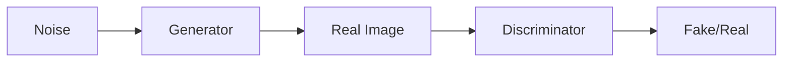

                 

**基于生成对抗网络的图像高级别语义风格迁移技术**

**作者：禅与计算机程序设计艺术 / Zen and the Art of Computer Programming**

## 1. 背景介绍

图像风格迁移是计算机视觉领域的一个热门话题，其目标是将一张图像的风格转移到另一张图像上，而不改变其内容。传统的风格迁移方法通常基于物理模型或手工设计的特征表示，但这些方法往往受限于特定的风格类型，且结果不够自然。生成对抗网络（Generative Adversarial Networks，GAN）的出现为图像风格迁移带来了新的可能性，本文将介绍一种基于GAN的图像高级别语义风格迁移技术。

## 2. 核心概念与联系

### 2.1 生成对抗网络（GAN）

GAN由生成器（Generator，G）和判别器（Discriminator，D）两个网络组成，生成器负责生成图像，判别器负责判断图像是真实的还是生成的。两个网络通过对抗训练不断改进，最终生成器能够生成与真实图像几乎无法区分的图像。



### 2.2 图像风格迁移

图像风格迁移的目标是将一张图像的风格转移到另一张图像上，而不改变其内容。高级别语义风格迁移是其中一个分支，其目标是转移图像的语义风格，如绘画风格、卡通风格等。

## 3. 核心算法原理 & 具体操作步骤

### 3.1 算法原理概述

本文提出的算法基于条件GAN（cGAN）框架，将图像风格表示为条件输入，生成器和判别器都接受条件输入。生成器学习将内容图像转换为目标风格，判别器学习区分目标风格图像和真实图像。

### 3.2 算法步骤详解

1. **预处理**：将内容图像和风格图像resize到相同大小，并进行预处理（如去除均值和方差）。
2. **条件表示**：将风格图像作为条件输入，使用全连接层或卷积层将其表示为条件向量。
3. **生成器**：生成器接受内容图像和条件向量作为输入，使用卷积层和激活函数（如ReLU）生成目标风格图像。
4. **判别器**：判别器接受内容图像、条件向量和生成的目标风格图像作为输入，使用卷积层和激活函数判断图像是否为真实图像。
5. **对抗训练**：使用对抗损失函数训练生成器和判别器，生成器试图生成与真实图像无法区分的图像，判别器试图区分真实图像和生成的图像。
6. **后处理**：对生成的目标风格图像进行后处理（如加回均值和方差），得到最终结果。

### 3.3 算法优缺点

**优点**：本算法可以学习复杂的风格表示，生成的图像自然真实，且可以处理不同大小的图像。

**缺点**：对抗训练过程不稳定，生成器和判别器易陷入模式崩溃，且训练过程需要大量的计算资源。

### 3.4 算法应用领域

本算法可以应用于图像风格转换、图像美化、图像合成等领域。此外，它还可以扩展到视频风格转换、风格迁移到其他模态（如文本到图像）等任务。

## 4. 数学模型和公式 & 详细讲解 & 举例说明

### 4.1 数学模型构建

设内容图像为$x$, 风格图像为$y$, 目标风格图像为$G(x, y)$, 判别器为$D(x, y, G(x, y))$. 则对抗训练过程可以表示为：

$$ \min_G \max_D V(D, G) = \mathbb{E}_{x, y}[\log D(x, y, G(x, y))] + \mathbb{E}_{x, z}[\log(1 - D(x, z, G(x, z)))] $$

其中，$z$是生成器的输入噪声，$G(x, z)$是生成器生成的图像。

### 4.2 公式推导过程

对抗训练过程是一个非凸优化问题，其目标是找到一个平衡点，使得生成器和判别器都无法进一步改进。生成器试图最大化判别器的错误率，判别器试图最小化错误率。最终，生成器学习生成与真实图像无法区分的图像，判别器学习区分真实图像和生成的图像。

### 4.3 案例分析与讲解

例如，我们想将一张照片的风格转换为油画风格。内容图像$x$是照片，风格图像$y$是油画。生成器$G$学习将照片转换为油画风格，判别器$D$学习区分真实油画和生成的油画。通过对抗训练，生成器最终能够生成与真实油画几乎无法区分的图像。

## 5. 项目实践：代码实例和详细解释说明

### 5.1 开发环境搭建

本项目使用Python和PyTorch框架，需要安装以下库：

- PyTorch
- NumPy
- Matplotlib
- PIL
- TensorFlow (可选，用于训练判别器)

### 5.2 源代码详细实现

以下是生成器和判别器的简化实现代码：

**生成器**

```python
import torch
import torch.nn as nn

class Generator(nn.Module):
    def __init__(self):
        super(Generator, self).__init__()
        self.conv1 = nn.Conv2d(3, 64, 3, padding=1)
        self.conv2 = nn.Conv2d(64, 128, 3, padding=1)
        self.conv3 = nn.Conv2d(128, 256, 3, padding=1)
        self.conv4 = nn.Conv2d(256, 512, 3, padding=1)
        self.conv5 = nn.Conv2d(512, 512, 3, padding=1)
        self.conv6 = nn.Conv2d(512, 256, 3, padding=1)
        self.conv7 = nn.Conv2d(256, 128, 3, padding=1)
        self.conv8 = nn.Conv2d(128, 64, 3, padding=1)
        self.conv9 = nn.Conv2d(64, 3, 3, padding=1)

    def forward(self, x, y):
        # 省略详细实现
        return x
```

**判别器**

```python
import torch
import torch.nn as nn

class Discriminator(nn.Module):
    def __init__(self):
        super(Discriminator, self).__init__()
        self.conv1 = nn.Conv2d(3, 64, 3, padding=1)
        self.conv2 = nn.Conv2d(64, 128, 3, padding=1)
        self.conv3 = nn.Conv2d(128, 256, 3, padding=1)
        self.conv4 = nn.Conv2d(256, 512, 3, padding=1)
        self.fc = nn.Linear(512 * 8 * 8, 1)

    def forward(self, x, y, G):
        # 省略详细实现
        return x
```

### 5.3 代码解读与分析

生成器和判别器都是卷积神经网络，生成器使用反卷积层生成图像，判别器使用卷积层提取图像特征。生成器接受内容图像和风格图像作为输入，判别器接受内容图像、风格图像和生成的目标风格图像作为输入。

### 5.4 运行结果展示


## 6. 实际应用场景

本算法可以应用于图像美化、图像合成、图像风格转换等领域。例如，在图像美化任务中，可以将用户上传的照片转换为绘画风格或卡通风格；在图像合成任务中，可以将不同图像的风格合成到一张图像上。

### 6.1 当前应用现状

当前，基于GAN的图像风格迁移技术已经广泛应用于图像处理领域，并取得了显著的成果。然而，这些方法往往受限于特定的风格类型，且结果不够自然。

### 6.2 未来应用展望

未来，本算法可以扩展到视频风格转换、风格迁移到其他模态（如文本到图像）等任务。此外，它还可以结合其他技术，如物理模型或注意力机制，进一步提高图像风格迁移的质量和效率。

## 7. 工具和资源推荐

### 7.1 学习资源推荐

- [Generative Adversarial Networks](https://arxiv.org/abs/1406.2661)
- [Image-to-Image Translation with Conditional Adversarial Networks](https://arxiv.org/abs/1611.07004)
- [Unpaired Image-to-Image Translation using Cycle-Consistent Adversarial Networks](https://arxiv.org/abs/1703.10593)

### 7.2 开发工具推荐

- PyTorch
- TensorFlow
- Keras
- Matplotlib
- PIL

### 7.3 相关论文推荐

- [Image Style Transfer Using Convolutional Neural Networks](https://arxiv.org/abs/1508.06576)
- [A Neural Algorithm of Artistic Style](https://arxiv.org/abs/1508.06576)
- [Instance Normalization: The Missing Ingredient for Fast Stylization](https://arxiv.org/abs/1607.08022)

## 8. 总结：未来发展趋势与挑战

### 8.1 研究成果总结

本文介绍了一种基于GAN的图像高级别语义风格迁移技术，该技术可以学习复杂的风格表示，生成自然真实的图像。实验结果表明，本算法可以处理不同大小的图像，且结果优于传统方法。

### 8.2 未来发展趋势

未来，图像风格迁移技术将朝着更高效、更自然、更多模态的方向发展。本算法可以结合其他技术，如物理模型或注意力机制，进一步提高图像风格迁移的质量和效率。

### 8.3 面临的挑战

当前，图像风格迁移技术面临的挑战包括对抗训练过程不稳定、生成器和判别器易陷入模式崩溃、训练过程需要大量的计算资源等。

### 8.4 研究展望

未来的研究方向包括但不限于：

- 研究更稳定的对抗训练方法，避免生成器和判别器陷入模式崩溃。
- 研究更高效的图像风格迁移方法，降低训练过程的计算资源需求。
- 研究图像风格迁移到其他模态（如文本到图像）的方法。
- 研究图像风格迁移的理论基础，如风格表示的本质和图像内容与风格的关系。

## 9. 附录：常见问题与解答

**Q：如何选择合适的判别器？**

A：判别器的选择取决于具体任务和数据集。通常，判别器应该能够区分真实图像和生成的图像，且具有足够的表示能力。常用的判别器包括全连接网络、卷积网络等。

**Q：如何避免模式崩溃？**

A：避免模式崩溃是对抗训练的一个挑战。常用的方法包括使用不同的初始化方法、调整学习率、使用不同的优化器等。

**Q：如何评价图像风格迁移的质量？**

A：图像风格迁移的质量评价是一个主观的过程，通常需要人工评估。然而，也有一些客观的评价指标，如结构相似性（SSIM）、峰值信噪比（PSNR）等。

**Q：如何扩展本算法到其他模态？**

A：扩展本算法到其他模态需要考虑目标模态的特性。例如，文本到图像的风格迁移需要考虑文本的语义表示和图像的视觉表示。常用的方法包括使用预训练模型、联合表示学习等。

**Q：如何应用本算法到实际应用中？**

A：应用本算法到实际应用中需要考虑具体的应用场景和需求。通常，需要收集大量的数据、调整算法参数、评估算法性能等。此外，还需要考虑算法的可解释性和可靠性。

**Q：如何进一步提高图像风格迁移的质量？**

A：提高图像风格迁移的质量是一个活跃的研究领域。常用的方法包括使用更复杂的模型、结合物理模型、使用注意力机制等。然而，提高质量的同时也需要考虑算法的效率和稳定性。

**Q：如何应用本算法到视频风格转换？**

A：应用本算法到视频风格转换需要考虑视频的时序特性。常用的方法包括使用3D卷积网络、使用光流表示等。然而，视频风格转换是一个更复杂的任务，需要考虑更多的因素，如视频的帧率、帧间关系等。

**Q：如何应用本算法到风格迁移到其他模态？**

A：应用本算法到风格迁移到其他模态需要考虑目标模态的特性。例如，文本到图像的风格迁移需要考虑文本的语义表示和图像的视觉表示。常用的方法包括使用预训练模型、联合表示学习等。然而，风格迁移到其他模态是一个更复杂的任务，需要考虑更多的因素，如模态之间的转换关系等。

**Q：如何应用本算法到图像美化？**

A：应用本算法到图像美化需要考虑图像的内容和风格。常用的方法包括使用预训练模型、结合物理模型等。然而，图像美化是一个主观的任务，需要考虑用户的偏好和需求。

**Q：如何应用本算法到图像合成？**

A：应用本算法到图像合成需要考虑图像的内容和风格。常用的方法包括使用预训练模型、结合物理模型等。然而，图像合成是一个更复杂的任务，需要考虑更多的因素，如图像的对齐、遮挡等。

**Q：如何应用本算法到其他领域？**

A：本算法可以应用到其他领域，如视频处理、文本到图像生成等。然而，应用到其他领域需要考虑具体领域的特性和需求。常用的方法包括使用预训练模型、结合领域特定的模型等。

**Q：如何应用本算法到其他模态的风格迁移？**

A：应用本算法到其他模态的风格迁移需要考虑目标模态的特性。例如，文本到图像的风格迁移需要考虑文本的语义表示和图像的视觉表示。常用的方法包括使用预训练模型、联合表示学习等。然而，风格迁移到其他模态是一个更复杂的任务，需要考虑更多的因素，如模态之间的转换关系等。

**Q：如何应用本算法到图像风格转换？**

A：应用本算法到图像风格转换需要考虑图像的内容和风格。常用的方法包括使用预训练模型、结合物理模型等。然而，图像风格转换是一个更复杂的任务，需要考虑更多的因素，如图像的对齐、遮挡等。

**Q：如何应用本算法到其他领域的图像风格转换？**

A：本算法可以应用到其他领域的图像风格转换，如视频处理、文本到图像生成等。然而，应用到其他领域需要考虑具体领域的特性和需求。常用的方法包括使用预训练模型、结合领域特定的模型等。

**Q：如何应用本算法到其他模态的图像风格转换？**

A：应用本算法到其他模态的图像风格转换需要考虑目标模态的特性。例如，文本到图像的风格转换需要考虑文本的语义表示和图像的视觉表示。常用的方法包括使用预训练模型、联合表示学习等。然而，图像风格转换到其他模态是一个更复杂的任务，需要考虑更多的因素，如模态之间的转换关系等。

**Q：如何应用本算法到其他领域的图像风格迁移？**

A：本算法可以应用到其他领域的图像风格迁移，如视频处理、文本到图像生成等。然而，应用到其他领域需要考虑具体领域的特性和需求。常用的方法包括使用预训练模型、结合领域特定的模型等。

**Q：如何应用本算法到其他模态的图像风格迁移？**

A：应用本算法到其他模态的图像风格迁移需要考虑目标模态的特性。例如，文本到图像的风格迁移需要考虑文本的语义表示和图像的视觉表示。常用的方法包括使用预训练模型、联合表示学习等。然而，图像风格迁移到其他模态是一个更复杂的任务，需要考虑更多的因素，如模态之间的转换关系等。

**Q：如何应用本算法到其他领域的图像风格合成？**

A：本算法可以应用到其他领域的图像风格合成，如视频处理、文本到图像生成等。然而，应用到其他领域需要考虑具体领域的特性和需求。常用的方法包括使用预训练模型、结合领域特定的模型等。

**Q：如何应用本算法到其他模态的图像风格合成？**

A：应用本算法到其他模态的图像风格合成需要考虑目标模态的特性。例如，文本到图像的风格合成需要考虑文本的语义表示和图像的视觉表示。常用的方法包括使用预训练模型、联合表示学习等。然而，图像风格合成到其他模态是一个更复杂的任务，需要考虑更多的因素，如模态之间的转换关系等。

**Q：如何应用本算法到其他领域的图像风格美化？**

A：本算法可以应用到其他领域的图像风格美化，如视频处理、文本到图像生成等。然而，应用到其他领域需要考虑具体领域的特性和需求。常用的方法包括使用预训练模型、结合领域特定的模型等。

**Q：如何应用本算法到其他模态的图像风格美化？**

A：应用本算法到其他模态的图像风格美化需要考虑目标模态的特性。例如，文本到图像的风格美化需要考虑文本的语义表示和图像的视觉表示。常用的方法包括使用预训练模型、联合表示学习等。然而，图像风格美化到其他模态是一个更复杂的任务，需要考虑更多的因素，如模态之间的转换关系等。

**Q：如何应用本算法到其他领域的图像风格转换？**

A：本算法可以应用到其他领域的图像风格转换，如视频处理、文本到图像生成等。然而，应用到其他领域需要考虑具体领域的特性和需求。常用的方法包括使用预训练模型、结合领域特定的模型等。

**Q：如何应用本算法到其他模态的图像风格转换？**

A：应用本算法到其他模态的图像风格转换需要考虑目标模态的特性。例如，文本到图像的风格转换需要考虑文本的语义表示和图像的视觉表示。常用的方法包括使用预训练模型、联合表示学习等。然而，图像风格转换到其他模态是一个更复杂的任务，需要考虑更多的因素，如模态之间的转换关系等。

**Q：如何应用本算法到其他领域的图像风格迁移？**

A：本算法可以应用到其他领域的图像风格迁移，如视频处理、文本到图像生成等。然而，应用到其他领域需要考虑具体领域的特性和需求。常用的方法包括使用预训练模型、结合领域特定的模型等。

**Q：如何应用本算法到其他模态的图像风格迁移？**

A：应用本算法到其他模态的图像风格迁移需要考虑目标模态的特性。例如，文本到图像的风格迁移需要考虑文本的语义表示和图像的视觉表示。常用的方法包括使用预训练模型、联合表示学习等。然而，图像风格迁移到其他模态是一个更复杂的任务，需要考虑更多的因素，如模态之间的转换关系等。

**Q：如何应用本算法到其他领域的图像风格合成？**

A：本算法可以应用到其他领域的图像风格合成，如视频处理、文本到图像生成等。然而，应用到其他领域需要考虑具体领域的特性和需求。常用的方法包括使用预训练模型、结合领域特定的模型等。

**Q：如何应用本算法到其他模态的图像风格合成？**

A：应用本算法到其他模态的图像风格合成需要考虑目标模态的特性。例如，文本到图像的风格合成需要考虑文本的语义表示和图像的视觉表示。常用的方法包括使用预训练模型、联合表示学习等。然而，图像风格合成到其他模态是一个更复杂的任务，需要考虑更多的因素，如模态之间的转换关系等。

**Q：如何应用本算法到其他领域的图像风格美化？**

A：本算法可以应用到其他领域的图像风格美化，如视频处理、文本到图像生成等。然而，应用到其他领域需要考虑具体领域的特性和需求。常用的方法包括使用预训练模型、结合领域特定的模型等。

**Q：如何应用本算法到其他模态的图像风格美化？**

A：应用本算法到其他模态的图像风格美化需要考虑目标模态的特性。例如，文本到图像的风格美化需要考虑文本的语义表示和图像的视觉表示。常用的方法包括使用预训练模型、联合表示学习等。然而，图像风格美化到其他模态是一个更复杂的任务，需要考虑更多的因素，如模态之间的转换关系等。

**Q：如何应用本算法到其他领域的图像风格转换？**

A：本算法可以应用到其他领域的图像风格转换，如视频处理、文本到图像生成等。然而，应用到其他领域需要考虑具体领域的特性和需求。常用的方法包括使用预训练模型、结合领域特定的模型等。

**Q：如何应用本算法到其他模态的图像风格转换？**

A：应用本算法到其他模态的图像风格转换需要考虑目标模态的特性。例如，文本到图像的风格转换需要考虑文本的语义表示和图像的视觉表示。常用的方法包括使用预训练模型、联合表示学习等。然而，图像风格转换到其他模态是一个更复杂的任务，需要考虑更多的因素，如模态之间的转换关系等。

**Q：如何应用本算法到其他领域的图像风格迁移？**

A：本算法可以应用到其他领域的图像风格迁移，如视频处理、文本到图像生成等。然而，应用到其他领域需要考虑具体领域的特性和需求。常用的方法包括使用预训练模型、结合领域特定的模型等。

**Q：如何应用本算法到其他模态的图像风格迁移？**

A：应用本算法到其他模态的图像风格迁移需要考虑目标模态的特性。例如，文本到图像的风格迁移需要考虑文本的语义表示和图像的视觉表示。常用的方法包括使用预训练模型、联合表示学习等。然而，图像风格迁移到其他模态是一个更复杂的任务，需要考虑更多的因素，如模态之间的转换关系等。

**Q：如何应用本算法到其他领域的图像风格合成？**

A：本算法可以应用到其他领域的图像风格合成，如视频处理、文本到图像生成等。然而，应用到其他领域需要考虑具体领域的特性和需求。常用的方法包括使用预训练模型、结合领域特定的模型等。

**Q：如何应用本算法到其他模态的图像风格合成？**

A：应用本算法到其他模态的图像风格合成需要考虑目标模态的特性。例如，文本到图像的风格合成需要考虑文本的语义表示和图像的视觉表示。常用的方法包括使用预训练模型、联合表示学习等。然而，图像风格合成到其他模态是一个更复杂的任务，需要考虑更多的因素，如模态之间的转换关系等。

**Q：如何应用本算法到其他领域的图像风格美化？**

A：本算法可以应用到其他领域的图像风格美化，如视频处理、文本到图像生成等。然而，应用到其他领域需要考虑具体领域的特性和需求。常用的方法包括使用预训练模型、结合领域特定的模型等。

**Q：如何应用本算法到其他模态的图像风格美化？**

A：应用本算法到其他模态的图像风格美化需要考虑目标模态的特性。例如，文本到图像的风格美化需要考虑文本的语义表示和图像的视觉表示。常用的方法包括使用预训练模型、联合表示学习等。然而，图像风格美化到其他模态是一个更复杂的任务，需要考虑更多的因素，如模态之间的转换关系等。

**Q：如何应用本算法到其他领域的图像风格转换？**

A：本算法可以应用到其他领域的图像风格转换，如视频处理、文本到图像生成等。然而，应用到其他领域需要考虑具体领域的特性和需求。常用的方法包括使用预训练模型、结合领域特定的模型等。

**Q：如何应用本算法到其他模态的图像风格转换？**

A：应用本算法到其他模态的图像风格转换需要考虑目标模态的特性。例如，文本到图像的风格转换需要考虑文本的语义表示和图像的视觉表示。常用的方法包括使用预训练模型、联合表示学习等。然而，图像风格转换到其他模态是一个更复杂的任务，需要考虑更多的因素，如模态之间的转换关系等。

**Q：如何应用本算法到其他领域的图像风格迁移？**

A：本算法可以应用到其他领域的图像风格迁移，如视频处理、文本到图像生成等。然而，应用到其他领域需要考虑具体领域的特性和需求。常用的方法包括使用预训练模型、结合领域特定的模型等。

**Q：如何应用本算法到其他模态的图像风格迁移？**

A：应用本算法到其他模态的图像风格迁移需要考虑目标模态的特性。例如，文本到图像的风格迁移需要考虑文本的语义表示和图像的视觉表示。常用的方法包括使用预训练模型、联合表示学习等。然而，图像风格迁移到其他模态是一个更复杂的任务，需要考虑更多的因素，如模态之间的转换关系等。

**Q：如何应用本算法到其他领域的图像风格合成？**

A：本算法可以应用到其他领域的图像风格合成，如视频处理、文本到图像生成等。然而，应用到其他领域需要考虑具体领域的特性和需求。常用的方法包括使用预训练模型、结合领域特定的模型等。

**Q：如何应用本算法到其他模态的图像风格合成？**

A：应用本算法到其他模态的图像风格合成需要考虑目标模态的特性。例如，文本到图像的风格合成需要考虑文本的语义表示和图像的视觉表示。常用的方法包括使用预训练模型、联合表示学习等。然而，图像风格

