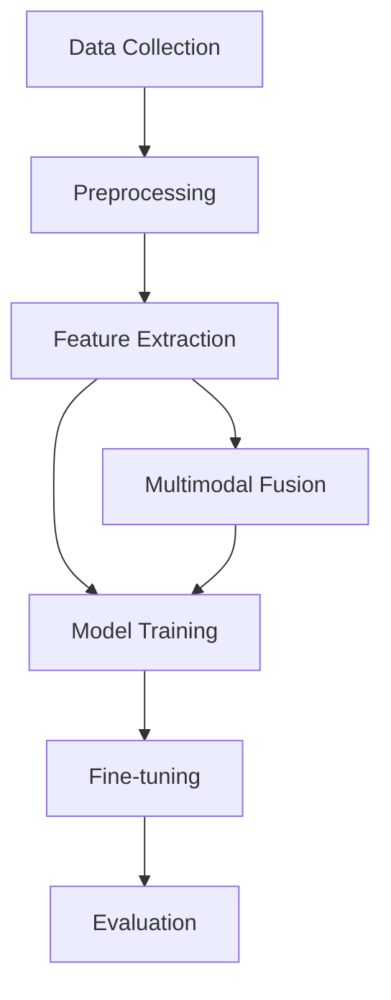

                 

## 1. 背景介绍

在当今的数字世界中，数据以多种形式存在，包括文本、图像、音频和视频等。这些数据模态（modalities）各有特点，但都蕴含着丰富的信息。因此，开发能够处理和理解多模态数据的模型变得至关重要。本文将深入探讨基础模型在多模态数据训练中的应用，并提供实践指南和工具推荐。

## 2. 核心概念与联系

### 2.1 多模态学习

多模态学习（Multimodal Learning）是指利用两个或更多模态的数据进行学习的过程。它旨在开发能够理解和处理不同模态数据的模型，从而提高模型的泛化能力和表达能力。

### 2.2 基础模型

基础模型（Foundational Models）是指在大规模、多模态数据上预训练的模型，旨在学习通用的表示，从而可以在下游任务上进行微调。这些模型通常具有广泛的应用领域，包括自然语言处理（NLP）、计算机视觉（CV）和音频处理等。

下图是多模态数据训练的架构示意图，展示了基础模型在多模态数据训练中的位置：



## 3. 核心算法原理 & 具体操作步骤

### 3.1 算法原理概述

基础模型的多模态数据训练通常遵循预训练-微调（Pre-train and Fine-tune）框架。首先，在大规模、多模态数据上预训练模型，学习通用表示；然后，在特定任务的数据上微调模型，适应任务特定需求。

### 3.2 算法步骤详解

1. **数据收集**：收集包含多种模态数据的大规模数据集。
2. **预处理**：清洗和预处理数据，以便于模型学习。
3. **特征提取**：提取每种模态数据的表示，如文本表示、图像表示等。
4. **模型训练**：在多模态数据上预训练模型，学习通用表示。
5. **多模态融合**：将不同模态的表示进行融合，以便模型能够理解和处理多模态数据。
6. **微调**：在特定任务的数据上微调模型，适应任务特定需求。
7. **评估**：评估模型在特定任务上的性能。

### 3.3 算法优缺点

**优点**：

* 基础模型在大规模、多模态数据上预训练，学习到的表示通用且有表达能力。
* 多模态数据训练可以提高模型的泛化能力和表达能力。
* 微调可以适应特定任务的需求，节省计算资源。

**缺点**：

* 训练基础模型需要大量的计算资源和数据。
* 多模态数据训练的挑战在于如何有效地融合不同模态的表示。
* 微调可能导致模型过拟合，需要慎重设置超参数。

### 3.4 算法应用领域

基础模型的多模态数据训练在各种领域都有应用，包括但不限于：

* 视觉问答（Visual Question Answering）：使用图像和文本数据训练模型，回答图像相关的问题。
* 图像描述（Image Captioning）：使用图像和文本数据训练模型，生成图像的描述。
* 多模态情感分析（Multimodal Sentiment Analysis）：使用文本、图像和音频数据训练模型，分析情感。

## 4. 数学模型和公式 & 详细讲解 & 举例说明

### 4.1 数学模型构建

假设我们有文本模态 $X_t$ 和图像模态 $X_i$，我们想要学习文本表示 $h_t$ 和图像表示 $h_i$。我们可以使用编码器-解码器架构构建模型，其中编码器负责学习表示，解码器负责多模态融合。

### 4.2 公式推导过程

编码器可以使用transformer结构，其自注意力机制可以有效地学习表示。给定文本模态 $X_t$ 和图像模态 $X_i$，编码器输出文本表示 $h_t$ 和图像表示 $h_i$：

$$h_t = Encoder_t(X_t), \quad h_i = Encoder_i(X_i)$$

解码器则可以使用简单的线性层进行多模态融合：

$$h_{fusion} = W[h_t || h_i] + b$$

其中 $W$ 和 $b$ 是学习参数， $||$ 表示拼接操作。

### 4.3 案例分析与讲解

例如，在视觉问答任务中，我们可以使用预训练的BERT模型作为文本编码器，预训练的ResNet模型作为图像编码器。然后，我们可以使用简单的线性层进行多模态融合，并使用交叉熵损失函数训练模型。

## 5. 项目实践：代码实例和详细解释说明

### 5.1 开发环境搭建

我们将使用PyTorch和Hugging Face的transformers库实现基础模型的多模态数据训练。首先，安装必要的库：

```bash
pip install torch transformers
```

### 5.2 源代码详细实现

以下是多模态数据训练的示例代码：

```python
import torch
from transformers import BertModel, BertTokenizer, ResNetModel, ResNetConfig

# Load pre-trained models
bert = BertModel.from_pretrained('bert-base-uncased')
resnet = ResNetModel.from_pretrained('resnet50')
tokenizer = BertTokenizer.from_pretrained('bert-base-uncased')

# Define the fusion layer
class FusionLayer(torch.nn.Module):
    def __init__(self, hidden_size):
        super(FusionLayer, self).__init__()
        self.linear = torch.nn.Linear(hidden_size * 2, hidden_size)

    def forward(self, h_t, h_i):
        return self.linear(torch.cat([h_t, h_i], dim=1))

# Initialize the fusion layer
fusion = FusionLayer(bert.config.hidden_size)

# Define the loss function and optimizer
criterion = torch.nn.CrossEntropyLoss()
optimizer = torch.optim.Adam(list(bert.parameters()) + list(resnet.parameters()) + list(fusion.parameters()))

# Train the model
for epoch in range(num_epochs):
    for batch in train_loader:
        # Preprocess the data
        text = batch['text']
        image = batch['image']
        label = batch['label']

        # Encode the text and image
        input_ids = tokenizer(text, padding=True, truncation=True, return_tensors='pt').input_ids.to(device)
        attention_mask = tokenizer(text, padding=True, truncation=True, return_tensors='pt').attention_mask.to(device)
        h_t = bert(input_ids, attention_mask=attention_mask).last_hidden_state[:, 0, :]
        h_i = resnet(image.to(device)).pooler_output

        # Fuse the text and image representations
        h_fusion = fusion(h_t, h_i)

        # Compute the loss
        loss = criterion(h_fusion, label.to(device))

        # Backpropagate and update the parameters
        optimizer.zero_grad()
        loss.backward()
        optimizer.step()
```

### 5.3 代码解读与分析

在代码中，我们首先加载预训练的BERT模型和ResNet模型。然后，我们定义了一个简单的线性层作为多模态融合层。在训练过程中，我们首先预处理文本和图像数据，然后使用BERT和ResNet编码器学习文本表示和图像表示。接着，我们使用多模态融合层将表示进行融合，并使用交叉熵损失函数训练模型。

### 5.4 运行结果展示

在训练过程中，我们可以监控损失函数的值，观察模型的收敛情况。在评估过程中，我们可以计算模型在测试集上的准确率，评估模型的性能。

## 6. 实际应用场景

基础模型的多模态数据训练在各种实际应用场景中都有广泛的应用，包括但不限于：

* **视觉搜索**：使用图像和文本数据训练模型，搜索与查询图像相似的图像。
* **多模态推荐**：使用文本、图像和音频数据训练模型，为用户推荐内容。
* **自动驾驶**：使用图像和文本数据训练模型，理解环境并做出决策。

### 6.4 未来应用展望

随着多模态数据的不断丰富和计算资源的不断提高，基础模型的多模态数据训练将会有更广泛的应用。未来，我们可以期待模型能够理解和处理更多种类的模态数据，从而开发出更智能的应用。

## 7. 工具和资源推荐

### 7.1 学习资源推荐

* **文献**：[A Survey of Multimodal Learning](https://arxiv.org/abs/2006.10027)，[Multimodal Foundational Models](https://arxiv.org/abs/2104.06790)
* **课程**：[Stanford CS224n: Natural Language Processing with Deep Learning](https://online.stanford.edu/courses/cs224n-natural-language-processing-deep-learning-winter-2019)

### 7.2 开发工具推荐

* **PyTorch**：<https://pytorch.org/>
* **Hugging Face Transformers**：<https://huggingface.co/transformers/>
* **TensorFlow**：<https://www.tensorflow.org/>

### 7.3 相关论文推荐

* [CLIP: Contrastive Language-Image Pre-training](https://arxiv.org/abs/2005.11998)
* [ViLBERT: Pretraining Task-Agnostic Visiolinguistic Representations for Vision-and-Language Tasks](https://arxiv.org/abs/1908.02265)
* [UNITER: UNiversal Image-TExt Representation Learning](https://arxiv.org/abs/1909.11740)

## 8. 总结：未来发展趋势与挑战

### 8.1 研究成果总结

本文介绍了基础模型的多模态数据训练，包括核心概念、算法原理、数学模型和工具推荐。我们展示了如何使用预训练模型学习通用表示，如何进行多模态融合，并提供了示例代码和实际应用场景。

### 8.2 未来发展趋势

未来，基础模型的多模态数据训练将会朝着更多模态、更大规模和更复杂任务的方向发展。我们可以期待模型能够理解和处理更多种类的模态数据，从而开发出更智能的应用。

### 8.3 面临的挑战

然而，基础模型的多模态数据训练也面临着挑战，包括如何有效地融合不同模态的表示，如何在大规模数据上训练模型，如何适应特定任务的需求等。

### 8.4 研究展望

未来的研究方向包括但不限于：

* 研究更有效的多模态融合方法。
* 研究如何在更大规模、更复杂的数据上训练模型。
* 研究如何适应更复杂任务的需求。
* 研究如何在保持通用表示的同时适应特定任务的需求。

## 9. 附录：常见问题与解答

**Q：如何选择预训练模型？**

A：选择预训练模型时，需要考虑模型的大小、复杂度和预训练数据的质量。通常，更大、更复杂的模型在表达能力上更强，但也需要更多的计算资源。

**Q：如何设置超参数？**

A：设置超参数时，需要考虑模型的复杂度、数据的规模和任务的需求。通常，可以通过网格搜索或随机搜索的方式找到最优的超参数组合。

**Q：如何评估模型的性能？**

A：评估模型的性能时，需要选择合适的评估指标，如准确率、精确度、召回率和F1分数等。通常，需要在测试集上评估模型的性能，并与baseline模型进行比较。

**Q：如何处理不平衡数据？**

A：处理不平衡数据时，可以使用过采样、欠采样或SMOTE等技术平衡数据集。也可以使用Focal Loss等损失函数平衡模型的学习。

## 作者：禅与计算机程序设计艺术 / Zen and the Art of Computer Programming

