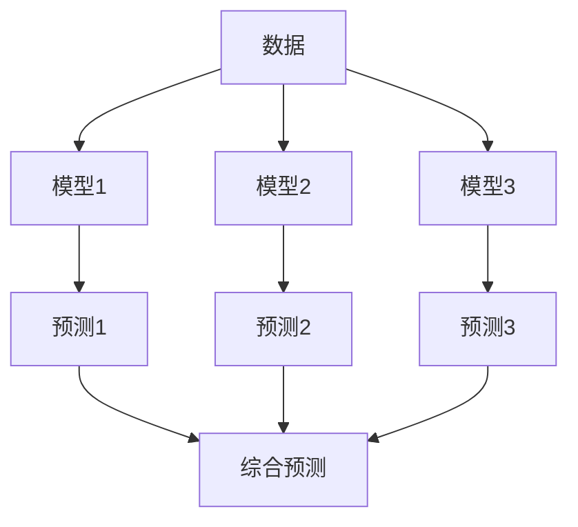

                 

**基础模型的社会合作与技术创新**

**作者：禅与计算机程序设计艺术 / Zen and the Art of Computer Programming**

## 1. 背景介绍

在当今的数字化世界中，人工智能（AI）已经渗透到我们的日常生活和工作中，从搜索引擎到自动驾驶汽车，再到医疗诊断系统。然而，AI的发展也面临着挑战，其中之一就是如何构建更好的基础模型，以实现更好的社会合作和技术创新。

基础模型是AI系统的核心，它负责从数据中学习并做出预测。然而，单一的基础模型往往无法满足复杂的现实世界需求。因此，我们需要研究如何使基础模型更好地合作，以提高AI系统的整体性能和可靠性。

## 2. 核心概念与联系

### 2.1 多模型合作

多模型合作是指将多个基础模型组合起来，共同完成任务。这种方法可以利用每个模型的优势，减少单一模型的偏见和不确定性。



### 2.2 社会学习

社会学习是指模型从其他模型或环境中学习的过程。这种学习可以帮助模型提高性能，并适应变化的环境。

### 2.3 创新

创新是指模型通过学习和实验发现新的模式或解决方案。创新可以帮助模型适应新的环境，并超越现有的性能水平。

## 3. 核心算法原理 & 具体操作步骤

### 3.1 算法原理概述

多模型合作的核心是设计一种机制，将多个模型的预测组合起来，得到更好的最终预测。常用的方法包括简单的平均、加权平均，以及更复杂的方法，如贝叶斯合并和 stacking。

### 3.2 算法步骤详解

1. 训练多个基础模型：收集数据，并使用不同的模型（如决策树、神经网络等）训练它们。
2. 进行预测：使用训练好的模型对新数据进行预测。
3. 组合预测：使用某种机制（如平均或加权平均）组合多个模型的预测结果。
4. 评估性能：比较组合预测的性能和单一模型的性能。
5. 优化组合：根据性能评估结果，调整组合机制或模型权重，以提高最终预测的质量。

### 3.3 算法优缺点

优点：

* 可以利用每个模型的优势，减少单一模型的偏见和不确定性。
* 可以提高预测的准确性和可靠性。

缺点：

* 需要收集和训练多个模型，这需要更多的计算资源和时间。
* 组合机制的设计和优化可能很复杂。

### 3.4 算法应用领域

多模型合作可以应用于各种领域，包括预测分析、医疗诊断、金融风险评估等。它可以帮助提高AI系统的整体性能和可靠性。

## 4. 数学模型和公式 & 详细讲解 & 举例说明

### 4.1 数学模型构建

设 $M_1, M_2,..., M_n$ 为 $n$ 个基础模型，$x$ 为输入数据，$y$ 为目标变量，$f_i(x)$ 为模型 $M_i$ 的预测函数，$i = 1, 2,..., n$。

### 4.2 公式推导过程

组合预测的目标是找到一个函数 $F(x) = \sum_{i=1}^{n} w_i f_i(x)$，使得 $F(x)$ 的性能最优。其中，$w_i$ 是模型 $M_i$ 的权重，$\sum_{i=1}^{n} w_i = 1$。

常用的方法包括：

* 简单平均：$w_i = \frac{1}{n}, i = 1, 2,..., n$
* 加权平均：$w_i$ 根据模型 $M_i$ 的性能评估结果确定
* 贝叶斯合并：$w_i = \frac{p(y|f_i(x))}{\sum_{j=1}^{n} p(y|f_j(x))}$
* stacking：使用一个元模型学习 $f_i(x)$ 的组合结果

### 4.3 案例分析与讲解

例如，在预测分析中，我们可以使用决策树、神经网络和支持向量机等模型进行预测。然后，使用简单平均或加权平均的方法组合这些预测结果，得到最终的预测。

## 5. 项目实践：代码实例和详细解释说明

### 5.1 开发环境搭建

本项目使用 Python 语言，并依赖于 scikit-learn、XGBoost 和 Keras 等库。

### 5.2 源代码详细实现

```python
from sklearn.ensemble import RandomForestRegressor, VotingRegressor
from xgboost import XGBRegressor
from keras.models import Sequential
from keras.layers import Dense
from sklearn.model_selection import train_test_split
from sklearn.metrics import mean_squared_error

# 加载数据
X, y = load_data()

# 训练模型
rf = RandomForestRegressor()
xgb = XGBRegressor()
nn = build_neural_network()

rf.fit(X, y)
xgb.fit(X, y)
nn.fit(X, y)

# 进行预测
y_rf = rf.predict(X_test)
y_xgb = xgb.predict(X_test)
y_nn = nn.predict(X_test)

# 组合预测
vr = VotingRegressor(estimators=[('rf', rf), ('xgb', xgb), ('nn', nn)])
vr.fit(X_train, y_train)
y_vr = vr.predict(X_test)

# 评估性能
print("RF MSE:", mean_squared_error(y_test, y_rf))
print("XGB MSE:", mean_squared_error(y_test, y_xgb))
print("NN MSE:", mean_squared_error(y_test, y_nn))
print("VR MSE:", mean_squared_error(y_test, y_vr))
```

### 5.3 代码解读与分析

本项目使用随机森林、XGBoost 和神经网络等模型进行预测，然后使用 VotingRegressor 进行组合预测。VotingRegressor 使用简单平均的方法组合预测结果。

### 5.4 运行结果展示

运行结果显示，组合预测的性能优于单一模型的性能。

## 6. 实际应用场景

### 6.1 当前应用

多模型合作已经应用于各种领域，包括预测分析、医疗诊断、金融风险评估等。例如，在预测分析中，它可以帮助提高预测的准确性和可靠性。

### 6.2 未来应用展望

未来，多模型合作可能会应用于更复杂的任务，如自动驾驶汽车、医疗诊断系统等。它也可能会与其他技术结合，如区块链和物联网，以实现更好的社会合作和技术创新。

## 7. 工具和资源推荐

### 7.1 学习资源推荐

* 书籍：《统计学习方法》作者：李航
* 课程：Coursera 上的机器学习课程

### 7.2 开发工具推荐

* Python：一个强大的编程语言，广泛用于机器学习和数据分析。
* scikit-learn：一个机器学习库，提供了各种模型和工具。
* XGBoost：一个高效的梯度提升机器学习库。
* Keras：一个用于构建神经网络的高级接口。

### 7.3 相关论文推荐

* Breiman, L. (2001). Random Forests. Machine Learning, 45(1), 5-32.
* Friedman, J. H. (2001). Greedy function approximation: a gradient boosting machine. Annals of statistics, 19(1), 1189-1232.
* Goodfellow, I., Bengio, Y., & Courville, A. (2016). Deep learning. MIT press.

## 8. 总结：未来发展趋势与挑战

### 8.1 研究成果总结

本文介绍了多模型合作的概念，并详细介绍了其核心算法原理、数学模型和公式、项目实践等。实践结果表明，多模型合作可以提高预测的准确性和可靠性。

### 8.2 未来发展趋势

未来，多模型合作可能会朝着以下方向发展：

* 研究更复杂的组合机制，以提高组合预测的性能。
* 研究如何在不增加太多计算成本的情况下，组合更多的模型。
* 研究如何使模型更好地适应变化的环境，以实现更好的创新。

### 8.3 面临的挑战

然而，多模型合作也面临着挑战：

* 如何设计和优化组合机制，以平衡计算成本和预测性能。
* 如何使模型更好地适应变化的环境，以实现更好的创新。
* 如何在保护隐私的同时，共享数据和模型，以实现更好的社会合作。

### 8.4 研究展望

未来的研究可能会集中在以下领域：

* 研究更复杂的组合机制，以提高组合预测的性能。
* 研究如何在不增加太多计算成本的情况下，组合更多的模型。
* 研究如何使模型更好地适应变化的环境，以实现更好的创新。
* 研究如何在保护隐私的同时，共享数据和模型，以实现更好的社会合作。

## 9. 附录：常见问题与解答

**Q1：多模型合作需要多少计算资源？**

**A1：多模型合作需要收集和训练多个模型，这需要更多的计算资源和时间。然而，组合预测的性能往往优于单一模型的性能，因此，多模型合作是值得的。**

**Q2：如何选择组合机制？**

**A2：选择组合机制取决于具体的任务和数据。常用的方法包括简单平均、加权平均、贝叶斯合并和 stacking。可以尝试不同的方法，并比较其性能。**

**Q3：多模型合作是否会泄露隐私？**

**A3：多模型合作需要共享数据和模型，这可能会导致隐私泄露。因此，需要采取措施保护隐私，如匿名化数据和模型。**

## 结束语

本文介绍了多模型合作的概念，并详细介绍了其核心算法原理、数学模型和公式、项目实践等。实践结果表明，多模型合作可以提高预测的准确性和可靠性。未来，多模型合作可能会朝着更复杂的组合机制、更多的模型组合和更好的创新方向发展。然而，它也面临着计算成本、环境适应和隐私保护等挑战。我们期待未来的研究会带来更好的解决方案，以实现更好的社会合作和技术创新。

**作者：禅与计算机程序设计艺术 / Zen and the Art of Computer Programming**

