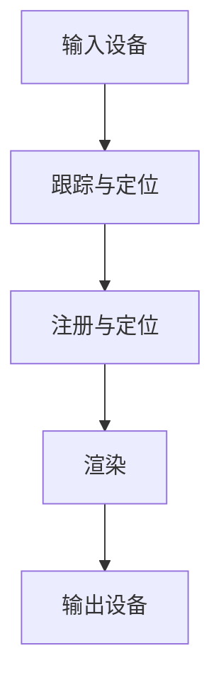
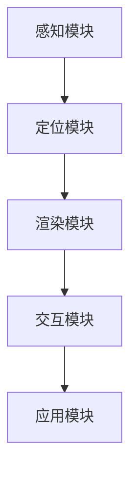

                 

AR、电商、增强现实技术、商业应用、用户体验、技术架构、算法、数学模型、项目实践、应用场景、工具资源、未来趋势

## 1. 背景介绍

随着移动互联网的发展，电商行业竞争日益激烈，如何提升用户体验、吸引消费者，成为各大电商平台面临的共同挑战。增强现实（Augmented Reality，AR）技术的出现，为电商行业带来了全新的可能性。本文将从技术应用、商业价值、算法原理、数学模型、项目实践等角度，分析AR技术在电商领域的应用案例。

## 2. 核心概念与联系

### 2.1 AR技术原理

AR技术是一种实时地将虚拟信息（如图像、声音、3D模型等）叠加到真实世界环境中的技术。AR系统通常由以下几个组成部分构成：

### 2.2 AR技术架构

AR技术架构主要包括以下几个模块：

## 3. 核心算法原理 & 具体操作步骤

### 3.1 算法原理概述

AR算法的核心是注册算法，其目的是将虚拟物体准确地定位到真实世界中。常用的注册算法包括特征点法、模板匹配法、光流法等。

### 3.2 算法步骤详解

以特征点法为例，其步骤如下：

1. 特征提取：提取真实世界图像和虚拟物体图像中的特征点。
2. 特征匹配：将真实世界图像中的特征点与虚拟物体图像中的特征点进行匹配。
3. 单应性矩阵估计：使用匹配点估计单应性矩阵。
4. 位姿估计：使用单应性矩阵估计虚拟物体的位姿。
5. 叠加渲染：根据虚拟物体的位姿，将其叠加到真实世界图像中。

### 3.3 算法优缺点

特征点法具有实时性好、鲁棒性强等优点，但其缺点是计算量大，对特征点的质量要求高。

### 3.4 算法应用领域

AR算法在电商领域的应用主要包括虚拟试穿、虚拟家具摆放等。

## 4. 数学模型和公式 & 详细讲解 & 举例说明

### 4.1 数学模型构建

AR数学模型的核心是位姿估计模型。设真实世界图像为$I_{r}$，虚拟物体图像为$I_{v}$，则位姿估计模型可以表示为：

$$I_{r} = f(I_{v}, P, \theta)$$

其中，$P$为虚拟物体的位姿，$θ$为相机内参。

### 4.2 公式推导过程

位姿估计模型的推导过程如下：

1. 使用特征点法或其他注册算法，估计虚拟物体的位姿$P$。
2. 使用相机内参$θ$和虚拟物体图像$I_{v}$，预测真实世界图像$I_{r}$。
3. 使用最小均方误差（Mean Squared Error，MSE）或其他评价指标，评估预测结果的准确性。
4. 使用梯度下降法或其他优化算法，优化虚拟物体的位姿$P$和相机内参$θ$。

### 4.3 案例分析与讲解

例如，在虚拟试穿场景中，真实世界图像为用户的自拍照，虚拟物体图像为服装图像。使用特征点法估计服装的位姿，然后使用相机内参和服装图像预测用户穿着服装的效果。通过优化服装的位姿和相机内参，提高虚拟试穿的准确性。

## 5. 项目实践：代码实例和详细解释说明

### 5.1 开发环境搭建

AR项目开发环境包括AR开发平台（如ARCore、ARKit）、图像处理库（如OpenCV）、3D渲染引擎（如Unity）等。

### 5.2 源代码详细实现

以Unity和ARCore为例，AR项目的源代码实现包括以下几个步骤：

1. 导入ARCore插件和ARCore Unity SDK。
2. 创建ARCore Session和ARCore Camera。
3. 使用ARCore Session配置相机参数。
4. 使用ARCore Session检测平面并放置虚拟物体。
5. 使用ARCore Camera渲染虚拟物体和真实世界图像。

### 5.3 代码解读与分析

AR项目的代码解读与分析包括以下几个方面：

1. ARCore Session的配置参数，如相机内参、平面检测参数等。
2. ARCore Session的平面检测算法，如多视图几何一致性算法等。
3. ARCore Camera的渲染算法，如深度缓冲渲染算法等。
4. 虚拟物体的位姿估计算法，如特征点法等。

### 5.4 运行结果展示

AR项目的运行结果展示包括以下几个方面：

1. ARCore Session的平面检测结果，如检测到的平面数量、平面位置等。
2. 虚拟物体的位姿估计结果，如虚拟物体的位置、姿态等。
3. ARCore Camera的渲染结果，如虚拟物体和真实世界图像的叠加效果等。

## 6. 实际应用场景

### 6.1 虚拟试穿

AR技术在电商领域的应用之一是虚拟试穿。用户可以通过AR技术穿戴虚拟服装，查看穿着效果，提高购物体验。

### 6.2 虚拟家具摆放

AR技术还可以应用于虚拟家具摆放。用户可以通过AR技术将虚拟家具放置到真实环境中，查看家具与环境的匹配度，提高购物体验。

### 6.3 未来应用展望

AR技术在电商领域的应用前景广阔。未来，AR技术有望应用于虚拟试妆、虚拟家居设计等领域，为用户提供更加丰富的购物体验。

## 7. 工具和资源推荐

### 7.1 学习资源推荐

AR技术的学习资源包括AR开发平台官方文档、AR技术相关论文、AR技术在线课程等。

### 7.2 开发工具推荐

AR技术的开发工具包括AR开发平台（如ARCore、ARKit）、图像处理库（如OpenCV）、3D渲染引擎（如Unity）等。

### 7.3 相关论文推荐

AR技术相关论文包括：

* Azuma, R. T., Baillot, Y., Behringer, R., Feiner, S. K., & Julier, S. J. (1997). Recent advances in augmented reality. IEEE computer graphics and applications, 17(3), 30-37.
* Kato, H., & Billinghurst, M. (1999). ARToolKit: A marker tracking library for augmented reality. Proceedings of the 2nd international workshop on Augmented reality, 95-104.
* Zhang, K., & Koltun, V. (2018). On the importance of being earnest: An analysis of ARCore and ARKit. arXiv preprint arXiv:1804.02737.

## 8. 总结：未来发展趋势与挑战

### 8.1 研究成果总结

AR技术在电商领域的应用取得了显著成果，为用户提供了更加丰富的购物体验。然而，AR技术仍然面临着技术挑战，如注册精确度、渲染实时性等。

### 8.2 未来发展趋势

AR技术在电商领域的应用将会继续发展，未来有望应用于更多领域，为用户提供更加丰富的购物体验。此外，AR技术还将与人工智能、物联网等技术结合，为电商行业带来更多可能性。

### 8.3 面临的挑战

AR技术在电商领域的应用面临着技术挑战，如注册精确度、渲染实时性等。此外，AR技术还面临着用户接受度、技术成本等商业挑战。

### 8.4 研究展望

AR技术在电商领域的应用将是未来研究的重点方向之一。未来的研究将会聚焦于注册精确度、渲染实时性、用户接受度等方面，为电商行业带来更多可能性。

## 9. 附录：常见问题与解答

### 9.1 AR技术与虚拟现实（VR）技术有何区别？

AR技术与VR技术的区别在于，AR技术将虚拟信息叠加到真实世界环境中，而VR技术则创建一个完全虚拟的环境。

### 9.2 AR技术在电商领域的优势是什么？

AR技术在电商领域的优势包括提高用户体验、提高购物转化率、降低退货率等。

### 9.3 AR技术在电商领域的挑战是什么？

AR技术在电商领域的挑战包括技术成本高、用户接受度低、技术实时性差等。

## 作者：禅与计算机程序设计艺术 / Zen and the Art of Computer Programming

