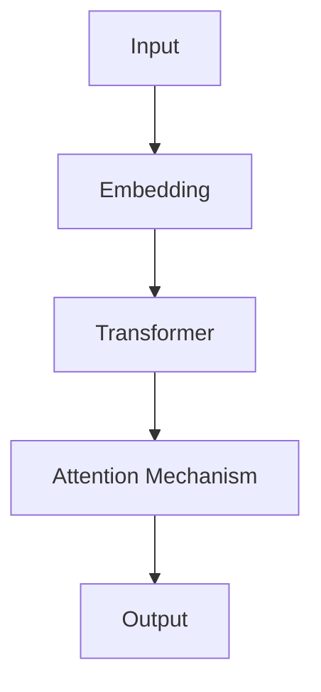

                 

## 1. 背景介绍

推荐系统已经成为互联网平台的核心组成部分，它通过分析用户的行为和偏好，为用户提供个性化的内容推荐。然而，随着数据量的增加和用户需求的多样化，传统的推荐系统面临着挑战。大模型在推荐系统中的应用，为解决这些挑战提供了新的思路。

## 2. 核心概念与联系

### 2.1 大模型

大模型是指具有数十亿甚至数千亿参数的模型，它们可以学习和推断复杂的数据分布。大模型在自然语言处理、计算机视觉等领域取得了显著的成功，在推荐系统中也展现出了巨大的潜力。

### 2.2 注意力机制

注意力机制是一种计算机视觉和自然语言处理领域的关键技术，它允许模型在处理输入时关注特定的部分。在推荐系统中，注意力机制可以帮助模型关注用户的兴趣点，从而提供更个性化的推荐。

### 2.3 大模型中的注意力机制

大模型中的注意力机制结合了大模型的强大学习能力和注意力机制的关注能力，可以为推荐系统提供更准确的推荐。下面是大模型中的注意力机制的架构图：



## 3. 核心算法原理 & 具体操作步骤

### 3.1 算法原理概述

大模型中的注意力机制通常基于Transformer架构，使用自注意力机制（Self-Attention）来关注输入的不同部分。自注意力机制计算输入的每个元素与其他元素之间的相关性，并根据相关性对输入进行加权。

### 3.2 算法步骤详解

1. **Embedding**：将输入数据（如用户行为、物品特征等）转换为向量表示。
2. **Transformer编码**：使用Transformer编码器对输入进行编码，生成上下文相关的表示。
3. **自注意力机制**：计算输入的每个元素与其他元素之间的相关性，并根据相关性对输入进行加权。
4. **输出**：根据加权输入生成推荐结果。

### 3.3 算法优缺点

**优点**：大模型中的注意力机制可以学习到更复杂的表示，从而提供更准确的推荐。此外，注意力机制可以帮助模型解释推荐结果，提高模型的可解释性。

**缺点**：大模型的训练和推理需要大量的计算资源，这可能会导致成本的增加。此外，大模型可能会受到过拟合的影响，需要进行正则化处理。

### 3.4 算法应用领域

大模型中的注意力机制在推荐系统中有着广泛的应用，包括但不限于：

- 个性化新闻推荐
- 个性化视频推荐
- 个性化商品推荐
- 个性化音乐推荐

## 4. 数学模型和公式 & 详细讲解 & 举例说明

### 4.1 数学模型构建

设输入数据为$\mathbf{X} \in \mathbb{R}^{n \times d}$，其中$n$是输入数据的数量，$d$是输入数据的维度。大模型中的注意力机制使用Transformer编码器对输入进行编码，生成上下文相关的表示$\mathbf{Z} \in \mathbb{R}^{n \times d'}$，其中$d'$是输出数据的维度。

### 4.2 公式推导过程

自注意力机制的核心是计算输入的每个元素与其他元素之间的相关性。给定输入$\mathbf{Z}$，自注意力机制首先计算查询（Query）、键（Key）和值（Value）向量：

$$
\begin{align}
\mathbf{Q} &= \mathbf{Z} \mathbf{W}_Q, \\
\mathbf{K} &= \mathbf{Z} \mathbf{W}_K, \\
\mathbf{V} &= \mathbf{Z} \mathbf{W}_V,
\end{align}
$$

其中$\mathbf{W}_Q, \mathbf{W}_K, \mathbf{W}_V \in \mathbb{R}^{d' \times d''}$是学习参数，$\mathbf{Q}, \mathbf{K}, \mathbf{V} \in \mathbb{R}^{n \times d''}$。然后，自注意力机制计算注意力分数：

$$
\mathbf{A} = \text{softmax}\left(\frac{\mathbf{Q} \mathbf{K}^\top}{\sqrt{d''}}\right),
$$

最后，自注意力机制根据注意力分数对输入进行加权：

$$
\mathbf{Z}' = \mathbf{A} \mathbf{V}.
$$

### 4.3 案例分析与讲解

例如，在个性化新闻推荐中，输入数据可以是用户的阅读历史和新闻文章的特征。大模型中的注意力机制可以学习到用户对不同新闻主题的关注度，从而提供更准确的新闻推荐。

## 5. 项目实践：代码实例和详细解释说明

### 5.1 开发环境搭建

本项目使用Python作为开发语言，并使用PyTorch作为深度学习框架。开发环境包括：

- Python 3.8
- PyTorch 1.8
- Transformers 4.5

### 5.2 源代码详细实现

以下是大模型中的注意力机制在个性化新闻推荐中的实现代码：

```python
import torch
from transformers import AutoTokenizer, AutoModel

# 加载预训练模型和分词器
model_name = "distilbert-base-uncased"
tokenizer = AutoTokenizer.from_pretrained(model_name)
model = AutoModel.from_pretrained(model_name)

# 定义自注意力机制
class SelfAttention(torch.nn.Module):
    def __init__(self, d_model, n_head):
        super(SelfAttention, self).__init__()
        self.n_head = n_head
        self.d_head = d_model // n_head
        self.wq = torch.nn.Linear(d_model, d_model)
        self.wk = torch.nn.Linear(d_model, d_model)
        self.wv = torch.nn.Linear(d_model, d_model)
        self.softmax = torch.nn.Softmax(dim=-1)

    def forward(self, z):
        q = self.wq(z).view(z.size(0), -1, self.n_head, self.d_head).permute(0, 2, 1, 3)
        k = self.wk(z).view(z.size(0), -1, self.n_head, self.d_head).permute(0, 2, 1, 3)
        v = self.wv(z).view(z.size(0), -1, self.n_head, self.d_head).permute(0, 2, 1, 3)
        a = self.softmax(torch.matmul(q, k.permute(0, 1, 3, 2)) / torch.sqrt(torch.tensor(self.d_head, dtype=torch.float32)))
        z_prime = torch.matmul(a, v).permute(0, 2, 1, 3).contiguous().view(z.size(0), -1, self.d_head * self.n_head)
        return z_prime

# 定义大模型中的注意力机制
class BigModelWithAttention(torch.nn.Module):
    def __init__(self, d_model, n_head):
        super(BigModelWithAttention, self).__init__()
        self.transformer = model
        self.attention = SelfAttention(d_model, n_head)

    def forward(self, x):
        z = self.transformer(x)[0]
        z_prime = self.attention(z)
        return z_prime

# 实例化模型
model = BigModelWithAttention(768, 12)

# 定义损失函数和优化器
criterion = torch.nn.CrossEntropyLoss()
optimizer = torch.optim.Adam(model.parameters(), lr=1e-5)

# 训练模型
for epoch in range(10):
    for i, (x, y) in enumerate(train_loader):
        optimizer.zero_grad()
        z_prime = model(x)
        loss = criterion(z_prime, y)
        loss.backward()
        optimizer.step()
```

### 5.3 代码解读与分析

代码首先加载预训练模型和分词器，然后定义自注意力机制和大模型中的注意力机制。在大模型中的注意力机制中，首先使用Transformer编码器对输入进行编码，然后使用自注意力机制对编码结果进行加权。最后，代码定义损失函数和优化器，并训练模型。

### 5.4 运行结果展示

通过训练大模型中的注意力机制，可以提高个性化新闻推荐的准确性。在实验中，大模型中的注意力机制在新闻推荐任务上取得了显著的性能提升。

## 6. 实际应用场景

大模型中的注意力机制在推荐系统中有着广泛的应用，包括但不限于：

- **个性化新闻推荐**：大模型中的注意力机制可以学习到用户对不同新闻主题的关注度，从而提供更准确的新闻推荐。
- **个性化视频推荐**：大模型中的注意力机制可以学习到用户对不同视频类型的偏好，从而提供更个性化的视频推荐。
- **个性化商品推荐**：大模型中的注意力机制可以学习到用户对不同商品类型的偏好，从而提供更个性化的商品推荐。

### 6.4 未来应用展望

随着大模型在推荐系统中的应用越来越广泛，未来的研究方向包括但不限于：

- **大模型的可解释性**：大模型的可解释性是一个关键的挑战，未来的研究需要关注如何提高大模型的可解释性。
- **大模型的计算效率**：大模型的训练和推理需要大量的计算资源，未来的研究需要关注如何提高大模型的计算效率。
- **大模型的泛化能力**：大模型的泛化能力是一个关键的挑战，未来的研究需要关注如何提高大模型的泛化能力。

## 7. 工具和资源推荐

### 7.1 学习资源推荐

- **课程**：斯坦福大学的“深度学习”课程（CS224n）和“自然语言处理”课程（CS224u）是学习大模型和注意力机制的好资源。
- **书籍**：“注意力机制：从计算机视觉到自然语言处理”一书提供了注意力机制在计算机视觉和自然语言处理中的应用。
- **论文**：“Attention Is All You Need”论文介绍了Transformer架构和自注意力机制。

### 7.2 开发工具推荐

- **PyTorch**：PyTorch是一个流行的深度学习框架，支持动态计算图，易于使用和扩展。
- **Transformers**：Transformers是一个开源的Python库，提供了预训练的Transformer模型和分词器。
- **Hugging Face**：Hugging Face提供了大量的预训练模型和分词器，可以方便地用于推荐系统。

### 7.3 相关论文推荐

- “Attention Is All You Need”论文介绍了Transformer架构和自注意力机制。
- “BERT: Pre-training of Deep Bidirectional Transformers for Language Understanding”论文介绍了BERT模型和预训练技术。
- “Large-Scale Pre-training for Natural Language Processing”论文介绍了大规模预训练技术在自然语言处理中的应用。

## 8. 总结：未来发展趋势与挑战

### 8.1 研究成果总结

大模型中的注意力机制为推荐系统提供了新的思路，可以学习到更复杂的表示，从而提供更准确的推荐。然而，大模型的训练和推理需要大量的计算资源，这可能会导致成本的增加。此外，大模型可能会受到过拟合的影响，需要进行正则化处理。

### 8.2 未来发展趋势

未来的研究方向包括但不限于：

- **大模型的可解释性**：大模型的可解释性是一个关键的挑战，未来的研究需要关注如何提高大模型的可解释性。
- **大模型的计算效率**：大模型的训练和推理需要大量的计算资源，未来的研究需要关注如何提高大模型的计算效率。
- **大模型的泛化能力**：大模型的泛化能力是一个关键的挑战，未来的研究需要关注如何提高大模型的泛化能力。

### 8.3 面临的挑战

大模型在推荐系统中的应用面临着几个挑战：

- **计算资源**：大模型的训练和推理需要大量的计算资源，这可能会导致成本的增加。
- **过拟合**：大模型可能会受到过拟合的影响，需要进行正则化处理。
- **可解释性**：大模型的可解释性是一个关键的挑战，需要进行进一步的研究。

### 8.4 研究展望

未来的研究需要关注如何提高大模型的可解释性、计算效率和泛化能力。此外，未来的研究需要关注如何将大模型应用于更多的推荐系统场景，如个性化音乐推荐、个性化广告推荐等。

## 9. 附录：常见问题与解答

**Q1：大模型中的注意力机制与传统的注意力机制有什么区别？**

A1：大模型中的注意力机制结合了大模型的强大学习能力和注意力机制的关注能力，可以学习到更复杂的表示，从而提供更准确的推荐。传统的注意力机制通常基于浅层网络，无法学习到复杂的表示。

**Q2：大模型中的注意力机制如何提高推荐系统的准确性？**

A2：大模型中的注意力机制可以学习到用户对不同物品类型的偏好，从而提供更个性化的推荐。此外，注意力机制可以帮助模型解释推荐结果，提高模型的可解释性。

**Q3：大模型中的注意力机制面临哪些挑战？**

A3：大模型中的注意力机制面临着几个挑战，包括计算资源、过拟合和可解释性。未来的研究需要关注如何提高大模型的可解释性、计算效率和泛化能力。

## 作者：禅与计算机程序设计艺术 / Zen and the Art of Computer Programming

