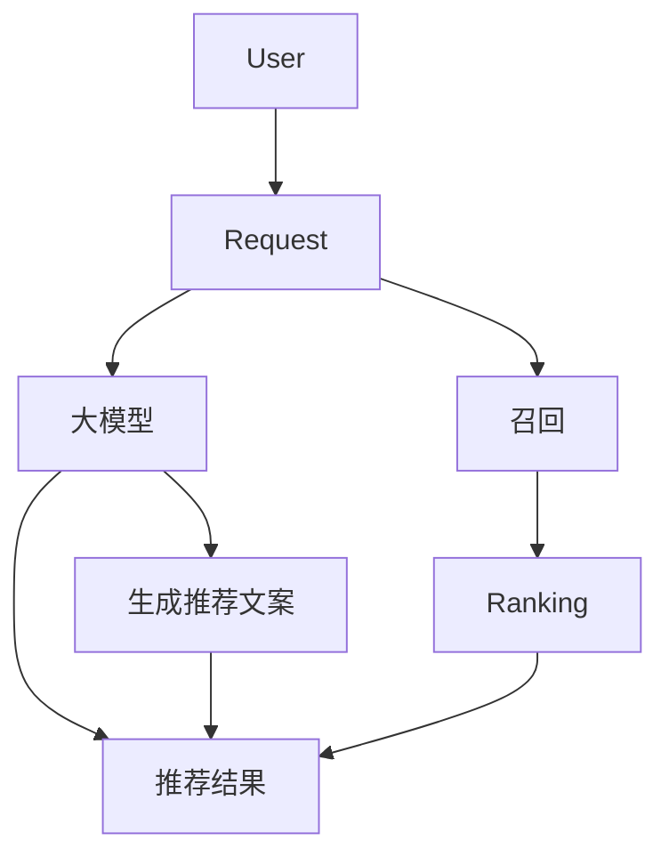

                 

## 1. 背景介绍

随着大数据和人工智能技术的发展，推荐系统已成为互联网平台的核心组成部分，为用户提供个性化的内容和产品推荐。然而，大模型的引入和应用正在改变推荐系统的 landscape，其中实时性是一个关键的考量因素。本文将深入探讨大模型对推荐系统实时性的影响，并提供解决方案和未来展望。

## 2. 核心概念与联系

### 2.1 大模型与推荐系统

大模型（Large Language Models，LLMs）是一种通过处理大量文本数据训练而来的模型，具有强大的理解和生成文本的能力。在推荐系统中，大模型可以用于理解用户偏好、生成个性化推荐文案，或作为召回模型帮助过滤海量候选项。

### 2.2 实时性（Real-time）

实时性是指系统能够在用户请求发出后尽快响应，提供即时的结果。在推荐系统中，实时性至关重要，因为用户期望在短时间内看到相关的推荐结果。

下图展示了大模型在推荐系统中的位置和实时性的关键路径：



## 3. 核心算法原理 & 具体操作步骤

### 3.1 算法原理概述

大模型在推荐系统中的应用主要基于其强大的文本理解和生成能力。常见的应用场景包括：

1. **用户偏好理解**：大模型可以分析用户的历史行为和交互数据，理解用户的兴趣和偏好。
2. **推荐文案生成**：大模型可以生成个性化的推荐文案，吸引用户点击和互动。
3. **召回模型**：大模型可以帮助过滤海量候选项，提高召回效率。

### 3.2 算法步骤详解

以大模型在推荐系统中的召回应用为例，其具体操作步骤如下：

1. **数据预处理**：收集和清洗用户交互数据、产品信息等数据。
2. **特征工程**：提取用户、产品和交互等特征，为大模型提供输入。
3. **大模型训练**：使用预处理后的数据训练大模型，学习用户偏好和产品特征。
4. **召回**：在用户请求到来时，使用大模型生成候选推荐项。
5. ** Ranking**：对候选推荐项进行排序，提供最终的推荐结果。

### 3.3 算法优缺点

大模型在推荐系统中的优势包括：

- 理解用户偏好能力强
- 可以生成个性化推荐文案
- 可以提高召回效率

然而，大模型也存在一些缺点：

- 训练和推理成本高
- 实时性可能受到影响
- 解释性差，难以理解模型决策

### 3.4 算法应用领域

大模型在推荐系统中的应用领域包括电子商务、内容推荐、个性化广告等。随着大模型技术的发展，其应用领域还在不断扩展。

## 4. 数学模型和公式 & 详细讲解 & 举例说明

### 4.1 数学模型构建

大模型在推荐系统中的数学模型可以表示为：

$$P(R|U) = \frac{exp(s(U,R))}{\sum_{R' \in C} exp(s(U,R'))}$$

其中，$U$表示用户，$R$表示推荐项，$C$表示候选推荐项集，$s(U,R)$表示用户$U$对推荐项$R$的偏好得分。

### 4.2 公式推导过程

大模型的偏好得分$s(U,R)$通常通过大模型的输出层生成，表示用户$U$对推荐项$R$的偏好。推荐系统的目标是最大化用户$U$对推荐项$R$的偏好得分。

### 4.3 案例分析与讲解

例如，在电子商务平台中，大模型可以学习用户的购买历史和产品特征，生成用户对产品的偏好得分。通过最大化偏好得分，推荐系统可以为用户提供个性化的产品推荐。

## 5. 项目实践：代码实例和详细解释说明

### 5.1 开发环境搭建

开发环境需要安装Python、PyTorch或TensorFlow等深度学习框架，以及-transformers库等大模型库。

### 5.2 源代码详细实现

以下是大模型在推荐系统中的简单实现示例：

```python
from transformers import AutoTokenizer, AutoModelForSequenceClassification
import torch

# 加载大模型
model_name = "distilbert-base-uncased-finetuned-sst-2-english"
tokenizer = AutoTokenizer.from_pretrained(model_name)
model = AutoModelForSequenceClassification.from_pretrained(model_name)

# 准备数据
user_history = "用户购买历史数据"
product_description = "产品描述数据"

# 编码数据
inputs = tokenizer(user_history, product_description, return_tensors="pt")

# 推理
outputs = model(**inputs)
logits = outputs.logits

# 生成偏好得分
score = logits.argmax(dim=1).item()

print(f"用户对产品的偏好得分：{score}")
```

### 5.3 代码解读与分析

上述代码使用了预训练的大模型，并对用户购买历史和产品描述进行了编码。然后，大模型生成了用户对产品的偏好得分。

### 5.4 运行结果展示

运行结果将显示用户对产品的偏好得分，该得分可以用于推荐系统的 Ranking 过程。

## 6. 实际应用场景

### 6.1 当前应用

大模型已在各种推荐系统中得到应用，例如：

- **内容推荐**：大模型可以帮助理解用户偏好，为用户提供个性化的内容推荐。
- **个性化广告**：大模型可以生成个性化的广告文案，吸引用户点击和互动。

### 6.2 未来应用展望

随着大模型技术的发展，未来大模型在推荐系统中的应用将更加广泛，例如：

- **实时推荐**：大模型可以帮助推荐系统实现实时推荐，为用户提供即时的个性化推荐。
- **多模态推荐**：大模型可以结合文本、图像和音频等多模态数据，为用户提供更丰富的推荐体验。

## 7. 工具和资源推荐

### 7.1 学习资源推荐

- **大模型相关论文**：[Attention Is All You Need](https://arxiv.org/abs/1706.03762)、[BERT: Pre-training of Deep Bidirectional Transformers for Language Understanding](https://arxiv.org/abs/1810.04805)
- **推荐系统相关书籍**：[Recommender Systems: The Textbook](https://www.oreilly.com/library/view/recommender-systems-the/9781492086328/)

### 7.2 开发工具推荐

- **大模型库**：[Hugging Face Transformers](https://huggingface.co/transformers/)、[EleutherAI](https://github.com/EleutherAI)
- **推荐系统库**：[LightFM](https://github.com/lyst/lightfm)、[Implicit](https://github.com/benfred/implicit)

### 7.3 相关论文推荐

- [Large Language Models Are Zero-Shot Reasoners](https://arxiv.org/abs/2005.14344)
- [Recommending with Large Language Models](https://arxiv.org/abs/2108.02263)

## 8. 总结：未来发展趋势与挑战

### 8.1 研究成果总结

本文介绍了大模型在推荐系统中的应用，分析了其对推荐系统实时性的影响，并提供了解决方案和未来展望。

### 8.2 未来发展趋势

未来，大模型在推荐系统中的应用将更加广泛，实时性将成为关键考量因素。大模型技术的发展将推动推荐系统的进一步发展。

### 8.3 面临的挑战

然而，大模型在推荐系统中的应用也面临着挑战，包括：

- **成本**：大模型的训练和推理成本高，需要优化模型和硬件。
- **实时性**：大模型的推理速度可能影响推荐系统的实时性，需要优化模型和算法。
- **解释性**：大模型难以解释其决策，需要开发解释性技术。

### 8.4 研究展望

未来的研究方向包括：

- **模型优化**：优化大模型的训练和推理速度，降低成本。
- **算法创新**：开发新的算法，提高大模型在推荐系统中的实时性。
- **解释性技术**：开发新的技术，提高大模型的解释性。

## 9. 附录：常见问题与解答

**Q：大模型在推荐系统中的优势是什么？**

A：大模型在推荐系统中的优势包括理解用户偏好能力强、可以生成个性化推荐文案、可以提高召回效率。

**Q：大模型在推荐系统中的缺点是什么？**

A：大模型在推荐系统中的缺点包括训练和推理成本高、实时性可能受到影响、解释性差，难以理解模型决策。

**Q：大模型在推荐系统中的应用领域有哪些？**

A：大模型在推荐系统中的应用领域包括电子商务、内容推荐、个性化广告等。

## 作者：禅与计算机程序设计艺术 / Zen and the Art of Computer Programming

