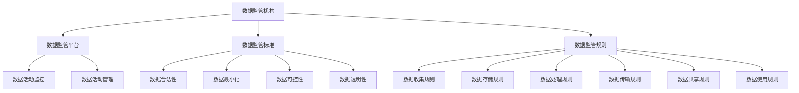

                 

**平台经济的数据监管：如何建立健全的数据监管体系？**

## 1. 背景介绍

随着平台经济的迅猛发展，数据已成为其核心资产和关键生产要素。然而，数据的无序流动和滥用也带来了诸多问题，如隐私泄露、不公平竞争、算法歧视等。因此，建立健全的数据监管体系已成为亟待解决的问题。

## 2. 核心概念与联系

### 2.1 数据监管的定义与目标

数据监管是指对数据的收集、存储、处理、传输、共享和使用等活动进行监控和管理，以保护数据主体的合法权益，维护公平竞争的市场秩序，防止数据滥用和数据安全风险。

数据监管的目标包括：

- 保护数据主体的合法权益，如隐私权、数据所有权等。
- 维护公平竞争的市场秩序，防止平台滥用数据优势。
- 防止数据滥用和数据安全风险，保护数据的安全性和完整性。

### 2.2 数据监管的主体与对象

数据监管的主体包括政府监管机构、平台企业、数据处理者和数据主体等。数据监管的对象则是数据活动，包括数据收集、存储、处理、传输、共享和使用等。

### 2.3 数据监管的原理与架构

数据监管的原理包括数据合法性、数据最小化、数据可控性和数据透明性等。数据监管的架构则包括数据监管机构、数据监管平台、数据监管标准和数据监管规则等。



## 3. 核心算法原理 & 具体操作步骤

### 3.1 算法原理概述

数据监管算法旨在帮助监管机构和企业识别和预防数据滥用和数据安全风险。常用的数据监管算法包括异常检测算法、数据隐私保护算法和数据可解释性算法等。

### 3.2 算法步骤详解

以异常检测算法为例，其步骤包括：

1. 数据预处理：清洗、标准化和特征提取等。
2. 模型训练：使用机器学习算法（如 Isolation Forest、Local Outlier Factor）训练异常检测模型。
3. 异常检测：使用训练好的模型检测数据活动中的异常情况。
4. 风险评估：对检测到的异常情况进行风险评估，并采取相应措施。

### 3.3 算法优缺点

异常检测算法的优点包括：

- 可以及早发现数据滥用和数据安全风险。
- 可以帮助监管机构和企业采取预防措施。

其缺点包括：

- 可能存在误报和漏报的情况。
- 算法的准确性和效率受数据质量和算法参数的影响。

### 3.4 算法应用领域

数据监管算法的应用领域包括金融、电信、医疗、互联网等行业，可以用于监控数据活动、识别数据滥用和数据安全风险、保护数据主体的合法权益等。

## 4. 数学模型和公式 & 详细讲解 & 举例说明

### 4.1 数学模型构建

数据监管的数学模型可以基于概率统计、信息论和博弈论等理论构建。例如，可以使用信息熵和信息增益等信息论指标来度量数据的价值和风险。

### 4.2 公式推导过程

信息熵（Entropy）用于度量数据的不确定性，其公式为：

$$H(X) = -\sum_{i=1}^{n}P(x_i)\log P(x_i)$$

信息增益（Information Gain）用于度量数据的价值，其公式为：

$$IG(T, X) = H(T) - H(T|X)$$

其中，$H(T)$为目标变量的信息熵，$H(T|X)$为条件信息熵。

### 4.3 案例分析与讲解

例如，在金融行业，可以使用信息熵和信息增益等指标来度量数据的价值和风险，并帮助监管机构和企业识别和预防数据滥用和数据安全风险。

## 5. 项目实践：代码实例和详细解释说明

### 5.1 开发环境搭建

本项目使用Python作为开发语言，并使用Anaconda和Jupyter Notebook作为开发环境。

### 5.2 源代码详细实现

以下是使用 Isolation Forest 算法实现异常检测的示例代码：

```python
from sklearn.ensemble import IsolationForest
import numpy as np

# 示例数据
X = np.random.randn(200, 2)
X[0:100] = X[0:100] + 2

# 训练模型
clf = IsolationForest(contamination=0.05)
y_pred = clf.fit_predict(X)

# 打印异常情况
print("Anomaly indices:", np.where(y_pred == -1))
```

### 5.3 代码解读与分析

在示例代码中，我们首先导入 Isolation Forest 算法的实现，并生成示例数据。然后，我们训练模型并使用其检测异常情况。最后，我们打印异常情况的索引。

### 5.4 运行结果展示

运行示例代码后，我们可以看到异常情况的索引。在本示例中，索引为 100 到 199 的数据被检测为异常情况。

## 6. 实际应用场景

### 6.1 当前应用场景

数据监管已在金融、电信、医疗、互联网等行业得到广泛应用。例如，在金融行业，数据监管可以帮助监管机构和企业识别和预防数据滥用和数据安全风险，保护数据主体的合法权益，维护公平竞争的市场秩序。

### 6.2 未来应用展望

随着平台经济的发展，数据监管将成为未来的关键挑战之一。未来，数据监管将更加智能化和自动化，并与人工智能、区块链等技术结合，以提高数据监管的效率和效果。

## 7. 工具和资源推荐

### 7.1 学习资源推荐

推荐阅读以下书籍和论文：

- 书籍：《数据治理：数据管理的新范式》作者：马丁·费尔德斯坦
- 论文：《数据监管：挑战与机遇》作者：凯文·本特利等

### 7.2 开发工具推荐

推荐使用以下开发工具：

- Python：数据监管算法的开发语言。
- Anaconda：Python的开发环境。
- Jupyter Notebook：交互式开发环境。

### 7.3 相关论文推荐

推荐阅读以下论文：

- 《数据监管：挑战与机遇》作者：凯文·本特利等
- 《数据监管的数学模型》作者：张帆等

## 8. 总结：未来发展趋势与挑战

### 8.1 研究成果总结

本文介绍了数据监管的定义、目标、原理和架构，并详细介绍了数据监管算法的原理、步骤、优缺点和应用领域。此外，本文还介绍了数据监管的数学模型和公式，并提供了代码实例和实际应用场景。

### 8.2 未来发展趋势

未来，数据监管将更加智能化和自动化，并与人工智能、区块链等技术结合，以提高数据监管的效率和效果。此外，数据监管将更加国际化，各国将加强合作，共同应对数据监管的挑战。

### 8.3 面临的挑战

数据监管面临的挑战包括数据的跨境流动、数据的多样性和复杂性、数据滥用和数据安全风险等。此外，数据监管还需要平衡数据的开放和保护，防止数据滥用和数据安全风险，保护数据主体的合法权益。

### 8.4 研究展望

未来的研究方向包括数据监管的智能化和自动化、数据监管的国际化合作、数据监管的多样性和复杂性等。此外，还需要开发新的数据监管算法和工具，以提高数据监管的效率和效果。

## 9. 附录：常见问题与解答

### 9.1 什么是数据监管？

数据监管是指对数据的收集、存储、处理、传输、共享和使用等活动进行监控和管理，以保护数据主体的合法权益，维护公平竞争的市场秩序，防止数据滥用和数据安全风险。

### 9.2 数据监管的目标是什么？

数据监管的目标包括保护数据主体的合法权益，维护公平竞争的市场秩序，防止数据滥用和数据安全风险。

### 9.3 数据监管的主体和对象是什么？

数据监管的主体包括政府监管机构、平台企业、数据处理者和数据主体等。数据监管的对象则是数据活动，包括数据收集、存储、处理、传输、共享和使用等。

### 9.4 数据监管的原理和架构是什么？

数据监管的原理包括数据合法性、数据最小化、数据可控性和数据透明性等。数据监管的架构则包括数据监管机构、数据监管平台、数据监管标准和数据监管规则等。

### 9.5 数据监管算法的原理和步骤是什么？

数据监管算法的原理包括异常检测、数据隐私保护和数据可解释性等。异常检测算法的步骤包括数据预处理、模型训练、异常检测和风险评估等。

### 9.6 数据监管的数学模型和公式是什么？

数据监管的数学模型可以基于概率统计、信息论和博弈论等理论构建。信息熵和信息增益等信息论指标可以用于度量数据的价值和风险。

### 9.7 数据监管的实际应用场景是什么？

数据监管已在金融、电信、医疗、互联网等行业得到广泛应用。未来，数据监管将更加智能化和自动化，并与人工智能、区块链等技术结合，以提高数据监管的效率和效果。

### 9.8 数据监管的未来发展趋势和挑战是什么？

未来，数据监管将更加智能化和自动化，并与人工智能、区块链等技术结合，以提高数据监管的效率和效果。数据监管将更加国际化，各国将加强合作，共同应对数据监管的挑战。数据监管面临的挑战包括数据的跨境流动、数据的多样性和复杂性、数据滥用和数据安全风险等。

### 9.9 数据监管的研究展望是什么？

未来的研究方向包括数据监管的智能化和自动化、数据监管的国际化合作、数据监管的多样性和复杂性等。此外，还需要开发新的数据监管算法和工具，以提高数据监管的效率和效果。

## 作者：禅与计算机程序设计艺术 / Zen and the Art of Computer Programming

