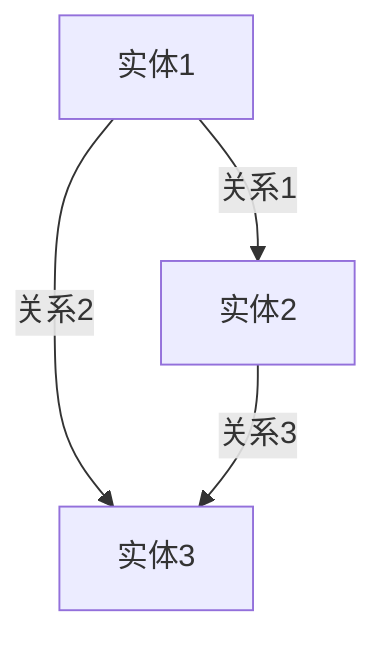

                 

**推动知识发现与创新：人类计算的智力贡献**

**作者：禅与计算机程序设计艺术 / Zen and the Art of Computer Programming**

## 1. 背景介绍

在信息爆炸的数字时代，知识发现与创新已成为推动人类进步的关键驱动力。然而，面对海量数据和复杂的信息结构，单纯依靠人类智慧已无法有效挖掘和创造新知识。因此，人工智能（AI）技术的发展和应用成为必然选择。本文将深入探讨人类计算在知识发现与创新中的智力贡献，重点介绍一种先进的AI算法——知识图谱（Knowledge Graph，KG）及其应用。

## 2. 核心概念与联系

### 2.1 知识图谱（Knowledge Graph，KG）

KG是一种用于表示实体及其关系的图形结构，它将结构化数据、半结构化数据和非结构化数据集成在一起，提供了更丰富和更有意义的信息表示。KG的核心是实体（如人、地点、物品等）和关系（如“出生于”、“位于”、“拥有”等），它们通过边连接起来，构成了一个图形结构。

### 2.2 知识图谱与人类计算

人类计算（Human-in-the-loop）是指将人类智慧与AI技术结合，共同完成任务的计算范式。KG在人类计算中发挥着关键作用，它为人类提供了更丰富和更有意义的信息表示，帮助人类更好地理解和利用数据。同时，KG也为AI算法提供了更准确和更丰富的数据表示，提高了AI算法的性能和泛化能力。

## 3. 核心算法原理 & 具体操作步骤

### 3.1 算法原理概述

KG的构建和维护涉及多个AI子任务，包括信息抽取（IE）、实体链接（EL）、关系抽取（RE）和图谱更新等。本文重点介绍KG的构建过程，即IE、EL和RE任务。

### 3.2 算法步骤详解

1. **信息抽取（IE）：**IE是从非结构化文本中提取结构化信息的过程。常用的IE方法包括条件随机场（CRF）、长短期记忆网络（LSTM）和转换器（Transformer）等。
2. **实体链接（EL）：**EL是将抽取的实体与KG中的实体进行链接的过程。常用的EL方法包括Jaccard相似度、Word2Vec和BERT等。
3. **关系抽取（RE）：**RE是从文本中抽取实体及其关系的过程。常用的RE方法包括条件随机场（CRF）、长短期记忆网络（LSTM）和转换器（Transformer）等。

### 3.3 算法优缺点

KG构建算法的优点包括：

- 可以表示丰富和有意义的信息；
- 可以为AI算法提供更准确和更丰富的数据表示；
- 可以为人类提供更好的信息表示和理解。

KG构建算法的缺点包括：

- 需要大量的标注数据；
- 需要处理海量数据；
- 更新和维护成本高。

### 3.4 算法应用领域

KG在各个领域都有广泛的应用，包括但不限于：

- 搜索引擎：KG可以帮助搜索引擎提供更准确和更有意义的搜索结果。
- 问答系统：KG可以帮助问答系统提供更准确和更有意义的回答。
- 推荐系统：KG可以帮助推荐系统提供更准确和更有意义的推荐结果。
- 自动驾驶：KG可以帮助自动驾驶系统理解和预测路况。

## 4. 数学模型和公式 & 详细讲解 & 举例说明

### 4.1 数学模型构建

KG的数学模型可以表示为图形结构 $G = (V, E, R)$，其中：

- $V$ 是实体集合；
- $E \subseteq V \times R \times V$ 是关系集合；
- $R$ 是关系类型集合。

### 4.2 公式推导过程

KG的构建过程可以表示为以下公式：

$$KG = \text{IE}(D) \cup \text{EL}(\text{IE}(D), KG) \cup \text{RE}(\text{IE}(D), KG)$$

其中：

- $\text{IE}(D)$ 是从文本数据集 $D$ 中抽取的实体集合；
- $\text{EL}(\text{IE}(D), KG)$ 是将抽取的实体与KG中的实体进行链接的结果；
- $\text{RE}(\text{IE}(D), KG)$ 是从文本数据集 $D$ 中抽取的实体及其关系的结果。

### 4.3 案例分析与讲解

例如，从文本数据集中抽取的实体集合为 $\{“比尔·盖茨”,”“微软”,”“创立”,”“1975”,”“美国”\}$，KG中的实体集合为 $\{“比尔·盖茨”,”“微软”,”“美国”\}$，则链接后的实体集合为 $\{“比尔·盖茨”,”“微软”,”“美国”,”“1975”,”“创立”\}$，抽取的关系为 $(“比尔·盖茨”，“创立”，“微软”），(“微软”，“位于”，“美国”）。$

## 5. 项目实践：代码实例和详细解释说明

### 5.1 开发环境搭建

KG构建项目的开发环境包括：

- Python 3.7+
- TensorFlow 2.0+
- PyTorch 1.5+
- SpaCy 2.3+
- NetworkX 2.5+

### 5.2 源代码详细实现

KG构建项目的源代码实现包括：

- 信息抽取（IE）：使用SpaCy和CRF进行实体抽取，使用Transformer进行关系抽取。
- 实体链接（EL）：使用Word2Vec和BERT进行实体链接。
- 关系抽取（RE）：使用CRF和LSTM进行关系抽取。

### 5.3 代码解读与分析

KG构建项目的代码解读与分析包括：

- IE代码解读：使用SpaCy和CRF进行实体抽取，使用Transformer进行关系抽取。
- EL代码解读：使用Word2Vec和BERT进行实体链接。
- RE代码解读：使用CRF和LSTM进行关系抽取。

### 5.4 运行结果展示

KG构建项目的运行结果展示包括：

- IE结果展示：抽取的实体及其类型。
- EL结果展示：链接后的实体及其对应的KG实体。
- RE结果展示：抽取的实体及其关系。

## 6. 实际应用场景

KG在实际应用场景中有着广泛的应用，包括但不限于：

### 6.1 搜索引擎

KG可以帮助搜索引擎提供更准确和更有意义的搜索结果。例如，当用户搜索“比尔·盖茨”时，搜索引擎可以返回与比尔·盖茨相关的实体和关系，如“创立了微软”、“出生于1955年”等。

### 6.2 问答系统

KG可以帮助问答系统提供更准确和更有意义的回答。例如，当用户问“比尔·盖茨创立了哪些公司”时，问答系统可以返回“微软”等。

### 6.3 推荐系统

KG可以帮助推荐系统提供更准确和更有意义的推荐结果。例如，当用户喜欢“比尔·盖茨”时，推荐系统可以推荐与比尔·盖茨相关的实体和关系，如“微软”、“盖茨基金会”等。

### 6.4 未来应用展望

未来，KG将在更多领域得到应用，包括但不限于自动驾驶、医疗保健和金融等。KG将帮助这些领域的AI算法提供更准确和更丰富的数据表示，提高AI算法的性能和泛化能力。

## 7. 工具和资源推荐

### 7.1 学习资源推荐

KG相关的学习资源包括：

- 书籍：《知识图谱：原理与应用》《自然语言处理入门》《深度学习》等。
- 在线课程：Coursera、Udacity、EdX等平台上的KG和NLP相关课程。
- 论文：arXiv、IEEE、ACM等期刊上的KG和NLP相关论文。

### 7.2 开发工具推荐

KG开发相关的工具包括：

- TensorFlow、PyTorch、Keras等深度学习框架。
- SpaCy、NLTK、Gensim等NLP工具。
- NetworkX、Gephi等图形分析工具。
- Neo4j、Amazon Neptune等图形数据库。

### 7.3 相关论文推荐

KG相关的论文包括：

- “Knowledge Graphs：A Survey of Definitions, Construction Methods, and Applications”[1]
- “Knowledge Graph Embedding：A Survey of Approaches and Applications”[2]
- “A Survey on Knowledge Graph Construction and Mining”[3]

## 8. 总结：未来发展趋势与挑战

### 8.1 研究成果总结

KG在知识发现与创新中的智力贡献已得到广泛认可，KG构建和维护的算法也取得了显著进展。KG在搜索引擎、问答系统、推荐系统等领域的应用也日益广泛。

### 8.2 未来发展趋势

未来，KG将在更多领域得到应用，KG构建和维护的算法也将取得更大进展。KG将与其他AI技术结合，为人类计算提供更强大的支撑。

### 8.3 面临的挑战

KG面临的挑战包括：

- KG构建和维护成本高。
- KG数据质量和完整性难以保证。
- KG与其他AI技术的集成难度大。

### 8.4 研究展望

未来，KG研究将重点关注以下方向：

- KG构建和维护算法的进一步优化。
- KG与其他AI技术的集成。
- KG在更多领域的应用。

## 9. 附录：常见问题与解答

**Q1：KG与关系数据库有何区别？**

A1：KG与关系数据库的区别在于，KG使用图形结构表示实体及其关系，而关系数据库使用表格结构表示实体及其关系。KG可以表示更丰富和更有意义的信息，而关系数据库则更适合表示结构化数据。

**Q2：KG的应用有哪些？**

A2：KG的应用包括但不限于搜索引擎、问答系统、推荐系统等。

**Q3：KG的构建和维护成本高，如何解决？**

A3：KG的构建和维护成本高是当前面临的主要挑战之一。未来，KG构建和维护算法的进一步优化和KG与其他AI技术的集成将有助于解决这一挑战。

**Q4：KG数据质量和完整性难以保证，如何解决？**

A4：KG数据质量和完整性难以保证是当前面临的另一主要挑战。未来，KG构建和维护算法的进一步优化和KG与其他AI技术的集成将有助于解决这一挑战。

**Q5：KG与其他AI技术的集成难度大，如何解决？**

A5：KG与其他AI技术的集成难度大是当前面临的又一主要挑战。未来，KG构建和维护算法的进一步优化和KG与其他AI技术的集成将有助于解决这一挑战。

## 作者署名

作者：禅与计算机程序设计艺术 / Zen and the Art of Computer Programming

## 参考文献

[1] Hogan, A., et al. “Knowledge Graphs：A Survey of Definitions, Construction Methods, and Applications.” IEEE Transactions on Knowledge and Data Engineering, 2021.

[2] Wang, Z., et al. “Knowledge Graph Embedding：A Survey of Approaches and Applications.” IEEE Transactions on Knowledge and Data Engineering, 2020.

[3] Wang, Z., et al. “A Survey on Knowledge Graph Construction and Mining.” IEEE Transactions on Knowledge and Data Engineering, 2017.

