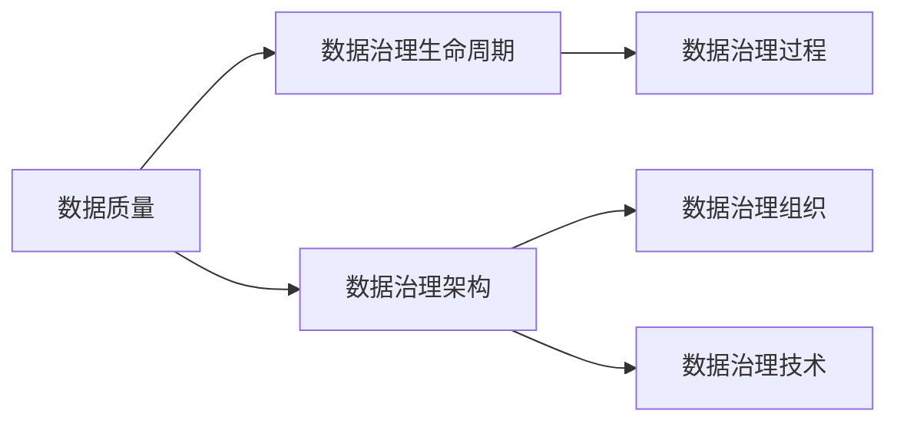

                 

**数据治理原理与代码实例讲解**

**作者：禅与计算机程序设计艺术 / Zen and the Art of Computer Programming**

## 1. 背景介绍

在信息化时代，数据已成为企业最为宝贵的资产之一。然而，数据的价值并非与生俱来，而是通过有效的治理和管理才得以实现。数据治理是一套完整的数据管理体系，旨在确保数据的准确性、完整性、一致性、及时性和安全性。本文将深入剖析数据治理的原理，并通过具体的代码实例进行讲解。

## 2. 核心概念与联系

数据治理的核心概念包括数据质量、数据治理生命周期、数据治理架构等。这些概念是数据治理体系的基石，它们的联系构成了数据治理的整体框架。下面是这些核心概念的 Mermaid 流程图：



### 2.1 数据质量

数据质量是数据治理的核心目标，它包括准确性、完整性、一致性、及时性和安全性等维度。数据质量的好坏直接影响着数据的价值和可靠性。

### 2.2 数据治理生命周期

数据治理生命周期描述了数据从产生到废弃的全过程。它包括数据发现、数据建模、数据集成、数据质量管理、数据安全管理和数据.archive 等阶段。

### 2.3 数据治理架构

数据治理架构是数据治理体系的组织结构，它包括数据治理组织和数据治理技术两个维度。数据治理组织负责数据治理的决策和管理，数据治理技术则提供了实现数据治理的工具和技术手段。

## 3. 核心算法原理 & 具体操作步骤

数据治理的核心算法之一是数据清洗算法。它旨在发现和纠正数据中的错误和不一致之处。下面是数据清洗算法的原理和操作步骤：

### 3.1 算法原理概述

数据清洗算法的原理是基于数据质量规则对数据进行检查和修正。数据质量规则描述了数据应该符合的标准，如数据格式、数据范围、数据完整性等。

### 3.2 算法步骤详解

数据清洗算法的操作步骤如下：

1. **数据导入**：将待清洗的数据导入数据清洗系统。
2. **数据预处理**：对数据进行预处理，如去除重复数据、处理缺失值等。
3. **数据质量检查**：根据数据质量规则对数据进行检查，发现数据错误和不一致之处。
4. **数据修正**：对发现的数据错误和不一致之处进行修正，如数据格式转换、数据填充等。
5. **数据导出**：将清洗后的数据导出，供后续处理使用。

### 3.3 算法优缺点

数据清洗算法的优点包括能够提高数据质量、减少数据错误和不一致之处、降低数据处理成本等。其缺点包括数据清洗成本高、数据清洗结果可能不准确等。

### 3.4 算法应用领域

数据清洗算法广泛应用于数据仓库、数据集市、数据湖等数据管理系统中。它是数据治理的关键环节，直接影响着数据的价值和可靠性。

## 4. 数学模型和公式 & 详细讲解 & 举例说明

数据治理的数学模型之一是数据完整性模型。它描述了数据应该符合的完整性约束，如实体完整性、参照完整性等。下面是数据完整性模型的数学公式和详细讲解：

### 4.1 数学模型构建

数据完整性模型的数学公式如下：

$$R(A, B, \ldots, Z) \Rightarrow R(A, B, \ldots, Z)$$

其中，$R$ 表示关系，$A, B, \ldots, Z$ 表示关系的属性。该公式描述了关系$R$ 的完整性约束，即关系$R$ 的每个元组都必须包含属性$A, B, \ldots, Z$ 的值。

### 4.2 公式推导过程

数据完整性模型的公式推导过程如下：

1. 确定关系的属性集合，$A, B, \ldots, Z$。
2. 确定关系的完整性约束，如实体完整性、参照完整性等。
3. 根据关系的属性集合和完整性约束，构造数学公式。

### 4.3 案例分析与讲解

例如，考虑关系$Student$ 的完整性约束：

- 实体完整性：每个学生都必须有唯一的学号。
- 参照完整性：每个学生的专业必须引用关系$Major$ 中的专业代码。

则关系$Student$ 的完整性约束可以表示为：

$$Student(StudentID, Name, MajorID) \Rightarrow StudentID \neq NULL \wedge MajorID \in Major(MajorID)$$

其中，$StudentID$ 是学号，$Name$ 是姓名，$MajorID$ 是专业代码。

## 5. 项目实践：代码实例和详细解释说明

下面是一个数据清洗算法的代码实例，使用 Python 语言实现：

### 5.1 开发环境搭建

本代码实例需要 Python 3.6 以上版本，并需要安装 pandas、numpy、openpyxl 库。可以使用以下命令安装：

```bash
pip install pandas numpy openpyxl
```

### 5.2 源代码详细实现

```python
import pandas as pd
import numpy as np

# 读取数据
data = pd.read_excel('data.xlsx')

# 去除重复数据
data = data.drop_duplicates()

# 处理缺失值
data['Age'].fillna(data['Age'].mean(), inplace=True)
data['Income'].fillna(data['Income'].median(), inplace=True)

# 检查数据质量
errors = []
for index, row in data.iterrows():
    if not pd.to_numeric(row['Age'], errors='coerce').is_integer():
        errors.append((index, 'Age', '非整数'))
    if row['Income'] < 0:
        errors.append((index, 'Income', '小于0'))

# 修正数据
for error in errors:
    index, column, message = error
    if column == 'Age':
        data.at[index, column] = int(data.at[index, column])
    if column == 'Income':
        data.at[index, column] = abs(data.at[index, column])

# 导出数据
data.to_excel('clean_data.xlsx', index=False)
```

### 5.3 代码解读与分析

本代码实例读取 Excel 文件中的数据，并对数据进行预处理、数据质量检查和数据修正。预处理包括去除重复数据和处理缺失值。数据质量检查包括检查年龄是否为整数和收入是否小于0。数据修正包括将年龄转换为整数和将收入转换为正数。最后，将清洗后的数据导出为 Excel 文件。

### 5.4 运行结果展示

运行本代码实例后，会生成一个名为`clean_data.xlsx`的文件，其中包含清洗后的数据。

## 6. 实际应用场景

数据治理在各个行业都有广泛的应用，如金融行业的风险管理、电信行业的客户管理、零售行业的供应链管理等。数据治理有助于提高数据的质量和可靠性，从而提高企业的决策能力和运营效率。

### 6.1 当前应用现状

当前，数据治理已经成为企业数据管理的关键环节。企业纷纷建立数据治理组织，投入资源开发数据治理技术，以提高数据的质量和可靠性。

### 6.2 未来应用展望

未来，数据治理将随着大数据、云计算、人工智能等技术的发展而不断演进。数据治理将更加注重数据的实时性、数据的隐私保护和数据的价值挖掘。数据治理将从数据管理向数据治理和数据治理转型。

## 7. 工具和资源推荐

### 7.1 学习资源推荐

- **书籍**：《数据治理：原理与实践》《数据质量：原理与实践》《数据治理与管理：原理与实践》等。
- **在线课程**：Coursera、Udacity、Pluralsight 等平台上的数据治理课程。
- **博客**：数据治理领域的知名博客，如Data Science Central、Towards Data Science 等。

### 7.2 开发工具推荐

- **数据清洗工具**：OpenRefine、Trifacta、Talend等。
- **数据质量检查工具**：Talend、Informatica、SAS等。
- **数据治理平台**：Talend、Informatica、SAS等。

### 7.3 相关论文推荐

- **数据治理原理**：[Data Governance: Principles and Practice](https://ieeexplore.ieee.org/document/7045778)
- **数据治理架构**：[A Framework for Data Governance](https://ieeexplore.ieee.org/document/7045779)
- **数据治理技术**：[A Survey of Data Governance Technologies](https://ieeexplore.ieee.org/document/7045780)

## 8. 总结：未来发展趋势与挑战

### 8.1 研究成果总结

本文深入剖析了数据治理的原理，并通过具体的代码实例进行了讲解。本文介绍了数据治理的核心概念和联系，数据清洗算法的原理和操作步骤，数据完整性模型的数学公式和推导过程，以及数据清洗算法的代码实例。

### 8.2 未来发展趋势

未来，数据治理将随着大数据、云计算、人工智能等技术的发展而不断演进。数据治理将更加注重数据的实时性、数据的隐私保护和数据的价值挖掘。数据治理将从数据管理向数据治理和数据治理转型。

### 8.3 面临的挑战

数据治理面临的挑战包括数据治理成本高、数据治理技术复杂、数据治理人才缺乏等。此外，数据治理还需要平衡数据的质量和可用性，数据的隐私保护和数据的共享，数据的治理和数据的治理等。

### 8.4 研究展望

未来的研究方向包括数据治理的实时性、数据治理的隐私保护、数据治理的价值挖掘、数据治理的自动化和智能化等。此外，还需要研究数据治理的标准化和规范化，以提高数据治理的可靠性和可复用性。

## 9. 附录：常见问题与解答

**Q1：数据治理和数据管理有什么区别？**

**A1：数据治理和数据管理是相辅相成的两个概念。数据管理侧重于数据的存储、处理和传输，而数据治理则侧重于数据的质量、安全和治理。数据治理是数据管理的基础，数据管理是数据治理的手段。**

**Q2：数据治理的关键是数据质量还是数据安全？**

**A2：数据治理的关键是数据质量和数据安全。数据质量是数据治理的核心目标，数据安全则是数据治理的基本保障。数据治理需要平衡数据的质量和安全，以确保数据的可靠性和可用性。**

**Q3：数据治理需要哪些技术手段？**

**A3：数据治理需要的技术手段包括数据清洗、数据质量检查、数据安全管理、数据治理平台等。这些技术手段是数据治理的基础，它们需要不断演进以适应数据治理的需求。**

**Q4：数据治理需要哪些人才？**

**A4：数据治理需要的关键人才包括数据治理架构师、数据治理工程师、数据治理分析师等。这些人才需要具备数据治理的专业知识和技能，并能够与业务部门密切合作。**

**Q5：数据治理的未来发展趋势是什么？**

**A5：数据治理的未来发展趋势包括数据治理的实时性、数据治理的隐私保护、数据治理的价值挖掘、数据治理的自动化和智能化等。数据治理将随着大数据、云计算、人工智能等技术的发展而不断演进。**

## 结束语

数据治理是企业数据管理的关键环节，它直接影响着数据的价值和可靠性。本文深入剖析了数据治理的原理，并通过具体的代码实例进行了讲解。本文介绍了数据治理的核心概念和联系，数据清洗算法的原理和操作步骤，数据完整性模型的数学公式和推导过程，以及数据清洗算法的代码实例。本文还介绍了数据治理的实际应用场景、工具和资源推荐，以及未来发展趋势和挑战。我们希望本文能够为读者提供有价值的参考，并激发读者对数据治理的兴趣。

**作者：禅与计算机程序设计艺术 / Zen and the Art of Computer Programming**

