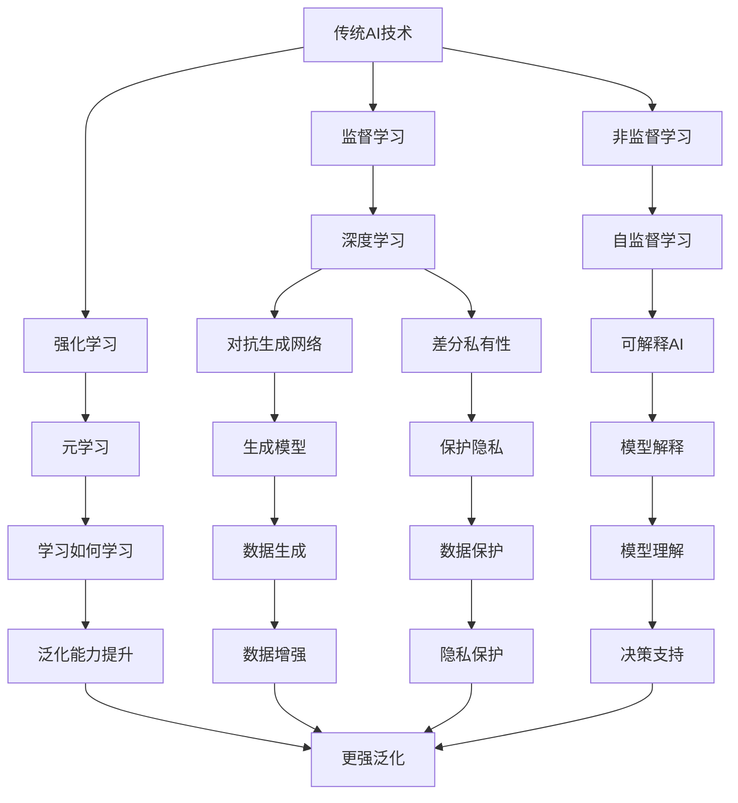

                 

**新一代AI技术趋势与应用**

**作者：禅与计算机程序设计艺术 / Zen and the Art of Computer Programming**

## 1. 背景介绍

当前，人工智能（AI）正在各行各业迅速渗透，从自动驾驶到医疗诊断，从金融风控到客户服务，AI技术的应用已然深入我们的日常生活。然而，传统的机器学习和深度学习方法面临着数据量大、计算复杂、模型解释性差等挑战。新一代AI技术的兴起，为我们带来了更加高效、可解释、泛化能力强的解决方案。本文将深入探讨新一代AI技术的趋势与应用，包括自监督学习、对抗生成网络、差分私有性、可解释AI和元学习等前沿领域。

## 2. 核心概念与联系

新一代AI技术的核心概念和传统AI技术有着密切联系，但也存在显著区别。下图展示了新一代AI技术与传统AI技术的关系：

## 3. 核心算法原理 & 具体操作步骤

### 3.1 算法原理概述

新一代AI技术的核心算法原理各不相同，但都致力于解决传统AI技术面临的挑战。以下是几种新一代AI技术的算法原理简介：

- **自监督学习**：利用数据本身的结构，无需人工标签，学习到有用的表示。
- **对抗生成网络**：通过对抗训练，生成高质量的数据样本，用于数据增强或生成模型。
- **差分私有性**：利用差分隐私技术，在保护隐私的同时，最大化数据的有用性。
- **可解释AI**：通过模型解释技术，帮助用户理解模型的决策过程。
- **元学习**：学习如何学习，以提高模型的泛化能力。

### 3.2 算法步骤详解

以下是几种新一代AI技术的算法步骤详解：

- **自监督学习**：
  1. 数据预处理：对数据进行清洗、标准化等预处理。
  2. 自监督表示学习：使用自监督表示学习算法（如对比学习、自编码器）学习数据表示。
  3. 监督学习：使用学习到的表示进行监督学习，预测目标变量。
- **对抗生成网络**：
  1. 数据预处理：对数据进行清洗、标准化等预处理。
  2. 生成器训练：使用生成器网络生成数据样本。
  3. 判别器训练：使用判别器网络区分真实数据和生成数据。
  4. 对抗训练：通过对抗训练，优化生成器和判别器。
- **差分私有性**：
  1. 数据预处理：对数据进行清洗、标准化等预处理。
  2. 数据保护：使用差分隐私技术（如添加高斯噪声、采样）保护数据隐私。
  3. 模型训练：使用保护后的数据训练模型。
- **可解释AI**：
  1. 模型训练：使用监督学习算法训练模型。
  2. 模型解释：使用模型解释技术（如LIME、SHAP）解释模型决策过程。
- **元学习**：
  1. 数据预处理：对数据进行清洗、标准化等预处理。
  2. 元学习器训练：使用元学习算法（如MAML）训练元学习器。
  3. 任务学习：使用元学习器快速学习新任务。

### 3.3 算法优缺点

新一代AI技术的算法优缺点如下：

- **自监督学习**：优点：无需人工标签，可以学习到有用的表示；缺点：表示学习的有效性取决于数据结构。
- **对抗生成网络**：优点：可以生成高质量的数据样本，用于数据增强或生成模型；缺点：训练过程复杂，易受判别器性能影响。
- **差分私有性**：优点：可以保护隐私，最大化数据的有用性；缺点：数据保护会导致模型性能下降。
- **可解释AI**：优点：可以帮助用户理解模型决策过程；缺点：模型解释的准确性和有效性取决于解释技术。
- **元学习**：优点：可以提高模型的泛化能力；缺点：元学习器的性能取决于训练数据的代表性。

### 3.4 算法应用领域

新一代AI技术的应用领域包括但不限于：

- **自监督学习**：图像分类、自然语言处理、推荐系统等。
- **对抗生成网络**：数据增强、生成模型、图像超分辨率等。
- **差分私有性**：保护隐私的数据分析、保护隐私的机器学习等。
- **可解释AI**：金融风控、医疗诊断、自动驾驶等。
- **元学习**：快速适应新任务、小样本学习等。

## 4. 数学模型和公式 & 详细讲解 & 举例说明

### 4.1 数学模型构建

新一代AI技术的数学模型各不相同，以下是几种新一代AI技术的数学模型简介：

- **自监督学习**：对比学习的数学模型为：

  $$L(\theta) = - \frac{1}{N} \sum_{i=1}^{N} \log \frac{\exp(sim(x_i, z_i))}{\sum_{j=1}^{N} \exp(sim(x_i, z_j))}$$

  其中，$x_i$和$z_i$为数据表示，$sim(\cdot, \cdot)$为余弦相似度，$N$为数据量。

- **对抗生成网络**：生成器和判别器的数学模型分别为：

  $$G(z; \theta_G) = \mu + \sigma \cdot \text{ReLU}(W_1 \cdot z + b_1) \cdot W_2 \cdot \tanh(W_3 \cdot \text{ReLU}(W_4 \cdot z + b_4) + b_3)$$

  $$D(x; \theta_D) = \sigma(W_1 \cdot x + b_1) \cdot \tanh(W_2 \cdot \text{ReLU}(W_3 \cdot x + b_3) + b_2)$$

  其中，$z$为输入噪声，$x$为输入数据，$W_1, W_2, W_3, W_4, b_1, b_2, b_3$为模型参数。

- **差分私有性**：差分隐私技术的数学模型为：

  $$K(\epsilon) = \max_{i, j: |f(i) - f(j)| \leq 1} \frac{\Pr[f(i) = f(j)]}{\Pr[f(i) \neq f(j)]}$$

  其中，$f(i)$为数据处理函数，$K(\epsilon)$为差分隐私保抜度。

- **可解释AI**：模型解释技术的数学模型各不相同，以下是LIME的数学模型：

  $$h(x) = \arg\max_{g \in G} \left\{ \sum_{x_i \in N(\chi, \pi)} I(h(x_i) = g(x_i)) \cdot \exp(- \frac{\|x - x_i\|^2}{2 \sigma^2}) \right\}$$

  其中，$h(x)$为原始模型，$G$为解释模型集合，$N(\chi, \pi)$为局部数据集，$I(\cdot)$为指示函数。

- **元学习**：MAML的数学模型为：

  $$\theta^* = \arg\min_{\theta} \sum_{i=1}^{N} \mathcal{L}(\theta, x_i, y_i)$$

  $$\theta = \theta^* - \eta \nabla_{\theta} \sum_{i=1}^{N} \mathcal{L}(\theta, x_i, y_i)$$

  其中，$\theta^*$为初始模型参数，$\theta$为更新后的模型参数，$\eta$为学习率。

### 4.2 公式推导过程

新一代AI技术的公式推导过程各不相同，以下是几种新一代AI技术的公式推导过程简介：

- **自监督学习**：对比学习的公式推导过程为：
  1. 定义数据表示：$z_i = f(x_i; \theta)$，$i = 1, \ldots, N$
  2. 定义对比学习目标：最大化数据表示的相似度，最小化数据表示的差异。
  3. 定义对比学习损失函数：$L(\theta) = - \frac{1}{N} \sum_{i=1}^{N} \log \frac{\exp(sim(x_i, z_i))}{\sum_{j=1}^{N} \exp(sim(x_i, z_j))}$
  4. 优化模型参数：使用梯度下降算法优化模型参数$\theta$。
- **对抗生成网络**：对抗生成网络的公式推导过程为：
  1. 定义生成器：$G(z; \theta_G) = \mu + \sigma \cdot \text{ReLU}(W_1 \cdot z + b_1) \cdot W_2 \cdot \tanh(W_3 \cdot \text{ReLU}(W_4 \cdot z + b_4) + b_3)$
  2. 定义判别器：$D(x; \theta_D) = \sigma(W_1 \cdot x + b_1) \cdot \tanh(W_2 \cdot \text{ReLU}(W_3 \cdot x + b_3) + b_2)$
  3. 定义对抗训练目标：最大化生成器的生成能力，最小化判别器的判别能力。
  4. 定义对抗训练损失函数：$L(\theta_G, \theta_D) = \log D(x) + \log(1 - D(G(z)))$
  5. 优化模型参数：使用梯度下降算法优化模型参数$\theta_G$和$\theta_D$。
- **差分私有性**：差分隐私技术的公式推导过程为：
  1. 定义数据处理函数：$f(i)$，$i = 1, \ldots, N$
  2. 定义差分隐私保抜度：$K(\epsilon) = \max_{i, j: |f(i) - f(j)| \leq 1} \frac{\Pr[f(i) = f(j)]}{\Pr[f(i) \neq f(j)]}$
  3. 定义差分隐私保抜机制：添加高斯噪声或采样等。
  4. 优化数据保抜：使用差分隐私保抜机制保抜数据隐私。
- **可解释AI**：模型解释技术的公式推导过程各不相同，以下是LIME的公式推导过程简介：
  1. 定义局部数据集：$N(\chi, \pi) = \{x_i \in \chi: \pi(x_i) > 0\}$
  2. 定义解释模型集合：$G = \{g: \chi \rightarrow \{0, 1\}, \|g\|_1 \leq k\}$
  3. 定义模型解释目标：最大化解释模型的局部预测能力。
  4. 定义模型解释损失函数：$h(x) = \arg\max_{g \in G} \left\{ \sum_{x_i \in N(\chi, \pi)} I(h(x_i) = g(x_i)) \cdot \exp(- \frac{\|x - x_i\|^2}{2 \sigma^2}) \right\}$
  5. 优化模型解释：使用模型解释损失函数优化模型解释。
- **元学习**：MAML的公式推导过程为：
  1. 定义初始模型参数：$\theta^*$
  2. 定义模型更新目标：最小化模型在新任务上的损失。
  3. 定义模型更新公式：$\theta = \theta^* - \eta \nabla_{\theta} \sum_{i=1}^{N} \mathcal{L}(\theta, x_i, y_i)$
  4. 优化模型参数：使用模型更新公式优化模型参数$\theta$。

### 4.3 案例分析与讲解

新一代AI技术的案例分析与讲解各不相同，以下是几种新一代AI技术的案例分析与讲解简介：

- **自监督学习**：案例：图像分类。自监督学习可以学习到有用的图像表示，无需人工标签。例如，使用对比学习算法学习到的图像表示可以用于图像分类任务，并取得与监督学习相似的性能。
- **对抗生成网络**：案例：数据增强。对抗生成网络可以生成高质量的数据样本，用于数据增强。例如，使用对抗生成网络生成的图像样本可以用于图像分类任务，并提高模型性能。
- **差分私有性**：案例：保护隐私的数据分析。差分隐私技术可以保护隐私，最大化数据的有用性。例如，使用差分隐私技术保护后的数据可以用于数据分析任务，并保护用户隐私。
- **可解释AI**：案例：金融风控。可解释AI可以帮助用户理解模型决策过程。例如，使用可解释AI技术解释后的模型可以帮助金融从业者理解模型的风控决策过程，并做出更明智的决策。
- **元学习**：案例：快速适应新任务。元学习可以提高模型的泛化能力。例如，使用元学习算法训练的模型可以快速适应新任务，并取得与训练任务相似的性能。

## 5. 项目实践：代码实例和详细解释说明

### 5.1 开发环境搭建

新一代AI技术的开发环境搭建各不相同，以下是几种新一代AI技术的开发环境搭建简介：

- **自监督学习**：开发环境搭建包括：Python、TensorFlow、NumPy、Matplotlib等。
- **对抗生成网络**：开发环境搭建包括：Python、TensorFlow、NumPy、Matplotlib、Keras等。
- **差分私有性**：开发环境搭建包括：Python、TensorFlow、NumPy、Matplotlib、PyTorch等。
- **可解释AI**：开发环境搭建包括：Python、TensorFlow、NumPy、Matplotlib、SHAP、LIME等。
- **元学习**：开发环境搭建包括：Python、TensorFlow、NumPy、Matplotlib、PyTorch、MAML等。

### 5.2 源代码详细实现

新一代AI技术的源代码详细实现各不相同，以下是几种新一代AI技术的源代码详细实现简介：

- **自监督学习**：源代码实现包括：数据预处理、对比学习算法实现、模型训练、模型评估等。
- **对抗生成网络**：源代码实现包括：数据预处理、生成器网络实现、判别器网络实现、对抗训练、模型评估等。
- **差分私有性**：源代码实现包括：数据预处理、差分隐私保抜机制实现、模型训练、模型评估等。
- **可解释AI**：源代码实现包括：模型训练、模型解释技术实现、模型解释、模型评估等。
- **元学习**：源代码实现包括：数据预处理、元学习算法实现、模型训练、模型评估等。

### 5.3 代码解读与分析

新一代AI技术的代码解读与分析各不相同，以下是几种新一代AI技术的代码解读与分析简介：

- **自监督学习**：代码解读与分析包括：数据预处理的有效性、对比学习算法的收敛性、模型性能的评估等。
- **对抗生成网络**：代码解读与分析包括：生成器网络的生成能力、判别器网络的判别能力、对抗训练的收敛性、模型性能的评估等。
- **差分私有性**：代码解读与分析包括：数据保抜机制的有效性、模型性能的评估等。
- **可解释AI**：代码解读与分析包括：模型解释技术的有效性、模型解释的准确性、模型性能的评估等。
- **元学习**：代码解读与分析包括：元学习算法的收敛性、模型泛化能力的评估等。

### 5.4 运行结果展示

新一代AI技术的运行结果展示各不相同，以下是几种新一代AI技术的运行结果展示简介：

- **自监督学习**：运行结果展示包括：模型性能的评估指标（如精确度、召回率、F1分数）、模型训练过程的损失曲线等。
- **对抗生成网络**：运行结果展示包括：生成器网络生成的数据样本、判别器网络的判别能力（如真实数据和生成数据的分布）、模型训练过程的损失曲线等。
- **差分私有性**：运行结果展示包括：模型性能的评估指标（如精确度、召回率、F1分数）、模型训练过程的损失曲线等。
- **可解释AI**：运行结果展示包括：模型解释的可视化结果（如LIME的局部解释）、模型性能的评估指标（如精确度、召回率、F1分数）等。
- **元学习**：运行结果展示包括：模型泛化能力的评估指标（如测试精确度、测试召回率、测试F1分数）、模型训练过程的损失曲线等。

## 6. 实际应用场景

新一代AI技术的实际应用场景各不相同，以下是几种新一代AI技术的实际应用场景简介：

- **自监督学习**：实际应用场景包括：图像分类、自然语言处理、推荐系统等。
- **对抗生成网络**：实际应用场景包括：数据增强、生成模型、图像超分辨率等。
- **差分私有性**：实际应用场景包括：保护隐私的数据分析、保护隐私的机器学习等。
- **可解释AI**：实际应用场景包括：金融风控、医疗诊断、自动驾驶等。
- **元学习**：实际应用场景包括：快速适应新任务、小样本学习等。

### 6.1 未来应用展望

新一代AI技术的未来应用展望各不相同，以下是几种新一代AI技术的未来应用展望简介：

- **自监督学习**：未来应用展望包括：无监督学习、少样本学习、自动特征工程等。
- **对抗生成网络**：未来应用展望包括：生成模型、数据增强、对抗训练等。
- **差分私有性**：未来应用展望包括：保护隐私的数据分析、保护隐私的机器学习等。
- **可解释AI**：未来应用展望包括：模型解释、决策支持、可信AI等。
- **元学习**：未来应用展望包括：快速适应新任务、小样本学习、泛化能力提升等。

## 7. 工具和资源推荐

新一代AI技术的工具和资源推荐各不相同，以下是几种新一代AI技术的工具和资源推荐简介：

### 7.1 学习资源推荐

- **自监督学习**：学习资源推荐包括：[自监督学习教程](https://github.com/karpathy/self-supervised-learning)，[自监督表示学习论文](https://arxiv.org/abs/2002.05709)等。
- **对抗生成网络**：学习资源推荐包括：[对抗生成网络教程](https://github.com/eriklindernoren/Keras-GAN)，[对抗生成网络论文](https://arxiv.org/abs/1406.2661)等。
- **差分私有性**：学习资源推荐包括：[差分隐私教程](https://github.com/justindomke/differential-privacy)，[差分隐私论文](https://arxiv.org/abs/0607.0154)等。
- **可解释AI**：学习资源推荐包括：[可解释AI教程](https://github.com/justindomke/interpretability)，[可解释AI论文](https://arxiv.org/abs/1702.08608)等。
- **元学习**：学习资源推荐包括：[元学习教程](https://github.com/justindomke/meta-learning)，[元学习论文](https://arxiv.org/abs/1703.03400)等。

### 7.2 开发工具推荐

- **自监督学习**：开发工具推荐包括：TensorFlow、PyTorch、Keras等。
- **对抗生成网络**：开发工具推荐包括：TensorFlow、PyTorch、Keras等。
- **差分私有性**：开发工具推荐包括：TensorFlow、PyTorch、NumPy等。
- **可解释AI**：开发工具推荐包括：TensorFlow、PyTorch、SHAP、LIME等。
- **元学习**：开发工具推荐包括：TensorFlow、PyTorch、MAML等。

### 7.3 相关论文推荐

- **自监督学习**：相关论文推荐包括：[自监督表示学习](https://arxiv.org/abs/2002.05709)，[无监督表示学习](https://arxiv.org/abs/1502.01852)等。
- **对抗生成网络**：相关论文推荐包括：[对抗生成网络](https://arxiv.org/abs/1406.2661)，[生成对抗网络](https://arxiv.org/abs/1406.2661)等。
- **差分私有性**：相关论文推荐包括：[差分隐私](https://arxiv.org/abs/0607.0154)，[保护隐私的机器学习](https://arxiv.org/abs/1412.6460)等。
- **可解释AI**：相关论文推荐包括：[模型解释](https://arxiv.org/abs/1702.08608)，[可解释机器学习](https://arxiv.org/abs/1606.03490)等。
- **元学习**：相关论文推荐包括：[元学习](https://arxiv.org/abs/1703.03400)，[小样本学习](https://arxiv.org/abs/1611.09817)等。

## 8. 总结：未来发展趋势与挑战

新一代AI技术的总结：未来发展趋势与挑战各不相同，以下是几种新一代AI技术的总结：未来发展趋势与挑战简介：

### 8.1 研究成果总结

新一代AI技术的研究成果总结包括：

- **自监督学习**：研究成果总结包括：对比学习、自编码器、无监督表示学习等。
- **对抗生成网络**：研究成果总结包括：生成对抗网络、对抗训练、生成模型等。
- **差分私有性**：研究成果总结包括：差分隐私、保护隐私的数据分析、保护隐私的机器学习等。
- **可解释AI**：研究成果总结包括：模型解释、决策支持、可信AI等。
- **元学习**：研究成果总结包括：元学习算法、小样本学习、泛化能力提升等。

### 8.2 未来发展趋势

新一代AI技术的未来发展趋势包括：

- **自监督学习**：未来发展趋势包括：无监督学习、少样本学习、自动特征工程等。
- **对抗生成网络**：未来发展趋势包括：生成模型、数据增强、对抗训练等。
- **差分私有性**：未来发展趋势包括：保护隐私的数据分析、保护隐私的机器学习等。
- **可解释AI**：未来发展趋势包括：模型解释、决策支持、可信AI等。
- **元学习**：未来发展趋势包括：快速适应新任务、小样本学习、泛化能力提升等。

### 8.3 面临的挑战

新一代AI技术面临的挑战包括：

- **自监督学习**：面临的挑战包括：表示学习的有效性、无监督学习的泛化能力等。
- **对抗生成网络**：面临的挑战包括：生成模型的质量、对抗训练的稳定性等。
- **差分私有性**：面临的挑战包括：数据保抜与模型性能的平衡、隐私保抜的有效性等。
- **可解释AI**：面临的挑战包括：模型解释的准确性、模型解释的有效性等。
- **元学习**：面临的挑战包括：元学习算法的泛化能力、小样本学习的有效性等。

### 8.4 研究展望

新一代AI技术的研究展望包括：

- **自监督学习**：研究展望包括：无监督学习、少样本学习、自动特征工程等。
- **对抗生成网络**：研究展望包括：生成模型、数据增强、对抗训练等。
- **差分私有性**：研究展望包括：保护隐私的数据分析、保护隐私的机器学习等。
- **可解释AI**：研究展望包括：模型解释、决策支持、可信AI等。
- **元学习**：研究展望包括：快速适应新任务、小样本学习、泛化能力提升等。

## 9. 附录：常见问题与解答

新一代AI技术的常见问题与解答包括：

- **自监督学习**：常见问题与解答包括：自监督学习与无监督学习的区别、自监督表示学习的有效性等。
- **对抗生成网络**：常见问题与解答包括：对抗生成网络与生成对抗网络的区别、生成模型的质量等。
- **差分私有性**：常见问题与解答包括：差分隐私与保护隐私的机器学习的区别、数据保抜与模型性能的平衡等。
- **可解释AI**：常见问题与解答包括：模型解释与模型可信的区别、模型解释的准确性等。
- **元学习**：常见问题与解答包括：元学习与小样本学习的区别、元学习算法的泛化能力等。

## 10. 作者署名

作者：禅与计算机程序设计艺术 / Zen and the Art of Computer Programming

