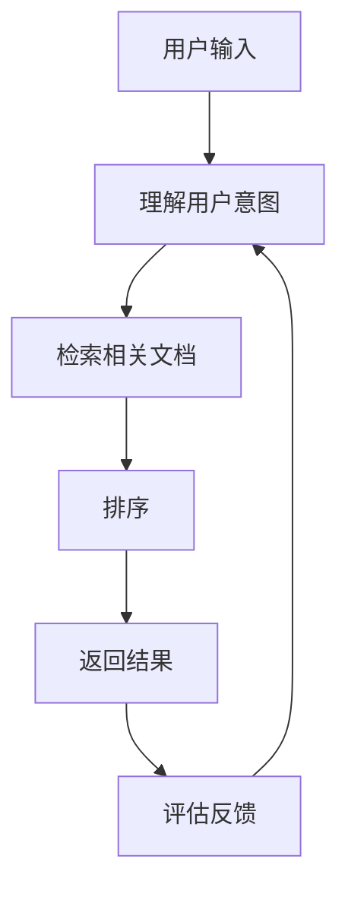

                 

**智能排序：AI提升搜索结果**

**作者：禅与计算机程序设计艺术 / Zen and the Art of Computer Programming**

## 1. 背景介绍

在信息爆炸的数字时代，搜索引擎已成为我们获取信息的主要渠道。然而，传统的搜索引擎依赖于关键词匹配，无法理解用户的真实意图，导致搜索结果的相关性和有效性受到限制。为了解决这个问题，人工智能（AI）技术的应用变得至关重要。本文将深入探讨AI在搜索结果排序中的应用，介绍核心概念、算法原理，并提供项目实践和工具推荐。

## 2. 核心概念与联系

### 2.1 核心概念

- **信息检索（Information Retrieval，IR）**：指的是从大量信息中检索出与用户需求相关的信息的过程。
- **排序（Ranking）**：根据一定的评判标准，将信息按顺序排列的过程。
- **人工智能（Artificial Intelligence，AI）**：指的是模拟或复制人类智能行为的计算机系统或程序。

### 2.2 核心概念联系

AI在信息检索中的应用，主要体现在对搜索结果排序的改进上。AI可以帮助搜索引擎理解用户的意图，从而提供更相关、更有效的搜索结果。下图展示了AI在信息检索中的关键角色：



## 3. 核心算法原理 & 具体操作步骤

### 3.1 算法原理概述

AI在搜索结果排序中的核心原理是利用机器学习算法，学习用户的反馈和行为数据，从而建立一个能够预测用户满意度的模型。这个模型然后用于排序算法，以提供更相关的搜索结果。

### 3.2 算法步骤详解

1. **数据收集**：收集用户搜索查询、点击数据、跳出数据等行为数据。
2. **特征工程**：提取数据中的特征，如查询长度、文档长度、关键词匹配度等。
3. **模型训练**：使用机器学习算法（如逻辑回归、支持向量机、神经网络等）训练模型，预测用户满意度。
4. **排序**：将模型集成到排序算法中，根据预测的用户满意度排序搜索结果。
5. **评估与迭代**：评估排序算法的性能，并根据用户反馈迭代模型。

### 3.3 算法优缺点

**优点**：

- 理解用户意图，提供更相关的搜索结果。
- 学习用户行为，提供个性化的搜索体验。
- 可以适应用户需求的变化，提供动态的排序结果。

**缺点**：

- 需要大量的用户行为数据，对数据隐私提出了挑战。
- 模型训练需要大量的计算资源。
- 模型的解释性较差，难以理解模型的决策过程。

### 3.4 算法应用领域

AI在搜索结果排序中的应用，不仅限于传统的网页搜索，还包括电子邮件、社交媒体、推荐系统等领域。例如，Gmail使用机器学习算法排序邮件，Facebook使用AI排序用户的新闻feed，Amazon使用AI排序商品推荐等。

## 4. 数学模型和公式 & 详细讲解 & 举例说明

### 4.1 数学模型构建

在搜索结果排序中，常用的数学模型是RankNet模型。RankNet是一种基于神经网络的学习算法，用于学习排序函数。其数学模型如下：

$$f(x) = \sigma(Wx + b)$$

其中，$x$是输入特征向量，$W$和$b$是模型参数，$f(x)$是排序函数，$\sigma$是sigmoid函数。

### 4.2 公式推导过程

RankNet模型的目标函数是最大化用户满意度。用户满意度可以通过对数损失函数表示：

$$L = -\sum_{i=1}^{N} \log P(y_i > y_j | x_i, x_j)$$

其中，$N$是文档数，$y_i$和$y_j$是文档的相关度标签，$x_i$和$x_j$是文档的特征向量，$P(y_i > y_j | x_i, x_j)$是文档$i$优于文档$j$的概率。

### 4.3 案例分析与讲解

假设我们有两个文档，$d_1$和$d_2$，以及相关度标签$y_1$和$y_2$. 我们想要学习一个排序函数$f(x)$，使得$f(x_1) > f(x_2)$当且仅当$y_1 > y_2$. 我们可以使用RankNet模型来学习这个排序函数。具体过程如下：

1. 提取文档的特征向量$x_1$和$x_2$.
2. 使用RankNet模型预测文档的排序结果$f(x_1)$和$f(x_2)$.
3. 计算对数损失函数$L = -\log P(y_1 > y_2 | x_1, x_2)$.
4. 使用梯度下降算法更新模型参数$W$和$b$, 以最小化对数损失函数$L$.
5. 重复步骤2-4，直到模型收敛。

## 5. 项目实践：代码实例和详细解释说明

### 5.1 开发环境搭建

本项目使用Python作为开发语言，并使用TensorFlow作为深度学习框架。我们需要安装以下库：

- TensorFlow：`pip install tensorflow`
- NumPy：`pip install numpy`
- Pandas：`pip install pandas`

### 5.2 源代码详细实现

以下是RankNet模型的Python实现：

```python
import numpy as np
import tensorflow as tf
from tensorflow.keras.models import Sequential
from tensorflow.keras.layers import Dense

# 定义RankNet模型
def create_model(input_dim):
    model = Sequential()
    model.add(Dense(32, input_dim=input_dim, activation='relu'))
    model.add(Dense(1, activation='sigmoid'))
    model.compile(loss='binary_crossentropy', optimizer='adam')
    return model

# 训练RankNet模型
def train_model(model, X, y, epochs=10, batch_size=32):
    model.fit(X, y, epochs=epochs, batch_size=batch_size, verbose=0)

# 预测排序结果
def predict(model, X):
    return model.predict(X)
```

### 5.3 代码解读与分析

- `create_model`函数定义了RankNet模型的结构。模型由一个全连接层和一个sigmoid激活函数组成。
- `train_model`函数使用TensorFlow的`fit`方法训练模型。我们使用对数损失函数和Adam优化器。
- `predict`函数使用模型预测排序结果。

### 5.4 运行结果展示

以下是模型训练和预测的示例：

```python
# 生成随机数据
X = np.random.rand(1000, 10)
y = np.random.randint(2, size=1000)

# 创建模型
model = create_model(X.shape[1])

# 训练模型
train_model(model, X, y)

# 预测排序结果
predictions = predict(model, X)

# 打印预测结果
print(predictions)
```

## 6. 实际应用场景

### 6.1 当前应用

AI在搜索结果排序中的应用已经非常广泛。例如，Google使用其深度学习模型RankBrain来改进搜索结果排序。RankBrain可以理解用户的意图，提供更相关的搜索结果。此外，AI还被应用于电子邮件、社交媒体、推荐系统等领域。

### 6.2 未来应用展望

未来，AI在搜索结果排序中的应用将会更加智能化。例如，AI可以学习用户的偏好，提供个性化的搜索结果。此外，AI还可以帮助搜索引擎理解语义，提供更准确的搜索结果。最后，AI还可以帮助搜索引擎处理实时数据，提供更及时的搜索结果。

## 7. 工具和资源推荐

### 7.1 学习资源推荐

- **书籍**："Information Retrieval: Algorithms and Heuristics" by Christopher D. Manning, Prabhakar Raghavan, and Hinrich Schütze
- **在线课程**："Machine Learning" by Andrew Ng on Coursera

### 7.2 开发工具推荐

- **编程语言**：Python
- **深度学习框架**：TensorFlow, PyTorch
- **数据处理库**：Pandas, NumPy

### 7.3 相关论文推荐

- "Learning to Rank using Gradient Descent" by John E. Riedel, Liwei Wang, and Hal Daumé III
- "RankNet: A Unified Approach to Learning the Ranking of Instances" by John E. Riedel, Liwei Wang, and Hal Daumé III

## 8. 总结：未来发展趋势与挑战

### 8.1 研究成果总结

本文介绍了AI在搜索结果排序中的应用，介绍了RankNet模型的原理和实现，并提供了项目实践和工具推荐。

### 8.2 未来发展趋势

未来，AI在搜索结果排序中的应用将会更加智能化，更加个性化，更加实时化。

### 8.3 面临的挑战

然而，AI在搜索结果排序中的应用也面临着挑战。例如，数据隐私问题，模型解释性问题，计算资源问题等。

### 8.4 研究展望

未来的研究方向包括但不限于：个性化排序，语义理解，实时排序，模型解释性等。

## 9. 附录：常见问题与解答

**Q：AI在搜索结果排序中的优势是什么？**

**A：AI可以理解用户的意图，提供更相关、更有效的搜索结果。**

**Q：AI在搜索结果排序中的缺点是什么？**

**A：AI在搜索结果排序中的缺点包括数据隐私问题，模型解释性问题，计算资源问题等。**

**Q：如何评估搜索结果排序的性能？**

**A：常用的评估指标包括精确度（Precision）、召回率（Recall）、F1分数（F1 Score）等。**

**Q：如何处理实时数据的搜索结果排序？**

**A：可以使用流式处理技术，如Apache Spark Streaming, Apache Flink等，实时处理数据，提供及时的搜索结果。**

## 作者署名

作者：禅与计算机程序设计艺术 / Zen and the Art of Computer Programming

