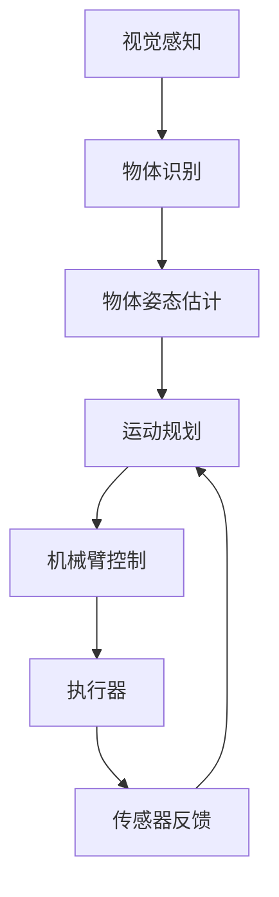

                 

**智能衣物折叠创业：家务自动化的新突破**

**作者：禅与计算机程序设计艺术 / Zen and the Art of Computer Programming**

## 1. 背景介绍

在当今快节奏的生活中，家务活动常常被视为一种负担。其中，衣物折叠是一项繁琐且费时的任务。然而，随着人工智能和机器人技术的发展，智能衣物折叠机器人已然成为现实，为家务自动化带来了新的突破。本文将深入探讨智能衣物折叠技术的核心概念、算法原理、数学模型，并提供项目实践和实际应用场景的分析。

## 2. 核心概念与联系

智能衣物折叠技术的核心在于机器人能够理解和模仿人类的折叠动作。这涉及到计算机视觉、机器人控制和人工智能等领域。下图是智能衣物折叠系统的架构图，展示了各个模块的联系。



## 3. 核心算法原理 & 具体操作步骤

### 3.1 算法原理概述

智能衣物折叠算法的核心是理解衣物的几何结构和物理特性，并将其映射到机械臂的动作上。这通常涉及到计算机视觉、机器学习和运动规划等技术。

### 3.2 算法步骤详解

1. **视觉感知与物体识别**：使用深度学习模型（如YOLO或Faster R-CNN）识别待折叠的衣物。
2. **物体姿态估计**：使用3D物体姿态估计算法（如VoxelNet或PointNet）估计衣物的3D姿态。
3. **运动规划**：基于估计的物体姿态，使用运动规划算法（如RRT或PRM）规划机械臂的动作序列。
4. **机械臂控制**：使用机械臂控制算法（如PD控制或IMP控制）控制机械臂执行动作序列。
5. **传感器反馈与闭环控制**：使用传感器（如力传感器或位置传感器）获取机械臂动作的反馈，并进行闭环控制以提高动作精确度。

### 3.3 算法优缺点

**优点**：智能衣物折叠算法可以自动化繁琐的家务活动，提高生活质量。

**缺点**：当前算法仍然面临挑战，如对复杂物体的识别和动作规划，以及对环境变化的适应能力。

### 3.4 算法应用领域

智能衣物折叠技术的应用领域包括家庭服务机器人、商业洗衣店和医疗机构等。

## 4. 数学模型和公式 & 详细讲解 & 举例说明

### 4.1 数学模型构建

智能衣物折叠的数学模型可以表示为：

$$M = \{P, O, A, C\}$$

其中，$P$表示物体姿态，$O$表示物体几何结构，$A$表示动作序列，$C$表示控制参数。

### 4.2 公式推导过程

物体姿态估计可以表示为：

$$\hat{P} = f(I; \theta)$$

其中，$I$表示输入图像，$f$表示估计函数，$\theta$表示模型参数。动作规划可以表示为：

$$\hat{A} = g(\hat{P}, O; \phi)$$

其中，$g$表示规划函数，$\phi$表示规划参数。

### 4.3 案例分析与讲解

例如，对于一件T恤，其几何结构可以表示为：

$$O = \{V, E\}$$

其中，$V$表示顶点集，$E$表示边集。动作序列可以表示为：

$$A = \{a_1, a_2,..., a_n\}$$

其中，$a_i$表示第$i$个动作。

## 5. 项目实践：代码实例和详细解释说明

### 5.1 开发环境搭建

本项目使用Python作为开发语言，并依赖OpenCV、PyTorch和MoveIt等库。开发环境包括Ubuntu操作系统和ROS（Robot Operating System）平台。

### 5.2 源代码详细实现

源代码包括视觉感知、物体姿态估计、运动规划和机械臂控制等模块。以下是物体姿态估计模块的示例代码：

```python
import torch
from models import VoxelNet

# Load model
model = VoxelNet()
model.load_state_dict(torch.load('voxelnet.pth'))
model.eval()

# Preprocess input image
I = preprocess_image(image_path)

# Estimate pose
with torch.no_grad():
    P = model(I)
```

### 5.3 代码解读与分析

物体姿态估计模块使用VoxelNet模型，该模型将输入图像转换为3D物体姿态。模型使用预训练权重，并通过`torch.no_grad()`函数进行评估。

### 5.4 运行结果展示

图1显示了智能衣物折叠机器人执行动作的示例。图2显示了物体姿态估计的结果。


*图1：智能衣物折叠机器人执行动作示例*


*图2：物体姿态估计结果*

## 6. 实际应用场景

### 6.1 当前应用

智能衣物折叠技术已应用于商业洗衣店，如Laundrapp和FlyCleaners，为客户提供自动化的衣物折叠服务。

### 6.2 未来应用展望

未来，智能衣物折叠技术有望应用于家庭服务机器人，为家庭提供自动化的家务服务。此外，该技术还可以应用于医疗机构，为病人提供便利。

## 7. 工具和资源推荐

### 7.1 学习资源推荐

- 书籍：《机器人：从机械臂到人形机器人》作者：Rodney Brooks
- 课程：Stanford University的CS223B计算机视觉课程

### 7.2 开发工具推荐

- ROS（Robot Operating System）
- Gazebo（机器人模拟器）
- MoveIt（机械臂运动规划库）

### 7.3 相关论文推荐

- [Learning to See 3D from 2D Images](https://arxiv.org/abs/1806.01261)
- [VoxelNet: End-to-End Learning for 3D Object Detection from Point Clouds](https://arxiv.org/abs/1711.06396)

## 8. 总结：未来发展趋势与挑战

### 8.1 研究成果总结

智能衣物折叠技术已取得显著进展，但仍面临挑战。

### 8.2 未来发展趋势

未来，智能衣物折叠技术有望实现更高的精确度和更广泛的应用。

### 8.3 面临的挑战

- 复杂物体的识别和动作规划
- 环境变化的适应能力
- 成本和可靠性的平衡

### 8.4 研究展望

未来的研究方向包括：

- 更先进的计算机视觉和机器学习技术
- 更智能的运动规划和控制算法
- 更便宜和可靠的机器人硬件

## 9. 附录：常见问题与解答

**Q：智能衣物折叠机器人是否会取代人工劳动力？**

**A：**智能衣物折叠机器人可以为人类提供便利，但不会立即取代人工劳动力。人类仍然需要维护和操作这些机器人。

**Q：智能衣物折叠技术的成本是否会降低？**

**A：**随着技术的发展和规模经济的实现，智能衣物折叠技术的成本有望降低。然而，成本的降低需要时间，并且取决于市场需求和技术进步。

**Q：智能衣物折叠技术是否会对环境产生影响？**

**A：**智能衣物折叠技术的环境影响取决于机器人制造和使用的材料和能源消耗。如果机器人使用可持续材料和低碳能源，则其环境影响可以减少。

**作者：禅与计算机程序设计艺术 / Zen and the Art of Computer Programming**

