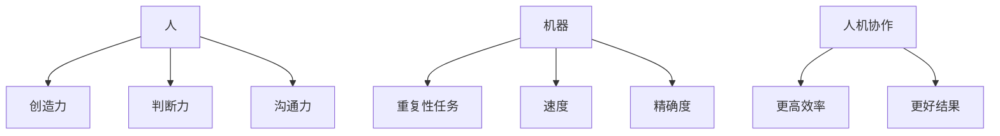

                 

**人工智能**, **自动化**, **人机协作**, **未来就业**, **数字化转型**, **技能转化**

## 1. 背景介绍

在当今快速变化的世界中，技术的发展正在重塑我们的工作方式。人工智能（AI）、机器学习（ML）、自动化和数字化转型等技术正在改变各行各业的面貌。根据世界经济论坛的报告，到2025年，全球将需要1.4亿新的数字化工作岗位，但同时也会消失7500万个传统岗位。这种转变为我们提供了一个机会，重新思考未来的工作图景，并通过人机协作创造更多的就业机会。

## 2. 核心概念与联系

### 2.1 人机协作

人机协作（Human-Machine Collaboration, HMC）是指人和机器共同合作完成任务的过程。在HMC中，人和机器各自发挥优势，共同创造更高的效率和更好的结果。机器负责重复性高、速度快、精确度高的任务，而人则负责需要创造力、判断力和沟通力的任务。



### 2.2 自动化与人工智能

自动化是指使用机器或软件自动完成任务，而不需要人工干预。人工智能则是指模拟人类智能的计算机系统，它可以学习、推理和解决问题。自动化和人工智能常常被结合使用，以创造更智能的自动化系统。

## 3. 核心算法原理 & 具体操作步骤

### 3.1 算法原理概述

人机协作的关键是要能够理解和模拟人类的行为。一种常用的方法是使用行为键控（Behavioral Cloning, BC）算法。BC算法通过学习人类示例来模拟人类行为。它首先记录人类的行为，然后使用机器学习算法（如神经网络）来模拟这些行为。

### 3.2 算法步骤详解

1. 数据收集：收集人类执行任务的示例数据，包括视频、音频和传感器数据。
2. 特征提取：从收集的数据中提取特征，这些特征将用于训练模型。
3. 模型训练：使用机器学习算法（如神经网络）来模拟人类行为。模型接受特征作为输入，并输出模拟的人类行为。
4. 模型评估：评估模型的性能，并进行调整以提高准确性。
5. 部署：将模型部署到实际环境中，与人类一起工作。

### 3.3 算法优缺点

优点：

* BC算法可以模拟人类行为，从而实现人机协作。
* 它可以学习复杂的任务，而不需要明确的规则。
* 它可以快速学习，因为它不需要大量的数据标记。

缺点：

* BC算法需要大量的示例数据，这可能很难收集。
* 它可能无法处理未知情况，因为它只能模拟示例中的行为。
* 它可能会受到示例数据的偏见，从而导致模型偏见。

### 3.4 算法应用领域

BC算法可以应用于各种领域，包括自动驾驶、机器人操作、游戏开发和人机交互等。它可以帮助机器理解人类的意图，并与人类协作完成任务。

## 4. 数学模型和公式 & 详细讲解 & 举例说明

### 4.1 数学模型构建

在BC算法中，我们可以使用神经网络作为模型。神经网络是一种计算模型，它模拟人类大脑的结构和功能。它由输入层、隐藏层和输出层组成。输入层接受特征作为输入，隐藏层进行特征提取和转换，输出层输出模拟的人类行为。

### 4.2 公式推导过程

神经网络的学习过程可以使用反向传播算法来优化。反向传播算法使用梯度下降法来调整网络的权重，以最小化预测误差。给定输入$x$和目标输出$y$，神经网络的目标函数可以表示为：

$$L(\theta) = \frac{1}{2} ||h_\theta(x) - y||^2$$

其中$h_\theta(x)$是神经网络的预测输出，$\theta$是网络的权重。反向传播算法通过计算梯度$\nabla_\theta L(\theta)$来更新权重$\theta$：

$$\nabla_\theta L(\theta) = \nabla_\theta \frac{1}{2} ||h_\theta(x) - y||^2 = (h_\theta(x) - y) \nabla_\theta h_\theta(x)$$

### 4.3 案例分析与讲解

例如，在自动驾驶领域，我们可以使用BC算法来模拟人类驾驶员的行为。我们首先收集人类驾驶员的示例数据，包括汽车的加速度、转向角和刹车信号等。然后，我们使用神经网络来模拟这些行为。模型接受汽车的传感器数据作为输入，并输出模拟的人类驾驶行为。最后，我们可以将模型部署到自动驾驶系统中，与人类驾驶员协作完成驾驶任务。

## 5. 项目实践：代码实例和详细解释说明

### 5.1 开发环境搭建

要实现BC算法，我们需要以下软件和库：

* Python：一种用于科学计算和机器学习的编程语言。
* TensorFlow：一种用于构建和训练神经网络的开源库。
* OpenCV：一种用于计算机视觉的开源库。
* NumPy：一种用于数值计算的开源库。

### 5.2 源代码详细实现

以下是BC算法的Python实现示例：

```python
import numpy as np
import tensorflow as tf
import cv2

# 数据收集和预处理
#...

# 特征提取
def extract_features(image):
    # 使用OpenCV提取特征，如边缘检测等
    #...
    return features

# 模型构建
model = tf.keras.Sequential([
    tf.keras.layers.Dense(64, activation='relu', input_shape=(num_features,)),
    tf.keras.layers.Dense(64, activation='relu'),
    tf.keras.layers.Dense(num_actions)
])

# 模型训练
model.compile(optimizer='adam', loss='mse')
model.fit(X_train, y_train, epochs=10, batch_size=32)

# 模型评估
#...

# 模型部署
#...
```

### 5.3 代码解读与分析

在代码中，我们首先导入所需的库。然后，我们定义了数据收集和预处理的函数。接着，我们定义了特征提取函数，使用OpenCV从图像中提取特征。我们使用TensorFlow构建了一个神经网络模型，并使用反向传播算法来训练模型。最后，我们评估模型的性能，并将其部署到实际环境中。

### 5.4 运行结果展示

在运行示例代码后，我们可以评估模型的性能，并将其部署到实际环境中。例如，在自动驾驶领域，我们可以将模型部署到自动驾驶系统中，与人类驾驶员协作完成驾驶任务。我们可以使用仿真器或真实环境来测试模型的性能。

## 6. 实际应用场景

### 6.1 工业自动化

在工业自动化领域，人机协作可以帮助机器人理解人类的意图，并与人类协作完成任务。例如，机器人可以协助人类在工厂装配线上工作，帮助人类完成重复性高、速度快、精确度高的任务。

### 6.2 服务业

在服务业，人机协作可以帮助机器人理解人类的需求，并提供个性化的服务。例如，机器人可以在餐厅为客人提供菜单，并根据客人的口味推荐菜品。

### 6.3 未来应用展望

随着技术的发展，人机协作的应用领域将会不断扩展。未来，人机协作可能会应用于医疗保健、教育、娱乐等各个领域。人机协作将帮助我们创造更智能、更高效的工作环境，并为我们提供更多的就业机会。

## 7. 工具和资源推荐

### 7.1 学习资源推荐

* "人工智能：一种现代方法"（Artificial Intelligence: A Modern Approach）是一本经典的AI教科书，可以帮助读者理解AI的基本概念和算法。
* "深度学习"（Deep Learning）是一本由Ian Goodfellow、Yoshua Bengio和Aaron Courville合著的深度学习教科书，可以帮助读者理解深度学习的原理和应用。
*  Coursera和Udacity等在线学习平台提供了大量的AI和机器学习课程，可以帮助读者学习最新的技术和工具。

### 7.2 开发工具推荐

* TensorFlow和PyTorch是两种流行的深度学习框架，可以帮助开发者构建和训练神经网络模型。
* OpenCV是一种流行的计算机视觉库，可以帮助开发者处理图像和视频数据。
* ROS（Robot Operating System）是一种流行的机器人操作系统，可以帮助开发者构建和控制机器人系统。

### 7.3 相关论文推荐

* "Behavioral Cloning by Deep Reinforcement Learning"是一篇由S. Ross等人撰写的论文，介绍了使用深度强化学习进行行为克隆的方法。
* "End-to-End Learning for Self-Driving Cars"是一篇由D. Bojarski等人撰写的论文，介绍了使用深度学习进行自动驾驶的方法。
* "Human-in-the-Loop Machine Learning for Autonomous Vehicles"是一篇由M. Chai等人撰写的论文，介绍了人机协作的自动驾驶系统。

## 8. 总结：未来发展趋势与挑战

### 8.1 研究成果总结

在本文中，我们介绍了人机协作的概念和应用，并详细介绍了行为克隆算法的原理和实现。我们还提供了一个Python实现示例，并介绍了人机协作的实际应用场景和未来发展趋势。

### 8.2 未来发展趋势

未来，人机协作将会成为一种主流的工作方式。人机协作可以帮助我们创造更智能、更高效的工作环境，并为我们提供更多的就业机会。随着技术的发展，人机协作的应用领域将会不断扩展，从工业自动化到服务业，从医疗保健到教育娱乐等各个领域。

### 8.3 面临的挑战

然而，人机协作也面临着一些挑战。首先，我们需要收集大量的示例数据来训练模型。其次，我们需要解决模型偏见和未知情况的问题。最后，我们需要解决人机协作的安全和可靠性问题。

### 8.4 研究展望

未来的研究将会集中在以下几个方面：

* 如何收集和标记大量的示例数据？
* 如何解决模型偏见和未知情况的问题？
* 如何提高人机协作的安全和可靠性？
* 如何将人机协作应用于更多的领域？

## 9. 附录：常见问题与解答

**Q1：人机协作和自动化有什么区别？**

A1：自动化是指使用机器或软件自动完成任务，而不需要人工干预。人机协作则是指人和机器共同合作完成任务的过程。在人机协作中，人和机器各自发挥优势，共同创造更高的效率和更好的结果。

**Q2：行为克隆算法有什么优缺点？**

A2：行为克隆算法的优点是可以模拟人类行为，从而实现人机协作。它可以学习复杂的任务，而不需要明确的规则。它可以快速学习，因为它不需要大量的数据标记。然而，它也有缺点，如需要大量的示例数据，可能无法处理未知情况，可能受到示例数据的偏见等。

**Q3：人机协作的未来发展趋势是什么？**

A3：未来，人机协作将会成为一种主流的工作方式。人机协作可以帮助我们创造更智能、更高效的工作环境，并为我们提供更多的就业机会。随着技术的发展，人机协作的应用领域将会不断扩展，从工业自动化到服务业，从医疗保健到教育娱乐等各个领域。

**Q4：人机协作面临的挑战是什么？**

A4：人机协作面临的挑战包括如何收集和标记大量的示例数据，如何解决模型偏见和未知情况的问题，如何提高人机协作的安全和可靠性等。

**Q5：未来的研究将会集中在哪些方面？**

A5：未来的研究将会集中在如何收集和标记大量的示例数据，如何解决模型偏见和未知情况的问题，如何提高人机协作的安全和可靠性，如何将人机协作应用于更多的领域等方面。

## 作者：禅与计算机程序设计艺术 / Zen and the Art of Computer Programming

