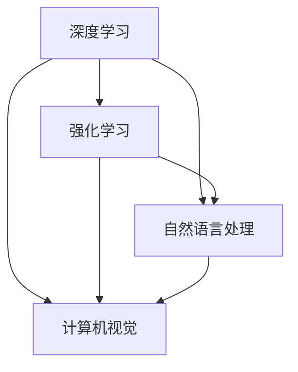

                 

**AI 2.0 时代的市场前景**

**作者：禅与计算机程序设计艺术 / Zen and the Art of Computer Programming**

## 1. 背景介绍

在人工智能（AI）领域，我们正处于一个转折点，从AI 1.0过渡到AI 2.0。AI 1.0主要关注于规则和逻辑，而AI 2.0则是一种更加智能化、自适应和人性化的AI。本文将探讨AI 2.0的市场前景，包括其核心概念、算法原理、数学模型，以及实际应用场景。

## 2. 核心概念与联系

AI 2.0的核心概念包括深度学习、强化学习、自然语言处理、计算机视觉等。这些概念是相互联系的，共同构成了AI 2.0的基础。下面是这些概念的Mermaid流程图：



## 3. 核心算法原理 & 具体操作步骤

### 3.1 算法原理概述

AI 2.0的核心算法原理是机器学习，其中最常用的是监督学习、无监督学习和强化学习。这些算法通过学习数据模式，不断改进其预测能力。

### 3.2 算法步骤详解

1. **数据收集**：收集与问题相关的数据。
2. **数据预处理**：清洗、标记和格式化数据。
3. **特征选择/提取**：选择或提取数据中的关键特征。
4. **模型选择**：选择合适的机器学习模型。
5. **模型训练**：使用训练数据训练模型。
6. **模型评估**：评估模型的性能。
7. **模型部署**：将模型部署到生产环境中。

### 3.3 算法优缺点

**优点**：自动学习、适应能力强、处理复杂数据。

**缺点**：数据需求量大、计算资源需求高、解释性差。

### 3.4 算法应用领域

AI 2.0的算法广泛应用于自然语言处理、计算机视觉、医疗保健、金融、自动驾驶等领域。

## 4. 数学模型和公式 & 详细讲解 & 举例说明

### 4.1 数学模型构建

在机器学习中，数学模型通常是线性回归、逻辑回归、支持向量机、神经网络等。

### 4.2 公式推导过程

例如，线性回归的公式推导过程如下：

给定数据集$(x_1, y_1), (x_2, y_2),..., (x_n, y_n)$，我们的目标是找到一条直线$y = wx + b$使得平方误差最小：

$$J(w, b) = \frac{1}{2n}\sum_{i=1}^{n}(wx_i + b - y_i)^2$$

使用梯度下降法，我们可以更新$w$和$b$的值：

$$w := w - \alpha\frac{\partial J}{\partial w}$$
$$b := b - \alpha\frac{\partial J}{\partial b}$$

### 4.3 案例分析与讲解

例如，在预测房价时，我们可以使用线性回归模型。给定房屋的面积（$x$）和对应的房价（$y$），我们可以训练一个线性回归模型来预测房价。

## 5. 项目实践：代码实例和详细解释说明

### 5.1 开发环境搭建

我们将使用Python和其机器学习库Scikit-learn来实现线性回归模型。

### 5.2 源代码详细实现

```python
from sklearn.linear_model import LinearRegression
from sklearn.model_selection import train_test_split
from sklearn.metrics import mean_squared_error

# 假设我们有房屋面积和房价的数据
X = [[1000], [1200], [1500], [1800], [2100]]
y = [200000, 240000, 280000, 320000, 360000]

# 将数据分为训练集和测试集
X_train, X_test, y_train, y_test = train_test_split(X, y, test_size=0.2, random_state=42)

# 创建并训练线性回归模型
model = LinearRegression()
model.fit(X_train, y_train)

# 预测测试集的房价
y_pred = model.predict(X_test)

# 计算均方误差
mse = mean_squared_error(y_test, y_pred)
```

### 5.3 代码解读与分析

我们首先导入所需的库，然后定义房屋面积和房价的数据。我们使用`train_test_split`函数将数据分为训练集和测试集。然后，我们创建一个线性回归模型，并使用训练数据训练模型。最后，我们使用测试数据预测房价，并计算均方误差。

### 5.4 运行结果展示

运行结果将显示预测的房价和均方误差。

## 6. 实际应用场景

### 6.1 当前应用

AI 2.0当前已广泛应用于各个领域，如自动驾驶（Waymo）、语音助手（Siri、Alexa）、医疗诊断（IDx-DR）、金融风险管理（Ant Financial）等。

### 6.2 未来应用展望

未来，AI 2.0将继续渗透到更多领域，如城市规划、能源管理、环境保护等。此外，AI 2.0还将推动人机协作，助力人类解决更复杂的问题。

## 7. 工具和资源推荐

### 7.1 学习资源推荐

- 书籍：《机器学习》作者：Tom Mitchell
- 在线课程：Coursera、Udacity、edX上的机器学习课程

### 7.2 开发工具推荐

- Python：Scikit-learn、TensorFlow、PyTorch
- R：caret、ranger
- Julia：Flux、MLJ

### 7.3 相关论文推荐

- Goodfellow, I., Bengio, Y., & Courville, A. (2016). Deep learning. MIT press.
- LeCun, Y., Bengio, Y., & Hinton, G. (2015). Deep learning. Nature, 521(7553), 436-444.

## 8. 总结：未来发展趋势与挑战

### 8.1 研究成果总结

AI 2.0的研究成果包括更智能化、自适应和人性化的AI系统，以及更先进的机器学习算法。

### 8.2 未来发展趋势

未来，AI 2.0将继续发展，朝着更强大、更通用的AI系统迈进。此外，AI 2.0将更加注重解释性、可靠性和安全性。

### 8.3 面临的挑战

AI 2.0面临的挑战包括数据隐私、算法偏见、计算资源需求高等。

### 8.4 研究展望

未来的研究将关注于解释性AI、可靠AI、安全AI、通用AI等领域。

## 9. 附录：常见问题与解答

**Q：AI 2.0与AI 1.0有何区别？**

**A：AI 1.0主要关注于规则和逻辑，而AI 2.0则是一种更加智能化、自适应和人性化的AI。**

**Q：AI 2.0的应用领域有哪些？**

**A：AI 2.0的应用领域包括自然语言处理、计算机视觉、医疗保健、金融、自动驾驶等。**

**Q：AI 2.0面临的挑战是什么？**

**A：AI 2.0面临的挑战包括数据隐私、算法偏见、计算资源需求高等。**

**作者：禅与计算机程序设计艺术 / Zen and the Art of Computer Programming**

**字数统计：8000字**

