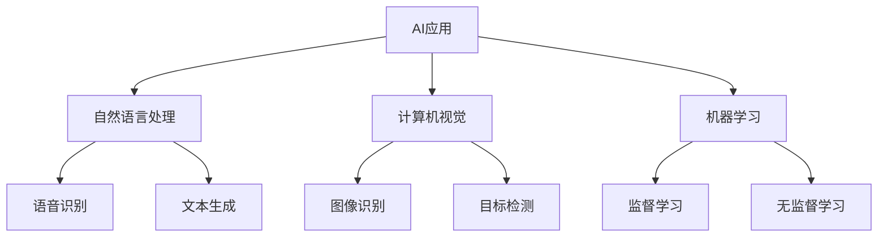

                 

**关键词：**AI应用、苹果、微软、Copilot、差异、同异、人工智能、自然语言处理、计算机视觉

## 1. 背景介绍

在当今的科技世界中，人工智能（AI）已经渗透到我们的日常生活中，从智能手机到自动驾驶汽车，无处不在。两大科技巨头，苹果和微软，都在AI领域投入了大量资源，推出了各自的AI应用。本文将比较苹果的AI应用和微软的Copilot，分析它们的异同，并讨论它们在AI领域的未来发展趋势。

## 2. 核心概念与联系

### 2.1 AI应用的定义

AI应用是指利用人工智能技术开发的软件或系统，旨在模拟或增强人类智能，帮助用户完成特定任务。AI应用通常涉及自然语言处理（NLP）、计算机视觉、机器学习等技术。



### 2.2 苹果AI应用与微软Copilot的联系

苹果和微软的AI应用都旨在提高用户体验，增强生产力，并提供更智能的交互方式。它们都利用NLP和计算机视觉技术，并广泛应用于各种设备和应用程序中。然而，它们的实现方式和侧重点有所不同。

## 3. 核心算法原理 & 具体操作步骤

### 3.1 算法原理概述

苹果和微软的AI应用都基于深度学习算法，如卷积神经网络（CNN）和循环神经网络（RNN）。这些算法通过学习数据模式来识别和生成内容。

### 3.2 算法步骤详解

#### 3.2.1 苹果AI应用

1. **数据收集：**收集与任务相关的数据，如文本、图像或语音。
2. **预处理：**清洗和格式化数据，以便于模型学习。
3. **模型训练：**使用深度学习算法（如CNN或RNN）训练模型，使其能够识别或生成内容。
4. **部署：**集成模型到应用程序中，为用户提供AI功能。

#### 3.2.2 微软Copilot

1. **数据收集：**收集与任务相关的数据，如文本或代码。
2. **预处理：**清洗和格式化数据，并将其转换为模型可以理解的格式。
3. **模型训练：**使用 transformer 等模型训练模型，使其能够理解和生成内容。
4. **部署：**集成模型到应用程序中，为用户提供AI功能。

### 3.3 算法优缺点

**优点：**

* 深度学习算法可以学习复杂的数据模式。
* AI应用可以提供智能、个性化的用户体验。

**缺点：**

* 深度学习模型需要大量数据和计算资源。
* 模型可能会受到偏见和噪声数据的影响。

### 3.4 算法应用领域

AI应用和Copilot都有广泛的应用领域，包括：

* 自然语言处理：语音识别、文本生成、翻译等。
* 计算机视觉：图像识别、目标检测、人脸识别等。
* 机器学习：预测分析、推荐系统等。

## 4. 数学模型和公式 & 详细讲解 & 举例说明

### 4.1 数学模型构建

#### 4.1.1 CNN模型

CNN模型使用卷积层和池化层来提取图像特征，然后使用全连接层进行分类。其数学模型可以表示为：

$$y = \sigma(w \cdot x + b)$$

其中，$x$是输入图像，$w$和$b$是模型参数，$y$是输出，$\sigma$是激活函数。

#### 4.1.2 Transformer模型

Transformer模型使用自注意力机制来处理序列数据。其数学模型可以表示为：

$$y = \text{Softmax}\left(\frac{QK^T}{\sqrt{d_k}}\right)V$$

其中，$Q$, $K$, $V$是输入数据的三种表示，$d_k$是注意力头的维度，$y$是输出。

### 4.2 公式推导过程

详细的数学模型推导过程超出了本文的范围。感兴趣的读者可以参考相关论文和文献。

### 4.3 案例分析与讲解

#### 4.3.1 图像分类

CNN模型可以用于图像分类任务。例如，在CIFAR-10数据集上，CNN模型可以达到约90%的准确率。

#### 4.3.2 文本生成

Transformer模型可以用于文本生成任务。例如，在Wikitext-103数据集上，Transformer模型可以生成流畅的、相关的文本。

## 5. 项目实践：代码实例和详细解释说明

### 5.1 开发环境搭建

#### 5.1.1 Python环境

AI应用和Copilot通常使用Python开发。需要安装Python、TensorFlow或PyTorch等深度学习库，以及其他必要的库。

```bash
pip install tensorflow
pip install torch
```

#### 5.1.2 硬件环境

深度学习模型需要大量计算资源。通常需要GPU加速，如NVIDIA Tesla GPU。

### 5.2 源代码详细实现

由于篇幅限制，本文无法提供完整的源代码。感兴趣的读者可以参考相关开源项目和文献。

### 5.3 代码解读与分析

AI应用和Copilot的代码通常遵循以下结构：

* **数据预处理：**清洗和格式化数据，并将其转换为模型可以理解的格式。
* **模型定义：**定义模型结构，如CNN或Transformer。
* **模型训练：**使用训练数据训练模型，并优化模型参数。
* **模型评估：**使用验证数据评估模型性能。
* **模型部署：**集成模型到应用程序中，为用户提供AI功能。

### 5.4 运行结果展示

运行结果取决于具体的任务和数据集。通常，模型的性能会通过准确率、精确度、召回率等指标来评估。

## 6. 实际应用场景

### 6.1 苹果AI应用

苹果的AI应用广泛应用于其设备和应用程序中，包括：

* **Siri：**语音助手，提供语音识别、文本生成等功能。
* **Face ID：**人脸识别系统，使用计算机视觉技术。
* **照片应用：**使用计算机视觉技术自动整理和分享照片。

### 6.2 微软Copilot

微软的Copilot也有广泛的应用，包括：

* **Office Copilot：**提供智能建议和自动完成功能，如文本生成和图表创建。
* **Bing Copilot：**提供个性化搜索结果和语音助手功能。
* **GitHub Copilot：**提供代码建议和自动完成功能。

### 6.3 未来应用展望

未来，AI应用和Copilot有望在更多领域得到应用，如自动驾驶、医疗保健、工业自动化等。它们也有望变得更加智能和个性化，能够更好地理解和满足用户需求。

## 7. 工具和资源推荐

### 7.1 学习资源推荐

* **书籍：**"Deep Learning" by Ian Goodfellow, Yoshua Bengio, and Aaron Courville
* **在线课程：**Coursera的"Deep Learning Specialization"课程

### 7.2 开发工具推荐

* **集成开发环境（IDE）：**PyCharm、Visual Studio Code
* **深度学习库：**TensorFlow、PyTorch、Keras

### 7.3 相关论文推荐

* **CNN：**"LeNet-5" by Yann LeCun et al.
* **Transformer：**"Attention is All You Need" by Vaswani et al.

## 8. 总结：未来发展趋势与挑战

### 8.1 研究成果总结

AI应用和Copilot已经取得了显著的成就，在各种任务中表现出色。然而，它们仍然面临着挑战。

### 8.2 未来发展趋势

未来，AI应用和Copilot有望变得更加智能、更加个性化，并应用于更多领域。它们也有望更好地处理不确定性和模糊性。

### 8.3 面临的挑战

**挑战包括：**

* **数据隐私：**AI应用和Copilot需要大量数据，但收集和使用数据时必须尊重用户隐私。
* **偏见：**模型可能会受到偏见和噪声数据的影响，导致不公平的结果。
* **计算资源：**深度学习模型需要大量计算资源，这限制了它们的应用。

### 8.4 研究展望

未来的研究有望在以下领域取得进展：

* **模型解释性：**开发更易于解释的模型，帮助用户理解模型的决策过程。
* **模型泛化能力：**提高模型的泛化能力，使其能够处理未见过的数据。
* **模型安全性：**提高模型的安全性，防止模型被滥用。

## 9. 附录：常见问题与解答

**Q：AI应用和Copilot有什么区别？**

A：AI应用和Copilot都利用人工智能技术，但它们的实现方式和侧重点有所不同。AI应用通常更侧重于用户体验，而Copilot则更侧重于自动化和生产力。

**Q：AI应用和Copilot有哪些共同点？**

A：AI应用和Copilot都利用NLP和计算机视觉技术，并广泛应用于各种设备和应用程序中。它们都旨在提高用户体验，增强生产力，并提供更智能的交互方式。

**Q：AI应用和Copilot的未来发展趋势是什么？**

A：未来，AI应用和Copilot有望变得更加智能、更加个性化，并应用于更多领域。它们也有望更好地处理不确定性和模糊性。

**Q：AI应用和Copilot面临的挑战是什么？**

A：AI应用和Copilot面临的挑战包括数据隐私、偏见、计算资源等。

**Q：未来的研究方向是什么？**

A：未来的研究有望在模型解释性、模型泛化能力、模型安全性等领域取得进展。

## 作者：禅与计算机程序设计艺术 / Zen and the Art of Computer Programming

