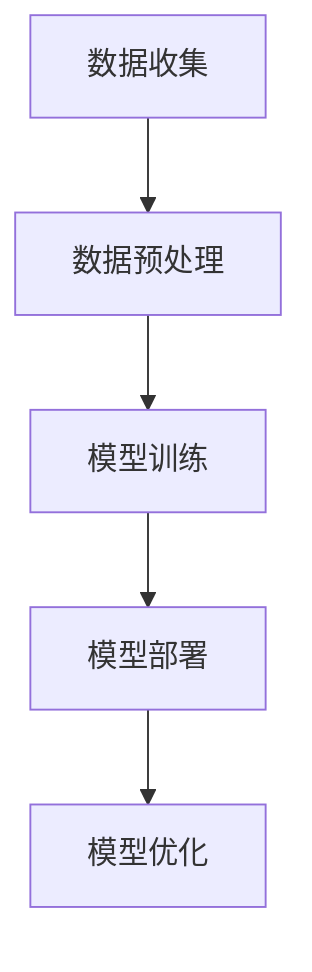

                 

**关键词：**AI应用、商业价值、苹果、深度学习、人工智能、算法、数据、隐私、创新

## 1. 背景介绍

在当今的技术世界中，人工智能（AI）已经渗透到我们的日常生活中，从语音助手到自动驾驶汽车，再到智能家居，AI无处不在。作为科技行业的领导者，苹果公司也在积极拥抱AI，并将其集成到其产品和服务中。 recent announcement of Apple's new AI applications has sparked interest in the commercial value of AI. This article will delve into the business value of AI applications, using Apple's recent announcements as a case study.

## 2. 核心概念与联系

### 2.1 AI应用的商业价值

AI应用的商业价值可以从多个角度来看。首先，AI可以帮助企业提高效率，自动化重复性任务，从而节省成本。其次，AI可以提供新的收入来源，通过开发新的产品和服务来满足客户需求。最后，AI可以帮助企业更好地理解其客户，从而改善客户体验。

### 2.2 AI应用的类型

AI应用可以分为两大类：通用AI和专用AI。通用AI旨在模仿人类智能，可以执行各种任务。专用AI则专门设计用于特定任务，例如图像识别或语音识别。

### 2.3 AI应用的架构

AI应用的架构通常包括数据收集、数据预处理、模型训练、模型部署和模型优化等步骤。数据收集和预处理是关键步骤，因为高质量的数据是构建有效AI模型的关键。模型训练和部署需要大量的计算资源，通常需要使用GPU或TPU等专用硬件。模型优化是一个持续的过程，旨在提高模型的准确性和效率。



## 3. 核心算法原理 & 具体操作步骤

### 3.1 算法原理概述

苹果公司在其AI应用中使用了各种算法，包括深度学习算法。深度学习是一种机器学习技术，旨在模仿人类大脑的工作原理。它使用神经网络模型，其中包含多个隐藏层，每层都有大量的神经元。

### 3.2 算法步骤详解

深度学习算法的步骤包括数据预处理、模型构建、模型训练和模型评估。数据预处理包括数据清洗、数据标准化和数据分割。模型构建包括选择合适的神经网络架构和初始化模型参数。模型训练包括使用反向传播算法调整模型参数，以最小化预测误差。模型评估包括使用测试数据集评估模型性能。

### 3.3 算法优缺点

深度学习算法的优点包括高准确性、泛化能力强和可以处理复杂数据。其缺点包括计算资源需求高、训练时间长和模型解释性差。

### 3.4 算法应用领域

深度学习算法在各种领域都有广泛应用，包括图像识别、语音识别、自然语言处理、自动驾驶汽车和医疗诊断等。

## 4. 数学模型和公式 & 详细讲解 & 举例说明

### 4.1 数学模型构建

深度学习模型的数学基础是神经网络模型。神经网络模型可以表示为以下形式：

$$y = f(x; W, b)$$

其中，$x$是输入数据，$y$是输出数据，$W$和$b$是模型参数，$f$是激活函数。

### 4.2 公式推导过程

模型训练的目标是最小化预测误差。预测误差可以使用均方误差（MSE）或交叉熵等损失函数来计算。模型参数可以使用梯度下降算法来调整，以最小化损失函数。梯度下降算法的公式如下：

$$W := W - \eta \nabla_W L$$
$$b := b - \eta \nabla_b L$$

其中，$\eta$是学习率，$\nabla_W L$和$\nabla_b L$是损失函数对$W$和$b$的梯度。

### 4.3 案例分析与讲解

例如，假设我们要构建一个简单的线性回归模型来预测房价。输入数据$x$是房屋的面积，输出数据$y$是房屋的价格。模型可以表示为：

$$y = Wx + b$$

我们可以使用梯度下降算法来调整$W$和$b$的值，以最小化预测误差。具体步骤如下：

1. 初始化$W$和$b$的值。
2. 计算预测值$y$。
3. 计算损失函数值。
4. 计算梯度$\nabla_W L$和$\nabla_b L$。
5. 使用梯度下降算法调整$W$和$b$的值。
6. 重复步骤2-5，直到模型收敛。

## 5. 项目实践：代码实例和详细解释说明

### 5.1 开发环境搭建

要构建深度学习模型，我们需要安装以下软件：

* Python：用于编写代码。
* TensorFlow或PyTorch：用于构建和训练深度学习模型。
* Jupyter Notebook：用于运行和调试代码。

### 5.2 源代码详细实现

以下是一个简单的深度学习模型的Python代码实现：

```python
import tensorflow as tf
from tensorflow.keras import layers

# 构建模型
model = tf.keras.Sequential([
    layers.Dense(64, activation='relu', input_shape=(784,)),
    layers.Dense(64, activation='relu'),
    layers.Dense(10, activation='softmax')
])

# 编译模型
model.compile(optimizer='adam',
              loss='sparse_categorical_crossentropy',
              metrics=['accuracy'])

# 加载数据
mnist = tf.keras.datasets.mnist
(x_train, y_train), (x_test, y_test) = mnist.load_data()
x_train, x_test = x_train / 255.0, x_test / 255.0

# 训练模型
model.fit(x_train, y_train, epochs=5)

# 评估模型
test_loss, test_acc = model.evaluate(x_test, y_test, verbose=2)
print('\nTest accuracy:', test_acc)
```

### 5.3 代码解读与分析

这段代码使用TensorFlow构建了一个简单的深度学习模型来识别手写数字。模型由两个隐藏层和一个输出层组成。模型使用ReLU激活函数和softmax激活函数。模型使用Adam优化器和交叉熵损失函数。数据集是MNIST数据集，包含60,000个训练样本和10,000个测试样本。模型在训练集上训练了5个epoch，然后在测试集上评估。

### 5.4 运行结果展示

运行这段代码后，模型的准确性应该在90%以上。

## 6. 实际应用场景

### 6.1 当前应用

苹果公司在其产品和服务中广泛应用AI，例如：

* Siri：苹果的语音助手，使用自然语言处理技术来理解用户的请求。
* Face ID：苹果的面部识别技术，使用深度学习算法来识别用户的面部特征。
* Apple Watch的心率检测：使用AI算法来检测用户的心率，并提供心率异常的警告。

### 6.2 未来应用展望

未来，苹果公司可能会在以下领域扩展其AI应用：

* 自动驾驶汽车：苹果公司正在开发自动驾驶汽车技术，使用AI算法来感知环境和控制车辆。
* 健康监测：苹果公司可能会扩展其AI应用，用于监测用户的健康状况，例如检测糖尿病或癌症等疾病。
* 个性化推荐：苹果公司可能会使用AI算法来为用户提供个性化的产品和服务推荐。

## 7. 工具和资源推荐

### 7.1 学习资源推荐

* "Deep Learning"一书：由Ian Goodfellow、Yoshua Bengio和Aaron Courville合著，是深度学习领域的权威教材。
* Coursera上的深度学习课程：由Stanford University提供，由Andrew Ng讲授。
* TensorFlow Playground：一个交互式工具，用于可视化和调试深度学习模型。

### 7.2 开发工具推荐

* Jupyter Notebook：一个交互式笔记本，用于编写和运行Python代码。
* TensorFlow：一个开源的深度学习框架，用于构建和训练深度学学习模型。
* PyTorch：另一个流行的深度学习框架，提供更灵活的模型构建和调试功能。

### 7.3 相关论文推荐

* "ImageNet Classification with Deep Convolutional Neural Networks"：由Krizhevsky、Sutskever和Hinton在2012年发表，是深度学习领域的里程碑式论文。
* "Attention Is All You Need"：由Vaswani、Shazeer等人在2017年发表，提出了transformer模型，改变了自然语言处理领域的发展方向。

## 8. 总结：未来发展趋势与挑战

### 8.1 研究成果总结

本文介绍了苹果公司在AI应用方面的商业价值，并详细介绍了深度学习算法的原理和实现。我们还讨论了苹果公司在当前和未来的AI应用场景。

### 8.2 未来发展趋势

未来，AI技术将继续发展，并渗透到更多领域。我们可能会看到AI在自动驾驶汽车、医疗诊断和个性化推荐等领域的更多应用。此外，AI技术也将继续发展，例如使用更复杂的模型架构和更先进的算法。

### 8.3 面临的挑战

然而，AI技术也面临着挑战，例如数据隐私和模型解释性等问题。此外，AI技术的发展也需要大量的计算资源，这可能会导致能源消耗和碳排放等环境问题。

### 8.4 研究展望

未来的研究将需要解决这些挑战，并开发更先进的AI技术。我们可能会看到更多的研究集中在模型解释性、数据隐私保护和绿色AI等领域。

## 9. 附录：常见问题与解答

**Q：AI应用的商业价值是什么？**

A：AI应用的商业价值包括提高效率、提供新的收入来源和改善客户体验等。

**Q：深度学习算法的优缺点是什么？**

A：深度学习算法的优点包括高准确性、泛化能力强和可以处理复杂数据。其缺点包括计算资源需求高、训练时间长和模型解释性差。

**Q：苹果公司在AI应用方面的当前和未来应用是什么？**

A：苹果公司在当前的AI应用包括Siri、Face ID和Apple Watch的心率检测等。未来的应用可能包括自动驾驶汽车、健康监测和个性化推荐等。

**Q：AI技术面临的挑战是什么？**

A：AI技术面临的挑战包括数据隐私、模型解释性和环境问题等。

**Q：未来的AI研究方向是什么？**

A：未来的AI研究方向可能包括模型解释性、数据隐私保护和绿色AI等领域。

**作者：禅与计算机程序设计艺术 / Zen and the Art of Computer Programming**

