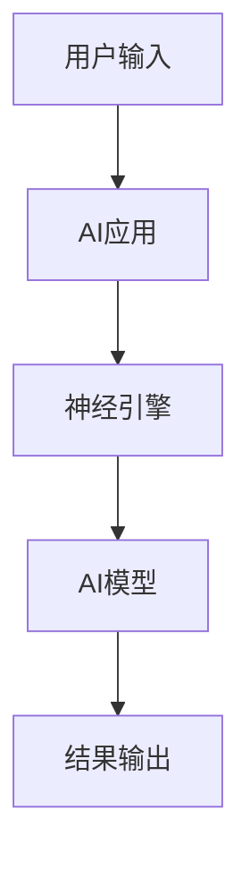

                 

**关键词：**AI应用、市场前景、苹果、深度学习、人工智能、移动应用、用户体验、隐私保护

## 1. 背景介绍

自从2017年发布了第一款支持AI的iPhone X以来，苹果公司在人工智能领域取得了显著的进展。随着AI技术的不断发展，苹果正在将其集成到其设备和操作系统中，以改善用户体验，提高性能，并增强隐私保护。本文将深入探讨苹果在AI应用市场的前景，分析其核心技术、算法原理，并提供项目实践和实际应用场景的分析。

## 2. 核心概念与联系

### 2.1 核心概念

苹果的AI应用主要基于深度学习技术，该技术允许计算机模仿人类大脑的学习和决策过程。苹果的AI应用包括面部识别（Face ID）、人像模式（Portrait Mode）、动物和植物识别（Animoji和ARKit）、语音助手（Siri）等。

### 2.2 核心架构

苹果的AI应用在其设备上运行，并利用其专有的A系列芯片进行处理。这些芯片内置了专门为AI任务优化的神经引擎，提供高性能和低功耗。下图是苹果AI应用核心架构的Mermaid流程图：



## 3. 核心算法原理 & 具体操作步骤

### 3.1 算法原理概述

苹果的AI应用使用深度神经网络（DNN）算法，该算法由多个相互连接的神经元组成。这些神经元接收输入，进行处理，并将结果传递给下一层神经元。DNN学习的过程涉及到调整神经元之间的权重，以最小化预测误差。

### 3.2 算法步骤详解

1. **数据预处理：**收集并预处理数据，如图像、语音或文本数据。
2. **模型构建：**构建DNN模型，定义层数、激活函数和优化算法。
3. **训练：**使用训练数据调整模型的权重，以最小化预测误差。
4. **评估：**评估模型的性能，使用验证数据集调整超参数。
5. **部署：**将训练好的模型集成到苹果设备的AI应用中。

### 3.3 算法优缺点

**优点：**
- 学习能力强，可以从数据中提取复杂的模式。
- 可以处理大规模、高维度的数据。

**缺点：**
- 训练过程需要大量的计算资源和时间。
- 缺乏解释性，难以理解模型是如何做出预测的。

### 3.4 算法应用领域

苹果的AI应用在其设备上广泛应用，包括：

- **面部识别（Face ID）：**用于解锁设备、支付和应用程序认证。
- **人像模式（Portrait Mode）：**在拍照时模糊背景，突出主体。
- **动物和植物识别（Animoji和ARKit）：**用于创建动画表情和增强现实体验。
- **语音助手（Siri）：**用于语音控制设备和执行任务。

## 4. 数学模型和公式 & 详细讲解 & 举例说明

### 4.1 数学模型构建

深度神经网络的数学模型可以表示为：

$$y = f(x; W, b) = f(\sum_{i=1}^{n} w_i x_i + b)$$

其中，$x$是输入向量，$y$是输出，$W$是权重向量，$b$是偏置项，$f$是激活函数。

### 4.2 公式推导过程

在训练过程中，模型的目标是最小化预测误差。误差函数通常是均方误差（MSE）：

$$E = \frac{1}{n} \sum_{i=1}^{n} (y_i - \hat{y}_i)^2$$

其中，$y_i$是真实值，$hat{y}_i$是预测值。使用梯度下降算法调整权重和偏置项，以最小化误差：

$$W := W - \eta \frac{\partial E}{\partial W}$$
$$b := b - \eta \frac{\partial E}{\partial b}$$

其中，$\eta$是学习率。

### 4.3 案例分析与讲解

例如，在Face ID应用中，输入是面部图像，$x$是图像的像素值，$y$是用户的身份。模型学习调整权重和偏置项，以正确识别用户的面部特征。

## 5. 项目实践：代码实例和详细解释说明

### 5.1 开发环境搭建

要开发苹果的AI应用，需要设置开发环境，包括macOS系统、Xcode集成开发环境（IDE）和Core ML框架。

### 5.2 源代码详细实现

使用Swift编写代码，并使用Core ML框架集成训练好的模型。以下是一个简单的示例，使用Core ML预测图像中的物体：

```swift
import UIKit
import CoreML
import Vision

class ViewController: UIViewController, UIImagePickerControllerDelegate, UINavigationControllerDelegate {

    @IBOutlet weak var imageView: UIImageView!

    let imagePicker = UIImagePickerController()

    override func viewDidLoad() {
        super.viewDidLoad()
        imagePicker.delegate = self
    }

    func imagePickerController(_ picker: UIImagePickerController, didFinishPickingMediaWithInfo info: [UIImagePickerController.InfoKey : Any]) {
        if let userPickedImage = info[UIImagePickerController.InfoKey.originalImage] as? UIImage {
            imageView.image = userPickedImage
            guard let ciImage = CIImage(image: userPickedImage) else {
                fatalError("Couldn't convert UIImage to CIImage.")
            }

            detect(image: ciImage)
        }

        imagePicker.dismiss(animated: true, completion: nil)
    }

    func detect(image: CIImage) {
        guard let model = try? VNCoreMLModel(for: Inceptionv3().model) else {
            fatalError("Failed to load Core ML model.")
        }

        let request = VNCoreMLRequest(model: model) { [weak self] request, error in
            guard let results = request.results as? [VNClassificationObservation],
                  let topResult = results.first else {
                fatalError("Unexpected result type from VNCoreMLRequest.")
            }

            print("Classification: \(topResult.identifier), confidence: \(topResult.confidence)")
        }

        let handler = VNImageRequestHandler(ciImage: image)
        do {
            try handler.perform([request])
        } catch {
            print("Failed to perform image request: \(error)")
        }
    }

    @IBAction func cameraTapped(_ sender: UIBarButtonItem) {
        present(imagePicker, animated: true, completion: nil)
    }
}
```

### 5.3 代码解读与分析

该示例使用Core ML框架集成Inceptionv3模型，并使用Vision框架对图像进行分类。当用户选择一张图像时，代码会调用`detect(image:)`函数，该函数使用VNCoreMLRequest对图像进行分类，并打印出最可能的分类和置信度。

### 5.4 运行结果展示

当用户选择一张图像时，应用程序会显示图像，并打印出最可能的分类和置信度。

## 6. 实际应用场景

### 6.1 当前应用

苹果的AI应用在其设备上广泛应用，包括iPhone、iPad和Mac。这些应用改善了用户体验，提高了性能，并增强了隐私保护。

### 6.2 未来应用展望

随着AI技术的不断发展，苹果的AI应用将继续扩展到新的领域，如自动驾驶、医疗保健和工业自动化。此外，苹果的AI应用将继续集成到其设备和操作系统中，以提供更智能、更个性化的用户体验。

## 7. 工具和资源推荐

### 7.1 学习资源推荐

- **Apple Developer Documentation：<https://developer.apple.com/documentation/>**
- **Stanford University's CS231n Convolutional Neural Networks for Visual Recognition：<https://www.coursera.org/learn/convolutional-neural-networks>**
- **Hands-On Machine Learning with Scikit-Learn, Keras, and TensorFlow：<https://www.oreilly.com/library/view/hands-on-machine-learning/9781492032632/>**

### 7.2 开发工具推荐

- **Xcode：<https://developer.apple.com/xcode/>**
- **Core ML：<https://developer.apple.com/machine-learning/>**
- **Create ML：<https://developer.apple.com/machine-learning/create-ml/>**

### 7.3 相关论文推荐

- **LeCun, Y., Bengio, Y., & Hinton, G. (2015). Deep learning. Nature, 521(7553), 436-444.**
- **Goodfellow, I., Bengio, Y., & Courville, A. (2016). Deep learning (Vol. 1). MIT press.**

## 8. 总结：未来发展趋势与挑战

### 8.1 研究成果总结

苹果在AI应用市场取得了显著的进展，其AI应用在改善用户体验，提高性能和增强隐私保护方面发挥了关键作用。

### 8.2 未来发展趋势

随着AI技术的不断发展，苹果的AI应用将继续扩展到新的领域，并集成到其设备和操作系统中。此外，苹果将继续关注隐私保护，开发更智能、更个性化的用户体验。

### 8.3 面临的挑战

苹果在AI应用市场面临的挑战包括：

- **隐私保护：**苹果需要平衡AI应用的功能和用户隐私。
- **算法偏见：**苹果需要确保其AI应用公平且不歧视。
- **计算资源：**苹果需要平衡AI应用的性能和设备的计算资源。

### 8.4 研究展望

未来的研究将关注AI应用在新领域的扩展，如自动驾驶、医疗保健和工业自动化。此外，研究将关注隐私保护、算法偏见和计算资源的平衡。

## 9. 附录：常见问题与解答

**Q：苹果的AI应用是如何工作的？**
A：苹果的AI应用使用深度神经网络算法，该算法由多个相互连接的神经元组成。这些神经元接收输入，进行处理，并将结果传递给下一层神经元。DNN学习的过程涉及到调整神经元之间的权重，以最小化预测误差。

**Q：苹果的AI应用有哪些优缺点？**
A：苹果的AI应用优点包括学习能力强，可以从数据中提取复杂的模式，可以处理大规模、高维度的数据。缺点包括训练过程需要大量的计算资源和时间，缺乏解释性，难以理解模型是如何做出预测的。

**Q：苹果的AI应用在哪些领域应用？**
A：苹果的AI应用在其设备上广泛应用，包括面部识别（Face ID）、人像模式（Portrait Mode）、动物和植物识别（Animoji和ARKit）、语音助手（Siri）等。

**Q：如何开发苹果的AI应用？**
A：要开发苹果的AI应用，需要设置开发环境，包括macOS系统、Xcode集成开发环境（IDE）和Core ML框架。使用Swift编写代码，并使用Core ML框架集成训练好的模型。

**Q：苹果的AI应用有哪些未来发展趋势？**
A：随着AI技术的不断发展，苹果的AI应用将继续扩展到新的领域，并集成到其设备和操作系统中。此外，苹果将继续关注隐私保护，开发更智能、更个性化的用户体验。

**Q：苹果的AI应用面临哪些挑战？**
A：苹果在AI应用市场面临的挑战包括隐私保护、算法偏见和计算资源的平衡。

**Q：未来的研究将关注哪些领域？**
A：未来的研究将关注AI应用在新领域的扩展，如自动驾驶、医疗保健和工业自动化。此外，研究将关注隐私保护、算法偏见和计算资源的平衡。

**作者：禅与计算机程序设计艺术 / Zen and the Art of Computer Programming**

